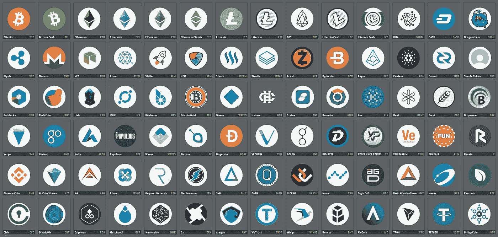

# 美国证券的未来将被符号化

> 原文：<https://medium.com/hackernoon/the-future-of-us-securities-will-be-tokenized-c469d41d81a1>

An age-old battle

扰乱金融服务市场的最大机会是证券的令牌化。为了理解这意味着什么，让我们谈谈背景:它始于区块链。

毫无疑问，在过去的 12 个月里，区块链一直是最热门的技术，对于那些了解内情的人来说，这个时间更长。本质上，区块链是一种账本技术，在这种技术中，数字交易被公开跟踪，任何人都可以看到它们，要编辑这个公共账本或添加新条目，必须有计算共识来验证它(这使得坏人很难篡改账本)。关于区块链如何工作，还有很多更长、更好的解释，但这不是本文的目的。

了解区块链很重要的一点是，该技术支持三种类型的加密资产:

1.  ***加密货币*** :类似比特币的数字货币，允许用户进行支付。这些货币不与特定国家挂钩，可以即时跨境转移，无需支付高额国际费用。
2.  ***实用令牌*** :用于访问协议或服务的令牌。想象一下街机代币的数字版本。就像 Chuck E. Cheese tokens 让你玩 Chuck E. Cheese 游戏一样，像 Indeed 这样的招聘板也可以有 Indeed Tokens，让公司列出职位或个人发布简历。本质上，这些效用令牌是用户与产品互动的方式，同时激励网络效应和参与。
3.  ***安全令牌*** :代表由所有权定义的资产的令牌。这包括房地产，财产，债务，不同类型的股权，你的名字。我最感兴趣的是最后两种，商业投资的代表，这些类型的证券将是本文其余部分的重点。

**有什么大不了的？**

如果你想一想美国所有的近 2800 万家小企业(值得注意的是，其中超过四分之三是非雇主公司)与在美国交易所公开交易的 3671 家公司(由于在美国公开交易的困难和昂贵，这一数字随着时间的推移而下降)，这两者的总市值实际上没有可比性。小企业每次都赢。

每年 70%的新增就业机会来自这些小企业。他们是我们国家的经济支柱，许多，如果不是大多数，这些小企业需要资金。向投资者出售私人公司的证券:风险资本家、天使投资者，以及自《就业法案》以来的大众投资者——稍后再详细介绍。

如果我们在谈论这些小企业的证券，无论我们是在谈论小企业债务，股权，可转换票据，无论结构可能是什么，重要的是要知道我们在谈论一大笔钱。数万亿美元的规模。这就是为什么解决如何将证券令牌化并转移到区块链是一件非常重要的事情。

**为什么要令牌化呢？**

Many of the above tokens are currencies, but you get the idea. Tokens!

令牌化证券改善了当前的金融市场，因为它们避开了中间商(银行等)，开放了证券交易市场。这意味着更低的费用，更多的市场暴露，因为交易是公开的，因此每个有互联网连接的人都可以看到，更大的投资者基础带来更多的交易，更快的交易，因为没有中间人来延长这一过程。听起来很棒，对吧？

然而，如何将证券令牌化的问题并不像描述其好处那么简单。令牌化的复杂性有几个原因，但主要问题在于证券如何出售给投资者。通常情况下，大多数私营公司会将股份出售给富有的投资者，购买协议中有许多固有的限制。下面只是其中的一部分。

**优先购买权**

优先购买权(或 ROFR)是投资交易中的常见条款。如果一个投资者想把他们的股票卖给另一个投资者，他们首先必须以同样的报价把同样的股票提供给期权持有者(通常是提供股票的公司)。如果他们放弃期权，那么也只有到那时，投资者才能卖给新的买家。

这对流动性来说是个大问题。投资者需要首先找到一个买家，然后说服买家提出书面报价，条件是公司接受转让。优先购买权的条款通常给公司 30 到 90 天的时间做出回应。这是一个交易杀手，因为它给投资者对投资者的流动性造成了摩擦，也让投资者原本可能只是略感兴奋的交易变得复杂。

**转让限制**

购买协议通常还包括转让限制。通常，投资者可以自由地将股票转让给他们的近亲、子女或投资者控制的信托机构。许多购买协议都不允许将股份转让给其他投资者。

原因多种多样:也许发行股票的公司希望其早期投资者继续致力于该项目，或者也许公司不希望陌生人控制该公司，或者不希望有超过 2，000 名股东的风险，这将迫使该公司成为一家报告公司(这主要是针对法规 D 的发行)。不管原因是什么，这些转让限制降低了流动性，而流动性是令牌化证券的主要好处之一，这些转让限制降低了投资者对发行的兴趣。

**外管局及其他衍生协议**

出售股票的一大创新来自硅谷，尤其是成功的 Y-combinator 加速器。创新是安全的，这是一个简单的未来股权协议。本质上，外管局是一种衍生股权的销售，是一种交付股权的未来承诺。投资者在出售时实际上没有得到任何权益。相反，一旦某些触发条件得到满足，比如让一个“合格的”投资者购买公司的股权，投资者就会获得股权。

这种衍生品几乎不可能卖出，因为投资者不知道购买条款。有多少股份被转让是未知的，所以投资者不知道他们的股票会被稀释多少。此外，由于没有到期日，因此也没有外管局何时转股的时间表，在此期间也没有兴趣。

不幸的是，许多融资门户网站广泛利用这一协议为使用新监管众筹规则的公司从投资者那里筹集资本，该规则允许公司直接从公众那里筹集资本。无法承受 7 年等待退出的普通投资者被套牢了，因为投资者对在二级市场上购买保险箱不感兴趣，因为它们很难定价。

**令牌化世界的解决方案**

A tokenized world. Isn’t it beautiful?

当我们谈论私人公司的代币化证券时，我们真正谈论的是大众对购买和出售这些证券的参与，因为代币流动性将在那里蓬勃发展。

然而，尽管密码爱好者可能会说，私人公司的证券，包括这些新的安全令牌，已经并将继续受联邦证券法的管辖。这意味着证券的销售必须在美国证券交易委员会注册，或者根据 1933 年的证券法使用注册豁免。有 3 项豁免与美国相关。这些是:

**法规 D 506(c)** :该法规只允许向合格的投资者出售证券，但没有上限，因此 506(c)规定的发行可以筹集公司喜欢的资本，只要投资者愿意购买。

法规 A+ :允许向认证和非认证投资者出售证券，但每年上限为 5000 万美元。

**监管众筹**:允许向经认证和未经认证的投资者出售证券，每年上限为 107 万美元。监管 A+和监管 CF 之间的差异与令牌化的讨论无关，主要是发行人负担的差异(即监管 A+在发行人可以出售证券之前有更密集的文书工作和审计)。

为了向投资者提供流动性，并创造一个令牌化证券可以彻底改变金融的环境，公司需要利用这些豁免，同时取消转让限制，以允许投资者仅根据最初用于出售这些股票的豁免下的时间限制出售其股票。

对于条例 D 下的规则 506(c)和条例众筹，时间限制为一年。对于法规 A+，没有时间限制，投资者可以在购买后立即交易证券代币。

我相信投资者会要求取消购买协议中的限制，以此作为投资令牌化证券的条件。为了通过令牌化实现可能的流动性，希望筹集资本的公司不应为普通股或优先股的销售增加任何限制，以鼓励二级交易。这将增加投资者的兴趣，从而提高股价和公司价值。未来，象征性的流动性将是扩大公司投资者基础和价值的关键。

对于一家希望对谁拥有股份拥有更多控制权的公司来说，限制是好事，但对投资者来说却是坏事。在一个由自由和消费者选择定义的时代，控制不再是限制贸易的足够好的理由。公司需要重新思考他们的资本表，接受他们的公司可以被任何人和每个人拥有的想法。这是件坏事吗？我听着不像。

*感谢阅读，如果你喜欢，请鼓掌 50 次！如果你有兴趣看到早期公司推销他们的业务，请收听 5 月 31 日的* [*StartEngine 演示日*](https://signup.startengine.com/DemoDay?utm_source=Howard_Blog) *，在那里，StartEngine 平台上的公司将在网上向投资者推销。*