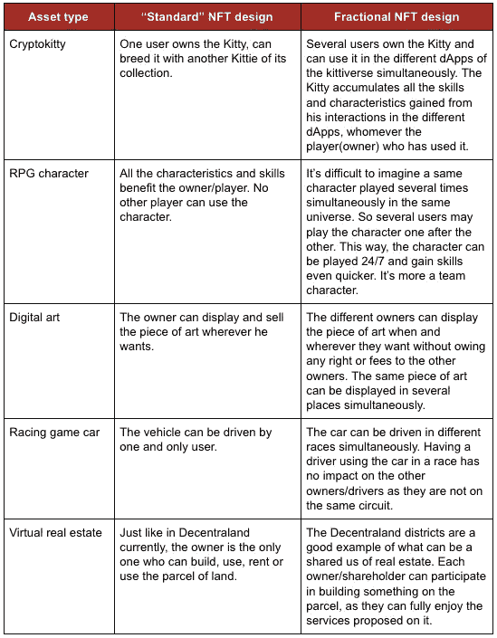

# 虚拟资产的未来:引入分数 NFT

> 原文：<https://medium.com/hackernoon/the-future-of-virtual-assets-introducing-the-fractional-nft-84c218da73c9>

我们现在生活在一个最有价值的资产不再是实物的世界里。虽然虚拟资产已经存在多年，但只是在最近，这些数字商品才作为一种新的资产类别出现。

现在，通过与区块链技术的结合，虚拟资产有机会不再局限于游戏等传统使用案例。

在当今的共享经济中，随着越来越多的实物和虚拟资产被令牌化，需要一种新的协议来确保安全性、透明度、所有权、流动性和共享使用。

简单回顾一下，代币是[以太坊](https://blockgeeks.com/guides/what-is-ethereum/)上的虚拟资产，其功能类似于现金或现有的不记名工具——如门票、优惠券、股票和债券证书、代金券、食品券和契约——它们赋予持有者不同的权利，类似于我们使用现金的方式。

在以太坊上运营的组织可以发行代币，以授予持有者访问其商品和服务的权利，使他们有权获得公司红利，并参与其商业模式的治理。

这里我们介绍下一代代币经济:分数不可替代代币(F-NFT) 。如果您不熟悉代币的概念，请不要担心，因为我们将简要回顾代币的主要类型及其作为虚拟资产所扮演的角色。

F-NFT 目前是否存在？是也不是。最近在官方以太坊改进提案(EIP)社区中有一些关于细分 NFT 的类似解决方案的讨论:

 [## 可分割的不可替换令牌(通过 NFTs 共享所有权)第 864 期以太坊/EIP

### 对于我们的项目，我们正在探索是否需要可分割的不可替换的令牌，或者换句话说，共享所有权…

github.com](https://github.com/ethereum/EIPs/issues/864) 

还有一篇由 [billy rennekamp](https://medium.com/u/8d132487b5f3?source=post_page-----84c218da73c9--------------------------------) 撰写的关于分数令牌的一些潜在应用和[理论的精心设计的帖子。](/@billyrennekamp/re-fungible-token-rft-297003592769)

本文的共同作者旨在探索这种潜在的新资产类别的可能性、利害关系和使用案例。我们的文章基于来自[我们应该以物易物吗？](/nonfungible/should-we-barter-nfts-daf8e6a635ee)这是一篇很好的快速阅读材料，有助于理解当前非功能性测试的一些局限性。

## 不可替代货币的局限性(NFT)

首先，让我们快速回忆一下什么是 NFT(又名“ERC721”)。这是在区块链上处理和存储的一类新的令牌。在[安全令牌](https://blockgeeks.com/guides/security-tokens/)和[实用令牌](/coinmonks/utility-tokens-a-general-understanding-f6a5f9699cc0)之后，(它们是标准“ERC20”令牌)不可替换令牌由以下特征定义:

*   一个 NFT 不能与另一个互换
*   每个令牌都有使其独一无二的特征

举几个简单而具体的例子，NFT 可以是:虚拟世界中的一块土地，一张独特的收藏卡，你在角色扮演中的角色，你的角色使用的剑，一件(数字或非数字)艺术品，……使用案例几乎是无限的。如果你想了解更多，这里有一篇关于[什么是 NFT](/0xcert/fungible-vs-non-fungible-tokens-on-the-blockchain-ab4b12e0181a)的文章。

今天，这些 NFT 中的大多数被认为是专有的和排他的。也就是说，一旦你获得了令牌，你就是唯一的所有者。同样，你是唯一能从这些服务中受益的人。

今天的这种状况代表了对 NFTs 使用的限制，并证明与区块链技术提出的去中心化思想相反。

## 我们怎么能想象一个分数 NFT (F-NFT)？

为什么一个 NFT 不可能有多个共有人？分数不可替换令牌(F-NFT)将是各种不可替换令牌，其被明确设计用于分散所有权和使用。

该令牌将基于以下基础:

1.  NFT 的共同所有权是不够的。令牌所提供的特征和/或服务的好处也必须被共享。
2.  购买或转售其他利益相关方持有的全部或部分代币不得以任何方式损害其他所有者。
3.  一个或另一个利益相关者对令牌的使用不得以任何方式损害其他所有者。理想情况下，不同所有者同时使用令牌必须是可能的。

## 什么是可分的，什么是不可分的？

为了进一步定义这些 F-NFT，我们需要查看实际用例，并对资产进行快速分类:

几乎每种资产都可以独立承载两种价值。这种类型学将任何种类的资产都纳入考虑范围，并关注价值和用途的比例。

*Conceptual representation of a video game asset*

在这个示意图中，资产的财务价值是灰色圆圈。这个值当然是由组成它的元素定义的，即元数据。从价值的角度来看，这个灰色圆圈可以是共有的，完全独立于元数据或组成元数据的特征。元数据和特征不能以同样的方式分割。

***值是可分的。***

***技能或特性不是必须的。***

> 今天的这种状况代表了对 NFTs 使用的限制，并证明与区块链技术提出的去中心化思想相反。

## 如何设计 F-NFT？

这些可分割的 NFT 只要求一件事:被认为是为共享使用而设计的。标志设计是 ICO 的关键，就像 NFT 设计是 F-NFT 的关键一样。

为了说明我们的想法，我们选择用具体的用例来面对 F-NFTs 的原则，以便清楚地在为个人使用设计的令牌和为分散使用设计的令牌之间划出界限。

NFT versus Fractional NFT asset type examples

## F-NFT 会扰乱哪些行业？

虽然最初采用 F-NFTs 会有最实际和更容易实现的虚拟商品用例，但会有对现实世界商品的交叉，如艺术品、收藏品和传统投资。我们设想世界上越来越多的资产将被令牌化，从而打开细分用例的闸门。

**艺术品和收藏品(A & C)**
全球艺术品市场代表着全球约 500 亿美元的资产。不幸的是，它们是流动性最差的资产。如果一个人想卖出一幅价值 100 万美元的德加画作，这可不像在易贝挂牌那么简单。事实上，更有可能的是，人们需要通过中间人或拍卖行，如索斯比或佳士得，收取高达 25%的溢价来出售这幅画。仅这两家拍卖行就控制了 80%的二手艺术品市场。他们向公众隐瞒自己的销售信息，阻止了准确的基于市场的价格发现和预测。

Edgar Degas The Star

大多数 A&C 随着年龄增长而增值，如果将它标记化，它可能是从这种增值中获益的机会。如果那幅价值 100 万美元的德加画作被分割成 100 份，这将允许 1000 名投资者每人拥有一份股票。这些股票可以交易，其所有权和真实性将通过[智能合约](https://en.wikipedia.org/wiki/Smart_contract)进行验证。这解决了 A & C 世界的第二个问题:流动性。个人买家不再需要等待数周或数月来购买高价商品，一旦转换为 F-NFT，它将在二级市场上提供给投资者购买，作为平衡投资组合的一个补充。

在这里，每个代币所有者的利益将是艺术品的价值转移、投资组合多样化、通过有限代币的潜在升值和更快的流动性。在这种情况下，即使最小的投资者也可能是德加的所有者。当然，需要对原始艺术品进行典型的认证和托管，但这对于象征性升值和资产流动性的好处来说是一个很小的代价。当然，与数字艺术不同，人们无法将这幅画分割成一千块，因此它的价值在于希望利用 A&C 类别帮助平衡其金融投资组合的资产所有者和投机者。

**传统投资** :
与传统资产如股票、债券、衍生品或黄金相比，加密货币是一个相当新兴的市场。这种新的资产类别只占当今全球总财富的不到千分之一:

由于其波动性和短期记录，金融专家对于一个人的总金融投资组合中应该有多少包含加密货币(如果有！).决定投资多少加密货币资产在很大程度上取决于你的风险承受能力和其他因素:

Research courtesy of Fred Wilson, CEO of venture capital firm Union Square Ventures

A F-NFT 将是一个新兴的子资产类别，可以用来进一步对冲一级加密市场的波动。正如 crypto 可以用作平衡投资组合的一部分一样，F-NFT 可以用作 crypto 的一部分，这取决于它的增长和风险承受能力。

**博彩**

如今，虚拟商品的价值已经超过了 500 亿美元。虽然把一个 100 美元的 CryptoKitty 细分可能不值得，但你可能想把资源集中在更昂贵的物品上。就在最近，一个游戏虚拟物品成为了有史以来最昂贵的物品之一——一个价值 600 万美元的虚拟星球。

将一个游戏虚拟物品变成 F-NFT 意味着你现在可以集中资源来众筹并共同拥有这个资产。虽然可能没有多少人能够在以后单独购买 600 万美元的 planet F-NFT 股票，但这将使流动性更快，同时使人们能够更容易获得否则会非常昂贵的虚拟商品。

> *令牌经济学需要给我们一个清晰的分类和标准，这样我们就有一个定义良好的词汇和方法来映射令牌可能的各种用例。我们需要明白，不同类型的代币会引发不同的经济问题。*
> 
> *-博士*[*Shermin Voshmgir*](/@sherminvoshmgir)*，密码经济学研究室主任@吴维也纳*

## F-NFT 的未来市场？

今天，有许多交易所为标准的 ERC20 和 ERC721 (NFT)代币提供流动性。《A F-NFT 法案》将要求一种新型的交易所，能够提供服务，对寻求分拆的不可替代资产进行验证。它需要能够帮助建立交易这些 F-NFT 的市场，以实现这一新资产类别的最大敞口和流动性。以下是这种新型交易所可能提供的一些功能:

*   **资产认证**:每项资产，无论是实物艺术品还是高价值的数字资产，都需要进行真实性验证。一旦核实，记录将被放在链上，供任何其他方参考。
*   **细分智能合约**:这将允许资产创建者和所有者指定令牌的属性或元数据，包括创建多少份额和所有权细节。
*   **F-NFT 上市**:该功能将在交易所上市 FNFT，并提供传统的交易所功能，如订单簿、匹配和代币的销售/购买。它还将提供充分的透明度，并告知所有者资产的新所有权或权利重新分配。

今天的集中交易所专门从事更大数量的 ERC20 代币，而[分散交易所](/@marcbegins/a-visual-way-to-understand-the-pros-and-cons-of-a-decentralized-exchange-5dd6a0a9fecf) (DEX)为 ERC20 和 ERC721 代币提供流动性。由于流动性是 dex 面临的最大挑战之一，因此诸如 [KyberNetwork](https://medium.com/u/7cedca298e8f?source=post_page-----84c218da73c9--------------------------------) 、 [0x](https://medium.com/u/109d6442eba6?source=post_page-----84c218da73c9--------------------------------) 和 [Loopring 协议](https://medium.com/loopring-protocol)等新协议有望在 dex 之间汇集流动性。FNFTs 的资金池功能还将允许更大的流动性，同时为做市商提供套利机会。

要快速了解 DEX 的利与弊，请参见以下概述:

 [## 理解分散式交换利弊的直观方式

### TL；DR:这是一个简短的、无法全面分析集中和分散的利弊的文章…

medium.com](/@marcbegins/a-visual-way-to-understand-the-pros-and-cons-of-a-decentralized-exchange-5dd6a0a9fecf) 

## 结论和下一步措施

为可分割的非金融资产提出一个标准，可能会带来有关价值和资产流动性的非常有趣的解决方案。这种新一代资产可能会极大地刺激整个 NFT 市场。除了财务风险，那些分数 NFT 提出的用例也很有前途。

关于这种新的资产类别，提出了几个问题:

*   什么资产是 F-NFT 的最佳使用案例，为什么？
*   哪些现实世界的资产不能作为 F NFTs 支持？
*   这个新标准的技术成分/特征是什么(市场、游戏和资产本身的整体 UX 必须被重新考虑和重新设计以分散使用)？

欢迎反馈！

*特别感谢* [*密码经济研究所所长谢明·沃斯姆吉尔*](https://medium.com/u/836f5cc46276?source=post_page-----84c218da73c9--------------------------------) *的预览和早期反馈。*

***介绍合著者***

马克·霍华德

Marc 是 Bookgel 的创始人，这是一个基于人工智能的云应用程序，帮助会计公司停止低估他们的服务。

[高瑟·朱平格](https://medium.com/u/2c70adbbbb26?source=post_page-----84c218da73c9--------------------------------)

晚上是区块链创业者，白天是数字化转型顾问。Gauthier 是 non-fungible 的联合创始人，这是一个关于各种不可替代代币的新闻和市场分析的参考网站。他并不热衷于对密码的投机。他对用例以及这种新媒体提供的几乎无限的可能性充满热情。

如果你喜欢这篇文章，请鼓掌支持作者，在 Medium 上关注他们！