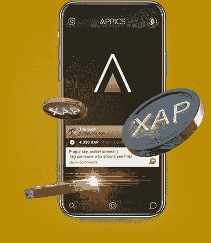

# 区块链上基于视觉的社交网络的未来

> 原文：<https://medium.com/hackernoon/the-future-of-visual-based-social-networks-on-a-blockchain-36d11842bbbf>

直到最近，集中化的社交网络还是一个常识。

Image by [Hurca](https://dribbble.com/Hurca)

在脸书，Instagram、Twitter、LinkedIn、Pinterest 和其他网站的用户在某种程度上倾向于消费特定的内容。有机接触不断失去动力，为付费促销开辟了道路。大量的机器人和虚假账号用强制内容填充我们的新闻。有些人可能会承认，这变得更像是钻研垃圾。

创作者花费时间和精力来交付优质内容。可悲的是，传统社交网络并不认可和奖励他们。高质量的内容吸引新用户，产生巨大的广告收入，而对创作者来说，以某种方式获得回报是一种私人业务。在脸书和剑桥分析新闻之后，个人数据收集和持续跟踪引发了许多问题，许多人认为应该删除脸书。如果你删除了脸书，你可能会继续使用属于脸书的 Instagram。如果你不喜欢写作，但有一些视觉效果可以分享，你如何取代这些社交网络？

区块链上基于视觉的社交网络正在发展，因为人们看到了巨大的潜力，关注着 [8 亿每月活跃的 Instagram 用户](https://www.statista.com/statistics/253577/number-of-monthly-active-instagram-users/)，他们努力分享视觉内容。一些重要的发展准备在不久的将来穿越第一个已知的基于视觉的社交网络应用程序:Steepshot，APPICS，SocialX 和 Lit。

Steepshot 和 APPICS 建立在区块链的 Steemit。SocialX 和 Lit 建立自己的区块链。如果你没有听说过 Steemit，看看他们基于 3 种加密货币的奖励系统:STEEM、Steem Dollars 和 STEEM Power——每种都有自己的用途。

# 1.Steepshot，分享时刻-赚取硬币(按)

[https://steepshot.io](https://steepshot.io)

## 奖励人们分享他们的生活方式和视觉体验的平台。

名为 Steemstagram 的概念在阿姆斯特丹举行的 [SteemFest 2016](https://www.youtube.com/watch?v=mrBYhi4BWrQ&feature=youtu.be&t=18m28s) 上展示。项目旨在关注优质内容，将更多人从 Instagram 带到 Steem 社区。Steepshot 测试版已经可以在 Android 和 iOS 设备上使用。也可以使用 alpha [网页版](https://alpha.steepshot.io)。

根据该团队的市场调查，高达 53–74%的人肯定会使用类似 Instagram 的应用程序来奖励用户。Steepshot 的奖励系统很简单:用户发布内容或评论，并根据他们在网络中的受欢迎程度获得 [SBD](https://coinmarketcap.com/currencies/steem-dollars/) 。

应用程序很容易让人想起 Instagram。有你的饲料主屏幕，趋势内容屏幕(分为热门，新闻，热门)，拍照/上传按钮和我的个人资料。用户配置文件从原始 Steemit 帐户拉起，显示每个帖子的总余额和价值。

与 Steepshot 的交互在某种程度上取决于 Steemit，因为它们都是相连的。一旦用户编辑了 Steemit 配置文件，它也会自动更新 Steepshot。如果用户在 Steemit 上关注某人的博客，他/她会自动关注他们发布的 Steepshot 内容(反之亦然)。用户在 Steepshot 上发布的所有内容都会出现在 Steemit 博客上。**Steemit 的投票系统和用户权力对于有历史和信誉的新用户来说可能是一个被发现的障碍。**

**团队不断发布新功能，并在[博客](https://steemit.com/@steepshot)上发布最新更新。最近的这些给用户提供了张贴短视频和推广帖子的能力。**

# **2.APPICS，激情回报(CH)**

**[https://appics.com](https://appics.com)**

## **APPICS 是下一代社交媒体应用程序，将生活方式与收入融为一体。**

****

**APPICS 正处于与 Steemit Inc .合作的早期开发阶段。该团队在今年的 ICO 期间筹集了约 400 万美元。不像 Steepshot 应用程序设计为在 Steem 区块链上使用自己的名为 XAP 的令牌(一种智能媒体令牌类型)进行操作。随着这一举措，应用程序有望为当前的 Steemit 算法带来一些创新。**

**首先，购买或赚取 XAP 代币带来了更大的影响力，而没有建立观众。XAPs 用户越多，他/她拥有的权力就越大。其次，品牌市场将允许通过令牌直接从 APPICS 销售商品。第三，如果创作者希望被发现，他们将有多达 15 个内容类别。每个类别将有一个导演或代表，“他在其他社交媒体平台上建立了声誉和观众”。代表将通过社区投票选出。**

****

**粗略地说，XAP 令牌可以帮助 APPICS 网络变得不那么依赖 Steemit 算法。有人可以购买 XAP 来处理它，而不是在 Steemit 上拥有先前的声誉。一般来说，这样会形成另一层权力用户。没有剧烈的变化，但这是一个机会，如果你努力。最大的关注点是策展人群体为用户选择最好的内容。目前，团队接受影响者和品牌提交的申请，以加入该网络。收入将在所有贡献方之间分配:65%给内容创作者，25%给投票者或管理者，剩下的 10%将维持网络。该应用程序还没有准备好供公众使用，但你可以在 APPICS [网站](https://appics.com)发送提前访问的请求。**

# **3.社交网络**

**[https://socialx.network](https://socialx.network)**

## **SocialX 生态系统将社交媒体体验提升到了一个新的高度。**

****

**SocialX 生态系统将社交媒体体验提升到了一个新的高度。
SocialX 拥有自己的区块链和更多隐私功能，不仅可以用于照片和视频共享，还可以发送加密消息、支付、直播和出售创意内容的许可证。SocialX 的目标是强调社会互动，而不仅仅是视觉发布。**

**ICO 已于 2018 年 1 月完成，并在 ETH 筹集了 220 万美元。SocialX 团队将采用向上投票系统，但承诺会通过改变来实现，这为增加社交网络的透明度带来了希望。投票系统也应该允许和禁止某些广告为 SocialX 社区产生更多的收入作为奖励。小型治理系统将检查有关许可证滥用或内容适用性的图像。根据 SocialX 网站的说法，他们计划使用预付借记卡在合作伙伴处消费获得的奖励，例如，在星巴克买咖啡。**

**正如白皮书中提到的，团队不打算让人们在 SocialX 生态系统中将资产兑换成 SOCX 令牌，而是通过直接兑换成其他 ERC-20 令牌。团队关注透明度和去中心化，所以他们采取了一个步骤，最近发布了一个开源代码。透明度的另一个特征是削减购买影响力的能力。**

**目前 SocialX 应用程序正处于中期测试阶段。您可以在此处申请提前访问[。团队还在](https://start.socialx.network)[博客中提到](/@socialx)将在不久的将来宣布新的赏金计划。如果你有兴趣，事先检查一下[原型](https://projects.invisionapp.com/share/45CZ6CEWR#/screens/247984528)。它显示了应用程序中可用的所有必要功能。**

# ****4。Lit，Mine 你的名气(KR)****

**[https://lit.live](https://lit.live) ，[https://mith.io/](https://mith.io/)**

## **一个奖励所有创作者的社交网络。**

****

**Lit 与区块链上的新兴社交网络有着相同的愿景和价值观:创作者应该有能力以更可行的方式将他们的内容货币化，而加密则让这变得更容易。秘银称之为社会采矿。为了实现这一目标，Mithril Inc .于 2018 年早春推出了 Mithril (MITH)。基本上，MITH 是一个公用事业令牌，是基于以太坊区块链的分散化社交媒体平台的燃料。MITH 可能比 Lit 应用程序更熟悉加密社区。你可以在 18 个交易所交易这个代币。**

**为了这次发布，Lit 准备了基于视觉的社交网络的所有典型功能，以及内容共享，如即时消息、故事提要和发现新朋友。在 MITH，向 Lit 平台贡献故事的用户会获得奖励。为了储存、使用或交换 Mithril 提供的[Mithril Vault](https://vault.tech/)——一个为 BTC 或 ETH 同步、入股和交易 MITH 的平台。根据[白皮书](https://mith.io/whitepaper.pdf) Mithril 希望无缝地整合现有的和新的社交网络，并为每个人提供一个赚钱的机会。**

**有很多理由让你在区块链而不是 Instagram 上尝试社交网络。新一代平台避免了用户跟踪和数据收集，以提高个人安全性。他们大幅减少广告或者根本不提供这些功能。虽然传统的社交网络甚至可以使用人们智能手机中的麦克风，但去中心化的平台使用加密来防止侵入私人生活。**

**有什么想法或问题吗？在这里和我分享一下:[Twitter](https://twitter.com/cryptokatia)|[LinkedIn](https://www.linkedin.com/in/cryptokatia)**