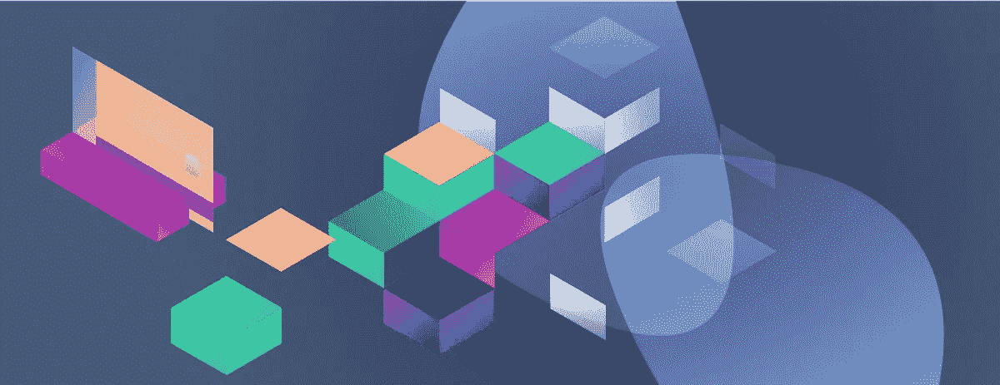
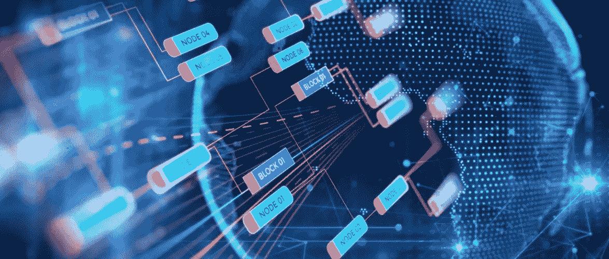
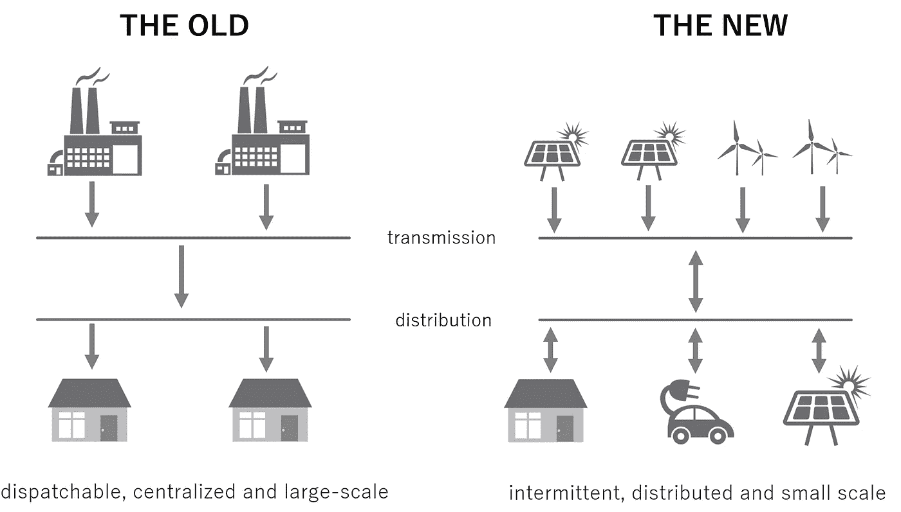

# 欢迎来到未来，分散的

> 原文：<https://medium.com/hackernoon/the-future-on-blockchain-6d8e6972b88d>

今年区块链的主要活动之一——[飘渺](https://etherealsummit.com/events/ethereal-summit-ny/)——于 5 月 11 日至 12 日在纽约市举行。许多知名人士参与其中，讨论了区块链[技术](https://hackernoon.com/tagged/technology)的最新发展和未来预测。ConsenSys 的创始人 Joseph Lubin 就区块链和以太坊的未来做了一个鼓舞人心的演讲。以下是对区块链未来的一些想法，以及它将如何(迅速)影响我们日常生活的方方面面。

## “无利害关系”问题

或许我们现在面临的最大问题之一是，如今觉得自己能够对社会产生影响或者觉得自己是人类事业中真正的利益相关者的人太少了。事实上，我们大多数人都在为他人的利益而工作，无法追求自己的经济利益。更具体地说，我们可以注意到，在我们当前的社会中，所有权太少，没有多少自给自足或个人主权。相反，我们互动的大多数环境都渗透着等级结构和自上而下的命令和控制。

如果我们每个人都有更多的自主权或意识到我们所做的事情可以留下印记或使这个世界变得更美好，这个“没有什么利害关系”的问题就可以解决。只有当生产的商品过剩时，经济才能运转；生产过剩使我们能够建立联系和相互依赖，建立对彼此的依赖。这适用于人际关系以及国家或公司之间的关系。从事生产性企业的两个实体不太可能希望对方受到伤害或试图掠夺对方的资源。

想象一下这样一个世界，每个人都在其他人的项目中拥有股份，并受到切实的激励去支持每个人的成功。在这样一个世界里，我们每一个人都是建设者和实干家，而不是协议的破坏者或价值的破坏者。

# 公司的性质，2.0 版

1937 年，一位名叫罗纳德·科斯的经济学家写了一篇论文《企业的性质》。科斯从交易成本的角度看待公司。他想知道为什么在民主、自由、开放和有效的市场中，像公司这样的等级实体仍然存在。

科斯确定了个人之间互动时的某些低效率。例如，可能需要大量的时间和精力来寻找必要的资源、讨价还价并与对方达成协议。他发现，搜索和讨价还价的成本可以通过将某些经济活动内部化来降低:自己制造可能比从别人那里购买更便宜、更快捷。随着公司的成长，边际交易的成本可能会比在公开市场中完成交易的成本更低。

通过使用“交易成本”的概念，科斯试图确定公司的最佳规模。随着技术的发展和通信成本的增长，我们可以注意到一个最佳公司的规模正在缩小，可以缩小到一个人。此外，在通信变得超级快捷和廉价的背景下，外包几乎所有的事情是有意义的。事实上，随着技术的发展，我们可能会看到一小群人创造和实现意义深远的东西。

有些人担心人工智能、机器人、AR/VR 或区块链等新技术会摧毁我们的工作，或者摧毁我们的生活。事实上，这些最新的技术进步正逐渐渗透到我们生活的越来越多的方面。我们不用担心这些技术会破坏我们的工作或造成不可挽回的伤害，我们可以采取更乐观的观点，相信这些技术会创造更好的工作。我们应该思考这些新技术如何将我们从稀缺思维中解放出来，并帮助我们重新定位我们的思维，以追求创造力、发展、成长、身体和社会健康。

# 区块链，或可信交互的互联网

区块链使我们能够远离由强大和有偏见的中介机构主导的社会，走向一个更加原子化的基础设施的世界。区块链的核心价值观之一是它创造了一个共享和信任的基础设施。这是通过使不同的行为者能够访问数据来实现的，并且很难欺骗该系统或对其进行监管。在更大的范围内，我们数据库系统的性质影响着社会的结构(停下来想一想)。

> *区块链及其共享基础设施正在帮助创建更好的协作系统。与机器人&人工智能一起，它使我们能够走向一个不再需要担心食物、住所或交通等生活必需品的社会。*

我们正在从一个人们关心交通，人们长时间开车去上班，卖汉堡赚外快的世界走向一个我们将会是受过良好教育，经常参加节日活动的游戏玩家的世界。:)教育将变得有趣，我们将以多种不同的方式表达自己。我们将参与体育和虚拟运动。我们将追求健康。如果社会从关注生存、匮乏的思维模式中解放出来，并转向追求情感和社会健康，这不是很有趣吗？区块链使我们能够思考如何从我们生活的这个蓝点扩展我们的物种。我们可以考虑在太空竞赛等重大项目上进行合作的可能方式，而不是被一家公司或一个政府所控制。

# 真正的信任最小化计算

我们数据库系统的本质影响着我们构建社会的本质。我们所生活的社会现在通过中介(“筒仓”)、“筒仓”数据库和“筒仓”企业连接在一起。这自然会影响法律的制定和我们的生活方式。当我们有机会建立共享数据基础设施时，我们可以考虑建立更好的基础设施。

区块链的核心价值观之一是建立信任的基础设施。实现这一点是因为网络上的不同参与者可以访问数据，这使得操纵或欺骗系统几乎是不可能的。当基于区块链的对等网络上的每个利益相关者都有他们自己的数据副本和他们自己的可能影响数据状态的规则副本(即智能合同)时，每个人都可以确信不存在流氓系统管理员或黑客对系统进行不正当操纵的机会。

# 互联网:太棒了，但也坏了

互联网是一种惊人的可扩展资源:我们可以将计算机添加到这个网络中，我们可以构建架构良好的应用程序，并处理成千上万的交易应用程序。有了区块链，我们已经把所有这些能力都丢掉了(在以太坊上，我们每秒可以执行 20-25 次交易)。在区块链，我们用所有这些换来了一个新的、更值得信赖的基础。在这个更加彻底的去中心化的基础上，我们可以开始重建可伸缩性。在未来的 2-5 年内，我们将会看到许多应用变得无处不在。第一步将是增加更多的计算机，以增加整个网络的容量。与此同时，我们正在观察现有的基础设施如何被转移到分散的应用程序中。

在区块链领域，我们被困在那些遗留数据库和区块链上的工具之间。基于传统的结构易受攻击，容易受到各种攻击。在基于传统的结构中，可以对各种数据(如您的身份)进行编程和操作。在区块链，现在的关键问题是如何构建应用层。

区块链上的应用程序和业务流程将更加安全。区块链将是 IT 安全领域的一场革命，因为针对你的基础设施的每一项都经过了强有力的认证和精确授权(参与者需要获得许可才能注册，以便访问该应用并在其上执行任何操作)。换句话说，我们将不再受制于被隔离的软资产，正如我们所看到的，系统经常被黑客或国家行为者渗透。在这种分散的体系结构中，很难拥有整个系统；黑客们将不得不非常努力地工作，才能获得很小的一部分。

## 区块链是普遍去中介化的力量

更安全的 IT 基础设施与真正的计算和点对点网络(定义为完全开放的自由市场和低准入门槛)相结合，将导致“普遍去中介化”。换句话说，如果你采用这种新的真正的、信任最小化的系统，你就有了一种普遍去中介化的力量。中介本身在经济中是一件美妙的事情:它增加信息，减少摩擦，降低成本，还可以增加交易的价值。然而，各行业的中介往往会介入交易流程，他们利用自己的职责、自己的寻租和动机来扩大他们增加的价值和从交易流程中提取的价值之间的差距。

区块链不是关于“激进的”非中介化；区块链不是要摆脱所有的银行、脸书、谷歌和其他类型的中介。区块链是关于调整中介机构的。在这种背景下，去中介化意味着让内容创建者、资源和服务提供商能够更直接地接触到他们的消费者，而几乎没有中介在不增加相应价值的情况下提取价值。在非中介化框架中，消费者可以直接控制他们的私有数据和令牌化资产。

Civil 是以太坊平台上旨在提供“可持续新闻”的项目之一。在 Civil，专业记者聚在一起向读者提供高质量和诚实的产品。Civil 还旨在成为一个在这些研究和出版物之上进行讨论的平台。

Cellarius 是另一个项目——一个原创的跨媒体赛博朋克系列(故事、艺术、音乐)，它利用区块链技术和用户生成的资产来创建一个围绕超级智能人工智能的合作粉丝策划的故事。在未来，将由塞利留斯的创造者来定义什么是真相。

去中介化意味着将服务直接与消费者联系起来。这种联系的某些层次是在劳动力、数据存储、资源、带宽等领域。一些例子:奖金网络——动态劳动力集合；git coin——使开源贡献者能够从他们的工作中获得报酬；或 Kauri——一个技术知识网络，贡献者因回应知识请求或产生高质量知识而获得奖金或提示；[盘古大陆](http://www.pangea.io/home) —房地产民主化；[电网+](http://gridplus.io/)——解除对能源市场的管制。

# 建立分散的万维网

互联网最初是一个分散的架构。然而，效率的考虑和对财富的追求导致了一个由中介主导的孤岛系统的产生。这种不幸结果的原因可以归结为缺乏一种共享开放平台所有权的机制。

Web 1.0(“信息互联网”)主要是关于图像、文本和超链接的。Web 2.0 为互联网增加了交互性、电子商务、移动和社交维度(“移动和社交互动互联网”)。效率和对财富的渴望导致了比 Web 1.0 更能改变我们社会的孤岛式结构。

我们现在正处于 Web 3.0(“智能交易互联网”)的边缘，它利用了前面提到的那些商品(个人数据、劳动力、资源、服务)。Web 3.0 现在/将来都将基于可信交易、自动化协议、以太坊等网络上的智能软件对象。Web 3.0 将触及各种协议的应用，例如分散存储、能量分配或繁重计算。所有这些都将使人们和企业能够更加流畅地进行互操作。

> 从本质上说，权力下放是指我们所有人都被充分授权做出自己的最佳决策。(卢宾)

Web 4.0(“传感器和机器的互联网”)会更加有趣。我们将会经历一个环境，在这个环境中，代表我们人类的智能代理将会在网络上作为代理为我们实现预编程的功能。通过区块链、数字稀缺性、代表真实价值的代币和智能签约系统，如 [OpenLaw](https://openlaw.io/) ，机器可以拥有真实的代理。OpenLaw 现在已经提供智能合约，数字货币和其他种类的信息通过数字代理进行转移。这些智能代理将与其他类型的实体达成协议。这些智能代理将能够向市场发送数据，或者，如果它是一辆自动驾驶汽车，它将能够自动安排燃料补充或维护，组成车队来帮助我们人类四处移动。机器经济的互联网将会非常有趣，它正通过区块链离我们非常近。

Tim Berners 在 1989 年发明了 HTTP 和 HTML，大约过了 10 年，互联网才到达大众消费者手中。18 年后的今天，它已经把我们的社会变成了一个全球社会。

有了区块链，我们可以预计，这项技术可能需要 5 年才能变得无处不在。人们对这种技术的发展有着巨大的兴趣，公共网络也呈指数级增长。目前，区块链正遭受着与互联网早期相似的担忧。但是这些问题以及可伸缩性将会得到解决。私人和公共许可系统将构成区块链的未来。

> (提醒:人是线性的，而技术是指数级的。)

# 区块链呈指数级增长

即使成千上万的公司正在从事各种各样的区块链开发项目，我们仍然感到焦虑不安，渴望看到一些最引人注目的用例及应用。

具体而言，区块链需要在四个主要领域迎头赶上。所以，首先，*数据*和组织(数据馈送、甲骨文、数据市场、智能计量、物联网、数据协议)；二、*协议和证书*(可合法自动执行的协议、政府和教育证书、去中心化权限管理)；第三，令牌化和交换机制(可替代和不可替代的令牌、原子互换协议、资产支持和价格稳定的令牌等)。);第四，分散的网络协议和商品(存储、带宽、繁重的计算、安全和保密的通信)。

这些问题将比我们意识到的更快得到解决，在一年或两年内，或者三年内，人们会觉得区块链无处不在。

关于区块链技术的另一个有趣的事情是，像以太坊这样的网络可以被认为是一个单一世界的计算机:它是一个单一的执行场所。因此，如果我们将相邻的音乐或保险基础设施放在一起，并且它们看起来运行良好，那么类似的协同效应很可能也可以在其他行业复制。因此，由于如此巨大的协同作用，一个新项目可以创造 50 或 100 个更有价值的项目。

## **令牌管理的注册管理机构**

另一个有趣的事情是所谓的“令牌管理的注册表”。AdChain 创建了这样一个令牌管理的注册中心，它有三种参与者——消费者、实体和令牌持有者——他们都想在这个名单上。他们都从创建一个更好的列表中获益。在广告链的情况下，想要进入该列表的演员(例如，想要托管广告的网站)陈述一些钱，并且如果代币持有者不相信他们应该在该列表上，则他们的行为可以被查看并从该列表中移除。将来，我们会看到许多类似的项目使用这种令牌管理的注册中心。

## **共享经济和基于协议的开放平台**

共享经济已经成为 21 世纪最显著的特征之一。我们都使用拼车服务或者通过 AirBnb 租公寓。例如，网飞是一个双边市场，我们是客户，网飞是服务提供商。脸书是一个三方市场，广告商是客户，脸书是中介，我们所有人都是产品。！).

ConsenSys 目前正致力于建立基于协议的开放平台，该平台建立在另一个协议(以太坊)的基础上，在该协议中，扮演不同角色的许多不同参与者占据着多边市场的各个方面。他们将自己的能力用于特定的领域。背后的想法是将许多不同的参与者彼此联系起来*而没有*一个对以某种方式影响系统中这些参与者之间的交流和价值交换感兴趣的中介。

这将使企业能够采取不同的方式:企业和客户之间不再进行基于利润的交流，而是在那些基于开放协议的平台上进行更诚实的交流。符号化将有助于为使这些网络运行的机制设计带来不同形式的激励。

可能的使用案例包括音乐/创意内容共享平台、身份、托管、原子交换、供应链、客户支持、专家网络、纵向健康、治理、扑克、新闻、科学报道、金融分析、教育、部分遗产所有权等。

## 自我主权身份

对互联网最大的担忧之一是，它从来没有一个本地身份结构。为了补救这一点，以太坊建立了所谓的“自我主权身份”:一个基于区块链的建筑，作为我们身份的根源。它使我们每一个人都能够以加密的形式上传您的数据，并从我们这一方的浏览器控制所有这些信息，而不是在互联网上喷洒您的身份信息(这些信息被公司货币化，并且没有得到公司的充分保护)。如果我们愿意，我们可以将我们的身份货币化，或者逐渐地、有选择地披露我们的身份(例如，如果我们想获得更好的贷款条件或迁移到不同的医疗保健提供商)。

这种身份系统将使我们能够更好地受益于我们的数据。自我主权身份还将使组织能够在数据市场上对我们的数据进行适当的(也许是付费的)访问。去中心化的万维网将更少利用个人信息。欧洲的一般数据保护法规已经迫使企业更仔细地思考，更安全地存储个人信息。像《剑桥分析》和脸书这样的情况将会把这种自我主权身份的观念推向显著地位。

更重要的是，在发展中国家，有如此多的人没有持久的可移植身份或持久的可移植声誉，自我主权身份将成为真正的生活改变者。自我主权身份可以作为多个应用程序的单点登录。在发达国家，您可以与您的传统身份提供商(例如，政府机构和银行等)建立联系。)并让他们记录证明你身份的原子或你作为公民的行为(例如，你是你所代表的公民。在发展中国家，人们不一定能获得金融服务或身份，他们可以利用他们的社会背景。例如，如果一群人可以访问互联网，他们可以创建一个系统来证明他们的行为，从而发展身份和声誉。如果他们不得不离开自己的国家，进行支付或购买，获得小额贷款或启动业务，这将非常有帮助。

ConsenSys 及其身份应用程序 [uPort](https://www.uport.me/) 正在取得重大进展。uPort 团队正在与瑞士团队合作，在瑞士，楚格市(逐渐被称为“加密谷”)的居民已经能够通过他们自己建立的基于区块链的根身份访问政府服务。该项目的下一阶段将是能够直接参与管理他们的国家和公民投票。

## 能源供应市场的分散化

许多人已经意识到，电力的集中发电和远距离传输效率低下、脆弱甚至野蛮。集中的能源生产和传输已经被分散化了:廉价的光伏和廉价的存储使世界各地的人们能够购买电池板并把它们放在他们的屋顶上。一家名为 [Grid+](http://gridplus.io/) 的公司率先让街道一边的 Alice 与街道另一边的 Bob 分享电子而获得报酬。

这对电力基础设施的稳健性有相当深远的影响。目前，许多人拥有光伏电池，但他们没有获得拥有存储的激励。这是因为他们不能直接得到报酬，所以没有时间改变电力的使用。Grid+团队已经建立了硬件，使比特能够在网络上输出以购买电力，它使时间转移能够购买和使用电力。能源是一个激动人心的领域，它将被分散化的应用极大地颠覆。

# OpenLaw &可依法强制执行的智能合同

[OpenLaw](https://openlaw.io/) 是另一个令人难以置信的令人兴奋的项目，它正在构建技术堆栈，以帮助推动下一代“智能”法律强制协议。OpenLaw 将触及每一个区块链应用程序，并影响我们的业务方式。

OpenLaws 本质上是一个协议，它能够上传法律协议，并将其转换为基于区块链的法律上可执行的混合协议。这是由人类完成的(很快将由人工智能完成)。每个人都可以访问和使用 OpenLaw，并且基于 OpenLaw 的区块链智能协议的数量每天都在增加。

OpenLaw 将允许我们接受一份协议，确定名称、数字、价格和日期，并将所有这些东西转化为标记语言的元素(“法律标记”)。这样，就可以输入名字和数字，填充整个文档。

智能合同最有趣的部分是，这些协议中的一些条款可以是区块链上的程序:这意味着有可能将资金托管到这些协议中(资金将在特定事件或条件发生时自动转移到另一方)。因此，我们正在走向这样一个世界，在这个世界中，我们将那些静态文件归档并保存在文件夹中，而在这个世界中，软件有助于生成和执行具有法律效力的协议。

# Ujo 如何分散音乐产业

Ujo 音乐是一个很好的例子，展示了自我主权身份和区块链可以做些什么。目前，音乐产业服务于音乐公司和少数能够获得成功的艺术家。音乐产业也为消费者提供了相当好的服务(尽管在内容多样性方面没有那么好)。

Ujo 音乐团队搭建了所谓的“相邻音乐产业平台”。艺术家可以利用 Ujo 上传他们作为个人的身份和他们的内容。使用 OpenLaw，他们能够附加法律强制执行的内容使用政策。消费者、艺术家、电影制作人和任何其他感兴趣的利益相关者都可以加入进来，获得私人或公共表演的许可证，或者创作衍生作品，获得同步权利。可以获得许可证，并且可以实时进行支付。然后，可以在所有合作者之间实时分配收集的金额。这意味着，艺术家将实时获得报酬，而不是赚不了多少钱，然后等 12-18 个月才能从某个收藏机构拿到钱。

# 分权的本质

回到罗纳德·科斯(Ronald Coase)的交易成本概念，小团体和个体户很可能是流动的非常有能力的社会基本元素。随着我们向前发展，我们相信，将一切符号化将创造流动和高效的市场，我们都将能够包装自己和 API，成为社会中非常有效的成员。

去中心化的核心原则之一是控制我们身份的能力。事实上，我们的身份直接影响着我们的经济机构和参与经济、社会和政治互动的能力。自我主权身份将使我们所有人成为这一人类事业的真正利益攸关方，并更加平等地相互参与。

区块链技术使我们所有人都有足够的自由和资源——因此我们几乎没有人会被迫做出糟糕的决定(即，我们被迫照顾生活必需品的决定)。

作为一个全球社会，我们正在从稀缺心态转向指数增长的富足世界，这是由最近从物质的约束中释放出来的正反馈循环所驱动的。权力下放的本质是当我们所有人都被充分授权做出最佳决策时，区块链有望帮助我们实现这一目标。