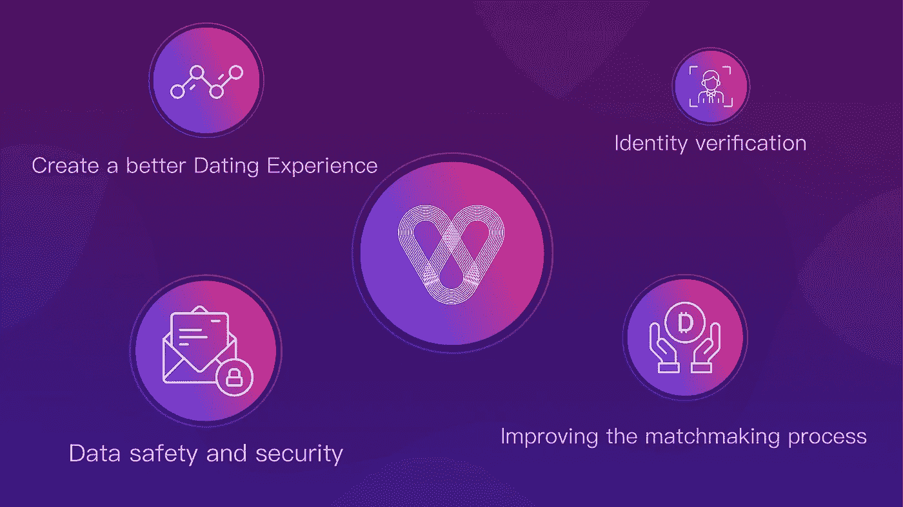
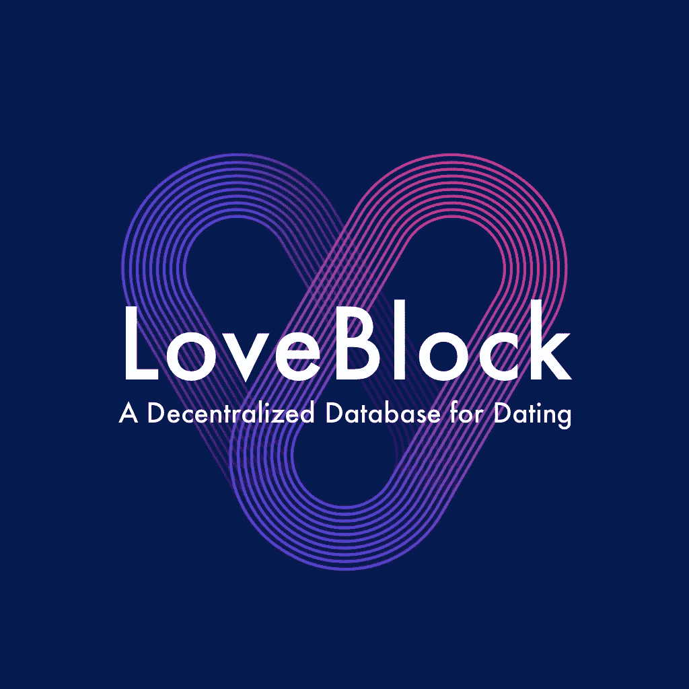

# 使用区块链技术约会的未来潜力

> 原文：<https://medium.com/hackernoon/the-future-potential-of-dating-using-blockchain-technology-21a27571de16>

## **与 LoveBlock 的网上约会市场前景**

# 在线约会行业的兴起

相亲是世界上最古老的职业之一。从古代中国用燕子来决定合适的配对和骆驼测试的圣经故事，到 20 世纪 20 年代古怪的科学方法，再到今天的网络世界。

因此，随着数以千计的应用程序和网站的出现，这项业务的蓬勃发展也就不足为奇了。事实上，[约会](https://hackernoon.com/tagged/dating)行业现在是这个星球上发展最快的行业之一，随着创纪录数量的单身人士转向互联网寻找各种可以想象的关系，它没有放缓的迹象。

年轻人引领着在线约会的激增，其中 18-24 岁的人使用最多。然而，在这场数字约会革命中，并非只有年轻人在寻找伴侣。

一项研究显示，越来越多的 55 岁至 64 岁的人也热衷于网上约会。

根据市场研究的数据，仅在美国，在线约会行业的价值就估计超过 25 亿美元。该行业预计将保持持续增长，Statista 的一项研究预测，从 2018 年到 2022 年，全球年收入增长率为 3.9%。

# 约会行业的核心问题:欺诈活动、虚假档案、诈骗和数据泄露

尽管在线约会迅速增加，但由于困扰几乎每个约会平台的一些核心问题，很大一部分用户仍不满意。

交友网站从一开始就受到个人资料真实性问题的困扰。曾经伟大的 Match.com 因虚假简介而闻名，结果人们已经厌倦了。

在近年来数百万新用户蜂拥加入在线约会服务后，该行业无疑处于繁荣期，但它并非没有逆风。大多数现有的应用程序，包括像 Tinder 和 Bumble 这样的知名应用程序，对诚实几乎没有什么激励，反而奖励那些个人资料看起来最具视觉吸引力，不是最透明也不是最值得信任的人。此外，人们不会神奇地在网上变得外向，对于一些用户来说，找到一个匹配仍然是一个具有挑战性的过程。

# 区块链和网上约会

[区块链](https://hackernoon.com/tagged/blockchain)技术有可能帮助治愈许多在线约会的创伤。

区块链技术建立在完全透明和不变性的理念之上，这两个因素在验证用户身份时可以发挥重要作用，同时保持隐私选项，甚至允许增加安全性。

在过去的几年里，约会网站的数据被盗的例子比比皆是。有了区块链技术，这种威胁可以减少到最低限度，或者理论上为零。

# 解决方案

在 LoveBlock，我们建立了一个解决方案，以协作和开放的方式解决这些核心问题和更多问题。

1.身份验证——为验证每个用户的帐户提供了一种万无一失的机制。因此，有了区块链提供的平台，用户就可以确定个人资料背后的人的真实身份。

2.个人数据安全-通过将数据存储在不可变的公共分类账中来确保数据安全。

3.激励用户创造更好的约会体验——通过 LoveBlock 可以量化每个用户行为的价值。积极的行为将被奖励代币，以激励和确保积极的平台

4.改善匹配过程——约会圈允许个性化约会和用户贡献，用户贡献将获得 DDD 代币奖励

如需了解更多信息，请访问 www . love block . one, Bounty 内容创建计划即将上线！

关注 LoveBlock 项目:

脸书[@爱情街区](http://www.facebook.com/theloveblock)

推特 [@theloveblock](http://www.twitter.com/theloveblock)

Instagram [@theloveblock](http://www.instagram.com/theloveblock)

电报[t.me/theloveblock](http://t.me/theloveblock)