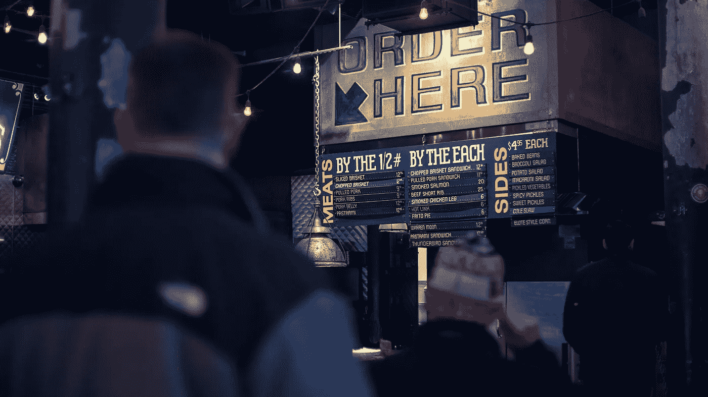

# 游戏规则改变者:移动订购和支付

> 原文：<https://medium.com/hackernoon/the-game-changers-mobile-ordering-payments-878feb52b565>

## 我们在帮助我们的客户通过移动点餐和为他们的连锁咖啡店付款来实施技术创新时学到了什么。

Photo by [Filmio .](https://unsplash.com/photos/5Z_7eoeSxWk?utm_source=unsplash&utm_medium=referral&utm_content=creditCopyText) on [Unsplash](https://unsplash.com/search/photos/ordering?utm_source=unsplash&utm_medium=referral&utm_content=creditCopyText)

移动订购和支付是一个复杂而庞大的领域。实现它们不仅仅是在现有的应用程序中添加功能或者构建一个新的应用程序。移动订购和支付需要范式转变。这不仅仅是一个需要解决的技术特征/问题。它涉及到与整个餐厅生态系统的整合。为了让这些创新发挥作用，我们需要让系统的所有活动部分协同工作。让这些功能产生收入，而不仅仅是成本！

**我们的学习**

简单介绍一下-我们的客户有一家连锁咖啡店。它大约有 25 家咖啡店。他们了解移动应用的需求。我们不需要证明这种需要。我们关注的是如何实现这一点。顾客可以通过它浏览和订购他们喜欢的咖啡。

**我们做了什么？**

我们从[开始学习](https://hackernoon.com/tagged/learning)更多关于整个咖啡店生态系统的知识。客户通常会做什么，他们会喜欢什么。我们找出了系统中所有我们需要小心处理的活动部件。在每个交互点，客户体验都应该很棒！下面的信息图显示了移动应用程序如何影响餐厅生态系统、益处和挑战。

 [## 移动订购和支付

### 移动订购正在兴起。消费者对在网上购买食品和饮料的简化方式有着巨大的需求

infograph.venngage.com](https://infograph.venngage.com/p/380812/mobile-order) 

**它是如何工作的？手机订购的零件:**

1.  **订购或预购**——人们大部分时间都在使用手机和社交网络。为什么不利用它。预购和支付解决方案消除了零售体验中的痛点。顾客不必排队，可以选择多种付款方式，这也有助于他们省钱。在高峰时间，比如你去上班，需要喝咖啡的时候。如果你能提前预订并在路上取货，那就太好了。听起来很简单。
2.  **付款** -您允许客户使用哪些选项付款。智能集成有助于为客户提供直接价值。这也是你可以开始建立关系的地方。扩展您的忠诚度或奖励计划。您现有的奖励计划应该与您的订购和支付功能相结合。通过提供简单的扫描、更少的下单和订购步骤，并通过奖励显示即时价值。
3.  **互动(奖励&忠诚度计划)-** 预购和付款让您有机会与客户互动并建立关系。这是一个转折点，你也可以开始追加销售。
4.  **客户愉悦**——使用收集的数据为您的客户提供更专业的优惠，让他们获得真正的价值。

**获得手机订购权**。

正如我之前所说，它不仅仅是一个可以添加到移动应用程序中的技术特性，它需要与生态系统相集成。我们面临的一些挑战和我们推荐的一些解决方案。

**如何管理订单的涌入**

预购可以给顾客带来很好的体验，但这是给员工还是给商店？有了预购功能，你会看到更多的订单，只为提货。您的店内基础设施准备好管理这些了吗？如果由于大量订单导致下飞机时出现拥堵怎么办？

这可能需要重新考虑商店的布局，改进标志和信息，或者培训你的员工，或者雇用新员工，或者为数字订单建立简单的独立站点。从产品的角度来看，我们帮助向客户和内部团队提供准确的订单通知。

有了大量关于用户订购行为的数据，你还可以使用分析来建立适用于高峰时段商品的模型。

## 创新理念

1.  使用语音点餐也是一种可以尝试的方式。
2.  与交付选项的联系。
3.  利用数据为客户提供专业服务。

请在评论区分享你的想法。