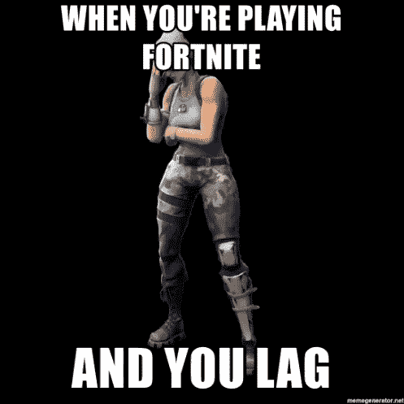

# 游戏结束，键盘破坏，滞后的世界(以及如何修复它)

> 原文：<https://medium.com/hackernoon/the-game-ending-keyboard-breaking-world-of-lag-and-how-to-fix-it-3a5c5243165e>

如果你玩过在线多人游戏，**你可能会遭受某种滞后**。当罗纳尔多在 Fifa 18 中踢裁判(而不是球)或者你在《反恐精英》中的角色开始在不同的墙壁之间传送时，这是高延迟的**令人讨厌的结果，从游戏服务器到你的游戏系统的连接速度很慢。这不是…**