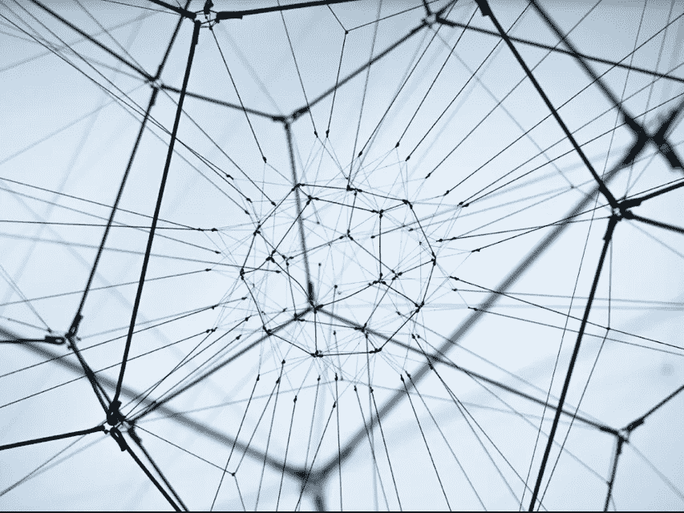

# 双子美元达到 1.19 美元，因为系绳挣扎着恢复其美元挂钩

> 原文：<https://medium.com/hackernoon/the-gemini-dollar-gusd-reaches-1-19-as-tether-usdt-struggles-to-regain-its-usd-peg-6db75de880bf>

**行情状态—2018 年 10 月 17 日** [**BTC**](https://berminal.com/coins/Bitcoin-BTC)**:6539.58 美元(-0.57%)** [**ETH**](https://berminal.com/coins/Ethereum-ETH)**:207.64 美元(-0.88%)** [**【USDT**](https://berminal.com/coins/Tether-USDT)**:0.969 美元(-1.11%)**

加密货币市场继续从上周的意外调整中复苏。比特币已经稳定在 6500 美元以上，以太坊保持在 200 美元以上，并稳步向 210 美元攀升。XRP 从上周接近 0.39 美元的低点反弹良好，加密货币目前的交易价格为 0.476 美元。USDT 仍然没有与美元挂钩，这一现象支撑了目前在币安和 BitFinex 上发现的比特币和以太坊溢价。

其他新闻方面，Telegram 计划在今年秋天发布其区块链平台的测试版本，今天 Mike Novogratz 宣布银河数码成为富达的第一个托管客户。本周早些时候，在迪拜的一次活动中， [CFTC 专员 Brian Quintenz 建议，智能合同编码者应该为开发预测代码负责，这种代码为他们提供了预测未来事件的不公平优势。Quintenz 说，CFTC 将把这些合同解释并归类为“预测市场”,它们属于 CFTC 的管辖范围。](https://berminal.com/news/101104/CFTC-Official-Warns-Smart-Contract-Coders-On-Prediction-Markets)

广受欢迎的日本汽车制造商丰田最近与区块链广告分析公司 clearity 合作，试图利用区块链技术来减少数字广告中的欺诈行为。clearity 提供了一个基于以太坊区块链的解决方案来跟踪供应链支付，使广告商能够监控他们的广告资金是如何分配的。据丰田公司的一名代表称，一项清晰的试验活动导致丰田网站的访问量上升了 21%,促使当前合同延期和扩大。([阅读更多](https://berminal.com/news/100770/Toyota-Partners-with-Lucidity-to-Integrate-Blockchain-with-Online-Advertising))

双子美元(GUSD)继续升值，而泰瑟(USDT)经历了一个艰难的阶段。 USDT 的估值在短短一周内下跌了近 20%，市值从 27 亿美元跌至不到 22 亿美元。据报道，许多交易员已经转向其他稳定的硬币，如双子座美元和 Paxos 标准稳定硬币。事实上，Gemini Dollar 周二已经攀升至 1.19 美元的历史高点。根据 CoinMarketCap 的数据，截至发稿时，GUSD 的交易价格为 1.02 美元。([阅读更多](https://berminal.com/news/100916/Gemini-Dollar-Gains-Momentum-As-Tether-Sinks))

**3)根据潘迪拉资本联合首席投资官乔伊·克鲁格的说法，下一轮比特币牛市可能会使整个加密市场增长 10 倍以上。**“如果你看看下一轮牛市，我认为总体加密空间可能会达到现在的 10 倍。”随着富达投资(Fidelity Investments)、道明银行(TD Bank)和洲际交易所(ICE)等大型金融机构的新闻报道的介入，他预计加密市场的总估值将轻松超过 2 万亿美元。Krug 认为采用的最大障碍是可扩展性，但他认为在未来几年内会开发出一个解决方案。([阅读更多](https://berminal.com/news/100812/Pantera-CIO-Says-the-Next-Bull-Run-Will-Increase-the-Crypto-Market-10x))

[***订阅百慕达简讯***](https://visitor.r20.constantcontact.com/d.jsp?llr=myyhdl6ab&p=oi&m=1131022639884&sit=9ar6aztmb&f=776989ec-8460-43a4-b86a-bcf8f2f1bca7)

[***免费下载百慕大 App***](https://berminal.app.link/medium-post)

*[***百慕大官方电报***](https://t.me/berminal)*

*[***百慕大推特***](https://twitter.com/berminalapp)*

**