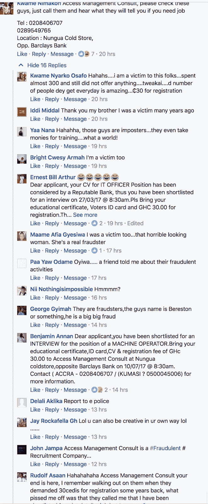

# 加纳的巨型招聘机构骗局:不可退还的注册费

> 原文：<https://medium.com/hackernoon/the-giant-recruitment-agency-scam-in-ghana-non-refundable-registration-fees-d66c2c2814d7>

我注意到加纳的招聘机构向求职者收取一定数额的费用，名为注册费。这个量可以达到 600 GHz(130 多美元)。

更重要的是，报名费是不可退还的，这意味着即使 T2 中介没有给你找到工作，你也拿不回钱。你能相信吗？

想象一下这种情况:MTN 加纳公司有 5 个职位空缺。该公司将联系招聘机构#A，并通知该机构他们需要 5 名工人。该机构将继续宣传这些工作职位，并收到 500 多份申请，**向每个人收取不可退还的注册费**，而实际上只有 5 人将获得工作机会。

几个加纳人分享了他们在加纳这个巨大的招聘机构骗局的经历，这太可怕了。看一看其中的一些

这是一个广泛的骗局；因为当你不能保证任何回报时，要求失业的毕业生放弃他们没有的钱是没有意义的，但出于绝望和缺乏任何其他选择，这些人被迫从朋友和家人那里借钱给这些招聘机构。

通常，公司会付钱给招聘机构来寻找候选人。这是有道理的，因为这些机构通过帮助公司招聘来为他们工作。但这并不总是一次好的经历。例如，在 2017 年 Magic Leap，佛罗里达州的初创公司开发未来 AR 眼镜[因招聘 39 名员工而损失了超过 100 万美元](https://hackernoon.com/bad-game-in-todays-recruitment-d1ccf6dc1acf)。这是 2017 年招聘行业最大的欺诈案之一。

随着技术的发展，招聘不再需要中介，因为借助区块链的力量，任何人都可以成为招聘人员，为空缺职位推荐候选人。例如， [Aworker](https://aworker.io/) 是一个平台，可以根据你的心理类型、专业技能和成就，帮助你找到最合适的公司和职位。权力下放为创建新的职业生态系统提供了最佳机会。在一个工作平台上，为人们的行为付费变得更加容易:借助智能合同的力量，为熟人推荐或自己来参加工作面试付费是自动的。此外，所有信息都被安全存储，所有操作都是透明的，这排除了陷入昂贵但不必要的义务的可能性。

我们认为，现在是招聘行业采用新技术、投资未来的最好时机。这将是所有人的胜利，希望加纳也是。