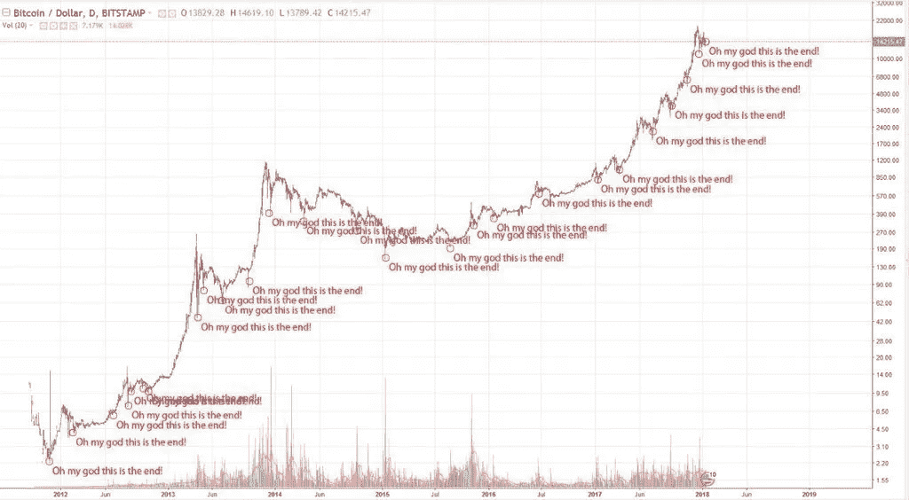

# 加密货币波动的礼物

> 原文：<https://medium.com/hackernoon/the-gift-of-crypto-volatility-3f4a4b55adb6>

本周早些时候，我和一位职业“活跃交易者”聊了聊，他的职业生涯是利用股票、货币、期权和衍生品等高流动性市场的短期价格波动。

我想“主动”在这里可能有点用词不当。这个特殊的人目前正在休一个非常长的，非常不必要的花园假。

一年零两个月前，他在自己的公司(最终倒闭)接受了一个方案，因为他们试图精简交易员队伍——从那以后，他一直在找工作。

他解释说，活跃的股票交易员的角色越来越少。除了算法高频交易作为一种更有效的解决方案的兴起(几乎没有人为错误的空间)，他的抱怨是显而易见的:

> “在一个几乎不再有波动性的股票市场，作为一名活跃的交易员，要真正谋生是不可能的。”

显然，2017 年是自 1964 年以来股市波动最小的一年。只有 6.8%的波动性，这对一个活跃的交易者来说根本不足以维持生计。

但是还有加密市场——它完全重新定义了波动性的概念:

*   神圣的烟雾！XRP [一天内上涨 33%](http://fortune.com/2017/12/29/ripple-cryptocurrency-surge/)——值得一提，因为仅在 2017 年，其价格就上涨了 28000%；
*   在 2017 年 12 月底，BTC 的价格在一天内下调了 3000 美元，最终在 2018 年初触及 9000 美元，但随后几天又上涨到 12500 美元。

简单的事实是:

# **对于股票来说，熊市和牛市是数年或数月的周期。对于加密货币来说，熊市和牛市是日和小时的循环。**

这不应该被认为是一个弱点；加密货币的熊/牛节奏——其波动性的惊人速度——是其优势所在。巨大的摆动是一个*好处*。

它告诉那些欣赏风险的人；面对波动无所畏惧的人(FFF)；谁不会对股票行情自动收录器一次上下移动几便士感到更无聊呢。

这就是为什么[加密货币](https://hackernoon.com/tagged/cryptocurrency)是送给新一代投资者的*礼物*:千禧一代。

千禧一代还没有机会致富。他们从未见过储蓄账户有 5%的利息。他们被学生的债务压得喘不过气。他们错过了房地产繁荣期；见鬼，他们是在住房危机期间长大的，这场危机让他们对政府、控制——当然还有股票——大为不满。

当然，千禧一代尝试了股票。他们开始避开真人财富管理人，而选择像 [Wealthfront](https://www.wealthfront.com/) 这样的机器人顾问(为什么不在你玩滑翔翼的时候让电脑试着赚钱呢？);对于那些想要亲身体验快感的人来说，他们用 [Robinhood](https://www.robinhood.com/) 游戏化了他们的日内交易习惯，这是一个让你买卖股票免佣金的应用程序，就好像它是垄断资金一样。

但仍然是 T4 股票。股票走势不够快。股票需要耐心。谁有时间做那个？

2017 年 9 月——当[比特币](https://hackernoon.com/tagged/bitcoin)还在 4600 美元的时候——养老金合伙人[的研究总监查理·比列洛(Charlie Bilello)指出](https://www.marketwatch.com/story/why-bitcoin-isnt-a-reliable-hedge-against-stock-market-moves-2017-09-07)“比特币和美国股票不会每天一起波动。它们基本上是相互独立的，我看不出比特币和股票有任何负面关系的根本原因。”

2018 年 1 月 16 日，金币销量增长了 5 倍，同期加密货币暴跌 40%。这很可能表明这两种投资工具之间存在[反向相关性](https://cointelegraph.com/news/gold-sales-spike-during-crypto-market-crash-highlighting-inverse-correlation)。

对于从事黄金交易的人来说，这是一个机会:与加密货币在同一波动池中游泳。虽然黄金总是有一些波动，但这提供了一种新的相关性——黄金是你购买的手镯，或是针对石油或债券的对冲。它被与住房、储蓄和传统股票归为一类。现在它和加密货币一起成为焦点。

如果我是一名股票交易员——甚至可能是一名失业者——我可能会渴望有一天，股票与加密货币(无论是反向还是直接)相关联，为它们提供亟需的波动性提振。

加密货币的波动性。这就是天赋。