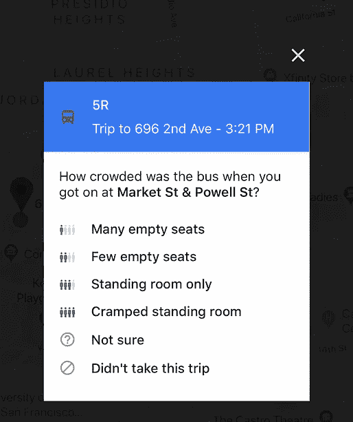

# 众包的黄金时代

> 原文：<https://medium.com/hackernoon/the-golden-age-of-crowdsourcing-3-important-lessons-2b512ed0912f>

## 3 个重要的教训

我们正在见证创新和有用的众包设计，几乎来自垂直技术领域。开发者需要[实现](https://hackernoon.com/tagged/implement)一种激励用户输入的体验，获取创造他们竞争优势的数据。我大胆猜测，我们正处于设计会议数据的黄金时代。

众包信息是最有趣的数据类型，因为用户选择加入——免费向开发者提供以前无法收集的有价值的信息。这些数据非常关键，因为它创造了竞争优势；例如，每个开发者都可以访问相同的地图[信息](https://hackernoon.com/tagged/information)，因此用户转换成本很高，为另一个地图应用创造独特的价值主张可能很困难。但是如果你能利用用户输入，你可能会得到别人得不到的东西。

众包的根本机制是背后的激励。用户将向开发者提供真实世界的数据，并获得回报。本文将重点介绍一些独特的例子，说明开发人员如何通过众包数据创建了一个可辩护的价值主张，以及他们能够做些什么来吸引用户参与该生态系统。

*   顺便说一句:如果你有兴趣获得更多与 PM 相关的分析，请考虑订阅我的时事通讯， [PM 午餐](http://eepurl.com/cUUrqL)，一份每周产品电子邮件时事通讯。

# 我们来定义一下众包。

Crowdsourcing, or no?

在我们开始之前，值得强调的是，众包是一种不同于普通用户生成内容(如 Instagram 故事或脸书邮报)的用户输入类型。

众包是计算机无法完成的数据收集。计算机无法提取东南亚中部一个小平房旅舍的数据，但人类可以——而且开发人员已经接近拥有一个数据库，可以显示世界各地的旅舍有多少间浴室。这些重要的数据是由集体意识获得的，开发者可以利用这些数据。

这个唯一数据集的收集需要交换值。用户通常不会主动做一个动作，除非他们得到某种形式的奖励。所提供的数据可以反过来为用户提供某种状态，或者所提供的信息增加了服务的价值。

让我们检查一些创新的想法。

# 第一课:集体利益感

Citizen 是一款移动应用程序，它为用户提供了他们所在地区所有犯罪活动或潜在不安全情况的实时地图。如果附近突然出现什么东西，该应用程序会通知用户情况的位置，以便避免它。这种活动最初是由收听警方扫描仪的受薪员工收集的，这本身就是一个有用的价值主张，但当你纳入其用户群的集体行动时，有趣的部分就开始发挥作用了。

Thanks for the heads up!

众包功能的一个主要部分是直播功能。如果有人在事故附近，他们会被提示在安全距离拍摄。此外，还要求他们提供最新情况。如果警察不在现场，他们可能也不知道所有的信息，所以本质上，公民是一个巨大的邻里监督组织。他们的服务价值与有多少人在使用它密切相关，因此他们受到激励，试图让他们的用户邀请他们的朋友和家人加入这个平台。

**关键要点:赋予用户良好的社会责任感。**

Citizen 表明，如果他们以某种方式包装价值主张，让用户感觉他们正在发挥作用，他们就可以利用集体意识。Citizen 为用户提供了一种通过使用该应用来感受社区感的方式，反过来，用户希望向该平台添加更多数据。

如果用户能够清楚地看到他们的行为是如何产生影响的，他们就会帮助为平台创建内容和数据。

# 第二课:众包抓住了定性

谷歌是众包数据最突出的例子之一，它覆盖了用户的其他账户数据。例如，谷歌地图知道你在哪里，你要去哪里。当晚上通勤时，如果我输入如何乘坐公交车返回的方向，谷歌地图可以根据我正常、无聊的设备和位置数据合理地推断出我确实乘坐了公交车。

然而，该设备*不能做的*是通知未来想和我同时乘坐 5R 的乘客，在那次乘坐期间通常有多拥挤。谷歌可能会根据有多少人同时搜索这条路线来猜测，但这并不准确。其次，“拥挤”是一个主观术语——50 个乘客坐一辆公交车会不会觉得拥挤？只有走那条路线的通勤者才能主观地告诉你这一点。所以谷歌求助于众包这种主观信息。类似于 Citizen，这种流量向用户灌输了一种社会公益的意识，但这种流量输入快速且易于输入，并在我下车后几分钟内及时发送。

**关键要点:主观的&定性数据只能通过询问用户获得。**

Quality is how the user subjectively felt about an interaction, which can’t be collected by a machine.

通话应用通常也会在通话结束后让用户评价他们的连接质量。虽然开发人员肯定能够获得连接速度和一致性背后的数据，但真正重要的是用户在通话过程中的感受。这都是关于用户如何体验一个产品，你必须问他们。类似地，一件衣服相对于用户期望的合身程度才是重要的。亚马逊知道大小，但不知道用户脑子里有什么。

请注意，谷歌地图上 Biron 酒店的列表有多少是众包的。主观的东西是我在研究景点时真正想知道的。

# 第三课:奖励有地位的用户创造了超级用户

Sarah is Elite

在前面的例子中，众包信息的数量很少，要求用户点击一两个屏幕并不是很麻烦。但是，随着众包者需要完成的工作量越来越大，他们需要得到的回报也就越多。社会地位是公司在其生态系统中成功创造激励的方式。人们非常关心相对于其他人的排名，这导致了一个权力使用者竞争的系统。

例如，亚马逊非常依赖客户评论和输入来建立对其平台的信任。随着评论者添加更多内容，他们会获得徽章，提醒其他用户他们在系统中的影响力，排名上升，最终开始获得免费内容进行评论。

The #1 Amazon Reviewer gets paid in free quinoa.

谷歌最近也实施了一个收集评论的系统，叫做本地指南。由于难以收集的数据丰富了他们的位置数据，他们的地图数据变得越来越有用，他们希望奖励他们的专用用户，并激励他们添加越来越多的数据。这是非常标准的[游戏化](https://uxplanet.org/gamification-in-2017-top-5-key-principles-cef948254dad)的东西。

当您输入更多关于企业的信息时，您可以升级并获得出现在您的地方评论上的当地导游状态徽章。你会在其他评论中得到更高的评价，你会开始觉得自己比其他朋友优越，因为你有最好的品味。至少这是个想法。

这里的教训是，你要求用户自愿提交的数据越多，他们需要的回报就越高。超级用户喜欢状态循环。

另一个例子是 LinkedIn 上的背书生态系统，它是在推荐之后很久才引入的。为推荐信写一两个段落是一个很大的要求——但是推荐是很容易做到的。你与这个系统互动得越多，你在职业上的地位就可能越高。

# 结论:众包数据创造了有趣的设计交互。

当你在一个系统中看到独一无二的众包数据时，那是一件美妙的事情。用户选择加入，在用户和开发者之间创造了一个价值交换。它有助于让应用程序感受到社会性和集体性，并有助于量化不可量化的东西。从用户那里收集数据，而不是关于用户的。