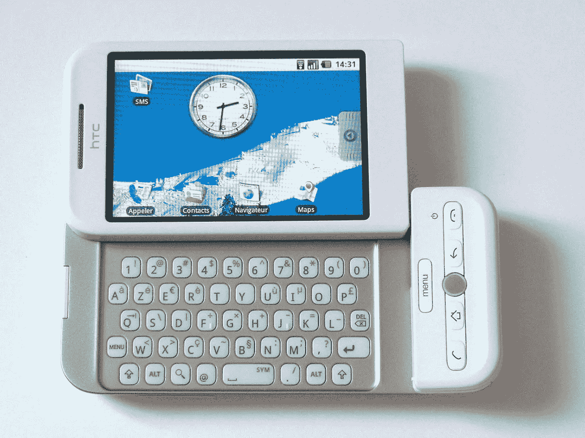
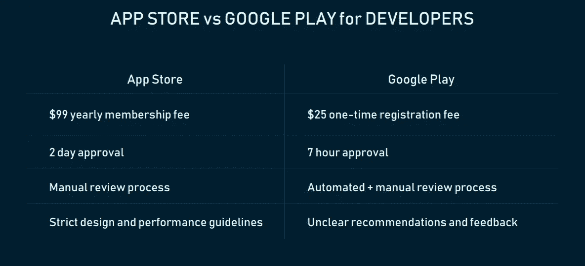
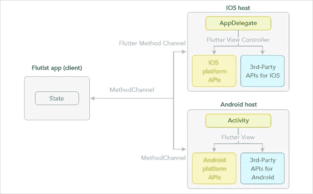
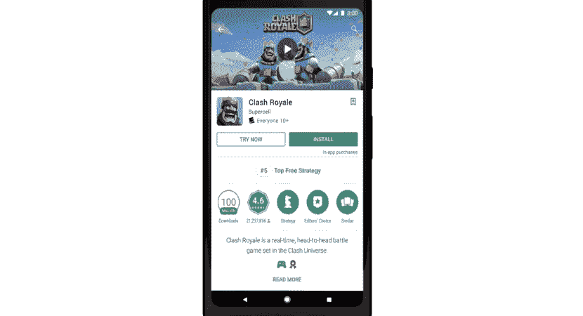
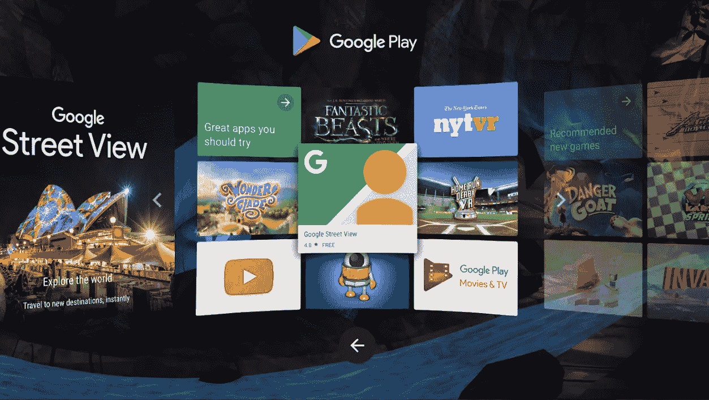
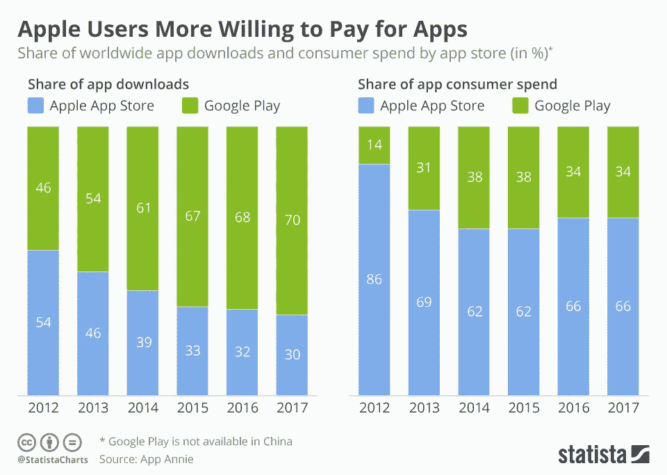
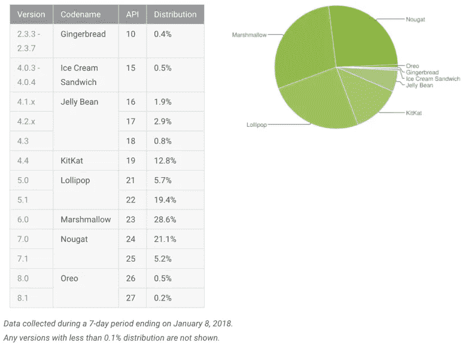
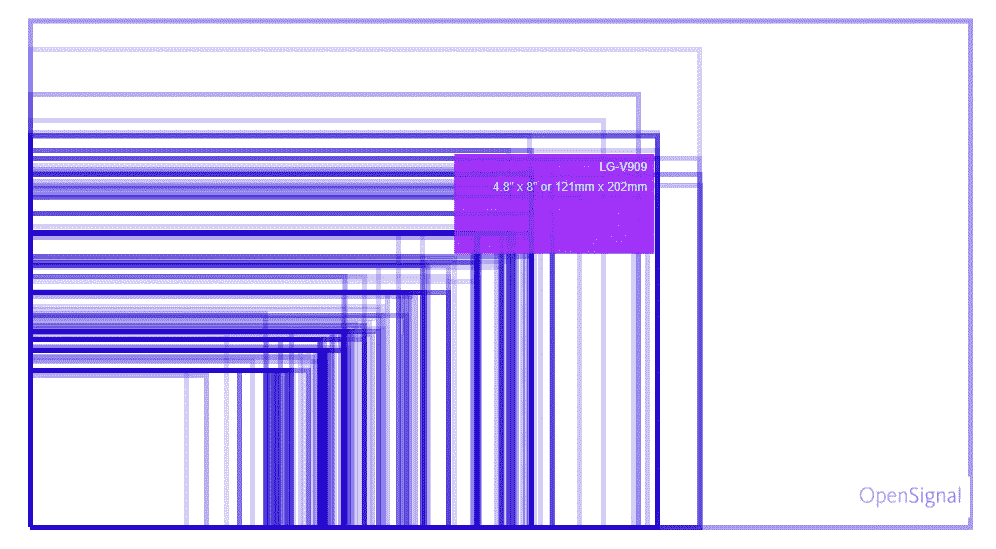

# Android 应用开发的好与坏

> 原文：<https://medium.com/hackernoon/the-good-and-the-bad-of-android-app-development-c9e4410a8df2>

如果只有 100 个人生活在地球上，其中 76 人将使用 Android，20 人使用 iOS(让我们忽略这 4 个使用 Windows 和黑莓智能手机的古怪个人)。然而，如果只考虑美国用户，范式就发生了转变:现在，这 100 人中有 65 人是 iOS 粉丝。

操作系统在特定地区的受欢迎程度只是决定为你的移动应用选择什么平台的众多因素之一。当然，在理想情况下，我们希望创建的应用程序能够让所有移动用户访问，而不管他们的原则、品牌忠诚度，甚至财务状况如何。但是，当涉及到本机开发时，您通常必须从本机开始。

加入我们对 Android 移动开发的回顾，了解当你选择谷歌而不是苹果时，有什么好处和挑战在等着你。我们开始吧。

# 机器人的历史

你还记得前智能手机时代吗？我们希望你不需要时光机就能记住 2006 年的交通状况。当时，Windows、Symbian 和 Blackberry 一直在缓慢地向移动市场提供所谓的*袖珍个人电脑*——笨重、不美观，配有物理 QWERTY 键盘，有时甚至配有手写笔。你可能有一个。早期的智能手机严格关注生产力。因此，有一个问题一直困扰着硬件和软件供应商:如何在这个小小的设备上安装更多的东西？。

他们做得很好。我们有 Twitter 和电子邮件、互联网浏览器、微软 Word 和许多更方便的功能，但网站没有响应，移动互联网很慢，人们仍然习惯于坐在全尺寸电脑前完成一项超过五分钟的任务。基本上，完全没有考虑可用性——以及开发者的自由。这是一个运作受限的世界。

*HTC Dream running on Android 1.6, 2008*

当第一款安卓设备 *T-Mobile G1* (又名 HTC Dream)进入市场时，这个世界甚至还不习惯触摸屏。但第一款消费级安卓手机已经集成了谷歌服务、内置 GPS、网页缩放和早期安卓市场(只有 35 个应用)。谷歌和安卓公司(Android，Inc .)的创始人安迪·鲁宾(Andy Rubin)在软件和互联网中看到了移动设备的未来——他们计划创建并免费分发将人们连接到网络的服务，并进入新一代移动设备。

# Android 开发入门包

Android 设备的原生开发由这个基本工具集组成:SDK、ide、编程语言、库和插件。让我们看看您可以使用哪些产品来构建自己的技术堆栈。

**软件开发工具包。**SDK 是一个包含可执行程序的工具包。这包括文档、调试器、模拟器、框架、库、分析器等等。 [Android SDK](https://developer.android.com/studio/) 已经包含在 Android Studio 中，但如果你想使用另一个 IDE，可以在链接页面底部单独下载。

**编辑和 IDEs** 。理论上，你可以在常规的文本编辑器或命令行中编写 Android 应用程序，但通常的方法是使用集成开发环境。该工具集成了所有 SDK 工具，有助于以更加用户友好的方式更轻松地管理它们。 [Android Studio](https://developer.android.com/studio/) 是官方的 Android IDE，但其他选项也很受欢迎。 [Eclipse](https://eclipse.org/downloads/) 是 Studio 的前身，可以使用插件将代码扩展到更多语言。 [IntelliJ IDEA](https://www.jetbrains.com/idea/) 是一个付费但高度可定制的选项。

**编程语言。** Java 和 Kotlin 被列为 Android 编程的官方语言，但也有替代语言。你也可以通过使用 [Android 原生开发套件](https://developer.android.com/ndk/)来使用 C 和 c++——该工具用于以原生代码实现之前编写的应用的部分。也有第三方工具允许你使用你最喜欢的语言创建原生 Android 应用，比如 [Ruboto](http://ruboto.org/) (Ruby)或者 [Kivy](https://kivy.org/#home) (Python)。只要记住任何非官方的解决方案在更新方面都会落后。

**图书馆。软件开发人员使用库来完成各种任务。它们是预写代码的片段，自动化了编码人员的工作，消除了重新发明轮子的需要。Android 社区对此类免费解决方案非常慷慨。其中最受欢迎的包括用于序列化和反序列化 Java 对象以与 API 通信的 [GSON](https://code.google.com/p/google-gson/) ，用于 API 组织的[改型](http://square.github.io/retrofit/)，以及用于不同 app 元素之间轻松通信的 [EventBus](http://greenrobot.github.io/EventBus/) 。为了配置所有这些设置并组织添加外部库的过程，开发人员使用名为 [Gradle](https://gradle.org/) 的工具。**

**外挂。**当库被用于自动化项目任务时，插件被创建用于增强每个软件工具，在我们的例子中是 IDE。我们不可能把它们都列出来，所以来看看 BestPlugins.com 上收集的 [Android Studio 插件](https://github.com/andyb129/AndroidStudioPluginsNPlay)和 [Eclipse 插件](http://www.bestplugins.com/software/eclipse)列表。

如果您正在寻找更复杂的解决方案来改善您的编码体验，请访问这篇关于 Android 开发 20 大工具的热门文章。

# Android 开发的优势

当谈到 Android 做得好的方面时，你无法避免与它在双寡头垄断中的合作伙伴——苹果进行比较。我们来分析一下 Android 是如何对开发者有利的，它在哪些地方打败或追平了 iOS。

## +简单的应用接受流程

众所周知，苹果应用商店对其发布的应用非常挑剔。虽然谷歌和苹果有着相似的指导方针，但他们在质量保证方面有着不同的方法。App Store 的审批过程可能会很繁琐，要求也很高，但谷歌审查系统几乎青睐所有人，只要你不违反其主要的内容政策。然而，苹果对应用程序的评估更加严格——如果有错误、崩溃、用户界面不一致和链接断开，系统将不会接受你的应用程序。这同样适用于相当主观的标准——没有持久的价值——你的利基或内容薄弱的应用程序将根据有用性来判断。

虽然细致的审核本质上并不坏，但这意味着开发者必须首先花费数千美元，并冒着被平台拒绝的风险。谷歌对新内容的开放态度允许你发布一个最简单可行的产品或者你的应用的早期版本来收集反馈或者给你的 Kickstarter 用户一个先睹为快的机会。

## +硬件独立性

在开发 Android 应用所需的东西中，硬件将是你最不关心的。Android 开发是在 Java 上进行的，这使得开发过程是跨平台的。Android Studio、Eclipse、IntelliJ IDEA、Fabric 和许多其他 Android 开发工具都可以在 Windows、Mac OS 和 Linux 上使用和下载。构建 iOS 应用程序需要使用 Mac 或虚拟机。

## + Java 和 Kotlin 作为编程语言

Android 有两种官方支持的编程语言——Java 和 Kotlin。第一种语言已经成为 20 年来最受欢迎的语言，并被评为 2018 年[第五大最受欢迎的技术](https://insights.stackoverflow.com/survey/2018/#technology)。 **Java** 是一种面向对象的跨平台语言，从金融科技初创公司到数据分析项目，这种语言被广泛使用。Web、桌面、移动、物联网产品——都可以由 Java 驱动，[我们最近在另一篇博客文章中探讨了其利弊。Java 的流行将让你很容易在市场上甚至在你的技术团队中找到熟练的 Android 开发者。](https://www.altexsoft.com/blog/engineering/pros-and-cons-of-java-programming/?utm_source=MediumCom&utm_medium=referral)

至于**科特林**，这是另一项备受推崇的技术。它本身并不完全是一种语言，更像是一种基于 Java 的新的编码方法。它消除了 Java 的所有复杂性和冗长性，使整个应用程序编写过程更快、更愉快。任何 Java 开发人员都可以很快掌握 Kotlin，但这不是必需的，除非您有一点额外的时间投资迁移到一个新的流程。另一件好事是，乔特林和卡瓦(看到我们在这里做了什么？)是完全互操作的，可以同时自由使用。

*Introduction to Kotlin (Google I/O ’17)*

值得一提的是，Java 和 Kotlin 并不是唯一的——尽管是官方的——选择。例如，Android Studio 也支持 C 和 C++。这两种语言都比 Java 复杂，但在某些情况下却很方便，比如游戏应用。此外，如果我们考虑到[跨平台工具](https://www.altexsoft.com/blog/engineering/xamarin-vs-react-native-vs-ionic-vs-nativescript-cross-platform-mobile-frameworks-comparison/?utm_source=MediumCom&utm_medium=referral)，语言池甚至更大 Xamarin 中有 C#，PhoneGap 中有 JavaScript，Flutter 中有 Dart。

## +学习资源

如果你曾经不得不处理任何种类的谷歌文档，你知道我们在谈论什么水平。除了网上的大量信息，谷歌还为初学者、有经验的工程师甚至需要更深知识的特殊案例提供自己的 [Android 开发培训](https://developers.google.com/training/)。材料结构良好，配有图片、动画和解说视频，以及一些互动练习。

截至目前，培训包括三个流:Android dev 基础知识、Kotlin boot camp 和带有 Flutter 的原生应用。

此外，程序员可以获得官方的[谷歌开发者认证](https://developers.google.com/training/certification/)。一次性考试费用为 149 美元，需要 8 个小时完成，根据谷歌提供的自学材料测试一个人的实践知识。

## +颤动

Flutter 是谷歌新推出的免费 SDK，允许你使用单一代码库为 Android 和 iOS 编写原生应用。尽管跨平台工具已经在市场上流行了一段时间，但谷歌对“一次编写，随处运行”的编程风格提出了自己的观点。

*Flutter iOS and Android Structure*

虽然并非没有一些缺点，但正如我们在本次 [Xamarin 与 Flutter 对比](https://www.altexsoft.com/blog/engineering/flutter-vs-xamarin-cross-platform-mobile-development-compared/?utm_source=MediumCom&utm_medium=referral)中所证明的，Flutter 提供了一些有趣的功能，使 Android 开发更容易、更流畅。例如，该工具有一个内置的材料设计库，当您只想实现标准的 Google 外观和感觉时，无需编写 UI 代码。它还与 Android Studio 和 IntelliJ 完全集成，允许您继续使用您已经知道并喜欢的工具。您还可以使用现有的 Java 代码，这样您的原生应用程序就可以很容易地移植到 Flutter 环境中。

虽然有许多跨平台工具，但 Android 开发者应该更仔细地看看 Flutter，并考虑它可能带来什么。

## +即时应用

2017 年 Android 开发者大会充满了创新。除了 Kotlin，谷歌还推出了即时应用——无需下载就可以直接从 Google Play 启动的原生应用。与[渐进式网络应用](https://www.altexsoft.com/blog/engineering/progressive-web-apps/?utm_source=MediumCom&utm_medium=referral)类似，这些应用更快、更容易获得、更吸引人，可以提供完整服务的有限功能，或者给用户提供付费应用的预览。

*How Instant Apps appear to users
Source:* [*Android Developers*](https://youtu.be/J7EZgXJQGz0)

即时应用有什么好的？

*   它们是“应用疲劳”的积极答案
*   它们增加了参与度，并且不会让用户付出任何代价
*   它们很容易分享，可以通过链接启动
*   它们为用户提供了另一个入口点

从技术上讲，即时应用没有任何限制。只需点击商店页面上的“立即尝试”按钮，用户就可以注册、购买和访问所有内容——只有出版商可以设置限制。构建过程也很简单——您可以像平常一样编写一个常规应用程序，只需在发布过程中进行一些配置来调整用户体验。

## +不仅仅是移动应用解决方案

如果你读过我们的[虚拟现实开发简介](https://www.altexsoft.com/blog/engineering/how-to-get-started-with-vr-intro-to-your-first-virtual-reality-project/?utm_source=MediumCom&utm_medium=referral)，你可能会记得构建虚拟应用并不总是一场磨难。移动虚拟现实的王储谷歌已经有两款耳机——廉价的 Cardboard 和严肃的 Daydream，并且，以真正的生态系统方式，你可以使用相同的 Android Studio 和 Android SDK 为这些设备开发应用程序。唯一增加的将是谷歌 VR SDK，但考虑到其他设备的技术栈，这肯定是有经验的 Android 程序员最容易接近的一个。

虚拟现实应用的发布平台也是一样的——你可以将发布就绪的 APK 上传到 Google Play，或者在 Daydream 应用上发现它。

*Daydream VR interface*

而 Android 开发并没有就此止步。该技术允许您使用相同的工具集为各种产品构建应用程序。这个生态系统包括:

[**安卓电视**](https://developer.android.com/training/tv/) 。这是 Android 版本，作为许多电视和流媒体视频设备内置的娱乐平台。除了像其他智能电视一样集成 YouTube 和网飞，Android TV 还内置了谷歌助手、精选视频内容、Google Play 应用程序、语音搜索等。通过为大屏幕电视开发应用程序，你不仅可以为你的用户提供另一个与你的产品互动的平台，还可以扩展服务的功能。

[**穿 OS**](https://developer.android.com/training/wearables/) 。使用相同的 Android SDK 开发的可穿戴 Android 应用程序可以在华硕、华为、LG、三星、索尼、[和更多](https://www.wikiwand.com/en/Wear_OS#/List_of_Wear_OS_devices)的智能手表上运行。凭借开发移动 Android 应用程序的知识，程序员可以构建可穿戴软件和*手表脸*——包括动画和上下文信息的动态屏幕，如智能手机小部件。

[**安卓汽车**](https://developer.android.com/training/auto/) 。这种经典 GPS 导航仪和谷歌服务的结合允许开发者通过特定的 API 访问用户的汽车——以仪表板控制台上的用户界面的形式。目前，该服务仅支持音频和消息应用程序，但预计该平台将很快通过访问车辆传感器和数据为更多连接铺平道路。

[**安卓事物**](https://developer.android.com/things/get-started/) 。该平台允许工程师为低功耗物联网设备(如相机或智能扬声器)创建应用。JBL、联想和 LG 等供应商已经使用物联网系统开发了他们的产品。

[**Chrome OS 设备**](https://developer.android.com/chrome-os/intro) 。任何 Android 应用程序都可以针对 Chromebooks 进行优化，Chromebooks 是第一款也是唯一一款运行 Chrome OS 的设备。虽然整体逻辑和界面是相同的，但一些方面如可调整大小和自由形式的应用程序窗口需要重写。你也可以自定义你的应用程序，以确保内容在更大的屏幕上看起来很自然，还可以改变界面方向。

# Android 开发的缺点

您很快就会发现，Android 开发的主要挑战归结于它的一些特性，这些特性也被认为是优势。让我们看看它们是什么。

## –安卓用户的消费习惯

大量的研究将会告诉你，苹果用户在他们的应用程序上的花费要比安卓爱好者多得多。Statista [声称](https://www.statista.com/chart/14590/app-downloads-and-consumer-spend-by-platform/)App Store 占据了所有移动消费的 60%以上，而 Google Play 以略高于 30%的份额落后。

*The staggering difference between app downloads and consumer app spend
Source: Statista*

它不仅关注应用下载，还关注应用内购买。原因可能是以下一个或几个:

*   数量庞大的 Google Play 应用程序导致了一长串付费或免费增值程序的替代品。用户可以找到更多类似付费应用的免费应用
*   Android 和 iOS 共享不同的人口统计数据。大多数苹果粉丝位于北美、澳大利亚和北欧，而安卓在低收入国家很受欢迎
*   在漫长的接受过程中，苹果淘汰了用户体验差的应用。因此，越来越多的优质应用登上了 App Store 排行榜的前列，促使用户付费
*   由于市场上旧操作系统的大量设备和活跃用户，许多 Android 应用程序容易出现错误。开发人员不得不花费更多的时间来彻底测试所有型号的应用程序，这通常是不可能的。我们将进一步讨论它。

对于开发者来说，这一切意味着你必须寻找不基于传统应用购买的其他[应用盈利方式](https://www.altexsoft.com/blog/business/software-business-models-examples-revenue-streams-and-characteristics-for-products-services-and-platforms/?utm_source=MediumCom&utm_medium=referral)。

既然我们在谈论竞争对手，Google Play 并不是唯一一家分发 Android 应用的商店。亚马逊应用商店允许你在 Kindle Fire 平板电脑和 Fire TV 上分享相同的应用，该平台目前有大约 40 万个可用的应用。此外，还有三星 Galaxy 应用商店，为 Galaxy 智能手机用户提供特别折扣。如果你计划覆盖整个移动市场，研究这些和其他平台上的发行是有意义的。

## –安全问题

虽然 Android 的开源特性对开发者来说是一件幸事，但它也可能是一个诅咒。虽然恶意软件和黑客几乎每周都会攻击数百万安卓用户，但谷歌很快就发布了安全补丁。不幸的是，大多数人没有定期更新他们的手机。这意味着应用程序开发人员通常必须通过进行复杂的加密来保护用户数据，包括额外的安全功能，或者完全避免个人数据输入。

## –操作系统采用分散

Android 测试是一个巨大的挑战。操作系统的范围很广，挑战之一与应用定制有关。根据谷歌自己的 [2018 年报告](https://developer.android.com/about/dashboards/)，大多数 Android 设备仍在运行棒棒糖、棉花糖和牛轧糖——分别来自 2014 年、2015 年和 2016 年的操作系统。

*Most popular Android OS versions*

另一个差异化问题来自各种 OEM(原始设备制造商),他们创建自己的“皮肤”,使运行在同一 Android 版本上的设备看起来如此不同。它不仅呈现了另一个更新交错层，还导致了功能上的变化，这可能会影响你的应用程序在所有智能手机上的工作方式。众所周知，索尼和三星是给程序员制造麻烦的罪魁祸首。

## –设备碎片

手机制造商的数量可能很大，但与这些供应商发布的设备数量相比，这仍然是可控的——每个供应商都有自己的屏幕尺寸、传感器、性能问题和图形驱动程序。在材料设计的官方文档中，[谷歌分享了](https://material.io/tools/devices/)一长串 Android(和 iOS)设备，以及相应的屏幕尺寸和分辨率。剧透:这比苹果的 14 款设备要大得多。

*Screen size fragmentation map created in 2015*
*Source:* [*OpenSignal*](https://opensignal.com/reports/2015/08/android-fragmentation/)

产品所有者在设备碎片问题上有两种解决方案:要么将支持的设备和系统的数量限制在可管理的最大限度内，要么在旧设备不支持高级传感器或其他功能时降低应用质量。然而，这并没有使开发和测试工作变得容易。

## –版权问题

早些时候，我们提出了一个观点，谷歌花更少的时间检查和接受 Google Play 的应用程序，这意味着你可以更容易地发布你的 MVP 比应用程序商店。然而，这种优势还有另一面。首先，谷歌没有进行彻底的专利或版权检查，这意味着你可以在不知情的情况下发布一个包含其他产品已经使用的功能或内容的程序。第二，当 Google Play 发布一个重复你独特解决方案的应用时，你自己也可能遭受版权侵犯。

# 一锤定音

通常，技术、平台或设备的选择甚至不会归结为开发挑战。从营销的角度来看，你首先需要看看人口统计，这在美国对 Android 不利。然而，为 iOS 发布甚至是半成品的应用程序是没有意义的，这就是为什么 Android 是测试你的 beta 产品版本、MVP 甚至高保真原型的完美场所。如果你更喜欢独立、开放、更多自由的可能性，至少从一开始，Android 也是一条路要走。如果都失败了，考虑跨平台的方法。

*原载于 AltexSoft Tech 博客**[***Android 应用开发的好与坏***](https://www.altexsoft.com/blog/engineering/pros-and-cons-of-android-app-development/?utm_source=MediumCom&utm_medium=referral)*