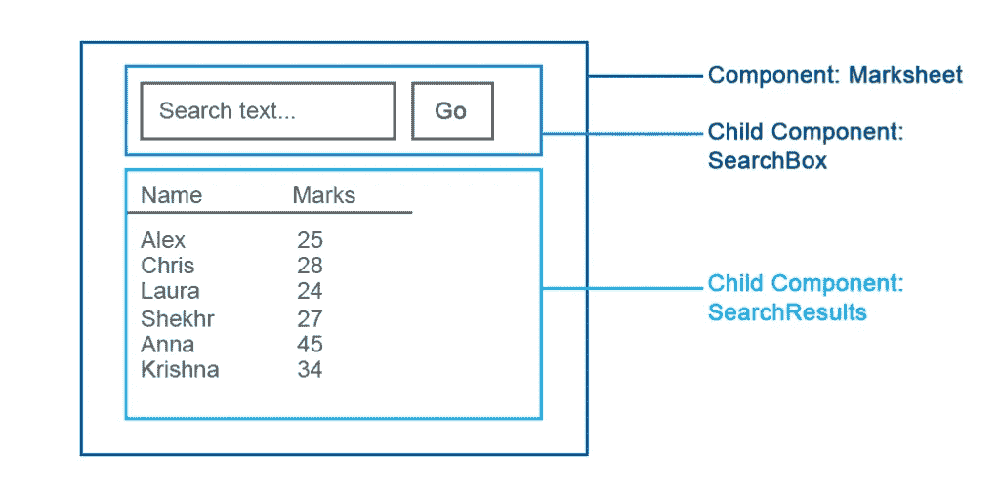
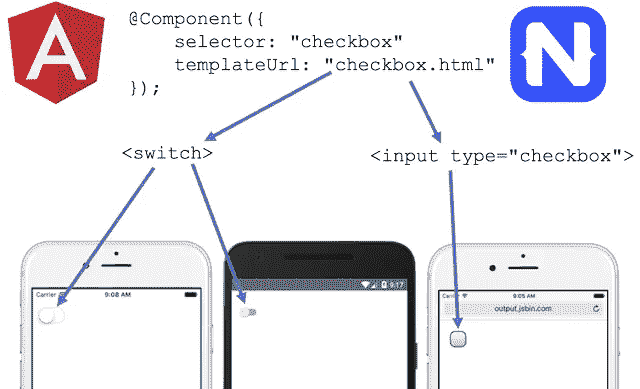
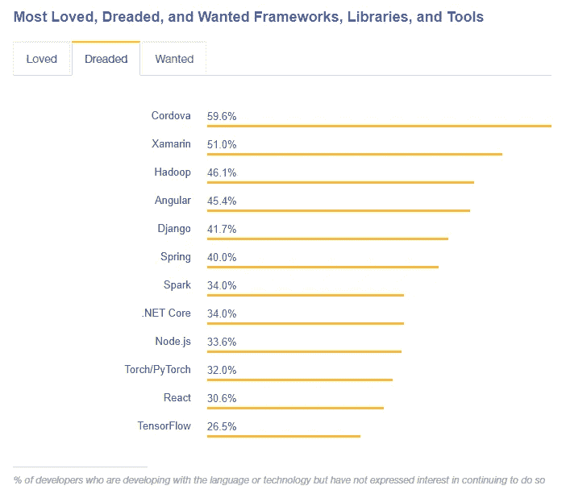

# 角发育的好与坏

> 原文：<https://medium.com/hackernoon/the-good-and-the-bad-of-angular-development-b30220bf010a>

Angular 是当今最流行的软件开发工具之一。它是由 Google 在 2009 年推出的，受到了开发社区的热烈赞扬。根据 2018 年 StackOverflow 调查，[36.9%的软件工程师现在应用 AngularJS 和新版本 Angular 2+来创建用户界面。让我们谈谈这些工具的主要特性，并探讨它们在前端工程方面的优势和不足。](https://insights.stackoverflow.com/survey/2018/)

这篇文章并不短，所以这里有一些方便的链接，可以跳转到你要找的部分。

[什么是有棱角的](https://www.altexsoft.com/blog/engineering/the-good-and-the-bad-of-angular-development/#what%20is%20angular)——故事、平均堆栈、工具和设置

[AngularJS](https://www.altexsoft.com/blog/engineering/the-good-and-the-bad-of-angular-development/#pros%20and%20cons%20of%20angularjs)的利与弊——旧框架概述

[Angular 2–6](https://www.altexsoft.com/blog/engineering/the-good-and-the-bad-of-angular-development/#angular%202%20and%20angular%202+)—新版本的优缺点

[结束语](https://www.altexsoft.com/blog/engineering/the-good-and-the-bad-of-angular-development/#final%20words) —关于用例的一些想法

# 什么是有角的

## AngularJS 和 Angular 2 到 Angular 6 背后的故事

Angular 由 Google 支持，是一个用于构建用户界面(前端)的开源软件工程平台。它的历史可以追溯到 2009 年，当时谷歌工程师 Misko Hevery 和 Adam Abrons 开发了目前称为 AngularJS 的框架，并于 2010 年正式发布。

**棱角分明。**2010 年，AngularJS 的主要优势在于它可以让你将基于 HTML 的文档转化为动态内容。在 AngularJS 之前，HTML，web 标记语言，总是静态的，这意味着用户不能主动地与 HTML 页面上的界面进行交互。有一些方法可以构建动态的单页面应用程序(spa ),但是对于方便的工程来说它们太复杂了。AngularJS 架构减少了旨在创建动态内容的开发工作，用户获得了具有动态形式和元素的网页。

**有角的 2+。【2016 年 9 月，谷歌发布 Angular 2。他们完全重写了框架，以满足现代网络日益增长的需求。AngularJS 1.x 和新 Angular 之间的差异如此之大，以至于你不能只是从一个更新到另一个。采用新技术需要完全重写您的应用程序。2017 年，又一次重大更新 Angular 4 到来。它对第 2 版做了几处重大改进，但其核心仍是同一产品。从那时起，谷歌一直定期发布更新。当前版本 Angular 6 于 2018 年 5 月推出，第 7 版计划于 2018 年 10 月首次亮相。为了避免术语混淆，我们将简单地称新框架为 Angular，正如一些社区成员[建议的](http://angularjs.blogspot.com/2016/12/ok-let-me-explain-its-going-to-be.html)，与旧的 AngularJS 1.x 版本相对。**

## 平均堆栈

角状属于所谓的均值叠加。这个缩写词描述了涵盖主要软件产品开发方面的四种技术。

***M—***[***MongoDB***](https://www.mongodb.com/)、noSQL(非关系)数据库

***E***——[***Express***](https://expressjs.com/)***，*** 后端中间件

***一—*** [***有角***](https://angular.io/) ***，*** 前端框架

***N—***[***node . js***](https://nodejs.org/en/)*，*运行环境。(在我们的专门文章中了解更多关于 Node.js 优缺点的信息。)

 [## Node.js Web 应用程序开发的利与弊

### 作为最流行的编程语言，JavaScript 也是最通用的软件开发工具之一

www.altexsoft.com](https://www.altexsoft.com/blog/engineering/the-good-and-the-bad-of-node-js-web-app-development/?utm_source=MediumCom&utm_medium=referral) 

虽然工程师可能会使用 Angular 而不考虑堆栈中的其他技术，但他们总是可以依赖现有的公司生态系统，其中也有其[全栈开发人员](https://www.altexsoft.com/blog/engineering/the-good-and-the-bad-of-javascript-full-stack-development/?utm_source=MediumCom&utm_medium=referral)，即涵盖软件开发所有方面的专家。

## 角度工具和设置

在这里，我们将讨论工程师通常使用 Angular 的主要工具，以获得框架的全部好处。

[**RxJS**](https://angular.io/guide/rx-library) **。没有 RxJS，你不可能使用 Angular，RxJS 是一个反应式编程库，旨在处理带有多个事件的异步数据。它基本上允许工程师建立多个数据交换通道，以减轻资源消耗。**

[**角 CLI**](https://cli.angular.io/) 。命令行界面(CLI)用于创建项目、添加文件、执行更新、处理调试测试和部署。

我们将在下面详细讨论 RxJS 和 Angular CLI。

**代码编辑器。**目前很多流行的代码编辑产品都支持 Angular。最常见的被社区接受的有 [Visual Studio Code](https://code.visualstudio.com/) 、 [Sublime text](https://www.sublimetext.com/) ，还有令人惊讶的不是——[Angular IDE](https://www.genuitec.com/products/angular-ide/)和 [WebStorm](https://www.jetbrains.com/webstorm/) 。但是，请检查您最喜欢的代码编辑器是否适合 Angular。

# 角度的利弊

让我们简要回顾一下使 original AngularJS 在其他前端开发框架中脱颖而出的主要优点，并描述一下该工具的主要缺点。

## 角度的优点

**⊕** **双向数据绑定。** AngularJS 采用模型-视图-控制器架构构建。框架同步了模型和视图。随着模型中数据的改变，视图也会改变。双向数据绑定允许工程师减少开发时间，因为它不需要编写额外的代码来提供连续的视图和模型同步。

**⊕指示。这个特性实际上启用了上面提到的 HTML 扩展。指令允许开发人员向文档对象模型(DOM)分配特殊的行为，允许工程师用 HTML 创建动态和丰富的内容。**

**⊕依赖注射。**依赖关系定义了不同的代码片段如何相互作用，以及一个组件的变化如何影响其他组件。通常，依赖关系直接在组件本身中定义。因此依赖关系的每一个变化都需要改变组件。使用 AngularJS，您可以使用将依赖关系定义为外部元素的注入器，将组件从它们的依赖关系中分离出来。依赖注入使得组件更加可重用，更易于管理和测试。

**⊕社区。**从一开始，AngularJS 就在工程师中非常受欢迎。一个强大的社区提供了足够的培训材料、讨论和第三方工具来着手使用 AngularJS，并为几乎所有出现的问题找到解决方案。

## AngularJS 的缺点

**θ表现。**动态应用并不总是表现良好。复杂的水疗中心可能会因其尺寸而滞后且不方便使用。

**θ陡峭的学习曲线。**angular js 是一种多功能仪器，因此完成任何任务的方法都不止一种。这在工程师中造成了一些困惑。然而，大量的教程和问题讨论解决了大部分问题。

在 Angular 2 发布，然后 Angular 4 更新之后，最初的 AngularJS 1.x 的使用慢慢开始下降。虽然新版本仍然具有相同的功能，如优点部分所述，但它们在新版本中得到了完全重建。

# 角度 2 和角度 2+

Angular 的主要问题是，它来到了一个新世界，受到其主要竞争对手 ReactJS 的影响。关于你应该使用谷歌的框架还是脸书的框架的争论非常激烈。我们已经介绍了原始的 AngularJS 1.x，并将它与其他的 [JavaScript 框架](https://www.altexsoft.com/blog/engineering/angularjs-vs-knockout-js-vs-vue-js-vs-backbone-js-which-framework-suits-your-project-best/?utm_source=MediumCom&utm_medium=referral)进行了比较，现在让我们来看看新的 Angular 环境的主要优缺点。虽然我们不会直接比较 Angular 和 ReactJS 的竞争对手，但在为您的下一个项目选择最合适的仪器时，应该记住这种竞争。

## 棱角分明的优点

让我们看看这项技术给工程界带来的主要好处，包括基于组件的架构、面向移动的理念、性能以及其他一些使 Angular 脱颖而出的特征。

## ⊕基于组件的架构提供了更高质量的代码

组件可以被认为是一个接口中相互独立的小部分。假设您有一个简单的应用程序，其中有一个商品列表和一个相应的搜索框，可以通过单词匹配来检索商品。列出名称的框、搜索框以及放置其他两个框的主页面都被视为 Angular 中的独立组件。

*Markesheet is a parent component to SearchBox and SearchResults that are respectively child components*

虽然 AngularJS 主要是围绕模型-视图-控制器(MVC)架构构建的，但从版本 2 开始，Angular 被认为是基于组件的，这与 MVC 非常相似，但确保了应用程序中组件的更高重用性。这允许构建具有许多活动部件的 ui，同时，简化了工程师的开发过程。这种架构的主要好处是什么？

**可重用性。类似性质的组件被很好地封装，换句话说，是自给自足的。开发人员可以在应用程序的不同部分重用它们。这在企业范围的应用程序中特别有用，在这些应用程序中，不同的系统聚合在一起，但可能有许多类似的元素，如搜索框、日期选择器、排序列表等。**

**可读性强。**封装还确保了新开发人员——他们最近加入了一个项目——能够更好地阅读代码，并最终更快地达到他们的生产力平台。

**单元测试友好。**组件的独立性简化了单元测试，即旨在验证应用程序最小部分(单元)性能的质量保证程序。

**可维护性。容易相互解耦的组件可以很容易地被更好的实现所替代。基本上，您的工程团队在迭代开发工作流中维护和更新代码的效率会更高。**

## ⊕打字稿:更好的工具、更干净的代码和更高的可伸缩性

Angular 是用 TypeScript 语言写的，基本上是 JavaScript 的超集。它完全编译成 JavaScript，但是在实际输入代码时帮助发现和消除常见错误。虽然小型 JavaScript 项目不需要这种增强，但企业级应用程序要求开发人员使代码更干净，并更频繁地验证代码质量。

对于许多工程师来说，将 Angular 的类型优先策略放在好处部分是有争议的。与 TypeScript 相关的抱怨不时出现在开发社区中。工程师不得不学习另一种语言。然而，TypeScript 的存在是有原因的，如果您愿意，您仍然可以使用 JavaScript。

Victor Savkin，Google Angular 团队的前开发人员，[解释说](https://vsavkin.com/writing-angular-2-in-typescript-1fa77c78d8e8)从 JavaScript 到 TypeScript 的转变是由大型企业级项目的工具来证明的。TypeScript 具有更好的导航、自动完成和重构服务。

目前，TypeScript 被认为是 Angular 的基础语言，文档也是为 TypeScript 创建的。

## ⊕RxJS:高效异步编程

正如我们提到的，RxJS 是一个通常与 Angular 一起使用来处理异步数据调用的库。 [Thinkster](https://thinkster.io/tutorials/learn-rxjs-observables/what-is-rxjs) 建议查看 JavaScript 代码的 RxJS，就像亨利·福特的汽车制造流水线一样。它允许独立地并行处理事件并继续执行，而不需要等待某个事件发生，也不会让网页无响应。原则上，这就像装配线一样，执行被分解成单独的、可互换的部分，而不是由一个人来完成。显然，异步编程在 RxJS 之前就存在了，但是这个库让很多事情变得更简单了。

虽然许多工程师抱怨 RxJS 的学习曲线非常陡峭，但是一旦你掌握了这个工具，它就会在许多方面大放异彩。该库通过*可观察对象、*类似于蓝图的方式运行，这些蓝图描述了数据流是如何组合的，以及应用程序如何对这些数据流中的变量做出反应。基本上，一旦你掌握了可观测量，你就可以像乐高积木一样轻松地重用、管理和组合它们，从而降低诸如构建拖放功能、处理大量数据等编程操作的复杂性。您可以将 RxJS 与其他支持前端(React)的框架结合使用。JS)或后端操作(Node。JS)，但是在 Angular 中 RxJS 是必需的，我们也将在缺点部分讨论。

## ⊕平台不可知的哲学

Angular 是根据[移动优先的方法](https://www.altexsoft.com/blog/business/how-to-be-mobile-first-company/?utm_source=MediumCom&utm_medium=referral)开发的。这个想法是共享代码库，并最终在 web、iOS 和 Android 应用程序之间共享工程技术。

为了实现这一雄心勃勃的定位，2015 年 Angular 开发者[与](http://angularjs.blogspot.com/2015/12/building-mobile-apps-with-angular-2-and.html) [NativeScript](https://www.nativescript.org/nativescript-is-how-you-build-native-mobile-apps-with-angular) 框架背后的团队合作(专注于构建接近原生的移动应用)。对于 NativeScript 和 Angular 来说，不仅是代码本身，诸如依赖注入、数据绑定、服务和路由等角度概念都是相似的。

然而，这种不可知论并没有延伸到代码重用本身，而是延伸到相同的工程技能集。换句话说，你的开发人员应该使用 NativeScript UI 组件来构建移动界面，但他们将在熟悉的 JavaScript 和 Angular 环境中操作，处理移动界面的学习曲线不会太陡。

*Image source: NativeScript.org*

## ⊕高性能

多种因素有助于提高应用程序的速度。通过分层依赖注入和角度通用支持来确保主提升。

**分层依赖注入。**与 AngularJS 相比，Angular 使用改进的分层依赖注入。该技术通过并行运行实际组件，将它们从依赖关系中分离出来。Angular 构建了一个独立的依赖注入器树，可以在不重新配置组件的情况下进行修改。因此，类本身没有依赖关系，而是从外部来源使用它们。

*Every component tree has an assigned tree of injectors that contain dependencies information*

该方法为角度应用提供了高性能分数。正如 Angular 团队所声称的那样，Angular 2 的速度是 Angular 1.x 的 5 倍，正如工程师所声称的那样，后来的版本甚至提高了性能标志。

**有角万能。Angular Universal 是一种允许在服务器而不是客户端浏览器上呈现应用视图的服务。Google 提供了一套[工具](https://universal.angular.io/overview/)来预渲染你的应用程序或者为用户的每个请求重新渲染它。目前，该工具集是为[节点定制的。JS 服务器端框架](https://www.altexsoft.com/blog/engineering/node-js-frameworks-comparison-for-your-back-end-solution-express-js-meteor-js-sails-js-and-more/?utm_source=MediumCom&utm_medium=referral)并支持[ASP.NET 核心](https://www.altexsoft.com/blog/engineering/the-good-and-the-bad-of-net-framework-programming/?utm_source=MediumCom&utm_medium=referral)。谷歌声称他们将增加对 PHP、Python 和 Java 的支持。**

**常春藤渲染器。**渲染器是将模板和组件翻译成浏览器能够理解和显示的 JavaScript 和 HTML 的引擎。Ivy 是继最初的编译器和*渲染器 2 之后的第三代 Angular 渲染器。*除了其他更新，Ivy 还应用了*树摇动*技术，这意味着它删除了未使用的代码块，使应用程序更小，加载更快。它是向后兼容的:在 Angular 更新后，您现有的应用程序将使用 Ivy 呈现，不会有额外的麻烦。

但是我们建议对任何性能声明持保留态度。不仅底层架构对此有贡献，而且您的工程师生成的代码的质量也有贡献。

## ⊕谷歌长期支持

一些软件工程师认为谷歌支持 Angular 是这项技术的一大优势。虽然这听起来很有道理，但谷歌本身是不够的。好消息是谷歌宣布了对该技术的长期支持(LTS)。Angular 背后的工程师 Igor Minar 和 Steven Fuin 在 [ng-conf 2017 主题演讲](https://www.youtube.com/watch?v=anzsE2TbCyk)中证实了这一承诺。

这基本上意味着谷歌计划坚持 Angular 生态系统并进一步发展它，试图在前端工程工具中保持领先地位。

## ⊕角材料简化材料设计界面工程

如果你对谷歌生态系统感兴趣，或者你只是认为[材料设计](https://material.io/design/)是一套很酷的设计指南，你会很高兴知道 Angular 团队一直在用材料设计组件更新他们的框架。材料设计的伟大之处在于，它是一个一致且非常合理的系统，考虑了人们如何与数字产品互动，并努力使他们的体验无缝且美观。如果你一直在使用 Google Drive、Google Cloud 或 Android，你很可能对它很熟悉。

有了 [Angular Material](https://material.angular.io/) 你可以得到各种各样的预构建组件，它们跨越表单控件、导航元素、布局、按钮和指示器、弹出窗口、模态窗口和数据表。它们可以调整角度使用，并且易于集成到项目中。

## 使用 Angular CLI 实现⊕无缝更新

有角度的命令行界面，因为种种原因，受到很多工程师的青睐。它易于设置，对新人友好，带有开箱即用的测试工具、简单的命令等等。

最近版本 6 的一个令人印象深刻的特性就是*ng update<package>*命令。它检查软件包，并对所有依赖项(包括加载程序和插件)可能需要的更新提出建议。一些涉及第三方依赖性的代码更新可以由第三方自动更新，例如，如果第三方决定修复其产品中的某些内容。你可以在[角度更新指南](https://update.angular.io/)页面上查看这是如何工作的。

同样适用于 Angular 本身。考虑到团队有一个令人印象深刻的节奏，新版本将在大约六个月内推出，必须有一个简单的方法来更新 Angular 本身，而不破坏任何东西。 *Ng update @angular/core* 会刷新你的框架包，TypeScript，和 RxJS。

## ⊕Powerful 生态系统

Angular 已经存在很长时间了，它已经被包、插件、附加组件和开发工具淹没了。你可以通过查看 [Angular Resources](https://angular.io/resources) 的列表来探索社区手工作品的一部分。这些包括 ide、工具、UI 环境、上面提到的用于服务器端渲染的 Angular Universal、分析工具、ASP.NET 工具、数据库等等。

如果普通工程师迷路了，总有一个工具可以帮助解决突然出现的问题。

## ⊕Angular 元素

如果您有多个项目运行，其中一些不是角度，与第 6 次更新，您可以在其他工程环境中使用角度元素。这些可能是用 VueJS、React 甚至 jQuery 构建的应用。通过将角度组件包装成 DOM 元素(自定义元素)，可以重用它。如果你或你的团队必须在各种环境之间切换，这真的很方便。

# 有角度的缺点

如果您一直在关注围绕 Angular 2–6 版本的宣传和讨论，您可能会知道该技术引发了很多批评。让我们检查一下也要考虑的主要缺点。

## θ分化和搅动的群落

不管 LTS 怎么说，任何技术周围的社区都是它在市场上强大的原因。而棱角分明的社区故事也颇具争议。根据 [2018 StackOverflow 开发者调查](https://insights.stackoverflow.com/survey/2018/)，Angular(Angular 1 . x 和 Angular 都有)是类别框架、库和其他技术中第二常用的技术，很酷。

但事实是，根据同一项调查，通常使用 Angular 的开发人员可能会在最喜欢、最害怕和最想要的框架、库和工具类别中流失。目前，TensorFlow 是最受欢迎的技术，支持率为 73.5%，其次是 React，支持率为 69.7%。45.4%的受访者认为棱角是最可怕的技术。低于 Hadoop (46.1)、Xamarin (51)、Cordova (59.6)，但还是挺高的。从好的一面来看，这个结果比前一年(48.3)要低，可能那些被遗留产品困住的人也投了票。所以，这种负面反应的某些部分实际上可能是针对 AngularJS 的。

*Source: StackOverflow.com*

这主要是因为 AngularJS 1.x 用户可能会流失，并且不会考虑过渡到现代 Angular。如你所知，你不能直接从 AngularJS 1.x 更新。

## θ将传统系统从 AngularJS 迁移到 Angular 需要时间

我们说过，AngularJS 和 Angular 之间的差异很大，从过去迁移到未来的路径也很大。查看此[迁移建议页面](https://angular.io/guide/upgrade)。不像从 Angular 5 升级到 Angular 6，这不会是一件轻而易举的事，尤其是如果你正在处理一个遗留的怪物。

有不同的方法可以做到这一点，其中之一是使用一种[混合方法](/contentsquare-engineering-blog/angularjs-to-angular5-upgrading-a-large-application-7e6fbf70bafa)，就像 [Pierre Maoui](https://medium.com/u/4341ab7f5c78?source=post_page-----b30220bf010a--------------------------------) 提供的方法一样。它需要在增量更新整个产品的同时让新旧 Angular 同时运行。这不仅需要时间，你还必须回顾许多工具，过渡到一种新的语言，并处理一个沉重的应用程序，因为你有两个 Angulars 运行。

## Angular 冗长而复杂

您从 Angular 开发社区听到的最常见的抱怨是工具的冗长。这个问题从 AngularJS 开始就没变过。

尽管我们已经提到了基于组件的架构的主要优点，但是组件的管理方式太复杂了。例如，在 Angular 中，一个组件可能需要多达五个文件，必须注入依赖关系，并声明组件生命周期接口。其他关注点是特定于 angle 的第三方库及其语法。因此，Angular 的大部分开发时间都花在了重复的事情上。

## θ陡峭的学习曲线

如果你让熟悉 JavaScript 的新开发人员学习和使用新的 Angular，与类似的 React 或 Vue 相比，他们将面临挑战。涵盖的主题和方面很多:模块、我们之前提到的依赖注入、组件、服务、模板等等。

另一个障碍是 RxJS，一个用于异步编程的反应式编程库。学习它，至少在基础水平上，对于使用 Angular 是强制性的。工程师们抱怨错误消息过于隐晦，如果没有额外的研究和反复试验的操作，很难理解。

TypeScript，正如我们在优势部分已经提到的，也是争论的焦点。虽然 TypeScript 提高了代码的可维护性，但学习它并不能使曲线变得更平缓。

## CLI 文档缺乏细节

一些工程师[对 CLI 文档的当前状态表示担忧](https://medium.jonasbandi.net/my-concerns-with-the-angular-cli-9002bdf36975)(通过[乔纳斯·班迪](https://medium.com/u/616dec513b97?source=post_page-----b30220bf010a--------------------------------))。虽然命令行非常有用，并且受到 Angular 开发人员的喜爱，但是您不会在 GitHub 的官方文档中找到足够的信息，您将花费一些时间探索 GitHub 上的线程来获得答案。幸运的是，社区会提供帮助。

# Angular 是为企业级应用而创建的

声称新 Angular 有争议太委婉了。如果您阅读来自开发社区的不同反馈帖子，很可能您会被抱怨而不是兴奋所绊倒。但是我们对 Angular 并没有那么悲观。

使用 TypeScript 来提高代码的可维护性，随着您开发更复杂的应用程序而提高的性能分数，以及特定的生态系统选择都表明 Angular 可能会成为长期和大量投资项目的主要工具，在这些项目中，陡峭的学习曲线可以通过稳定性和持续的技术支持来补偿。

这是新的 Angular 和 ReactJS 之间的主要区别，你也可以考虑一下。后者很容易掌握、部署和开始工作，但是它的通用性和可维护性肯定不如 Angular。

*这篇文章是我们“好与坏”系列的一部分。有关最流行技术的优缺点的更多信息，请参阅本系列的其他文章:*

[****Xamarin****移动开发**](https://www.altexsoft.com/blog/mobile/pros-and-cons-of-xamarin-vs-native/?utm_source=MediumCom&utm_medium=referral)

*[****JavaScript 全栈*** *开发**](https://www.altexsoft.com/blog/engineering/the-good-and-the-bad-of-javascript-full-stack-development/?utm_source=MediumCom&utm_medium=referral)*

**[****node . js****Web App 开发**](https://www.altexsoft.com/blog/engineering/the-good-and-the-bad-of-node-js-web-app-development/?utm_source=MediumCom&utm_medium=referral)**

**[*的好与坏* ***ReactJS 和 React Native***](https://www.altexsoft.com/blog/engineering/the-good-and-the-bad-of-reactjs-and-react-native/?utm_source=MediumCom&utm_medium=referral)**

**[****雨燕*** *编程语言**](https://www.altexsoft.com/blog/engineering/the-good-and-the-bad-of-swift-programming-language/?utm_source=MediumCom&utm_medium=referral)**

**[****的好与坏。NET*** *框架编程**](https://www.altexsoft.com/blog/engineering/the-good-and-the-bad-of-net-framework-programming/?utm_source=MediumCom&utm_medium=referral)**

**[****硒*** *测试自动化工具**](https://www.altexsoft.com/blog/engineering/the-good-and-the-bad-of-selenium-test-automation-tool/?utm_source=MediumCom&utm_medium=referral)**

**[****Java****编程**](https://www.altexsoft.com/blog/engineering/pros-and-cons-of-java-programming/?utm_source=MediumCom&utm_medium=referral)**

***原载于 AltexSoft 的博客****’***[***棱角发育的好与坏***](https://www.altexsoft.com/blog/engineering/the-good-and-the-bad-of-angular-development/?utm_source=MediumCom&utm_medium=referral)***’*****