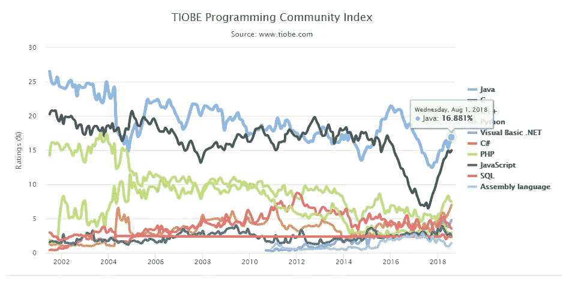
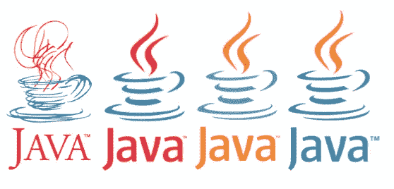
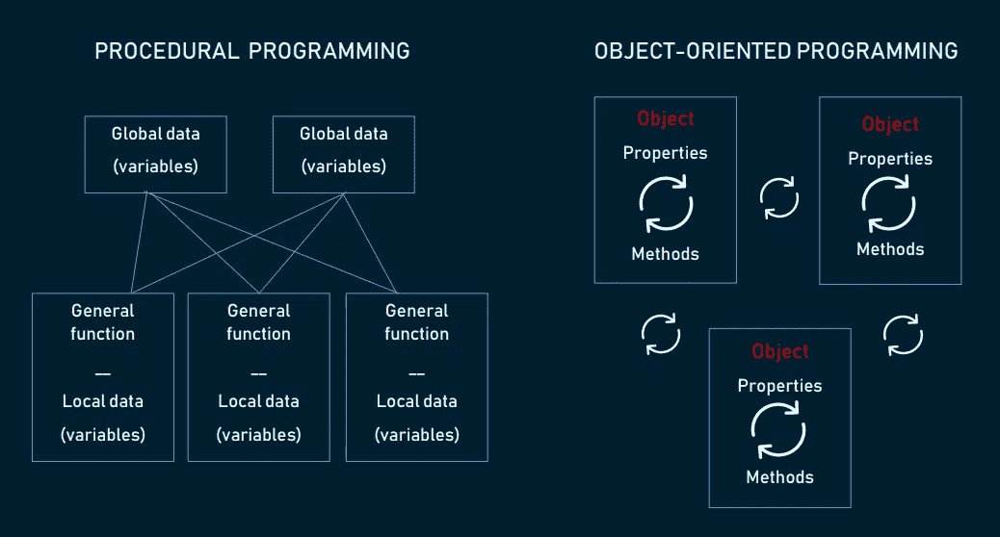
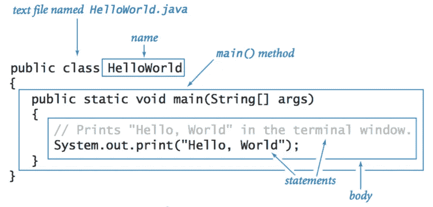
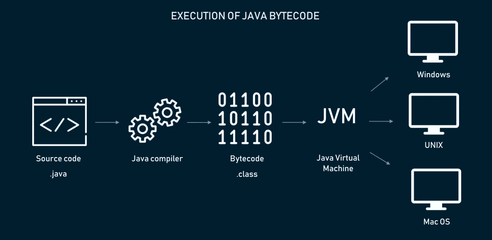
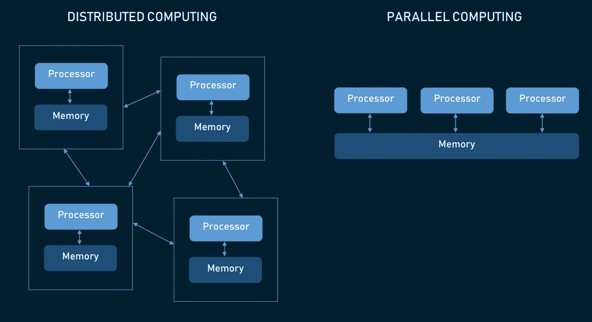
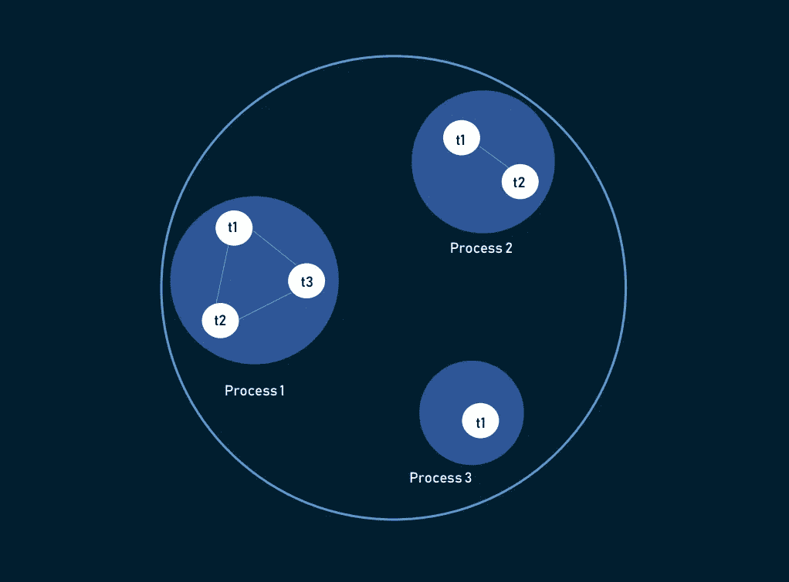
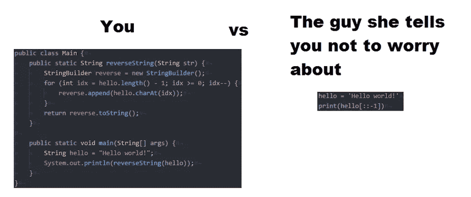

# Java 编程的好与坏

> 原文：<https://medium.com/hackernoon/the-good-and-the-bad-of-java-programming-eeaee8918ea>

没有多少技术可以吹嘘保持 20 多年的相关性。但是今年，Java 被评为第五大最受欢迎的技术，仅次于无可争议的领导者 JavaScript、HTML、CSS 和 SQL。虽然在同一份 StackOverflow 调查中，它在最受喜爱的名单上排在第 18 位，但在最令人恐惧的排名中，它也排在最后。今天，我们来揭开 Java 的许多成功和挑战——这是一项历史悠久的技术，带有标志性的热气腾腾的咖啡杯标志，是当今许多程序员亲近的语言。

# 什么是 Java 编程:历史和影响

Java 是一种通用编程语言，它遵循面向对象的编程范式和一次编写随处运行的方法。Java 用于桌面、web、移动和企业应用程序。你可以在这里找到更多信息:

Java 不仅仅是一门语言，还是一个工具生态系统，几乎涵盖了 Java 开发所需的一切。这包括:

*   **Java 开发工具包**(JDK)——有了它和一个标准的笔记本应用程序，你可以编写、运行/编译 Java 代码
*   **Java 运行时环境**(JRE)——包含独立 Java 虚拟机、Java 标准库(Java 类库)和配置工具的软件分发工具
*   **集成开发环境**(IDE)——帮助您运行、编辑和编译代码的工具。 [IntelliJ IDEA](https://www.jetbrains.com/idea/) 、 [Eclipse](http://www.eclipse.org/) 和 [NetBeans](http://www.netbeans.org/) 是最受欢迎的

你可以在任何地方找到 Java。它是 Android 开发的主要语言。您会在 web 应用程序、政府网站和大数据技术(如 Hadoop 和 Apache Storm)中找到它。它也是科学项目的经典选择，尤其是自然语言处理。甚至在智能手机出现之前，Java 就已经统治了移动领域[——21 世纪初的第一批手机游戏大多是用 Java 制作的。因此，可以公平地说，Java 由于其悠久的历史，已经在编程名人堂中赢得了一席之地。TIOBE index 是世界上最著名的编程排名之一，它使用搜索引擎结果进行计算。尽管 Go 和 Python 越来越受欢迎，但 Java](https://www.pocketgamer.biz/feature/10705/a-brief-history-of-mobile-games-2002-wake-up-and-smell-the-coffee/) [十多年来一直高居榜首](https://www.tiobe.com/tiobe-index/)。

*TIOBE Index data as of August, 2018*

这一切都始于 20 世纪 90 年代初，当时 Sun Microsystems 团队开始开发一个更好的 C++版本——易于移植，对新手友好，并支持自动内存管理。这项研究创造了一种全新的语言，这个名字是从会议室里大声喊出来的几十个名字中挑选出来的。今天，一个热气腾腾的咖啡杯的标志是无声的、普遍认可的编程符号。程序员对咖啡因的痴迷或与 java(咖啡的同义词)的关联，哪一个先出现已经不清楚了。

*Evolution of Java logos*

这些只是 Java 引入编程世界的一些变化:

**灵活性。** Java 证明了 C 语言的过程化的、手动分配的、依赖于平台的代码并不是最重要的。多亏了 Java，越来越多的人开始采用面向对象编程，这是当今普遍接受的实践。

**小程序**。在 JavaScript 出现之前的几年里，Java 引入了 applets，这是一种提供交互式元素的小型 web 程序，对于可视化和教学尤其有用。虽然它们只用于简单的动画，但它吸引了许多程序员的注意，并为 HTML5、Flash，当然还有 JavaScript 的开发铺平了道路。

**测试驱动开发。有了 Java，TDD 不再是一种实验性的实践，而是开发软件的标准方法。2000 年 JUnit 的引入被认为是 Java 最大的贡献之一。**

# 用 Java 编程的好处

尽管[不再是安卓开发唯一官方支持的语言，当然也不是 web 编程的唯一选择，Java 仍然紧跟其他语言的步伐。因为这不仅仅是因为它有相当长的历史，所以让我们来探索一下 Java 有哪些优势。](https://techcrunch.com/2017/05/17/google-makes-kotlin-a-first-class-language-for-writing-android-apps/)

## ⊕面向对象编程

Java 包含了**面向对象编程**(OOP)——一种编码概念，在这种概念中，你不仅要定义数据类型及其结构，还要定义应用于它的一组函数。这样，您的数据结构就变成了一个对象，现在可以操作它来创建不同对象之间的关系。

另一种方法是**过程化编程**，在这种方法中，你必须遵循一系列使用变量和函数的指令，与之相反，OOP 允许你根据上下文对这些变量和函数进行分组，从而对它们进行标记，并在每个特定对象的上下文中引用函数。

*Comparing procedural programming and object-oriented programming*

OOP 为什么是优势？

*   您可以轻松地在其他程序中重用对象
*   它通过让对象隐藏一些不应该被轻易访问的信息来防止错误
*   它使程序更有组织性和预先计划，甚至是更大的程序
*   它提供了简单的维护和遗留代码现代化

## ⊕高级语言，语法简单，学习曲线适中

Java 是一种高级语言，这意味着它非常类似于人类语言。与类似机器代码的低级语言相反，高级语言必须使用编译器或解释器进行转换。这简化了开发，使语言更容易编写、阅读和维护。

*Writing Hello World in Java
Source:* [*Java Programming Cheatsheet*](https://introcs.cs.princeton.edu/java/11cheatsheet/)

Java 的语法(程序员使用的一套规则和结构)来自 C++，这就是为什么你会注意到它非常类似于 C 代码。然而，它简单得多，允许初学者更快地学习技术，更有效地编码以达到特定的结果。

Java 可能不像 Python 那样对初学者友好，但是任何对框架、包、类和对象有基本了解的开发人员都可以很快掌握它。它直截了当、强类型化，并且有非常严格的期望，很快就能帮助你把思维引向正确的方向。此外，大量的免费在线教程和课程不会让新手束手无策。

## ⊕企业计算标准

企业应用程序是 Java 最大的资产。它始于 90 年代，当时组织开始寻找非 c 语言的强大编程工具。Java 支持大量的库，这些库是任何企业系统的构建模块，可以帮助开发人员创建公司可能需要的任何功能。巨大的人才库也有帮助——Java 是大多数学校和大学用来介绍计算机编程的语言。此外，它的集成能力令人印象深刻，因为大多数主机提供商都支持 Java。最后但同样重要的是，Java 的维护成本相对较低，因为您不必依赖于特定的硬件基础设施，并且可以在任何类型的机器上运行您的服务器。

## ⊕缺乏安全风险

您可能会认为 Java 是一种安全的语言，但这并不完全正确。这种语言本身并不能保护你免受攻击，但是它的一些特性可以避免常见的安全缺陷。首先，与 C 相比，Java 没有指针。指针是一个存储另一个值的内存地址的对象，该值可能导致对内存的未授权访问。其次，它有一个**安全管理器**，一个为每个应用程序创建的安全策略，您可以在其中指定访问规则。这允许您在“沙箱”中运行 Java 应用程序，消除了损害的风险。

## 独立于⊕平台(一次编写，随处运行)

一次编写，随处运行(WORA)是 Sun Microsystems 推出的一个流行的编程口号，用来描述 Java 的跨平台能力。这意味着你可以在比如说 Windows 上创建一个 Java 程序，把它编译成字节码，然后在任何支持 Java 虚拟机(JVM)的平台上运行这个应用程序。在这种情况下，JVM 充当代码和硬件之间的抽象层。

*How WORA approach works in Java*

包括 Windows、Mac OS 和 Linux 在内的所有主流操作系统都支持 JVM。除非你正在编写一个主要依赖于特定平台特性和 UI 的程序，否则你可以共享——也许不是全部——但是一大块字节码。

## ⊕分布式语言，方便远程协作

Java 被设计成一种分布式语言，这意味着它有一种集成的机制，可以在多台计算机之间共享数据和程序，从而提高性能和效率。

*Distributed computing vs parallel computing*

与必须使用外部 API 进行分发的其他语言不同，Java 在其核心提供了这种技术。用于分布式计算的特定于 Java 的方法被称为**远程方法调用** (RMI)。使用 RMI 允许您将 Java 的所有好处，如安全性、平台无关性和面向对象编程，带到分布式计算中。除此之外，它还支持套接字编程和 CORBA 的分布方法，用于在不同语言编写的程序之间共享对象。

## ⊕自动内存管理

由于自动内存管理(AMM)和垃圾收集，Java 开发人员不必担心手动编写内存管理任务的代码，自动内存管理也用于 [Swift 编程语言](https://www.altexsoft.com/blog/engineering/the-good-and-the-bad-of-swift-programming-language/?utm_source=MediumCom&utm_medium=referral)，垃圾收集是一种自动处理内存分配和取消分配的应用程序。到底是什么意思？

一个程序的有效性与记忆直接相关——而记忆是有限的。通过使用带有手动管理的语言，开发人员可能会忘记分配内存，从而导致内存占用和延迟。一个**垃圾收集器**可以定位你的程序不再引用的对象并删除它们。尽管它会影响程序的 CPU，但您可以通过智能优化和调优来减少或防止它。

## ⊕多线程

在编程中，线程是最小的处理单位。为了最大限度地利用 CPU 时间，Java 允许您同时运行这些线程——在一个称为多线程的过程中。

线程共享相同的内存区域，因此在它们之间切换几乎不需要时间。它们也是独立的，所以如果一个线程面临异常，它不会影响其他线程。这对于游戏和动画密集型程序尤其有用。

*Multithreading example*

## ⊕的稳定和庞大的社区

多亏了社区、Oracle 的支持以及在 JVM 上持续运行的大量应用程序和语言，Java 已经存活了相当长的时间。此外，Java 的新版本定期发布，带有[新鲜有趣的特性](https://aboullaite.me/10-new-features-in-java-10/)。

Java 的开发者社区也是无人能及的。大约 45%的 StackOverflow 2018 调查受访者使用 Java。它有一个非常大的生态系统，其中包含针对任何用例的经过充分测试的库和框架。Java 很可能是初学者在学习中遇到的第一批语言之一，因为 Udemy 上有 1000 多门与 Java 相关的课程，Coursera 上有 300 多门。

# Java 编程的缺点

在用 Java 编写下一个项目之前，这里有一些你想知道的缺点。

## θ支付了商业许可

甲骨文最近[宣布](https://java.com/en/download/release_notice.jsp)他们将从 2019 年开始对“商业、商业或生产”使用的 Java 标准版 8 收费。要获得所有新的更新和漏洞修复，你需要按用户数量或每个处理器付费。

今天，Java 的当前版本是免费的，可以为通用计算重新发布。为了应对这种变化，每家公司都必须评估他们使用了多少 Java，如果价格升级太过痛苦，就寻求一种替代技术。

## θ表现不佳

由于虚拟机的编译和抽象级别，任何高级语言都必须处理糟糕的性能。然而，这并不是 Java 经常被批评的速度的唯一原因。以垃圾收集器为例，这是一个有用的特性，但不幸的是，如果它占用超过 20%的 CPU 时间，就会导致严重的性能问题。不良的缓存配置还会导致过多的内存和垃圾收集使用。当几个线程试图访问同一个资源时，也会发生线程死锁，以及——每个 Java 开发人员的噩梦——内存不足错误。虽然这些问题中的每一个都可以通过有技巧的计划来预防，但是它们累积起来会造成不同程度的损害。

## θ远非桌面上的原生外观

为了创建程序的图形用户界面(GUI)，开发人员使用不同的语言专用工具。因此，对于 Android 应用程序，[有 Android Studio](https://www.altexsoft.com/blog/mobile/key-approaches-to-mobile-development-explained/?utm_source=MediumCom&utm_medium=referral) 帮助创建外观和感觉都是本地的应用程序。然而，当谈到桌面 UI 时，Java 明显缺乏。

Java 程序员可以从几个 GUI 生成器中选择:Swing、SWT、JavaFX、JSF 是最流行的。Swing 很老，但是很可靠，是跨平台的，并且已经集成在各种 Java IDEs 中，包括 Eclipse 和 NetBeans。但是除非你使用模板，否则你会注意到界面不一致。SWT 使用本地组件，但它不适合复杂的用户界面。JavaFX 很干净，看起来很现代，但是还不是很成熟。总的来说，为基于 Java 构建的 GUI 选择一个合适的工具需要额外的研究。

## θ冗长而复杂的代码

当代码冗长时，意味着它使用了太多的单词。虽然当你试图理解这种语言时，这看起来是一个优势，但是长而复杂的句子会降低代码的可读性和可扫描性。通过试图模仿英语，许多高级语言往往会制造太多噪音。Java 是为了淡化难以接近的 C++而创建的，它迫使程序员准确地输入他们的意思，这使得这种语言对非专业人士来说更加透明，但不幸的是——不够简洁。

如果我们把 Java 和它的对手 Python 比较一下，我们可以看到 Python 代码显得多么清晰:它不需要分号；使用“and”、“or”和“not”作为运算符，而不是 Java 的“&&、“||”和“！”；并且通常具有较少的诸如括号或花括号之类的附加功能。

*Java vs Python code
Source:* [*reddit.com/r/ProgrammerHumor*](https://www.reddit.com/r/ProgrammerHumor/comments/66jj7f/java_vs_python/)

# 总结:Java 用在哪里？

大多数组织都以这样或那样的方式使用 Java。广泛的用例使得这些应用程序几乎不可见，这也是为什么“在哪里使用 Java”这个问题经常被提出。为了结束我们的概述，让我们看看 Java 可以覆盖哪些领域:

**安卓应用。**尽管 [Kotlin 的入侵式增长](https://appdevelopermagazine.com/why-kotlin-language-use-is-skyrocketing/)，Java 仍然是 Android 应用程序事实上的语言，这自动将一大群 Java 开发者变成了 Android 程序员。虽然 Android 使用 Android SDK 而不是 JDK，但代码仍然是用 Java 编写的。

**软件产品。除了已经提到的 Hadoop 和 Apache Storm，Java 还被用来创建 Eclipse、OpenOffice、Gmail、Atlassian 等等。**

**金融项目。作为金融行业最需要的语言技能之一，Java 在服务器端和客户端都被用来构建可靠、快速和简单的网站。它也是数据模拟和建模的首选语言。**

**销售点系统。**许多企业使用 Java 创建 PoS 系统，因为它们通常需要平台无关性和庞大的人才库。

**交易申请。** Murex，一个流行的银行管理程序，用于前后连接，是用 Java 编写的。

**大数据程序。** Hadoop 是用 Java 写的。Scala、Kafka 和 Spark 使用 JVM。此外，Java 让您可以访问大量经过实践检验的库、调试器和监控工具。

*这篇文章是我们“好与坏”系列的一部分。有关最流行技术的优缺点的更多信息，请参阅本系列的其他文章:*

[****Xamarin****手机开发**](https://www.altexsoft.com/blog/mobile/pros-and-cons-of-xamarin-vs-native/?utm_source=MediumCom&utm_medium=referral)

*[****JavaScript 全栈*** *开发**](https://www.altexsoft.com/blog/engineering/the-good-and-the-bad-of-javascript-full-stack-development/?utm_source=MediumCom&utm_medium=referral)*

**[****的好与坏 Node.js*** *Web App 开发**](https://www.altexsoft.com/blog/engineering/the-good-and-the-bad-of-node-js-web-app-development/?utm_source=MediumCom&utm_medium=referral)**

**[****的好与坏 ReactJS 和 React Native****](https://www.altexsoft.com/blog/engineering/the-good-and-the-bad-of-reactjs-and-react-native/?utm_source=MediumCom&utm_medium=referral)**

**[****雨燕*** *编程语言**](https://www.altexsoft.com/blog/engineering/the-good-and-the-bad-of-swift-programming-language/?utm_source=MediumCom&utm_medium=referral)**

**[****的好与坏。NET*** *框架编程**](https://www.altexsoft.com/blog/engineering/the-good-and-the-bad-of-net-framework-programming/?utm_source=MediumCom&utm_medium=referral)**

**[****硒*** *测试自动化工具**](https://www.altexsoft.com/blog/engineering/the-good-and-the-bad-of-selenium-test-automation-tool/?utm_source=MediumCom&utm_medium=referral)**

**[****角度*** *编程**](https://www.altexsoft.com/blog/engineering/the-good-and-the-bad-of-angular-development/?utm_source=MediumCom&utm_medium=referral)**

***最初发表于 AltexSoft tech 博客****'***[***Java 编程的好与坏***](https://www.altexsoft.com/blog/engineering/pros-and-cons-of-java-programming/?utm_source=MediumCom&utm_medium=referral)***'*****