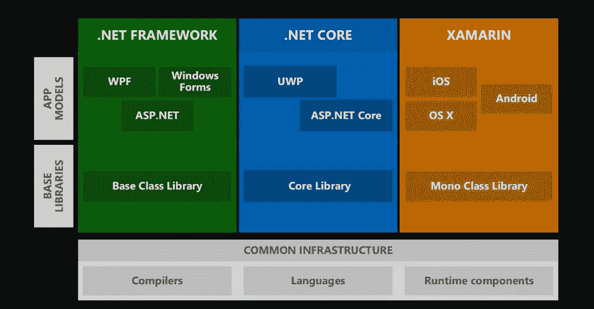
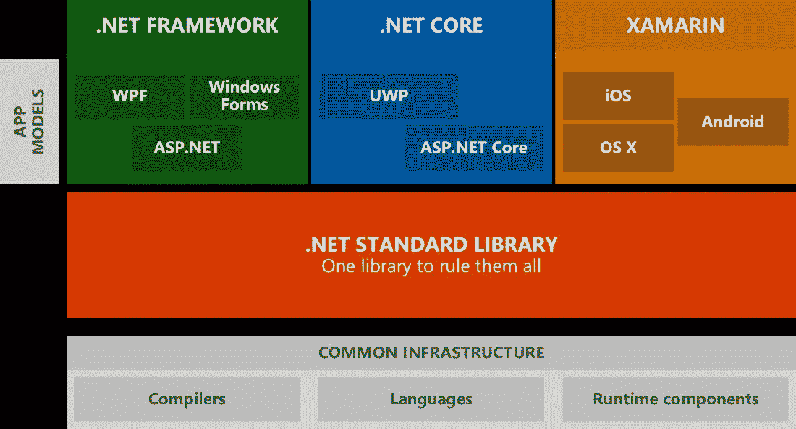
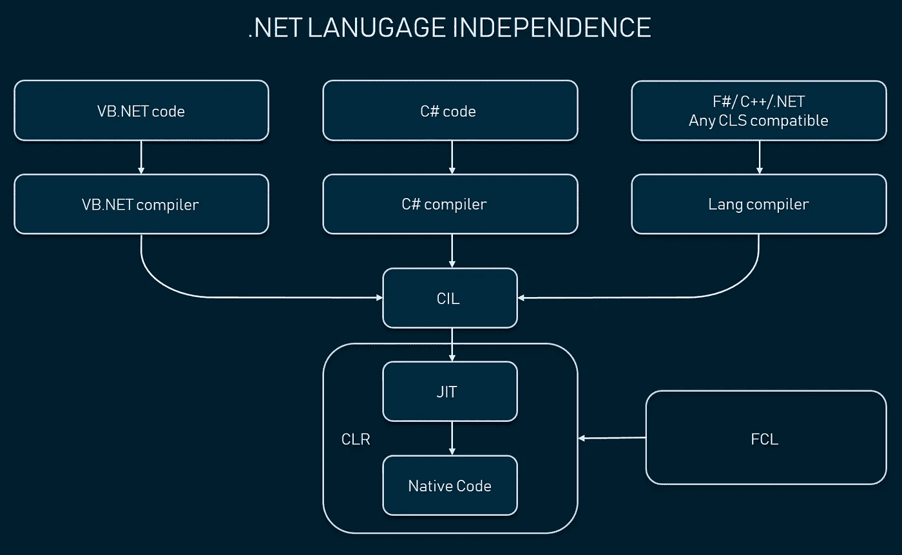
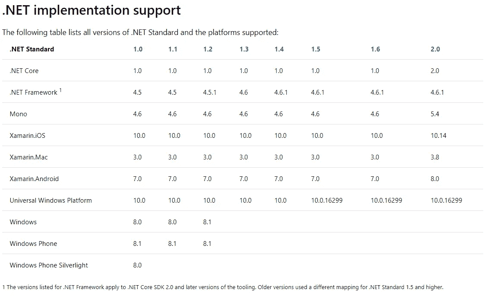
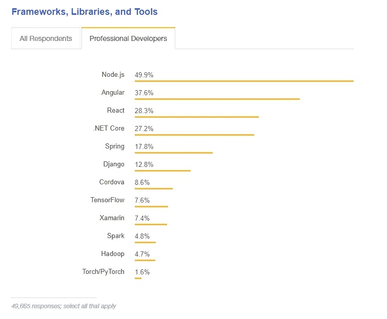

# 的好与坏。NET 框架编程

> 原文：<https://medium.com/hackernoon/the-good-and-the-bad-of-net-framework-programming-6e3b5ccc03>

。NET 是一个软件开发框架和生态系统，由微软设计和支持，允许简单的桌面和 web 应用程序工程。这是一个流行的免费平台，目前用于许多不同类型的应用程序，因为它为大多数软件开发阶段提供了编程环境。。NET 最适合寻求广泛功能的企业，如基于 web 的服务、桌面软件和云基础设施支持。

微软开始致力于。从那时起，这个工具经历了巨大的转变，现在伴随着一个丰富的生态系统，如下图所示。

*.NET ecosystem before 2016*

# 。NET 开发平台

的。NET 有三种风格:。NET 框架，。NET Core 和 Xamarin。这些实现组合在一起称为。NET 开发平台。它们都包含构建各种应用程序的框架和库。

## 。NET 框架

的。NET Framework 是该平台的第一个也是最古老的实现。它包括三个主要的应用模型——ASP.NET 窗体、WPF 窗体和基础类库。

**Windows Presentation Foundation(WPF)**是一个 UI 框架，主要用于为 Windows 操作系统上的桌面客户端应用程序创建图形界面。WPF 使用可扩展应用程序标记语言的功能( [XAML](https://en.wikipedia.org/wiki/Extensible_Application_Markup_Language) )。

**Windows Forms** 是内部的一个 GUI 类库。NET 框架。Windows 窗体用于开发带有丰富图形的桌面应用程序，这些图形易于更新和部署。

**ASP.NET。前两个组件是为桌面工程设计的，而 ASP.NET 用于开发动态网站和网络应用。它的核心是*公共语言运行时(CLR)* ，为开发者提供了使用不同[编写 ASP.NET 代码的机会。网络语言](https://en.wikipedia.org/wiki/List_of_CLI_languages)。公共语言运行库是一个应用程序虚拟机，它管理内存，实现代码访问安全性，验证代码安全性，并提供线程和代码的执行。**

**基础类库(BCL)** 提供最常见的功能，如名称空间中的类，并且是*框架类库**【FCL】*的核心，这是一组可重用的接口、类和值类型，与*公共语言运行时(CLR)* **紧密集成。**FCL 和 CLR 的结合构成了。NET 框架。

作为。NET Framework 只支持基于 Windows 的设备，因此需要一个跨平台的软件包。

## 。网络核心

。网芯发布于 2016 年。这是跨平台重建的。NET 框架。与旧版本不同，工程师现在可以在 Linux 和 OS X 上使用该产品，并创建不一定与 Windows 家族相关的应用程序。新系统旨在征服云空间，因为一些提供商如 Digital Ocean 是 Linux 驱动的。不仅如此。NET Core 是跨平台的，它的不同版本可以并行安装在同一台设备上。。NET Core 包括 ASP.NET Core 和通用 Windows 平台(UWP)。

**通用 Windows 平台(UWP)** 是由微软创建的 API，用于开发通用应用程序，这些应用程序可以在所有兼容的微软 Windows 设备上运行，即 Windows、Windows Phone 和 [HoloLens](https://www.altexsoft.com/blog/engineering/augmented-reality-check-get-ready-to-ditch-your-smartphone-for-goggles/) 。

ASP.NET 核心是 ASP.NET 的再版，碰巧是一个比它的前身更模块化的框架。ASP.NET 核心允许你建立移动后端，网络应用和服务。它也是跨平台的，可以在 OS X、Windows 和 Linux 上运行。

## Xamarin

第三种实现称为 Xamarin，用于移动应用程序和 Mac 产品。最初，Xamarin 是独立于微软设计的，是一种专有产品，直到微软在 2016 年收购了它，成为了的一个完全开源的分支。NET 平台。Xamarin 使用 Mono 运行时和。NET Framework 进行了调整，可以与 iOS、Android 和 Xamarin.Mac 的 API 一起工作。要获得该产品的详细概述，请查看我们的 [Xamarin 利弊](https://www.altexsoft.com/blog/mobile/pros-and-cons-of-xamarin-vs-native/)文章。

所有的运行时都使用一个公共的基础设施，使整个生态系统工作。它提供运行时组件、语言和编译器。

## 。净标准

2016 年微软也推出了[。NET Standard](https://docs.microsoft.com/en-us/dotnet/standard/net-standard) ，一个结合了来自。NET 框架，。NET Core 和 Xamarin 允许工程师使用一个基础类库，而不是掌握三个不同的相关类库。NET 实现。这一步统一了生态系统，并为跨不同平台重用组件带来了更高的一致性。

*.NET ecosystem after 2016*

。NET 开发平台最好与用于跨所有平台和设备构建、调试和发布应用程序的 Visual Studio IDE 一起使用。

目前，最流行的。NET are。NET Core 和 Xamarin。所以，让我们更深入地看看使用的优缺点。NET 开发平台。大多数要点可以应用于整个生态系统，而其中一些仅与其特定组件相关，我们将在相应的部分中详细说明。

# 的优点。净发展

## 面向对象的软件开发模型

。NET 是基于*面向对象编程(OOP)* 。OOP 是一种开发模型，其思想是将软件分解成更小的部分，以便于管理和组合。OOP 将数据划分为对象，即数据字段，并通过类的声明来描述对象的行为和内容。

模块化结构有助于定义对象的行为及其交互，而无需管理对象的内部属性。OOP 通过使代码易于管理、易于测试和响应重复出现的问题来简化编程。它还消除了不必要的编程，通常对开发人员来说意味着更少的编码。。NET 使得重用代码和组件成为可能，节省了时间和开发成本。

## 可靠而简单的缓存系统

缓存意味着将数据保存在临时存储位置，以便在需要时更快地调用。存储的数据是早期信息请求的结果，或者是存储在其他地方的重复信息，需要更长时间才能检索到。

中的缓存系统。NET 功能强大，使用简单。它还被设计成可扩展的。Object Cache 类允许开发人员创建自定义缓存实现，用于提高 Windows 客户端和服务器应用程序的性能和可伸缩性。

## Visual Studio IDE

集成开发环境(IDE)是面向程序员的单一产品，它通过提供编写和测试软件的所有工具，使应用程序开发变得更加容易。

Visual Studio 是一个 Microsoft IDE，用于跨所有平台(包括 Android 和 iOS)构建、调试和发布应用程序。Visual Studio 与集成在一起。NET 并提供特定语言环境的特性。

Visual Studio IDE 的主要功能是:

*   它被用作所有人的单一 IDE。网络应用
*   IDE 集成了编译和调试功能
*   该解决方案可用于基于不同语言编写的代码的应用程序
*   Visual Studio 允许自定义环境以匹配用户偏好

最重要的是， [Visual Studio Marketplace](https://marketplace.visualstudio.com/) 提供了来自微软和其他提供商的各种编辑器扩展，以支持团队协作、[、持续集成](https://www.altexsoft.com/blog/business/continuous-delivery-and-integration-rapid-updates-by-automating-quality-assurance/?utm_source=MediumCom&utm_medium=referral)、第三方连接、云开发管理等。

 [## 持续交付和集成:通过自动化质量保证快速更新

### 在过去的十年中，连续交付已经成为讨论最多的开发实践之一。制作软件…

www.altexsoft.com](https://www.altexsoft.com/blog/business/continuous-delivery-and-integration-rapid-updates-by-automating-quality-assurance/?utm_source=MediumCom&utm_medium=referral) 

## 的跨平台设计和语言独立性。网络核心

。NET Core 是跨平台的。NET 实现，允许代码在 OS X、Windows 和 Linux 上运行。与原作不同。NET 框架——它只是部分开放的—。NET Core 拥有完全开放的源代码，这确保了广泛的工程社区能够不断地为其开发做出贡献。

如果您用 C#、F#或 Visual Basic 编写，您的代码将在每种兼容的操作系统上运行。这使得公司能够接触到最广泛的平台。网络生态系统。同时，跨平台设计和语言独立性保证了整体。拥有大量不同工程技能的. NET 社区分享经验。目前，。NET 支持超过 25 种语言，包括 C#、Visual Basic.NET、J#、托管 C++、IronPython 和 IronRuby。

*.NET language independence*

## 灵活的部署和易于维护

其中一个重要的。NET 的核心特性是灵活的部署。它可以作为应用程序的一部分安装，也可以单独安装。模块化设计允许包含您需要的所有依赖项。部署本身就像复制文件夹一样简单。

另一个好处是你可以有多个。NET 核心版本在同一台机器上并行运行，以涵盖不同的项目并无缝地执行部署任务。

## 通用。净标准

自 2016 年以来。NET 生态系统通过一个名为。净标准。它基于。NET 框架，。NET Core 和 Xamarin。它们用于处理常见的功能，如图形渲染、数据库交互和 XML 文档操作。的。NET 标准库大大简化了开发人员的工作。

之前。NET 标准，程序员必须为新平台重新开发应用程序或库，然后在各种平台上分发所有更新。目前，该库支持跨应用程序的所有依赖库。但是，您应该检查版本兼容性以成功利用。净标准。

*You may check your product compatibility with .NET Standard here and track updates on the* [*Microsoft documentation site*](https://docs.microsoft.com/en-us/dotnet/standard/net-standard)

## 大型社区

。NET 有一个庞大的开发人员社区。有趣的是，它联合了来自小型、中型和企业级公司的工程师。这意味着几乎任何问题都可以在社区成员的帮助下得到解决。

自从。NET Core 是开源的，它的库、运行时和编译器都可以在 GitHub 上获得，有很多贡献。根据[栈溢出 2018 调查](https://insights.stackoverflow.com/survey/2018/)，两个。NET 产品是最受欢迎的技术:。NET Core 排名第四，Xamarin 排名第九。

*Most popular frameworks Stack Overflow Survey 2018*

除此之外，还有一个名为[的独立组织。NET Foundation](https://dotnetfoundation.org/) 围绕。网络生态系统。。NET 社区和商业开发者把它作为思想交流的主要论坛。

## ASP 中的自动监控。网

ASP。NET 有内置的自动监控。Windows Web 服务器严格监控网页和在其上运行的应用程序。如果出现任何问题，如内存泄漏或无限循环，它会立即发出警报。这允许直接纠正这些行为并创建新的流程。监控确保了更高的稳定性和透明度。NET 应用程序。

# 的缺点。净发展

即使。由于广泛的基础设施和成熟的产品开发历史，NET 被认为是最强大的工程平台之一，但它也带来了一系列问题。

## 有限的对象关系支持

正如我们上面提到的。NET 使用面向对象编程(OOP)语言模型。该模型基于对象而非“动作”和数据而非逻辑。支持面向数据的软件应用开发。NET 框架由[实体框架](https://docs.microsoft.com/en-us/ef/)提供。

实体是一个对象关系映射器( [ORM](https://en.wikipedia.org/wiki/Object-relational_mapping) )，它在面向对象的。NET 框架和关系(SQL)数据库。一些工程师认为实体框架不够灵活，可能不支持所有可用的数据库设计。这也意味着在某些时候，实体框架可能不支持新的数据库设计。另一个问题是，该框架最终可能会被微软抛弃，这将迫使您采用供应商建议的一些新技术。

从好的方面来看，我们还没有遇到实体的问题，所以这仍然是一个有争议的问题。

## 供应商锁定

第二个缺点与前一个缺点部分相关。。NET 是基于微软运行的。而。NET Core 和 Xamarin 都是开源的，整个生态系统远不是社区驱动的。这意味着你的产品仍然依赖于供应商和微软的决策。

## 许可成本

建筑。不管开源技术如何，NET apps 都不便宜。大多数情况下，您的费用将花费在 Visual Studio IDE 和 Microsoft 为简化您的工作而提供的其他协作和质量保证服务上。到今天为止，Visual Studio 的基础版本将花费你 539 美元/年来雇佣一名工程师。一个包括各种云、企业移动性、QA 功能等的企业版大约每年 3000 美元。然而，你仍然可以尝试成为[微软的合作伙伴](https://partner.microsoft.com/en-US/membership/msdn-subscriptions?tpqid=800-000036#simple-tab-content-2)，付费订阅一些内容。

即使你可以使用。NET Core 在 Mac 和 Linux 机器上，最好的方法是使用 Windows for。NET 工程，这也伴随着许可费用。

如果你以前从未使用过微软的产品，你必须从 AWS 云生态系统迁移到 Azure，这个障碍会更高。

## 释放和稳定之间的差距

也许，这个问题削弱了所有的微软产品，而不是。仅限网络堆栈。但绝对值得一提。新发布的产品缺乏适当的文档、支持、稳定性，并且容易发生剧烈的变化。在[的一个 AltexSoft 项目](https://www.altexsoft.com/case-studies/marketing/customer-engagement-cloud-platform-gamification-marketing-startup/?utm_source=MediumCom&utm_medium=referral)中，我们的架构师决定使用一个新的 DocumentDB(现在的 [Azure Cosmos DB](https://docs.microsoft.com/en-us/azure/cosmos-db/introduction) )，但随后被迫设计定制的数据架构，因为该产品遇到了许多可能危及整个项目的技术问题。

Y Combinator 的一位用户生动地描述了这个问题:“*我对这些微软技术宣传文章/视频的问题是，似乎微软总是让他们的新技术发挥作用，并告诉世界它很棒，可以投入生产了。然后你去实现它，一旦你离开他们演示的完美世界，一切都分崩离析，然后你发现文档是为测试版编写的，不再适用，所以你只能猜测你需要的方法的正确调用签名。”*

较小的缺点包括由于在封闭系统中进行垃圾收集而出现的性能问题。而且，一般来说，托管环境比那些直接与硬件通信的环境要慢。

# 何时使用。网

**可扩展产品**。通常，业务需求在增长，您的软件必须随之扩展。。NET 提供了可扩展的环境，并允许重新设计正在进行的应用程序，以满足不断增长的业务需求。

**跨平台需求。如果你需要跨平台的应用程序。NET 将是一个很好的选择，因为它覆盖了大多数平台，你可以减少开发工作，同时将你的桌面或移动应用程序扩展到其他操作系统。最重要的是。NET 可用于游戏(包括 Xbox)和 AR 开发(包括 HoloLens)等具体工程案例。**

**企业级基础设施。是否……仍是一个有争议的问题。NET 主要是为企业使用而设计的。但是微软确保提供尽可能广泛的工具集来构建和交叉集成企业产品，包括内部和公共产品。它还支持强大的[企业移动生态系统](https://www.altexsoft.com/blog/cloud/enterprise-mobility-management-models-and-solutions/?utm_source=MediumCom&utm_medium=referral)。**

*本文是我们“好与坏”系列的一部分。如果你对 web 开发感兴趣，可以看看我们的博客文章:*

[*Xamarin 发展的好与坏*](https://www.altexsoft.com/blog/mobile/pros-and-cons-of-xamarin-vs-native/?utm_source=MediumCom&utm_medium=referral)

[*棱角分明的好与坏*](https://www.altexsoft.com/blog/engineering/the-good-and-the-bad-of-angular-development/?utm_source=MediumCom&utm_medium=referral)

[*JavaScript 全栈开发的优劣*](https://www.altexsoft.com/blog/engineering/the-good-and-the-bad-of-javascript-full-stack-development/?utm_source=MediumCom&utm_medium=referral)

[*node . js Web App 开发的好与坏*](https://www.altexsoft.com/blog/engineering/the-good-and-the-bad-of-node-js-web-app-development/?utm_source=MediumCom&utm_medium=referral)

[*反应的好与坏，反应的原生*](https://www.altexsoft.com/blog/engineering/the-good-and-the-bad-of-reactjs-and-react-native/?utm_source=MediumCom&utm_medium=referral)

[*Swift 编程语言的好与坏*](https://www.altexsoft.com/blog/engineering/the-good-and-the-bad-of-swift-programming-language/?utm_source=MediumCom&utm_medium=referral)

*原载于 AltexSoft 的博客**[***的好与坏。NET 框架编程***](https://www.altexsoft.com/blog/engineering/the-good-and-the-bad-of-net-framework-programming/?utm_source=MediumCom&utm_medium=referral)*