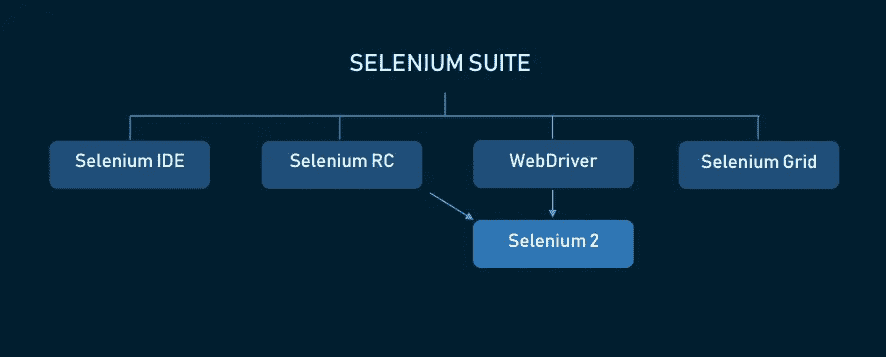
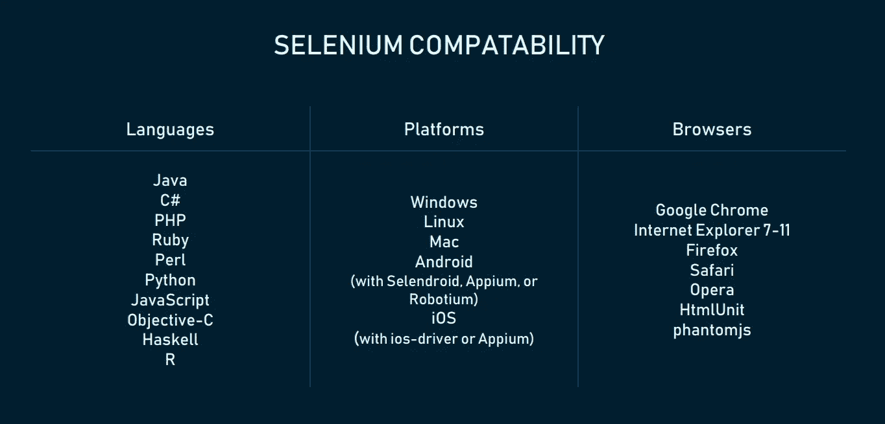
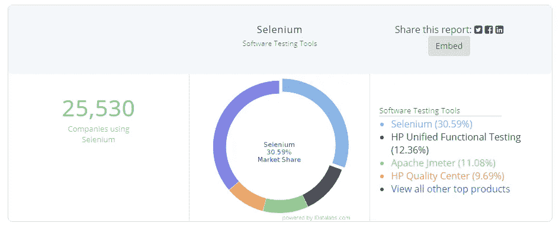

# Selenium 测试自动化工具的优缺点

> 原文：<https://medium.com/hackernoon/the-good-and-the-bad-of-selenium-test-automation-tool-49f3a6b29920>

谁不喜欢有深厚背景的命名故事？在 21 世纪初，一家名为 Mercury Interactive 的公司凭借其工具 Astra Quick Test 统治了测试自动化世界。这不是能想象到的最好的产品。例如，您只能在 Windows 计算机上运行测试，只有少数浏览器版本受支持，并且您必须使用一种语言来编写脚本— VBScript。当软件工程师 Jason Huggins 构建一个新的、创新的测试自动化工具时，他通过引用被推荐作为汞中毒解毒剂的化学元素和补充物来命名他的发明——硒。这个工具就是我们今天要复习的内容。

# 硒简介

Selenium 是一套开源软件测试自动化工具，已经成为质量保证领域的事实产品。Selenium 拥有多种编程语言，支持所有主要的操作系统和浏览器，目前被网飞、谷歌、HubSpot、Fitbit 等公司用于生产。整个套件为不同的测试问题和需求提供了一系列解决方案。在本文的后面，我们将讨论这些工具，以及 Selenium 在创建十年后仍然适用的原因。但是现在，让我们来看看是什么让硒变得如此重要。

Jason Huggins 在 2004 年创造了一个 JavaScript 框架，旨在将其创造者从重复的手工测试中解放出来。最先被预测命名为 JavaScriptTestRunner 的产品可以直接在浏览器中执行测试，驱动页面上的交互，并在没有手动输入的情况下重新运行它们。在 Huggins 意识到它的潜力，使其开源并将其重命名为 Selenium Remote Control 之后，该工具开始流行。它的创新之处在于，在它之前没有其他工具允许测试人员用他们选择的编程语言与浏览器对话。

然而，很快就发现浏览器对 JavaScript 应用了安全限制，使得无法使用该工具的全部功能。当时，谷歌是 Selenium 的狂热用户，但工程师们努力克服其局限性。其中一个人，西蒙·斯图尔特，开始开发一种能与浏览器自然对话的产品，他称之为 WebDriver。Selenium 将 WebDriver 结合起来，改变了我们十多年来测试软件的方式。

要开始您的 Selenium 之旅，请查看以下迷你入门包:

*   [下载硒](https://www.seleniumhq.org/)
*   [硒文档](https://www.seleniumhq.org/docs/index.jsp)
*   [Google Groups 上的 Selenium 用户社区](https://groups.google.com/forum/#!forum/selenium-users)
*   [Selenium GitHub 项目](https://github.com/SeleniumHQ/selenium/)
*   [加入硒 IRC 聊天频道](http://elementalselenium.com/tips/20-irc-chat)

# Selenium 套件基础架构

Selenium 系列的第一款产品是 Selenium 遥控器(现在称为 Selenium 1)。由于它的上述限制和随后与 WebDriver 的合并，它很快就被弃用，不再受支持。整个 Selenium 基础设施可以通过下面的图像可视化，我们可以突出显示仍然受到社区大力支持和认可的三个主要产品:Selenium WebDriver、Selenium IDE 和 Selenium Grid。让我们快速描述一下它们中的每一个。

*Selenium Suite today*

## Selenium WebDriver (Selenium 2)

大多数时候，当人们谈论 Selenium 时，他们指的是 Selenium WebDriver。产品开发的最大部分都集中在这个产品上。

WebDriver 中测试自动化的工作方式经常被比作出租车驾驶。出租车驾驶与测试自动化的参与者有三个:客户/测试工程师、汽车/浏览器、出租车司机/WebDriver。根据这个类比，测试人员命令 WebDriver 与元素进行交互，就像客户向出租车司机发出指令一样。然后，WebDriver 给浏览器(汽车)发出类似这样的命令:*当按钮可点击时，点击按钮。*然后，浏览器向 WebDriver 提供关于 web 元素的值和状态的信息，这些信息随后被发送到脚本。如果您想了解更多关于质量保证活动的信息，请参阅我们全面的[软件测试白皮书](https://www.altexsoft.com/whitepapers/quality-assurance-quality-control-and-testing-the-basics-of-software-quality-management/?utm_source=MediumCom&utm_medium=referral)。

在本文中，我们将主要讨论 Selenium WebDriver 的优点和缺点。

## 硒 IDE

这个 Firefox 插件被一半的测试人员拒绝，而被另一半人庆祝。它不是为生产而设计的，很容易学习，非常适合原型任务。你不需要编程技能就能在 Selenium IDE 中成功操作，因为它基本上记录了你在浏览器中的操作并重复它们。然而，大量的官方和非官方插件允许您构建一个可能成为生产就绪工具的 IDE 怪物(我们稍后会谈到)。对于那些觉得 Selenium WebDriver 入门太高的公司来说，在 IDE 上使用一些插件可能是一个可行的解决方案。

## 硒栅

Selenium Grid 允许您同时在多台机器和浏览器上运行并行测试。这个工具的主要功能是节省时间。如果您必须运行 100 个测试，但是您使用 Selenium Grid 来设置四台虚拟机或物理机，那么它将花费您在单台机器上逐个运行这些测试所花费时间的四分之一。考虑到脚本通常在浏览器上运行缓慢，使用并行测试等性能改进技术可以帮助解决这个问题。当一台机器运行 Firefox，另一台运行 Chrome 等等时，您还可以使用它在不同的浏览器中并行测试一个应用程序。您可以使用 Grid 创建不同的配置，结合不同版本的浏览器和操作系统。不用说，当在大型生产环境中使用时，网格可以节省大量时间。

# 使用硒的好处

最后，是时候讨论好的老 Selenium 是如何随着每年市场上出现的众多出色的测试工具而继续存在的了。

## +免费

Selenium 不是市场上唯一的自动化测试工具，但它是唯一可以与付费产品竞争的免费工具。正如您在我们的[自动化测试工具比较中所看到的，](https://www.altexsoft.com/blog/engineering/comparing-automated-testing-tools-selenium-testcomplete-ranorex-and-more/?utm_source=MediumCom&utm_medium=referral) Katalon Studio 是唯一可行的替代方案，但是它没有提供那么多的语言选择，不能在 Linux 上工作，并且根本没有支持它的支持者。Selenium 的开源状态使得一个具有陡峭学习曲线的工具成为初创公司和独立开发者的低入门点。毫不奇怪，即使是更大的公司也不会急于转向付费选项，并在 Selenium 仍然存在时放弃几千美元和维护费用。

## +与敏捷、开发运维、持续交付工作流相集成

在这些话被付诸实践之前，Selenium 就已经在遵循敏捷和 DevOps 的叙述了。Selenium 的整个性质完全符合敏捷、 [DevOps](https://www.altexsoft.com/blog/engineering/devops-principles-practices-and-devops-engineer-role/?utm_source=MediumCom&utm_medium=referral) 或[连续交付](https://www.altexsoft.com/blog/business/continuous-delivery-and-integration-rapid-updates-by-automating-quality-assurance/?utm_source=MediumCom&utm_medium=referral)背后的主要原则。这究竟是如何实现的？

*   由于它可以跨所有平台移植，并且通常不需要学习新语言，Selenium 提供了无与伦比的灵活性
*   Selenium 很容易与 Jenkins、Maven、TestNG、QMetry、SauceLabs 等各种开发平台集成。
*   Selenium Grid 的并行测试允许开发人员更快地接收反馈，并立即进行修改，而不是整夜等待测试通过。

## +支持移动测试

使用 Selenium，您还可以测试本地、混合或 web 移动应用程序，尽管您需要额外的软件。有两个主要选项——[Appium](http://appium.io/)和 [Selendroid](http://selendroid.io/) 。它们都是基于 Selenium 的，因此已经精通 Selenium 的开发人员可以在测试移动应用程序时应用相同的原理。

这两个工具都是开源的，有很大的社区支持。主要区别在于 Appium 支持 iOS、Android 和 Windows 设备，而 Selendroid 只专注于 Android。Selendroid 还捆绑了 Appium，这样当你测试 Android 到 4.3 版本时，程序会自动切换到 Selendroid。

使用 Appium 似乎是一个更合理的选择，因为它不会把你限制在一个操作系统上。然而，如果你打算专门测试 Android，那么只使用 Selendroid 更有意义。它还有一些漂亮的功能，比如“热插拔”——你可以在不中断测试的情况下插入和拔出设备，增加了可以同时测试的仿真器或硬件设备的数量。

您可能还想了解另外两个合适的工具:

*   [robot ium](https://github.com/RobotiumTech/robotium)——Android 的黑盒测试框架
*   ios-driver —一个用于 ios 测试的 Selenium WebDriver API，与 Selenium Grid 集成

## +广泛支持的语言、平台和浏览器

Selenium 提供的灵活性在测试自动化领域几乎是无与伦比的。首先，我们有 10 种受支持的语言，其中包括 Java、Ruby、C#、PHP、JavaScript、Perl 和 R——所有这些都属于当今最常用的编程语言。它也是唯一涵盖 Linux 测试的主流工具。有关支持的浏览器版本的详细更新列表，请参考本页。

*Languages, platforms, and browsers supported by Selenium*

## +庞大的社区

数据驱动的研究公司 iDataLabs 为软件测试工具市场提供了有趣的见解。您可以看到，Selenium 在所有软件测试工具中占据了惊人的 30.59%的市场份额，其最接近的竞争对手 UFT 仅占 12%多一点——这是惊人的数据。

*According to iDataLabs, more than 25k companies are using Selenium*

作为现代自动化测试的先驱之一，Selenium 也获得了像 Google 和初创公司这样的大公司的开发人员的支持。QA 专业人员的工作清单将硒的熟练程度列为必备技能之一。

我们之前提到过的 Selenium 也有替代品，但它们的定价从几千美元到一万美元不等。手头有一个出色的免费工具可以让老测试人员忠于 Selenium，让新测试人员成为其粉丝。

从对在线课程的需求来看，他们正在成为粉丝。Udemy、Lynda.com 和 Coursera 为学习 Selenium 提供了几种选择。数百个循序渐进的 YouTube 教程，[Quora](https://www.quora.com/topic/Selenium-testing-framework)上一个拥有 2.5 万关注者的话题，以及 StackOverflow 上的 5.5 万个问题标志着一个庞大的、蓬勃发展的社区，它为市场提供了更多的 Selenium 人才。

## +大型插件库

Selenium 可以通过各种插件扩展其标准功能。Appium 和 Selendroid 就是其中两个。在[这个页面](https://www.seleniumhq.org/download/)上，你会看到有些被 Selenium 官方认可的第三方插件，但是你可以在 Github 上找到更多不被支持的。一定要谷歌一下*" Selenium plugins<tool name>"*，你可能会找到一个扩展，可以方便地与你喜欢的编程产品集成，比如 Jenkins 或 Eclipse。

这些插件不仅适用于 WebDriver，也适用于 Grid 和 Selenium IDE。后者尤其广泛，能够加强功能薄弱的工具，并使其为生产做好准备。

# 使用硒的缺点

我们从来不会在称赞一个软件产品的时候不提到它的一些痛点。硒也有一些这样的成分。

## –陡峭的学习曲线

当今自动化测试的趋势之一是无代码测试。这种方法允许任何没有深入编程知识的人进行测试。一些测试工具，如 TestComplete、Ranorex 或 Tricentis，通过在代码层之上构建用户友好的 UI 并支持两种模式之间的切换，提供了这种选择。测试人员仍然可以编写脚本并接收详细的反馈，但是如果需要的话，可以跳过编码部分。

然而，Selenium 不允许无代码测试。您需要很好地掌握一种编程语言，这种语言缩小了参与测试过程的人员范围。许多公司，尤其是初创公司，倾向于雇佣他们最好的程序员来编写产品特性，并让不太熟练的人参与自动化测试。这对硒不起作用。

## –无内置图像比较

在 QA 过程中，自动化图像验证存在困难。判断图像是否在屏幕上正确显示的最简单有效的方法是手动检查。虽然对于大多数产品来说，使用手动和自动测试的组合是正常的，但是这是一个很大的错误来源，因为任务很快就变得重复，测试人员检查的频率也越来越低。

解决这个问题的一个常用方法是**图像比较**。你有一个你的图像模型，程序应该与测试中显示的图像进行比较。TestComplete、Ranorex、Katalon Studio 以及其他一些软件已经包含了这个功能。要在 Selenium 中做到这一点，你需要一个第三方软件。[斯库里](http://www.sikuli.org/)是常见的选择。这是一个基于图像的识别工具，可以与 Selenium 很好地集成，但它有一些限制——它必须在同一个虚拟或物理屏幕上运行，并且不能识别动画。

## –没有技术支持

寻找硒的帮助是一把双刃剑。上面，我们提到了大量的教程、问题、答案和聊天室链接，在那里你可以向社区寻求帮助。这样做不好的一面是，提供帮助的是社区，而不是产品创造者。为你的非常规问题找到一个解决方案或者帮助客户请求是可能的，但是很困难。如有需要，您可以联系咨询或服务公司寻求商业支持。Selenium 在其[生态系统页面](https://www.seleniumhq.org/ecosystem/)上提供了此类公司的简短列表。

## –没有报告功能

测试人员、开发人员、项目经理——他们都需要访问测试结果，最好以图表、表格的形式可视化，并有截图支持。当最终的信息可能会丢失或者无法传达给最需要它的人时，编写脚本和执行测试还有什么意义呢？

缺少自动生成的报告是 Selenium 面临的最大挑战之一。要在 Selenium 中捕获测试失败，您必须在失败的时候截屏。这与团队快速诊断问题所需的可读格式相差甚远。虽然不同的供应商提供具有数据驱动的洞察力和团队工作工具集成的报告功能，但 Selenium 必须依赖第三方解决方案。以下是最受欢迎的:

*   TestNG 在测试执行时创建两种类型的报告:详细报告和摘要报告。摘要提供简单的通过/失败数据；而详细报告有日志、错误、测试组等。
*   [JUnit](https://junit.org/junit5/) 使用 HTML 在 Selenium 中生成简单的报告，用指示器表示“失败”和“成功”
*   [Extent Library](http://extentreports.com/) 是最复杂的选项:它创建测试摘要，包括截图，生成饼状图，等等。
*   [Allure](http://allure.qatools.ru/) 创建带有图表、时间线和分类测试结果的漂亮报告——所有这些都在一个方便的仪表板上。

# 一锤定音

如果 Selenium 突然宣布走付费路线，会发生什么？当一些东西完全免费提供给你的时候，很难去评论它们，但是如果我们突然不得不为它们付费，这些陷阱会有多痛苦呢？

Selenium 并不完美，但对测试人员来说已经足够好了，可以付出更大的努力，忽略无代码的趋势。当你准备花几个小时在网上寻找解决方案，而不是付费获得帮助时，它就达到了最佳状态。它仍然有一些王牌适合今天的工程叙事:更快的交付，更容易处理的小部分，接收即时反馈。

硒是一个普遍的用例。它不会掩盖所有其他的测试自动化工具，尤其是如果你有预算的话。但它的垄断性质会让你三思而后行。也许，没那么糟糕。

*这篇文章是我们“好与坏”系列的一部分。有关最流行技术的优缺点的更多信息，请参阅本系列的其他文章:*

[*Xamarin 移动开发的好与坏*](https://www.altexsoft.com/blog/mobile/the-good-and-the-bad-of-xamarin-mobile-development/)

[*JavaScript 全栈开发的好与坏*](https://www.altexsoft.com/blog/engineering/the-good-and-the-bad-of-javascript-full-stack-development/)

[*node . js Web App 开发的好与坏*](https://www.altexsoft.com/blog/engineering/the-good-and-the-bad-of-node-js-web-app-development/)

[*反应当地人的好与坏*](https://www.altexsoft.com/blog/engineering/the-good-and-the-bad-of-reactjs-and-react-native/)

[*Swift 编程语言的好与坏*](https://www.altexsoft.com/blog/engineering/the-good-and-the-bad-of-swift-programming-language/)

[*好坏之分。NET 框架编程*](https://www.altexsoft.com/blog/engineering/the-good-and-the-bad-of-net-framework-programming/)

[*棱角发育的好与坏*](https://www.altexsoft.com/blog/engineering/the-good-and-the-bad-of-angular-development/)

[*Java 编程的好与坏*](https://www.altexsoft.com/blog/engineering/pros-and-cons-of-java-programming/)

*原载于 AltexSoft Tech 博客**[***硒测试自动化工具的好与坏***](https://www.altexsoft.com/blog/engineering/the-good-and-the-bad-of-selenium-test-automation-tool/?utm_source=MediumCom&utm_medium=referral)*