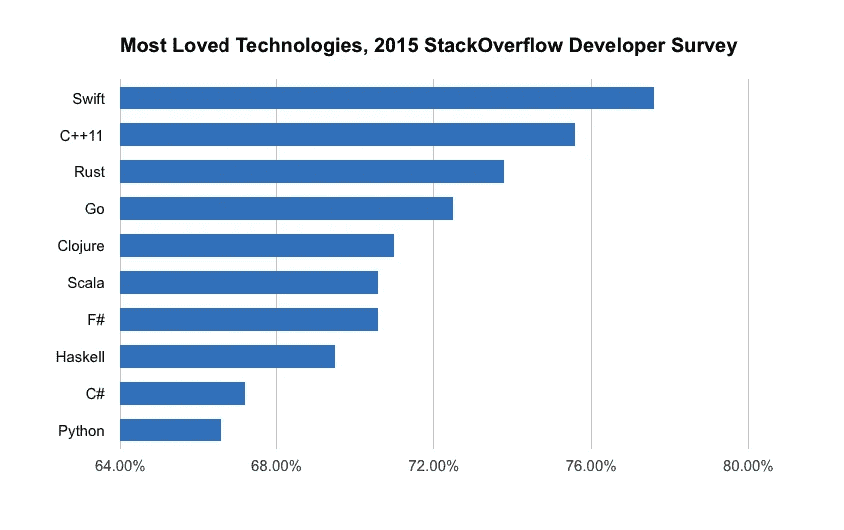
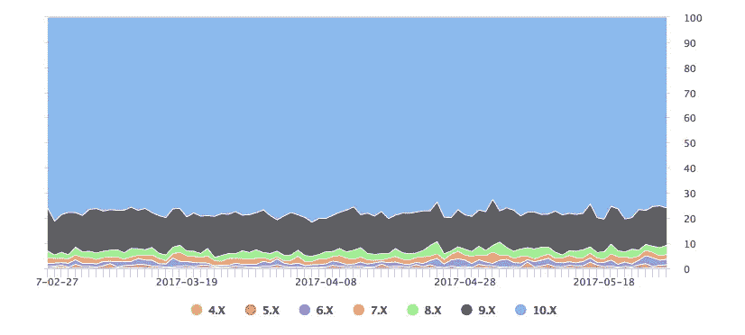

# Swift 编程语言的好与坏

> 原文：<https://medium.com/hackernoon/the-good-and-the-bad-of-swift-programming-language-44bad24f659a>

截至 2016 年 1 月[日](https://www.theverge.com/2016/1/26/10835748/apple-devices-active-1-billion-iphone-ipad-ios)，有超过 10 亿台设备在使用，iOS 是世界上第二大最受欢迎的移动平台。在包括美国、英国和法国在内的一些地区，苹果设备在[智能手机销量](http://www.businesspress24.com/pressrelease1479656.html)上继续超过安卓。这就是为什么如此多的企业将他们的软件产品主要集中在 iOS 平台上，有时仅仅是作为一个关键的投资机会和战略利益。

如果你是那些遵循 [iOS 应用程序开发](https://www.altexsoft.com/blog/mobile/ios-app-development-checklist-27-items-to-consider-before-starting-your-next-project/?utm_source=MediumCom&utm_medium=referral)道路的聪明的企业主之一，可能你将做出的最重要的决定是为你的产品选择正确的技术堆栈。如果你决定进行本地开发而不是跨平台解决方案，你仍然需要决定使用哪种语言:传统的 Objective-C 还是全新的 Swift。

# 什么是 Swift，为什么要使用它？

Swift 是一种用于 iOS、macOS、watchOS、tvOS 和 Linux 应用程序的编译编程语言。以下是您需要了解的有关 Swift 的信息。

**由苹果公司于 2014 年创建。在全球最具影响力的科技公司之一的支持下，Swift 将成为 iOS 开发及其他领域的主导语言。**

**开源。** Swift 的创造者承认，为了构建一种定义性的编程语言，技术需要对所有人开放。因此，在其存在的三年内，Swift 获得了一个庞大的支持社区和丰富的第三方工具。

**安全。它的语法鼓励你写干净和一致的代码，有时甚至会感觉很严格。Swift 提供了防止错误和提高可读性的安全措施。**

**快。** Swift 的设计考虑了性能。它的简单语法和易用性不仅能帮助你更快地开发，而且名副其实:[正如 apple.com](https://www.apple.com/swift/)上所说，Swift 比 Objective-C 快 2.6 倍，比 Python 快 8.4 倍。

**需求**。截至 2018 年 3 月，它是[第 12 大最受欢迎的语言](https://www.tiobe.com/tiobe-index/)，超过了 Objective-C、Go、Scala 和 r。在 [GitHub](https://github.com/apple/swift) 上有超过 4 万颗星和 187 万个 StackOverflow 问题，这种年轻的语言理所当然地成为行业中的主导技术之一。

请继续阅读以了解更多关于该技术的信息，或者如果您想直接使用 Swift 进行开发，请访问以下链接:

[下载并阅读 Swift 官方社区网站上的文档](https://swift.org/download/) [下载 Xcode IDE，开始在 macOS 上使用 Swift](https://itunes.apple.com/us/app/xcode/id497799835?ls=1&mt=12) [访问 GitHub 上的 Swift 资源库，贡献或深入了解该语言的技术细节使用](https://github.com/apple/swift) [在 iPad 上通过交互式 Swift Playgrounds 学习 Swift](https://developer.apple.com/swift-playgrounds/) [通过在 StackOverflow 上问答 Swift 问题，与其他开发人员联系](https://stackoverflow.com/questions/tagged/swift)

# Swift 语言简史

## 2013-2014 —创建和发布

Swift 编程语言在苹果 2014 年全球开发者大会(WWDC)上首次推出，此后引发了相当大的争议。苹果开发工具部门的高级主管克里斯·拉特纳早在 2010 年就开始设计这种新语言的基本概念。

起初，这真的只是我在胡闹，没有人知道这件事，因为这没什么好知道的。但是最终，事情变得有点严重了……所以我开始和我的管理层以及一些正在开发 Clang 的工程师交谈，他们似乎对此很兴奋。我们找了几个人兼职做这个项目，我说服我的经理，这个项目非常有趣，我们可以找几个人一起做。”

*——克里斯·拉特纳作* [*意外科技播客*](http://atp.fm/205-chris-lattner-interview-transcript/) *，2017 年 1 月*

直到 2013 年，该团队才解决了一个关于新语言如何融入现有 Objective-C 生态系统的战略问题。强迫所有的 iOS 开发者转向一种新的语言可能会对社区产生重大的破坏性影响。因此，该公司决定继续投资 Objective-C，同时致力于开发一种新的“*安全编程语言。*

一年后，注册的苹果开发人员可以拿到新语言的测试版。根据蒂姆·库克的说法，[在它作为 Xcode 工具的一部分发布后的第一个月，它就被下载了超过 1100 万次。](https://sixcolors.com/post/2015/01/tim-cook-transcript-what-apples-ceo-said-to-analysts/)

人们对斯威夫特的最初反应褒贬不一。一些开发人员对它的特性、灵活性和简单性感到高兴，而其他人则批评它。然而，他们中的大多数人认为 Swift 用于生产还为时过早。这种语言发展很快:每一个新版本都引入了重大的变化。

然而，根据 [2015 StackOverflow 开发者调查](https://insights.stackoverflow.com/survey/2015)，这并没有阻止 Swift 成为“最受喜爱”的技术。

同时，这种语言被列为十大“最需要”的技术之一。

## 2015 —转向开源

自 2015 年苹果决定将 Swift 作为开源语言以来，它的增长非常巨大。在宣布后的第一周，超过 60，000 人进行了 Swift 项目的克隆。现在，两年后，Swift 正式成为历史上增长最快的语言，根据 [TIOBE Index](https://www.tiobe.com/tiobe-index/swift/) :该语言在 2017 年 3 月进入前 10 名。

该语言对所有人免费开放，随着其最新版本 Swift 4.0 于 2017 年 9 月发布，该语言正在快速发展。这种语言被积极地部署在 iOS 开发中，为 OSX 构建桌面应用程序时，甚至作为一种服务器端技术，这要感谢 IBM。

Swift 在如此短的时间内如此受欢迎的原因之一可能是它是由苹果公司制造的。当一家拥有如此全球知名度和数百万忠实追随者的公司做某件事时，它很可能注定会成功(或者至少有好的媒体报道)。

现在，让我们仔细看看 Swift 的关键优势和劣势。关于这种语言，你应该知道些什么？可以投入生产了吗？构建 Swift 应用程序涉及哪些风险？我们从让它成为开发者宠儿的优势开始。

# 使用 Swift 进行 iOS 原生开发的优势

通常被称为“Objective-C，没有 C”，Swift 语言在许多方面都优于它的前身。根据[官方新闻稿](https://www.apple.com/newsroom/2014/06/02Apple-Releases-iOS-8-SDK-With-Over-4-000-New-APIs/)，“ *Swift 结合了编译语言的性能和效率与流行脚本语言的简单性和交互性。*“抛开技术细节和营销不谈，让我们从商业角度来看看它到底意味着什么。

## 快速开发过程

Swift 是一种简洁而富于表现力的语言，具有简化的语法和句法，更易于阅读和书写。它非常简洁，这意味着与 Objective-C 相比，执行相同任务所需的代码更少。自动引用计数(ARC)负责跟踪和管理应用程序的内存使用情况，因此开发人员无需花费时间和精力手动完成这些工作。相应地，使用 Swift 构建 iOS 应用程序通常需要更少的时间。

这一优势的一个突出例子是新的 Lyft 应用程序:该公司[使用 Swift](https://www.fastcompany.com/3050266/tech-forecast/lyft-goes-swift-how-and-why-it-rewrote-its-app-from-scratch-in-apples-new-lang) 完全重写了其 iOS 应用程序。旧的代码库由大约 75，000 行代码组成，Swift 版本用不到三分之一的代码重新创建了相同的功能。此外，该应用程序现在推出了新的入职流程:旧流程需要一个多月的时间和多名工程师来实施，而 Swift 的新入职流程仅用一名工程师就在一周内完成了。

## 更容易扩展产品和团队

除了更快的开发时间之外，您还可以获得一个面向未来的产品，并且可以根据需要扩展新功能。因此，Swift 项目通常更容易扩展。苹果更有可能支持 Swift 而不是 Objective-C 的事实也应该得到长期投资的认真考虑。

此外，Swift 允许您在需要时向您的团队添加更多开发人员:由于代码库的简单和简明，入职相对较快。

## 提高安全性和性能

顾名思义，swift 就是……嗯，Swift。由于专注于性能和速度，该语言最初被设计为优于其前身。也就是说，与 Objective-C 相比，最初的版本声称性能提高了 40%。多年来，多个[基准测试](http://benchmarksgame.alioth.debian.org/u64q/swift.html)和个人开发人员进行的测试已经证明了这一点。此外，[有很多方法可以优化 Swift 代码](https://github.com/apple/swift/blob/master/docs/OptimizationTips.rst/)以获得更好的性能。

*Image source —* [*AppleInsider Live Blog*](http://live.appleinsider.com/Event/Live_from_Apples_Worldwide_Developer_Conference_2014?Page=13)

Swift 的另一个优势是它的安全性。它强大的输入系统和错误处理功能可以防止代码崩溃和生产中的错误。因此，Swift 具有更短的反馈回路，允许您立即看到代码中的错误并即时修复，从而大大减少了修复 bug 所需的时间和精力，并消除了部署低质量代码的风险。

## 减少内存占用

当你构建一个应用程序时，你会使用大量第三方代码——可重复使用且通常开源的框架或库编译到你的应用程序代码中。这些库可以是静态的和动态的(或共享的)。Swift 在推出时首次将动态库引入 iOS。你大概可以猜到**静态**库在你编译它们的时候被锁定在代码中，成为你的可执行文件的一部分，从而增加了它的大小和加载时间。它们也不能自动更新，因为它们停留在你编译的版本上。另一方面，动态库存在于你的代码之外，只在需要的时候上传。静态库需要在程序的所有文件中都有副本，而动态库只需要一个。

虽然从外部获取动态代码比调用已经包含的动态代码需要更多的时间，但是当您想要隔离不应该共享的应用程序时，您可以选择继续使用静态库。

## 与 Objective-C 的互操作性

正如 Buffer 的 iOS 开发者 Jordan Morgan 在他的 [Medium post](/the-traveled-ios-developers-guide/swift-objective-c-c8aa66fa21dd) 中所写的那样，“*[……]swift 是新的玩具，标志着未来。目标-C 正在显示出它的年龄，最终将会很少流行。但此时此地，两者必须学会和平共处。*“因此，在同一个项目中使用两者有两种可能的情况:要么在现有的 Objective-C 代码库中添加 Swift 中的新功能，要么在新的 Swift 项目中使用 Objective-C 元素。

无论哪种方式，Swift 语言都与 Objective-C 完美兼容，可以在同一个项目中互换使用。这对于正在扩展或更新的大型项目尤其有用:利用现有的 Objective-C 代码库，您仍然可以使用 Swift 添加更多功能。因此，移植过程变得更容易，更无风险。

## 自动内存管理

Swift 使用自动内存计数(ARC)——一种旨在添加垃圾收集器功能的技术，这种功能以前没有引入 iOS。像 Java、C#和 Go 这样的语言使用垃圾收集器来删除不再使用的类实例。它们有助于减少内存占用，但会增加 20%的 CPU。在 ARC 之前，iOS 开发人员必须手动管理内存，并不断管理每个类的保留计数。Swift 的 ARC 确定哪些实例不再使用，并代表您将其删除。它可以让你提高应用程序的性能，而不会影响你的内存或 CPU。

## 全堆栈潜力和跨设备支持

在 IBM 的积极推动下，将这种语言放入云中的计划到目前为止相当成功。服务器端 Swift 集成了大多数流行的后端技术。就像在[全栈 Javascript 开发](https://www.altexsoft.com/blog/engineering/the-good-and-the-bad-of-javascript-full-stack-development/?utm_source=MediumCom&utm_medium=referral)中一样，在应用的后端和前端使用 Swift 允许广泛的代码共享和重用，从而加快开发过程并减少开发工作量。

此外，Swift 不仅为 iPhones 和 iPads 提供开箱即用的支持，还为所有苹果设备提供支持，包括 Apple TV、Apple Watch 和 Mac。除此之外，已经有了对 Linux 的支持，并打算将其正式移植到 Windows 平台上。甚至有传言称，谷歌将放弃 Java，转而将 Swift 作为 Android 开发的一级语言。然而，最近来自谷歌 I/O 的公告显示 [Kotlin 是 Android](https://blog.jetbrains.com/kotlin/2017/05/kotlin-on-android-now-official/) 的未来。

## 充满活力的开源社区和可学习性

该语言的下一个版本 Swift 5.0[将于 2018 年底](http://www.applemust.com/swift-4-heads-out-of-beta-as-swift-5-development-begins/)推出，许多预期的功能将解决当前的大多数问题，如回调繁重的代码和有问题的 Cocoa SDK 集成——苹果最初为 Objective-C 创建的 API。该公司坚持不懈地努力使 Swift 不仅成为所有苹果设备的主要语言，而且成为构建 web 服务器、Linux 和 Android 应用程序的主要语言，这证明它将成为市场上最受欢迎的技术之一。

正如苹果软件工程高级副总裁 Craig Federighi，[提到的](http://www.businessinsider.com/apple-craig-federighi-swift-master-plan-2015-12)“*我们认为开源是一个关键因素，可以让 Swift 发挥其成为语言的潜力，成为我们行业未来 20 年编程的主要语言。”*

事实上，在苹果和 IBM 的大力支持下，Swift 已经迅速成为最活跃、最有活力的开源社区之一。前面提到的采用趋势就是一个很好的例子。除此之外，Swift 是目前 GitHub 上明星最多的语言，其次是 Google 的 Go。

对于这样一门年轻的语言，Swift 肯定有丰富的资源来帮助开发者加速采用。除了官方电子书，还有大量的社区指南、播客、在线甚至[现实生活课程](https://www.apple.com/newsroom/2017/08/leading-us-community-colleges-adding-swift-curriculum/)，第三方应用，当然还有[Swift Playgrounds](https://www.apple.com/swift/playgrounds/)——一种来自苹果的游戏化学习体验。

*Source —* [*github.com*](https://github.com/showcases/programming-languages)

# Swift 编程语言的缺点

虽然似乎有很多理由喜欢 Swift，但这种语言仍远非完美。许多开发人员和企业主在转换到新语言时过于谨慎。这有几个原因。

## 这种语言还很年轻

Swift 可能是世界上最快、最强大的语言，但还是太年轻了。它有许多问题需要解决，有“成长的烦恼”需要经历。毕竟，对于任何一种语言来说，三年的时间都太短了，即使它很快就会成熟。

此外，Swift 的“原生”库和工具数量仍然非常有限:许多专用于早期 Swift 版本的可用资源和工具在新版本中毫无用处。

## Swift 被视为“移动目标”

也就是说，Swift 经常被认为是不稳定的，因为每个新版本都会引入重大变化。许多开发人员提出的一个关键问题是缺乏与旧语言版本的向后兼容性。因此，如果开发人员想要切换到最新的 Swift 版本，他们不得不完全重写他们的项目。

虽然 Xcode 提供了一个工具来帮助开发人员将他们的 Swift 代码更新到新版本，但它并没有解决所有问题。因此，将您的项目移植到较新的 Swift 版本可能会非常耗时且成本高昂。Xcode IDE 的最新更新以及 Swift 4.0 通过支持从 Swift 3.2 开始的所有版本，部分解决了这个问题。您还可以单独编译每个目标，以防某些第三方库尚未更新。尽管你仍然需要手动更新你的代码——苹果的 SDK 也经历了一些变化。如果你有一个非常大的项目或者你不打算经常更新的项目，Swift 可能不是你的最佳选择，至少目前是这样。

## 人才库有限

虽然 Swift 社区发展迅速，但与任何其他开源语言相比，它的规模仍然很小。根据最新的 StackOverflow 开发者调查，78，000 名受访者中只有 8.1%使用 Swift。与此同时，全球自由职业者市场 Upwork.com[发现，对敏捷程序员的需求正在增长，这可能会导致人才缺口。](https://www.upwork.com/press/2017/01/26/upwork-reveals-fastest-growing-skills-q4-natural-language-processing-tech-skills-top-list/)

虽然 Swift 开发人员不多，但拥有该语言实际操作经验的就更少了。可能只有一个人有这样的 Swift 经验，但是 [Tesla 已经把那个球员招入他们的名单](https://techcrunch.com/2017/01/10/tesla-hires-apples-creator-of-swift-as-new-vp-of-autopilot-software/)。

## 与第三方工具和 ide 的互操作性差

很大程度上是由于频繁的更新和缺乏向后兼容性，如上所述，通常很难找到合适的工具来帮助完成某些任务。此外，苹果官方 IDE XCode 在工具和对 Swift 的支持方面落后。开发人员经常报告语法高亮、自动完成、重构工具和编译器的问题。

## 缺乏对早期 iOS 版本的支持

您只能在针对 iOS7 和更高版本的应用程序中使用 Swift。也就是说，Swift 不能用于在旧版操作系统上运行的遗留项目。

然而，根据最近的研究，目前只有不到 5%的苹果设备运行 iOS8 或更早版本。

*Source —* [*david-smith.org*](https://david-smith.org/iosversionstats/)

# 与 Swift 一起使用的 ide

IDE(集成开发环境)是与语言交互的要点。这里我们将讨论可用于 Swift 的 ide。

**Xcode。**如上所述，使用原生 Apple IDE Xcode 与 Swift 合作并不总是最佳选择。在大多数情况下，Xcode 对于 Swift 工程来说已经足够了。它有一个方便界面，自动完成支持，和许多其他功能，使 Swift 工程顺利。但是，如果您还需要使用 HTML、CSS 和 JavaScript，Xcode 将变成一个简单的文本编辑器，缺少 Objective-C 和 Swift 提供的工具。

**原子。** Atom 文本编辑器和 IDE 由 GitHub 创建。如果将普通的 iOS 开发与其他平台和语言相结合，它会大放异彩。虽然 Atom 本身是基本的，但它有大量由 GitHub 社区构建的开源包，这些包允许您通过自动完成、高级导航和其他有用的功能，为跨平台和通用开发定制 IDE。

**AppCode。**这款面向 iOS 和 macOS 开发者的 IDE 由 JetBrains 设计。该产品旨在通过提供一些类似于 Android Studio 中可用的重构工具来提高开发性能。这可能是你考虑 AppCode 而不是 Xcode 的主要原因之一。不幸的是，与 Xcode 相比，AppCode 在 Swift 上的功能仍然有限，缺乏故事板、应用验证和提交。最重要的是，AppCode 附带订阅费。

虽然您也可以考虑 Visual Studio 和其他一些用于 Swift 的 ide，但这三个是首先要检查的，因为它们中的每一个都提供了使用这种语言的独特优势。

# 目标-C 超过 Swift？比较用例

在编程语言之间做出选择的很大一部分是你的团队的经验和编程偏好。如果您有精通 Objective-C 的开发人员，让他们全部迁移到 Swift 可能不是一个选择。让我们分析一下，在哪些情况下，您可能希望坚持使用 Objective-C 而不是 Swift。

## **旧 OS 版本支持**

作为一种新语言，Swift 仅支持 iOS 7 和 macOS 10.9 或更高版本。如果您有理由构建应该在旧版本上运行的应用程序，除了使用 Objective-C，您别无选择。

## **紧迫的截止日期**

学习一门语言，即使是像 Swift 这样简单的语言，也需要很多项目所缺乏的时间和努力。如果你不能推迟你的应用发布直到你的团队成员适应 Swift，你应该考虑坚持 ObjC。如果时间允许，考虑到苹果不打算停止开发，学习 Swift 从长远来看肯定是有益的。

## **大项目规模**

Swift 很年轻，这就是为什么较小的应用程序可以更容易地绕过更新。在缺点部分，我们提到用每个版本重写你的程序可能是一场斗争，所以在这个问题被完全解决之前，你不会想要冒险进行长列表的修改。

## **使用 C 或 C++第三方框架**

作为 C 语言的一个超集，Objective-C 允许你舒适流畅地使用 C 和 C++库。虽然需要专门导入 C++文件的情况很少，但您应该知道 Swift 不支持这种情况。

# Swift 能成为 iOS 开发的未来吗？

尽管 Swift 还很年轻，还伴随着争议，但它已经有了许多突出的成功故事。选择新语言的公司包括 Lyft、LinkedIn、Coursera、Pandora、Vimeo、Twitter、Fitbit 和 Groupon。此外，据[报道](https://thenextweb.com/dd/2016/04/07/google-facebook-uber-swift/%23.tnw_sjEr5GsM)脸书和优步对 Swift 表现出了浓厚的兴趣。

随着据称更稳定的新版本 Swift 计划于今年晚些时候发布，许多列出的缺点将有望得到解决。因此，Swift 的采用将继续增长，这可能很快会完全取代 Objective-C，成为 iOS [移动应用开发](https://www.altexsoft.com/mobile-application-development/?utm_source=MediumCom&utm_medium=referral)的主要一流语言。

对于企业主来说，为市场可能带来的任何变化做好准备至关重要。因此，以最小的努力和合理的成本准备转换到新的语言应该是近期的关键策略之一。

这篇文章是我们“好与坏”系列的一部分。有关最流行技术的优缺点的更多信息，请参阅本系列的其他文章:

[*棱角发育的好与坏*](https://www.altexsoft.com/blog/engineering/the-good-and-the-bad-of-angular-development/)

[*无服务器架构的好与坏*](https://www.altexsoft.com/blog/cloud/pros-and-cons-of-serverless-architecture/)

[*Xamarin 移动开发的好与坏*](https://www.altexsoft.com/blog/mobile/the-good-and-the-bad-of-xamarin-mobile-development/)

[*JavaScript 全栈开发的好与坏*](https://www.altexsoft.com/blog/engineering/the-good-and-the-bad-of-javascript-full-stack-development/)

[*node . js Web App 开发的好与坏*](https://www.altexsoft.com/blog/engineering/the-good-and-the-bad-of-node-js-web-app-development/)

[*反应当地人的好与坏*](https://www.altexsoft.com/blog/engineering/the-good-and-the-bad-of-reactjs-and-react-native/)

**喜欢这个故事吗？为我们鼓掌，让更多人发现它！👏**
原载于 AltexSoft 的博客:“[*Swift 编程语言的好与坏*](https://www.altexsoft.com/blog/engineering/the-good-and-the-bad-of-swift-programming-language/?utm_source=MediumCom&utm_medium=referral) ”