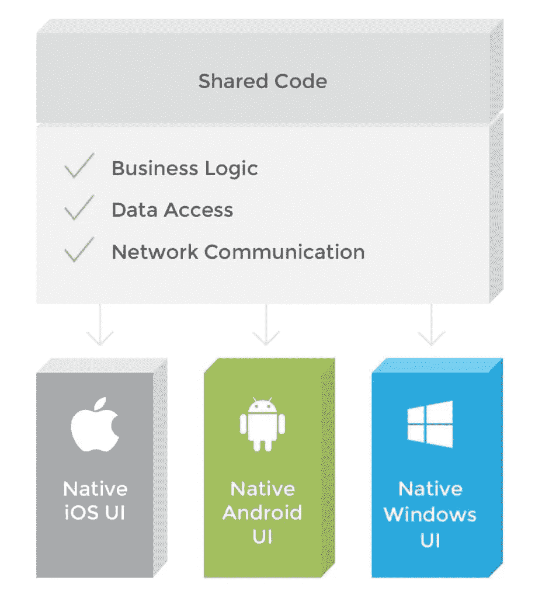
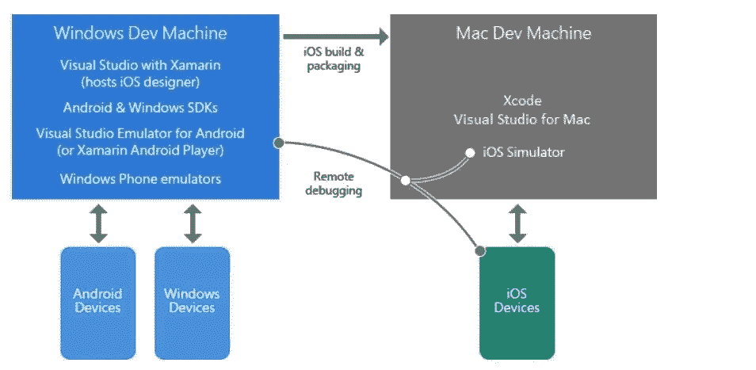
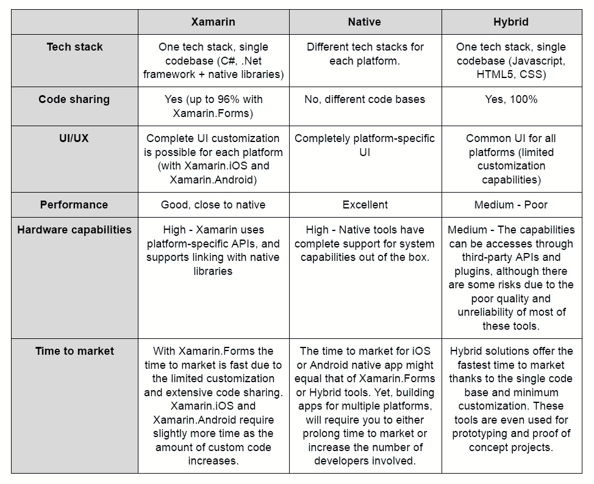

# Xamarin 移动开发的好与坏

> 原文：<https://medium.com/hackernoon/the-good-and-the-bad-of-xamarin-mobile-development-880430507e05>

在考虑 iOS 或 Android 应用开发时，我们大多数人想到的都是 [Objective-C vs Swift](https://www.altexsoft.com/blog/engineering/the-good-and-the-bad-of-swift-programming-language/) ，首先想到的是 Java。被认为是原生技术栈，当涉及到 iOS 和 Android 应用程序开发时，它们自然是最常用的移动开发工具。然而，有更多的方法来构建高性能和用户友好的移动应用程序。而 Xamarin 就是其中之一。在本文中，我们进行了深入的 Xamarin 审查，并将其与市场上的本地和跨平台移动开发解决方案进行了比较。如果你知道基础知识，考虑跳到你感兴趣的部分。

*   什么是 Xamarin？
*   使用 Xamarin 的优点
*   使用 Xamarin 的缺点
*   Xamarin Visual Studio IDE
*   Xamarin vs 原生 iOS/Android vs 混合开发
*   一条建议

# 什么是 Xamarin？

在谈论移动应用开发的[关键方法](https://www.altexsoft.com/blog/mobile/key-approaches-to-mobile-development-explained/?utm_source=MediumCom&utm_medium=referral)时，不可能忽略 Xamarin。Xamarin 是一款用于跨平台移动应用开发的工具，允许工程师在主要平台之间共享约 90%的代码。作为一个相对较新的工具，它基于微软的技术堆栈，已经拥有超过 140 万开发人员的社区。

这个平台是由 [Mono](http://www.mono-project.com/) 背后的开发者构建的，Mono 是一个基于。NET 框架，由 Miguel de Icaza 领导，于 2001 年首次推出。Xamarin 公司成立于 2011 年 5 月 16 日。

然而，与它的前身不同，Xamarin 是作为一个商业项目创建的，直到该公司在 2016 年被微软收购。Xamarin 成为微软生态系统内开发移动应用程序的流行跨平台产品。此次收购打破了使用 Xamarin 的财务障碍。随着微软将 Xamarin SDK 开源，它成为了 Xamarin Visual Studio 集成开发环境的一部分(我们将在下面的中讨论用于 Xamarin 开发的最佳 ide)。Xamarin 的主要特点是什么？

**C#语言。Xamarin 使用单一语言 C#来创建适用于所有移动平台的应用程序。与解释型解决方案(如 Appcelerator Titanium)不同，Xamarin 是本机编译的，这使它成为构建具有本机外观的高性能应用程序的首选。**

**根据。NET 框架。C#是一种成熟的语言，具有强大的安全类型，可以防止代码出现意外行为。因为 C#是。NET 框架语言，它可以与一些有用的。NET 特性，如 Lambdas、LINQ 和异步编程(Asynk)。**

从技术上讲，Xamarin 使用 C#和本机库包装在。Net 层进行跨平台的 app 开发。在性能和用户体验方面，这类应用程序经常被拿来与 iOS 和 Android 移动开发平台的 native 进行比较。此外，Xamarin 可以利用所有本机和最新的 API 访问来利用 Xamarin 应用程序中的底层平台功能，如 iOS 上的 [ARKit](https://developer.xamarin.com/api/namespace/ARKit/) 或 [Android 多窗口](https://blog.xamarin.com/optimizing-android-apps-for-multi-window-mode/)。

虽然与业务逻辑、数据库访问和网络通信相关的代码可以跨所有平台共享，但 Xamarin 允许您创建特定于平台的 UI 代码层。因此，与通用混合应用相比，Xamarin 跨平台应用在任何设备上看起来都是 100%原生的，提供了更好的用户体验。

**编译**。该平台有两个主要产品:Xamarin.iOS 和 Xamarin.Android。在 iOS 的情况下，源代码直接编译成原生 ARM 汇编代码(提前编译)，而 Android Xamarin 应用程序首先编译成中间语言，然后在运行时编译成本生汇编代码(即时编译)。然而，在这两种情况下，这个过程都是自动的，并且是定制的，以默认处理诸如内存分配、垃圾收集和平台互操作性之类的问题。

**Xamarin.Forms.** Xamarin。Forms 是一个独立的产品，旨在创建原型或简单的移动应用程序，在 iOS 和 Android 之间共享 100%的代码。

**Xamarin.Mac.** 另外，工程师可以使用 Xamarin。为 Mac OS 构建应用程序。稍后将讨论 Xamarin 堆栈中的这些产品和其他一些产品。

**平台 SDK。** Xamarin 通过简单的 C#语法提供对特定于平台的 SDKs 和 Android SDK 的 CocoaTouch)的访问。

**特定于平台的代码绑定。**在大多数情况下，工程师将能够在 Xamarin 环境中保持各自平台的原生外观和感觉来进行开发。然而，如果您必须重复使用一些模块或实现一些特定于平台的功能，如条形码扫描、PayPal 或谷歌分析集成，Xamarin 允许您调用现有的平台代码(例如 iOS 版 Swift)。

**可穿戴设备的支持。** Xamarin 支持为苹果和安卓手表设备构建应用。工程师可以使用 Visual Studio both for Mac 和 Windows 来构建 iOS Apple Watch 应用程序。还有，Xamarin 完全支持 Android Wear。

**Xamarin 项目结构。**大多数与 Xamarin 相关的工作预计将通过安装了 Visual Studio 和 Xamarin 的 Windows 开发计算机运行。这些应用程序可以直接从桌面调试，也可以在设备和模拟器上调试。如果你计划在 Windows 上开发 iOS 应用，这也是可能的，因为 Visual Studio 可以连接到 iOS 故事板设计器和 iOS 模拟器。还有 Visual Studio for Mac，它允许在 Mac 上或直接在连接的 iPhone 上运行模拟器。调试是通过 Visual Studio 运行的。

*Xamarin project structure. Image source:* [*Visual Studio Docs*](https://docs.microsoft.com/en-us/visualstudio/cross-platform/learn-about-mobile-development-with-xamarin)

要更深入地了解 Xamarin 工程方面，请查看以下资源:

[主要的 Xamarin 文档中心](https://docs.microsoft.com/en-us/xamarin/)

[Xamarin。Android 文档](https://docs.microsoft.com/en-us/xamarin/android/)

[Xamarin.iOS 文档](https://docs.microsoft.com/en-us/xamarin/ios/)

[Xamarin。表格文件](https://docs.microsoft.com/en-us/dotnet/api/Xamarin.Forms?view=xamarin-forms)

[Xamarin 的 Visual Studio](https://www.visualstudio.com/xamarin/)

[Xamarin Studio 应用中心](https://docs.microsoft.com/en-us/appcenter/sdk/getting-started/xamarin)

[Xamarin 社区论坛](https://forums.xamarin.com/)

与任何其他技术一样，Xamarin 有其自身的优点和缺点，这一直是最近热烈讨论的主题。为了对 Xamarin 与本机开发做出明智的决定，让我们权衡一下使用 Xamarin 进行应用程序开发的利弊。

# 使用 Xamarin 进行开发的优点

包括 Trello、Slack 和 GitHub 在内的众多公司都在使用 Xamarin，这是有充分理由的。

## ⊕一个技术堆栈，为所有平台编码

Xamarin 使用 C#并辅以。Net 框架为任何移动平台创建应用程序。因此，您可以重用高达 96%的源代码，从而加快工程周期。Xamarin 也不需要在开发环境之间切换:您可以在 Visual Studio 中构建所有的 Xamarin 应用程序，Visual Studio 完全取代了 Xamarin Studio。跨平台开发工具作为 IDE 的内置部分免费提供。

## ⊕表现接近本土

与基于 web 技术的传统混合解决方案不同，用 Xamarin 构建的跨平台应用程序仍可归类为原生应用。性能指标可与 Java for Android ( [，如本文所述](http://stackoverflow.com/questions/17134522/does-anyone-have-benchmarks-code-results-comparing-performance-of-android-ap))和 Objective-C 或 Swift for [原生 iOS 应用开发](https://www.altexsoft.com/blog/mobile/ios-app-development-checklist-27-items-to-consider-before-starting-your-next-project/?utm_source=MediumCom&utm_medium=referral))相媲美。此外， [Xamarin 的性能](https://www.altexsoft.com/blog/engineering/performance-comparison-xamarin-forms-xamarin-ios-xamarin-android-vs-android-and-ios-native-applications/?utm_source=MediumCom&utm_medium=referral)也在不断改进，以完全符合本地开发的标准。Xamarin platform 提供了测试和跟踪应用性能的完整解决方案。它的 Xamarin 测试云与 Xamarin 测试记录器工具配合使用，允许您运行自动化的 UI 测试，并在发布之前发现性能问题。但是，这项服务需要额外付费。

## ⊕本地用户体验

Xamarin 允许您使用特定于平台的 UI 元素创建完美的体验。用于 iOS、Android 或 Windows 的简单跨平台应用程序是使用 Xamarin 构建的。表单工具，在运行时将应用程序 UI 组件转换为特定于平台的界面元素。就像 Xamarin 的用法一样。Forms 大大提高了应用程序开发的速度，对于面向业务的项目来说，这是一个很好的选择。然而，由于额外的抽象层，性能可能会略有下降。对于自定义应用程序 UI 和更高的性能，您仍然可以使用 Xamarin.iOS 和 Xamarin。Android 分开，以确保优秀的结果。

## ⊕全面硬件支持

借助 Xamarin，您的解决方案可以获得原生级别的应用功能。它消除了所有硬件兼容性问题，使用插件和特定的 API，跨平台使用通用设备功能。除了对特定于平台的 API 的访问，Xamarin 还支持与本地库的链接。这允许以很少的开销实现更好的定制和本机级别的功能。

## 拥有强大企业支持的⊕开源技术

在该公司于 2016 年 2 月被微软收购后，Xamarin 的许可政策发生了根本性的变化。Xamarin SDK，包括运行时、库和命令行工具，已经成为开源的，并作为 Visual Studio 的一部分在 MIT 许可下对所有人开放。通过消除主要障碍，即许可费用，微软为该平台的进一步发展铺平了道路。另外，由微软领导，并得到 Unity、JetBrains 和 Red Hat 的支持。NET Foundation 已经成为一个可靠而强大的技术平台。

## ⊕简化维护

由于其跨平台应用，Xamarin 使维护和更新更容易。您可以简单地将更改或更新部署到源文件，它们将应用于 iOS 和 Android 应用程序。但是，这只适用于使用 Xamarin 的应用程序。表单或业务逻辑、共享代码、Xamarin.iOS 和 Xamarin 的更新。安卓应用。因此，它可以帮助您节省时间和金钱，同时保持您的应用程序最新。

## ⊕完整的发展生态系统

Xamarin 在一个包中提供了完整的开发工具集，包括自己的 IDE (Xamarin Studio，现在被 Visual Studio 取代)、平台本身(Xamarin SDKs)、测试(Xamarin 测试云)、分发和分析(Hockeyapp 和 Xamarin)。见解)平台。因此，您不需要投资额外的工具或集成第三方应用来构建、测试和部署您的 Xamarin 应用。

## ⊕·沙玛琳。表单:简单应用和原型的框架

Xamarin 建议开发者以两种方式构建移动应用。第一个是使用 Xamarin.iOS 和 Xamarin。Android，这被认为是主要的方法。使用 Xamarin。窗体，Visual Studio 库是第二个。Xamarin。Forms 允许快速原型化或生成具有较少平台特定功能的应用程序。这就是为什么 Xamarin？表单最适合代码共享比自定义 UI 更重要的应用程序。您将能够创建一个单一的界面，并跨平台共享它，而无需为每个平台单独设计。您还可以构建一些应用程序，其中部分用户界面是用 Xamarin 制作的。表单和其他表单是使用本机 UI 工具包设计的。

而 Xamarin。与 Xamarin.iOS 和 Xamarin 相比，Forms 在本机外观和感觉方面仍然是一种折衷。Android，有一个活跃的社区关注这个工具。例如，一些技术提供商贡献了他们的库，如 [Telerik UI](https://www.telerik.com/xamarin-ui) ，这些库丰富了提供预配置 UI 组件的工程能力。

## ⊕·沙玛琳。表单 Live Player

作为 Xamarin。Forms 的目标是快速和无摩擦的开发，微软建议使用一个 [Live Player 工具](https://docs.microsoft.com/en-us/visualstudio/cross-platform/learn-about-mobile-development-with-xamarin)。它是一个安装在实际手机上的应用程序，可以立即测试和调试您的应用程序，而无需部署仿真器，也无需将设备连接到工作站。安装 Live Player 后，开发人员使用手机摄像头扫描 Visual Studio 中的二维码，从而可以访问当前开发的应用程序。手机上的应用程序与 Visual Studio 中的应用程序实时同步。这大大简化了所有的设置和进一步的调试程序。

## ⊕用 Xamarin 为 MAC 电脑开发应用。Mac 工具

Xamarin。Mac 允许使用 C#和. NET 开发完全原生的 Mac 应用程序。它集成了用于使用 Xcode 在 Objective-C 中开发的相同库。通过使用 Xamarin。Mac 结合了 Xamarin.iOS 和 Xamarin。Android，开发者可以在 Android、iOS 和 Mac OS 之间共享高达 90%的原生代码。此外，Xamarin。Mac 与 Xcode 集成，因此开发人员可以使用 Xcode 的界面生成器来创建应用程序的用户界面。

## ⊕大学提供平稳的入职培训

[Xamarin 大学](https://www.xamarin.com/university)是一个专门的电子学习门户网站，面向刚刚熟悉该软件包的人。大学迎合了懂 C#的工程师以及任何有一点编程经验的人。如果你只是让新工程师加入你的 Xamarin 产品，大学会提供所有必要的知识。该门户提供从初级到高级的课程，包括免费的自学、在线直播课程、办公室讲座和客座讲座。

# 要考虑的主要缺点

然而，仍然有一些缺点会给平台蒙上阴影。那么，为什么不用 Xamarin 呢？

## θ略微延迟对最新平台更新的支持

这完全取决于 Xamarin 开发团队。第三方工具不可能为最新的 iOS 和 Android 版本提供即时支持:实施更改和/或引入新插件等需要一些时间。尽管 Xamarin 声称提供[当天支持](https://xamarin.com/faq#q6)，但仍可能会有一些延迟。

## θ限制对开源库的访问

本地开发大量使用开源技术。有了 Xamarin，你只需要使用平台提供的[组件和一些。Net 开源资源，同时面对](https://components.xamarin.com/)[开发者](https://github.com/Microsoft/dotnet/blob/master/dotnet-developer-projects.md)和[消费者](https://github.com/Microsoft/dotnet/blob/master/dotnet-consumer-projects.md)。虽然选择不像 Android 和 iOS 移动应用程序开发那样丰富，但 Xamarin 组件提供了数千个自定义 UI 控件、各种图表、图形、主题和其他强大的功能，只需几次点击就可以添加到应用程序中。这包括内置支付处理(如 Stripe)、信标和可穿戴设备集成、开箱即用的推送通知服务、云存储解决方案、多媒体流功能等等。

## Xamarin 生态系统问题

显然，Xamarin 社区的规模明显小于 iOS 或 Android。因此，寻找一个有经验的 Xamarin 开发者可能是一个挑战。尽管该平台在微软的支持下不断壮大。根据不同来源的信息，Xamarin 社区占全球移动开发协会的 10%。尽管 Xamarin 工程师的数量无法与 iOS 或 Android 原生社区相比，但该平台为其开发者提供了广泛的支持。也就是说，有一个专门的教育平台，Xamarin 大学，为那些新接触这项技术的人提供资源和实践培训。使用这种支持，有经验的 C#/的学习曲线。网络工程师是最少的。

## θ需要基本的母语知识

使用 Xamarin.iOS 和 Xamarin 时。Android 要构建具有真正原生外观和感觉的移动应用程序，您仍然需要编写特定于平台的代码层。因此，至少需要对原生技术(Android 的 Java/Kotlin 和 iOS 的 Objective-C/Swift)有基本的了解。然而，这并不适用于 Xamarin.Forms。

## θ不适合图形繁重的应用

Xamarin 的主要好处是能够跨平台共享您的代码。然而，您只能共享逻辑，UI 代码将主要是特定于平台的。这使得用 Xamarin 构建游戏、丰富的自定义 UI 或复杂的动画变得毫无意义。有了少量的共享代码，Xamarin 就成了不可行的选择。

## θ更大的应用尺寸

根据其类型和复杂性，Xamarin 应用程序通常比本机应用程序大(后者可能是 Xamarin 应用程序的一半大小)。一个简单的 Android“hello，world”应用程序可能需要 16 MB，其中大部分被相关的库、内容、Mono 运行时和基本类库(BCL)程序集使用。

*Source —* [*developer.xamarin.com*](https://developer.xamarin.com/guides/android/advanced_topics/application_package_sizes/)

因此，Xamarin 应用程序通常需要[额外的优化](https://developer.xamarin.com/guides/cross-platform/deployment,_testing,_and_metrics/memory_perf_best_practices/%23linker)来保持应用程序文件大小合理。

## θ与第三方库和工具的兼容性问题

将第三方资源与您的 Xamarin 应用程序集成时可能会出现一些问题。虽然大多数工具和库都提供了对本地技术的完全支持，但 vedor 可能不提供 Xamarin 兼容性。尽管 Xamarin 有自己的组件库，但总有可能你需要一个特定的功能或应用程序中的集成，而这是平台所不提供的。

# Xamarin Visual Studio IDE

如果你觉得 Xamarin 适合你，你会有兴趣知道可以使用的主要 Xamarin IDEs，以及它们之间的比较。

Visual Studio (VS)是一个 Microsoft 集成开发环境，是一种用于在所有平台和设备上构建、调试和发布应用程序的软件。Xamarin 有三个主要的 Visual Studio 版本— Visual Studio Community、Visual Studio Professional 和 Visual Studio Enterprise。选择可接受版本的关键因素是开发人员(学生或专业工程师)的经验和他们的团队规模。程序员可以为 Web、移动、服务器和桌面开发各种版本的软件。

**Visual Studio 社区**非常适合学生、开源项目、拥有多达 5 名用户的小型开发团队。社区包对于刚接触 Visual Studio 的团队来说也很好。这个版本是免费的。

**Visual Studio Professional** 是一套为专业开发人员、小型团队和企业使用而创建的工具和服务。这个版本提供了强大的功能来快速理解您的代码:显示代码引用、代码更改、显示谁最后修改了一个方法，或者发现测试是否通过。专业版包括 Team Foundation Server 2017，提供敏捷项目规划工具、交付计划、图表等功能。这个版本的年费是每位用户 539 美元。

**Visual Studio Enterprise** 拥有强大的支持工具和服务。它们允许管理开发和 IT 操作之间的复杂过程；用手动和自动跟踪工具跟踪质量；获得专业培训；以及整个微软工程和测试生态系统。它包括用于 Visual Studio Team Foundation Server 和 Visual Studio Team Services 的 Microsoft 扩展。在此版本中，Team Foundation Server 为您提供了测试管理器、包管理和私有管道。企业版还拥有优先支持、合作伙伴优惠等等。Enterprise Studio 的年价格是每个用户 2999 美元。

对于企业用户，我们还建议查看 [Visual Studio 应用中心](https://docs.microsoft.com/en-us/appcenter/)。这是一个跨不同移动技术(包括 Xamarin)组织应用程序开发工作流的工具。在这里，开发多个应用程序的工程团队可以将他们的工具集放在一起。它通过 GitHub 或 Bitbucket 自动打包应用程序，为不同的测试服务提供集成，支持测试的电子邮件应用程序分发，进行崩溃跟踪和分析。

**Visual Studio Online (VSO)** 是一套工具，它允许开发人员轻松设置跨不同平台的持续集成。[持续集成](https://www.altexsoft.com/blog/business/continuous-delivery-and-integration-rapid-updates-by-automating-quality-assurance/?utm_source=MediumCom&utm_medium=referral)是一种软件实践，在这种实践中，所有的代码更改都会被立即测试并与主代码库集成。它有助于快速检查和调试代码。对于移动开发者来说，这个版本可能是最相关、最有趣的。

# 从 Android Studio 或 Xcode 切换到 Visual Studio

如果您的开发团队考虑从 Android Studio (AS)或 Xcode 过渡到 Visual Studio，学习曲线不会太陡。功能与功能的比较表明，就开发流程而言，ide 是非常相似的，每个环境都有细微的差别。

**从 Android Studio 到 Visual Studio。【Android Studio 官方支持主要集中在 Java、C/C++、Kotlin 和 XML 语言上，而 VS 支持[所有主流编程语言](https://code.visualstudio.com/docs/languages/overview)，包括 AS 语言。这是因为 ide 支持的平台范围很广。VS 提供了更多的工程自由度，允许在一个环境中处理不同的项目。如果你一直在使用与 AS 集成的谷歌云平台来运行虚拟机或只是管理项目，谷歌也很乐意为 VS 提供其[云平台扩展](https://cloud.google.com/visual-studio/)。基本上，您可以直接从 VS 中使用微软云生态系统和谷歌云。Visual Studio 可以安装在所有主要平台上:Windows、Android、Mac OS 和 Linux。**

**从 Xcode 到 Visual Studio。与 VS 类似，Xcode IDE 支持所有主流编程语言的源代码。所以，过渡之后不会有什么惊喜。同样，如果你在使用 Xcode 时已经绑定到 Mac OS，则不需要苹果硬件。对于那些使用 CloudKit 进行服务器端存储的人来说，Visual Studio 和 Xamarin 允许简单集成 CloudKit。与 Xcode 相比，使用 VS 的主要缺点是一样的:Android Studio 和 Xcode 都是免费的，而 VS 需要相当高的订阅费。**

根据[开发者的估计](https://www.g2crowd.com/compare/android-studio-vs-visual-studio)，Visual Studio 和 Android Studio 都有着几乎相同的易用性水平和支持质量。用 VS 和 Xcode 对比同样的指标，可以说 VS 的估计要好一点。此外，Visual Studio 在企业(> 1000 名员工)中更受欢迎，而大约 50%的 Android Studio 和 Xcode 用户是小型企业(50 名或更少的员工)。

考虑到 [Strategy Analytics 在移动开发环境上的排名](https://visualstudiomagazine.com/articles/2015/11/11/visual-studio-xcode-android-ide-report.aspx)，Xcode 和 Visual Studio 一样在测试能力上获得了最高排名。Android Studio 落后了。总分分别是:Xcode-22；visual Studio-21；和 Android Studio -13。

# 考虑其他选择:Xamarin vs 原生 iOS/Android vs 混合开发

最近，许多开发人员倾向于同意 Xamarin 可以被视为“原生”开发工具。事实上，有一种观点认为“任何可以在 iOS 应用程序中使用 Objective-C 或 Swift 完成的事情，以及任何可以在 Android 应用程序中使用 Java 完成的事情，都可以在 C#中使用 Xamarin 完成。”

然而，在本地与 Xamarin 的辩论中有许多陷阱。让我们看看 Xamarin 与原生开发工具和混合开发平台(Ionic、PhoneGap/Cordova)相比如何。

尽管混合移动开发工具发展迅速，但它们仍然缺乏 Xamarin 以大致相同的成本提供的性能和原生功能。当考虑这两种方法时，最常见的困境是 [Xamarin vs Ionic 或者 Xamarin vs React Native](https://www.altexsoft.com/blog/engineering/xamarin-vs-react-native-vs-ionic-cross-platform-mobile-frameworks-comparison/?utm_source=MediumCom&utm_medium=referral) (也可以参见我们关于 ReactJS 和 React Native 的利弊的故事，以获得对该框架的完整解释)。然而，由于底层技术 (web 堆栈)中的许多[限制，后者往往会失败。](https://www.quora.com/What-are-some-drawbacks-with-iOS-apps-built-using-Ionic-or-Apache-Cordova/answer/Oleksandr-Medovoi)

然而，有一种基于 JavaScript 的移动开发工具优于混合解决方案，至少在 UI 方面是如此。是 NativeScript。这个由 [Telerik](http://www.telerik.com/) 支持的跨平台开源框架，允许你在使用单一代码库的同时，实现原生 UI 并连接到原生 API，以获得更好的移动体验。它的主要区别在于，它使用 XML 标记，而不是 HTML webview，XML 标记可以编译成 Android 和 iOS 原生等同物。

这种方法填补了本地和混合开发之间的空白，类似于 Xamarin 所做的。这两个工具的主要区别在于它们使用的编程语言。所以 Xamarin 与 NativeScript 的比较应该是一个更详细研究的主题。

与此同时，Xamarin 与原生 Android/iOS 开发的争论似乎更加复杂:两种选择都证明在产品质量和性能方面提供了价值，选择通常取决于您想要构建的应用程序的类型。

# 一条建议

在比较利弊时，列出的缺点通常被认为是附带损害。大多数企业主选择 [Xamarin 移动应用开发](https://www.altexsoft.com/case-studies/media/altexsoft-applies-xamarin-best-practices-to-bridge-the-gap-between-ios-and-android-in-sports-industry/?utm_source=MediumCom&utm_medium=referral)平台，因为它通过共享代码和使用单一技术堆栈，缩短了上市时间和工程成本。然而，应用程序的目的及其目标受众可能是一个更重要的考虑因素。

根据我们团队的经验，Xamarin 的最佳用例是**企业移动解决方案**。有了覆盖 90%项目的标准 UI，所有的核心产品逻辑可以很容易地跨平台共享。因此，平台定制只需要工程工作的 5-10%。

如果是面向消费者的应用，有大量的用户界面，共享代码的数量会急剧减少。因此，Xamarin 跨平台开发失去了它的主要优势，并且在时间和成本上可能等同于本地解决方案。

然而，如果你正在寻找 Xamarin 的替代品来构建一个跨平台的移动应用程序，你可能会失望。虽然最广泛使用的跨平台移动开发工具是 PhoneGap/Apache Cordova、Ionic Framework、Appcelerator/Titanium，但它们主要依赖于 web 技术，如 HTM5 或 JavaScript。这就是为什么这些工具都没有 Xamarin 提供的相同级别的性能和本机功能。

*本文是我们“好与坏”系列的一部分。如果你对 web 开发感兴趣，可以看看我们在*上的博文

[*棱角发育的好与坏*](https://www.altexsoft.com/blog/engineering/the-good-and-the-bad-of-angular-development/?utm_source=MediumCom&utm_medium=referral)

[*JavaScript 全栈开发的好与坏*](https://www.altexsoft.com/blog/engineering/the-good-and-the-bad-of-javascript-full-stack-development/?utm_source=MediumCom&utm_medium=referral)

[*node . js Web App 开发的好与坏*](https://www.altexsoft.com/blog/engineering/the-good-and-the-bad-of-node-js-web-app-development/?utm_source=MediumCom&utm_medium=referral)

[*反应当地人的好与坏*](https://www.altexsoft.com/blog/engineering/the-good-and-the-bad-of-reactjs-and-react-native/?utm_source=MediumCom&utm_medium=referral)

[*Swift 编程语言的好与坏*](https://www.altexsoft.com/blog/engineering/the-good-and-the-bad-of-swift-programming-language/?utm_source=MediumCom&utm_medium=referral)

**喜欢这个故事吗？鼓掌让我们知道，这样更多的人可以找到它！**👏
最初发表于 AltexSoft 的博客:*[Xamarin 移动开发的好与坏](https://www.altexsoft.com/blog/mobile/pros-and-cons-of-xamarin-vs-native/?utm_source=MediumCom&utm_medium=referral)*