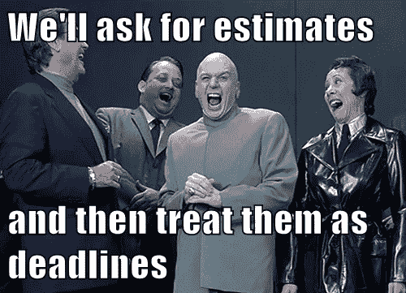

# 如何使评估最终对开发人员有用

> 原文：<https://medium.com/hackernoon/the-good-the-bad-and-the-ugly-about-estimates-d07252952860>

请任何开发人员估计他们完成一个项目需要多长时间。你会看到他们眼中的厌恶。而且理由很充分。几十年来，许多管理者错误地使用了评估，然后让团队对他们的评估负责，好像这是实际的截止日期。更令人沮丧的是，在许多情况下，这些经理只根据他们从你那里听到的最低数字采取行动！这就好像他们有一个 min()函数，他们只是不断试图让这个数字变小。但是工程不是魔术！！难怪#NoEstimates 这个标签变得如此出名。

要做到这一点，我们(尤其是经理)需要遵守一些规则。然后我们将会看到评估是如何提高软件质量的。是的，你没看错。在我看来，很明显。

# 不要扰乱评估的规则！

## 规则#1:永远不要将评估视为对截止日期的承诺

或者，你冒着立刻失去团队信任的风险，并且很难再得到他们的信任。有趣的是，即使是经理也不知道他们在一天结束时会做些什么。那么，考虑到他们的[生产力会被随机影响](https://anaxi.com/blog/2018/10/15/top-12-things-that-destroy-developer-productivity/)并且大多数时候项目有很多未知，他们怎么能想象[开发人员](https://hackernoon.com/tagged/developers)会确切地知道他们将会完成什么呢？没有什么是魔法🤬！

## 规则 2:永远不要在团队之外或其他相关部门分享你的评估

我想这比第一条规则更糟糕。传达一个估计值会带来风险，它会自动转换为对截止日期的承诺，并且其他部门会相应地调整它们的优先级，从而给团队带来更大的压力。

## 规则 3:如果你有一个大概的估计，现实最有可能在下限和上限之间，而不是下限

作为一名经理，你不能仅仅通过愿望来影响交付日期。除非你改变项目的范围或质量。否则，你不能。如果给你一个大概的数字，有一个高的和低的估计，你会更聪明地考虑这两条信息。甚至 PMP 也引入了术语 [PERT(计划评估和评审技术)](https://www.linkedin.com/pulse/what-pert-how-can-we-use-dave-fourie-pmp-prince2-/)来更接近最终结果。

## 规则 4:评估的不确定性与未知相关。未知越多，你对评估的信心就越少

但是未知越少，你应该对评估越有信心。

这是什么意思？每个项目都有一定程度的未知因素。当开发人员给你一个大概的估计，比如说 4-8 天，他们给你两个有价值的信息:天数和他们对此的信心。另一种看法是这样的:6 天有 2 天的不确定性(或 33%的不确定性)。如果不确定性很重要，这意味着可能有许多未知因素会影响最终的交付。这些未知因素可能会产生很大影响，或者根本没有影响。我在这里的观点是，当不确定性很高时，估计出错的可能性更大(即使在定义的边界之外)。

## 规则 5:首先解决未知问题确实会增加对评估的信心

未知有两种类型:未知的未知和已知的未知。对于未知的未知，你无能为力。从定义上来说，开发人员在他们的评估中不能真正考虑到它们；他们可能会给自己多几天时间以防万一，而这些时间实际上通常都花在了调试上。然而，对于已知的未知，在项目的最初几个小时或几天内解决它们可以极大地减少对最终要完成的工作的疑虑。这样你可以减少规则 4 中提到的不确定性。例如，6 天+/- 2 天可以变成 6 天+/- 1 天。

顺便说一下，你可以理解规格是可能的已知未知的一部分。规格越精确，不确定性就越少。去工作吧，经前综合症。

## 规则 6:如果一个估计对你来说没问题(你是那种高期望值的经理)，你可能想问正确的问题

如果一个开发人员告诉你一个项目需要 4 天，而你预计需要 5 天，而你总是倾向于过于乐观，那么这可能意味着开发人员对任务的想法和你不一样。我个人建议你问自己以下几个问题:

*   规格是否被充分理解？
*   [技术](https://hackernoon.com/tagged/technology)或架构能扩展到我们想要的用户数量吗？
*   能坚持至少 24 个月吗？
*   这个解决方案和将要做出的选择有什么风险？

关键是，您可能没有考虑解决方案的相同级别的需求。还是那句话，没有魔法。

## 规则 7:如果你需要一个截止日期，尊重不确定圆锥

有时您需要提前几周/几个月确定发布日期，因为您不是唯一需要满足特定项目截止日期的人。这是你需要考虑的现实。在这种情况下，你听说过[不确定圆锥](https://whatis.techtarget.com/definition/cone-of-uncertainty)吗？

这个图表非常简单明了，但是用几句话来说:你不能过早要求承诺。承诺对未知的东西不起作用。所以首先要做的就是把发布日期定的越晚越好。但是如果你真的必须在早期给出一个时间表，要求你的团队首先进行探索，并在开始商定日期之前尝试解决所有未知问题。但是，请记住，您的团队应该尽可能地定义或影响日期。如果没有，你就有可能影响项目的范围或质量。

## 规则 8:分析瘫痪很容易克服

好的……所以这本身并不是一条规则。但对管理者来说，这是一个很好的技巧。开发人员可能一开始并不真正欣赏它，但我认为它确实引发了对话，如果最终您同意评估对开发人员有价值，那么开发人员可能会接受这条规则。🤞

如果一个开发人员因为任务太复杂而不想给你一个评估(公平地说，评估不是一件容易的事情)，开始讨论的一个简单方法就是抛出一个非常高的数字，比如“100 天”？开发者很可能会说:“见鬼，不！”然后你用越来越低的数字继续往下做，直到开发人员告诉你，“可能是”然后做同样的事情，但是数量很少；开发商会再次告诉你，“不可能！”你又一次向上努力，直到开发人员告诉你，“有可能。”那里！你有一个大概的估计开始。但是不要忘记尊重所有其他的规则——估计并不是承诺的交付时间。

好吧，我们已经过了规则。不要犹豫，在评论中添加更多。我将根据你的意见编辑这篇文章。现在，让我们假设我们的团队尊重关于评估如何以及为什么对开发人员有用的所有规则。

# 为什么开发人员会对评估非常满意？

如果你不需要一个预先定义的发布日期，你可能想知道为什么你甚至需要估计。有效的问题，我的朋友。

在我看来，评估的意义在于，它们围绕未知的事物引发讨论和相互理解。当您讨论评估时，如果其中任何一个有一点偏差，就会产生讨论，开发人员可以到白板上勾画出他们对手头任务要完成的工作的理解。如果他们的理解有点偏差，其他开发人员可能会澄清代码架构中的某些点。你甚至可能会遇到这样的情况，一个高级开发人员可以从初级开发人员那里学到一些很棒的技巧。

评估会引发讨论，让开发人员了解代码及其架构。它们最终可以提升代码本身的质量，甚至帮助开发人员比以前更快地处理任务。但是，请注意，为了最大限度地利用评估，应该以团队的形式完成评估。你也可以在事后反思中反思这些估计；将会有更多的教训需要吸取。

最后，获得的好处是团队在评估上花费的时间的一个权衡。有很多方法可以做到这一点。例如，评估可以有他们自己的专门会议，应该尽可能地保持专注。我们都知道会议……不用多说了。

—

最后一点。如果你对给你的评估有第二个想法，你也可以考虑“游戏化”这个过程来吸引你的开发者。例如，对团队在几周或几个项目中的准确性进行评分，并在打破新纪录时获得某种祝贺礼物。嗯，只是一个想法:)。如果我错过了任何规则，或者如果你不同意我的结论，请告诉我。

# 在你走之前…

你觉得这篇文章有趣吗？请按住👏说“谢谢”并帮助别人找到它！
如果您对关于**我们在** [**Airbyte**](http://airbyte.io) **用我们所有的知识**打造世界级组织的旅程的文章感兴趣，请订阅我们的时事通讯！

在 Twitter 上关注我，保持联系。谢谢大家！

*原载于 2018 年 11 月 9 日*[*anaxi.com*](https://anaxi.com/blog/2018/11/09/how-to-make-estimates-useful-finally-to-developers/)*。*