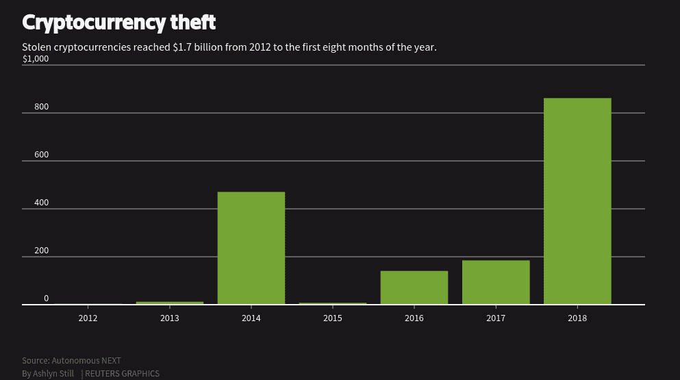

# 善、恶、丑——Crypto 2018

> 原文：<https://medium.com/hackernoon/the-good-the-bad-and-the-ugly-crypto-2018-ba784bdd2a47>

虽然很多 crypto 的人都在观望，想知道下一个发展和应用是什么，但我想利用这个时间来结束这一年，反映我在 crypto 生态系统前沿的观点。通过这样做，它提供了一个机会，从一个新的角度重新考虑事件、想法和感受，从而迎来新的一年。

**好人**

*   **联系社区**——今年参加了+15 以上的会议，还是差不多。然而，这是一个很好的机会，让来自世界各地的专业人士感受市场的脉搏。了解个人最初是如何参与区块链和金融科技的，让我破除了 crypto 是一个骗子社区的神话。根据剑桥大学发布的[全球加密资产基准研究](https://www.jbs.cam.ac.uk/fileadmin/user_upload/research/centres/alternative-finance/downloads/2018-ccaf-2nd-global-cryptoasset-benchmarking.pdf)，数百万新的加密用户已经进入生态系统，拥有 1.39 亿个账户，其中至少有 3500 万个身份验证账户。这与 2017 年相比增长了 4 倍。
*   监管者的兴趣——尽管引入了去中心化经济的理念，但我们必须意识到，散户投资者消息较少，需要得到保护。教育和社区参与发挥着重要作用，但也需要监管机构来确保。有趣的是，随着专业服务的出现，自我监管的努力也在增加，以使行业成熟。日本是最先采取这种方式的国家之一。
*   **资产证券化**——在 ICO 狂潮之前，股权众筹是我的主要兴趣。它允许普通个人部分投资于一处房地产或参与一家公司的早期发展。不幸的是，这种筹集资本的方法并没有成功，因为许多企业家将股权众筹视为与风险投资或债务融资相比的最后手段。此外，专业投资者认为平台上的项目质量不高，希望获得更多控制权。[资产证券化](https://www.forbes.com/sites/rachelwolfson/2018/10/03/a-first-for-manhattan-30m-real-estate-property-tokenized-with-blockchain/#1f3419764895)重新激发了专业投资者、公司和企业家的兴趣。

**坏的**

*   **ICO-**后资金管理不佳大多数项目认为他们的资本有 3-5 年的发展期。在今年与几个项目就收益的使用进行交谈后，似乎大多数项目仅将部分 ETH 转化为 fiat 用于短期运营，而将剩余部分用于预期的价格恢复或升值。因此，一家公司的跑道已经大大减少到一年以下。一个众所周知的 ICO 甚至[日交易](https://www.livebitcoinnews.com/crypto-bear-market-is-so-bad-that-an-ico-is-day-trading-its-holdings/)他们的股份，而不是像白皮书上说的那样制造产品。据统计，超过 90%的初创企业会失败，糟糕的资金管理会增加失败率。

**丑陋的**

*   **辛迪加和基金损害投资利益—** 传统风投对早期项目进行长期投资。然而，与其他投资者相比，大多数与加密相关的基金采取了较短期的方法，具有折扣代币定价和有利的锁定期。主要参与者参与协助做市、营销和交易所上市服务，这些服务在牛市中成功执行，因为每个人都兴奋地看到即将出现的顶级电子表格项目、网站上的基金徽标、具有区块链经验的博士以及自称与大公司的合作协议。不幸的是，现在低线基金和散户投资者已经失去了资金和对这个领域的信任，整个市场已经失去了对即将到来的项目走向的方向感。

在我们见证市场复苏之前，我们需要再次将信任带回加密领域。下个月，币安将于 2019 年 1 月 19 日至 22 日在新加坡举办首届区块链周。重点将放在探索保护加密资产的解决方案上。安全性仍然是该行业的重中之重。社区需要努力保护平台免受攻击者、欺诈者和洗钱者的攻击。据研究机构 Autonomous Next 称，仅今年上半年就有超过 8 亿美元被盗。

对即将于 2019 年 1 月 11 日至 12 日在香港举行的币安预黑客马拉松感兴趣的团队和个人可以在此[注册](http://safuhack.com/)。

从大的方面来看，比特币在过去已经被冻结了 300 多次，但我们仍然看到越来越多有经验的专业人士在区块链和加密资产生态系统中转型。此外，每日交易总额继续呈现正增长；建议增加各种加密网络的使用。看看区块链的底层技术将如何参与到未来社会的核心基础设施中，这将是一件有趣的事情。

***Christian Ng*** *是一位在 fintech、加密货币和股权市场经验丰富的基本面投资专业人士。他热衷于与交易所、初创企业和大型金融服务机构合作，帮助构建扩大加密规模所需的基础设施和能力。*