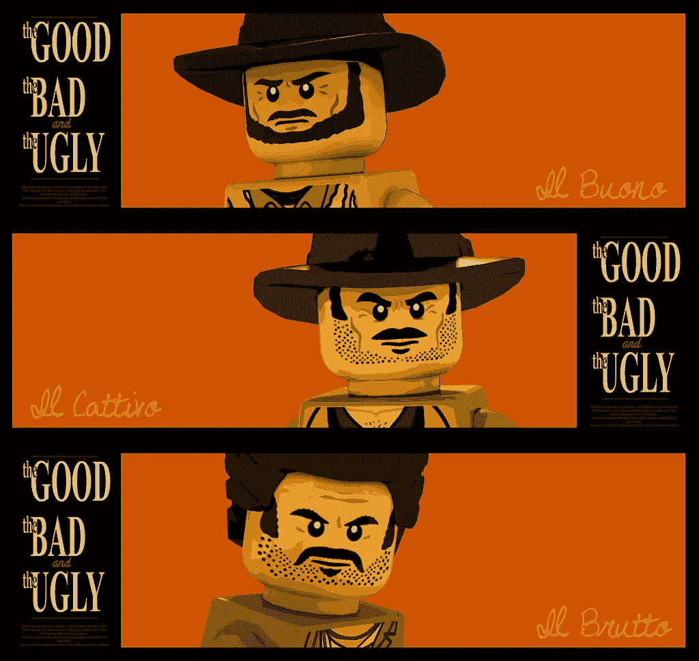
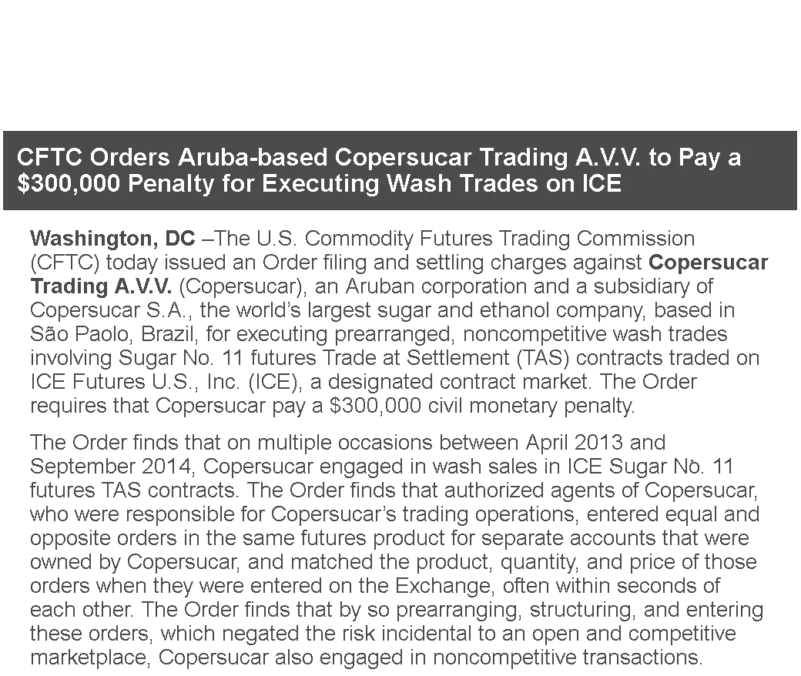
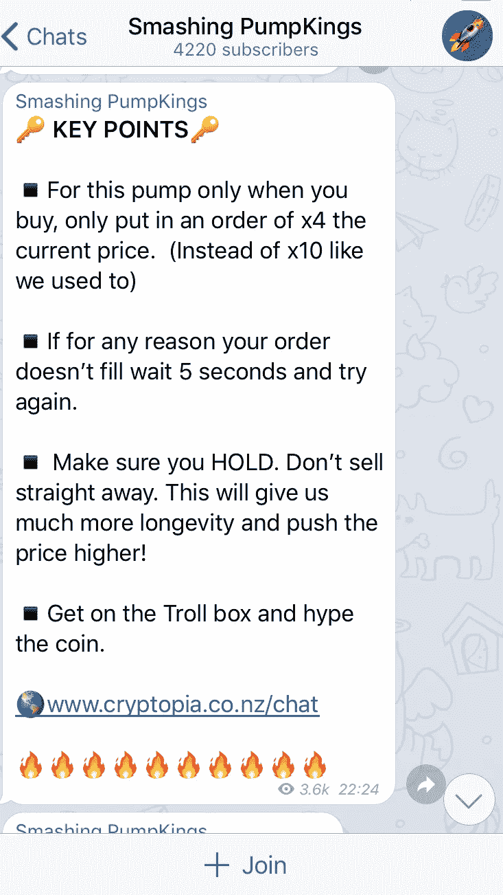
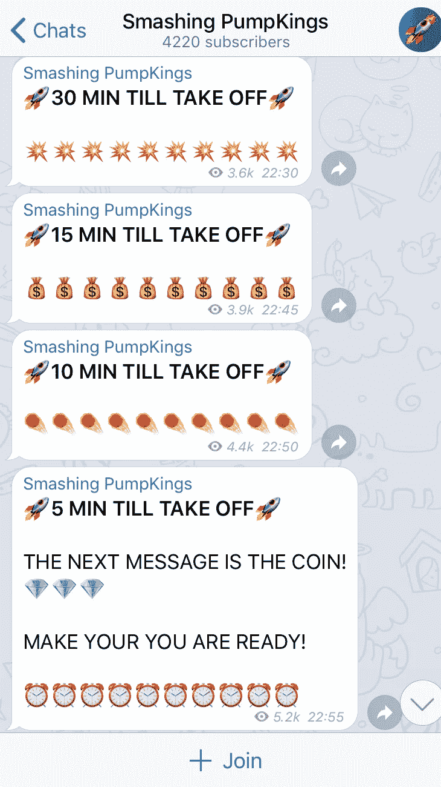

# 秘密做市的好、坏、丑

> 原文：<https://medium.com/hackernoon/the-good-the-bad-and-the-ugly-of-crypto-market-making-13a44bb2d207>

The Good, the Bad, and the Ugly of Crypto market making; Source: [Flickr](https://www.flickr.com/photos/nick_ab/14369867624)

从股票或固定收益等传统的“无聊”市场进入加密领域会让人耳目一新。没有监管，巨大的波动性，令人兴奋的交易工具和交易所。然而，它也有黑暗的一面。长期以来，传统市场中被认为是华尔街之狼的某些做法，正在以加密方式卷土重来。

作为这一新兴资产类别的做市商，我经常被要求将某些“服务”添加到套餐中，这是我不愿意看到的。ICO 项目可能会要求提高其股票的市场价格，或者提高交易量，或者两者兼而有之。提出这些请求的有两组 ICO 问题:

1)用心良苦的 ICO 创始人，他们希望提高项目的短期可见性，并吸引更多的投资者。这些加密项目可能会将这些做法视为另一种营销工具，而没有意识到对令牌声誉的长期负面影响。他们也可能不知道什么是好的做市实践。

2)意图不太好的创始人，他们希望通过产生一些虚假的市场需求来掩盖其 ico 的欺诈性质。

我决定写这篇博客来解决第一组问题，并帮助善意的 ICO 发行人了解加密市场制作的狂野西部。

# **让我直截了当地说吧:承诺一个象征性的价格目标或交易量，不是一个秘密做市商能做到的。**在加密的狂野西部，一个“好的”做市商**只能保证它完全控制的结果，比如价差和报价大小。**

伪装成“好的”ICO 做市商，城里还有其他参与者。丑陋的承诺向 ICO 发行者承诺具体的交易量水平。虽然这似乎会吸引更多的投资者购买代币，并为进入更高层次的交易所创造条件，但人们应该意识到，没有人能真正保证具体的交易量(因为做市商不能完全控制它)。坏的“做市商”向黑暗的一面又迈进了一步，他们向雄心勃勃的 ICO 发行者承诺，他们的代币价格将上涨到一定水平。从长远来看，这样的声明甚至更有害，而且，不管怎样，这些做法在加密领域之外是完全非法的。欢迎来到加密的狂野西部。

让我更深入地探究加密做市的好、坏和丑陋是如何运作的，做市商采用什么样的具体策略，以及如何识别这些策略。

# 好人

做市商在任何市场中的作用是提供流动性，弥合买卖双方之间的差距，并确保订单交易。无论晴雨，做市商都将在那里，承担短期风险，并通过大量双向交易进行补偿。由于做市商从交易量中获利，他们自然会出现在高交易量的产品中，如[比特币](https://hackernoon.com/tagged/bitcoin)和前 10 名币。流动性较低的代币不太可能让做市商免费提供流动性，而需要让它们参与付费合同协议。

在这样的协议中，**做市商唯一可以承诺的是在服务约定的持续时间内以确定的报价规模提供恒定的买卖价差。**优秀的加密做市商拥有运行算法的专有软件，每天进行数千笔交易，并有专门的交易专家关注市场。这有助于实现买卖差价目标，但它不能直接影响其他任何东西，特别是价格和交易量。正如我在之前的[博客](https://hackernoon.com/why-your-ico-needs-a-market-maker-e42afd837b7a) **“为什么你的 ICO 需要做市商”**中所写的，让做市商参与进来可以对这些指标产生积极影响，但这将是你的代币质量不受流动性不足限制的结果。

# 丑陋的

遇见丑的。你可以通过这些玩家承诺实现一定的交易量水平来识别他们。实现这一目标的最常见策略叫做“洗盘交易”。

## **典型的洗盘交易“策略”包括交易者与自己进行系统交易。** **一个“新手”洗盘交易者会简单地下一个大的买入订单，然后在几秒钟内打出自己的卖出订单。一个更“老练”的操纵者会使用更小的订单，在更长的时间内下单，甚至用多个账户而不是一个账户操作(使交易所更难发现)。**

操纵交易量对加密技术来说并不新鲜。大约一个世纪前，也就是 1936 年，这种做法在美国已经被禁止了。如今，任何受监管的交易所至少都会有自我交易防范措施，而监管机构，如美国证券交易委员会(SEC)或 CFTC，将会时刻警惕这些行为。在以下案例中，简单的谷歌搜索很容易产生大量 5 位数的罚款:

A typical example of wash trading fees and reputation damages in the traditional markets

然而，加密市场不受监管。虽然我预计一些较大的交易所将在未来几年内采取自我交易预防措施，但在可预见的未来，典型 ICO 上市的第一家交易所不会受到任何监管。从我的经验来看，交易所目前不愿意实施任何反清洗交易机制，这使得这些平台上的 ICO 发行者和投资者几乎无法抵御这些做法。

我把这种做法称为丑陋(而不是糟糕)的原因是因为我认为，并非所有承诺特定交易量目标作为激励薪酬一部分的加密做市商都计划进行洗盘交易。一些人可能对你的代币有足够的信心，在足够的流动性支持下达到这些水平。鉴于他们之前的约定，有些人可能会彻底赌上成功的结果。这种情况的丑陋之处在于，你在流动性协议中加入了交易量目标，从而刺激了他们参与清洗交易。鉴于完全缺乏监管，如果一些优秀的做市商倒向丑陋的一边，这可能是你的责任。

# 坏事

清洗交易可能经常被忽视，因为它几乎是一种没有受害者的犯罪。虽然事实并非如此(我将在下面的“长期后果”中介绍)，但还有一些更乏味的实践。向你保证一定交易量的秘密做市商可能只是一个动机错误或缺乏经验的好人。有人向你保证，你的代币会涨价，但他几乎没有为自己辩护。我很不情愿对这些团体或个人使用“做市商”这个术语。

价格操纵有多种形式。最值得一提的是:

**泵送和卸载**

**斜坡**

**转弯**

## **低价倾销是所有价格操纵策略之母。组建一个团队，购买一个代币，开始在社交网络上推广。一旦它飞得足够高，就卖出获利。所有这一切都发生在一个电报频道的匿名背后。**

以下是其中一个频道的快照:

“做市”策略通常包含相同的想法，但持续时间更长，同时交易量也有所增加。

**上升**包括创造一个大买家的印象，毫不费力地浏览大市场报价(属于同一个主要所有者)。这种行为很容易被误导，其他不知情的交易者可能会觉得被迫“跑在”大买家前面，最终成为输家。秘密“做市商”可以采用这种策略，创造一个在固定时间段(例如每天)进行大宗交易的虚拟买家，让市场习惯这种行为，推动价格上涨。不用说，一旦做市约定完成，大买家神秘消失，代币价格很可能暴跌。

**囤积居奇**是大宗商品市场最典型的活动，在那里供应有限，很难长时间保持空头头寸。类似地，较小的代币遵循相同的供应模式。如果一个做市商是唯一的流动性提供者，那么他不可能通过购买大量的代币来赚钱。然而，当有更多相同的做市商时，他可以使用这种策略，旨在接管他们的库存，迫使他们提高价格，因为他们必须将价差维持在同一水平。

**不用说，这三种价格操纵行为在受监管的领域是彻头彻尾的犯罪，而且理由很充分——它们扰乱了市场，抹去了人们对交易资产的信心，并导致好的参与者长期亏损。**签订一份承诺价格上涨的秘密做市协议可能很有诱惑力；毕竟，看到你的项目升值是如此令人兴奋！然而，人们可能没有注意到的是这些策略的后果。

# 恶劣和丑陋行为的长期后果

价格和交易量都会受到这样或那样的操纵。从长远来看，结果可能是灾难性的，对声誉以及与投资者和加密交易所的关系产生复合影响。

最基本的影响表现在失败的期望上。在 ICO 上市后，预计交易会“逐渐消失”是正常的。然而，稳定的交易量和上涨的价格都突然蒸发的模式将不可避免地导致整个加密项目是一个低质量的项目，或者只是骗局的结论。你将失去对你的代币的第一批投资者的信任，他们应该是你的大使。你将失去上市交易所的信任，并可能被摘牌。如果你因为高交易量而进入了更高一级的交易所，你不仅会被踢出局，而且你会发现很难回到任何其他带有“市场操纵者”标签的重要交易所。

最后，谈到声誉效应，许多专业投资者、加密交易所和加密风投都来自更传统的金融和商业背景。他们会很快发现不良和丑陋的行为，一旦他们发现，国际奥委会创始人的声誉将被摧毁，即使创始人不知道这些行为的发生。

# 结论

如果你是一个用心良苦的 ICO，有着高质量的产品、长远的眼光，并且非常关心项目的成功，那么与加密做市商合作是一个明智的选择。优秀的做市商可以帮助你的代币创造一个流动的市场，吸引成熟的投资者，并在更高层次的交易所上市。不过，在这样做的时候，我鼓励你好好调查一下你的做市商:看看创始人的简介、他们的经历以及他们的所在地。询问他们将使用的具体策略，避开任何向你承诺一定交易量和价格的人。同样，不要要求你的加密做市商达到他们无法完全控制的指标，因为这可能会刺激他们从事可能对你有害的做法。

***

[*叶夫根尼·盖沃伊*](https://www.wintermute-trading.com/about) *是全球领先的密码做市商* [*温特穆特交易*](https://www.wintermute-trading.com/) *的创始人兼首席执行官。*