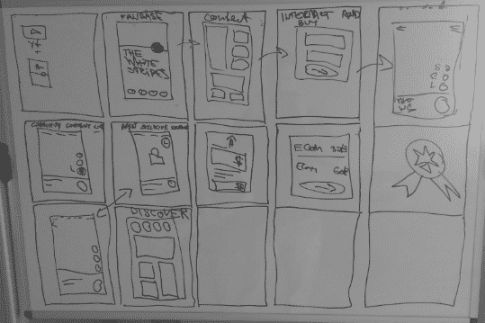

# 行动中的谷歌设计冲刺

> 原文：<https://medium.com/hackernoon/the-google-design-sprint-in-action-c798b8b920ec>

# 风扇底座设计

我们想为我们的新项目 [Fanbase](https://www.fanbase.live/) 创建一个应用程序设计。为了在一周内快速完成设计，我们决定尝试 [GV 设计冲刺](http://www.gv.com/sprint/)。我们是这样走的…

Fanbase 是一个为音乐人带来内容控制和奖励他们的粉丝的应用程序。这是一个去中心化的应用程序(d App ),开发出来运行在[的](https://www.lightstreams.network/)区块链上。

设计冲刺被描述为学习的捷径，这个想法是团队不必为了测试他们的想法而发布他们的产品。

通过使用设计冲刺来验证[粉丝群](https://www.fanbase.live/)，我们问自己重要的问题，跨团队工作以确保我们没有在产品中建立偏见，并最终测试最终的设计结果。

设计冲刺是一个为期 5 天的过程。

## 星期一

我们定义了 5 天流程的目标。我们描绘了一个成功的客户之旅。我们聘请专家，积累集体知识，在前进的过程中重新定义我们的地图。毕竟，如果没有业内人士对他们所看到的需求和他们所熟知的粉丝挫折的投入，我们就无法为艺人和粉丝创造最好的体验。我们还确定了一个客户目标，并在本周的剩余时间里关注该客户。

[Fanbase](https://www.fanbase.live/) 的长期目标是成为一个可扩展的、面向消费者的 dApp，可以病毒式传播——所以它需要易于使用，对粉丝有吸引力，为他们提供优于当前集中式网站的体验。它还必须帮助艺术家直接接触粉丝。

Core Reasons for Building Fanbase

当我们开始冲刺的时候，我们意识到这是我们建立粉丝群的核心原因:我们想把艺术家和粉丝更紧密地联系在一起。他们之间不应该有典型的社交媒体网站。艺术家应该能够直接与粉丝分享内容，粉丝应该能够分享他们的内容，与其他粉丝交流，并直接从艺术家那里获得忠诚度奖励。当 [Fanbase](https://www.fanbase.live/) 推出时，它将是一个基于艺术家的社区，像 Reddit 一样运行，在那里管理巨魔，用户可以基于层进行交互。他们还可以因为提交的热门内容而获得奖励。

## 星期二

我们所有的团队成员分四个阶段勾勒出他们的解决方案，从研究到涂鸦，头脑风暴快速变化，最后制定出细节。

三个团队集思广益，为他们的目标用户设计创造性的解决方案。

## 星期三

整个团队选择了一个获胜的设计，每个人都开发了一个故事板，显示应用程序旅程的结构和在[粉丝群](https://www.fanbase.live/)中的登录页面。

## 星期四

我们得工作了！我们的第四天致力于构建一个可供用户使用和测试的现实原型。

## 星期五

我们带着我们的原型去见粉丝，一对一地采访他们的反应。这有助于我们捕捉创意，为粉丝和艺术家打造最佳用户体验。我们很兴奋，我们的 MVP 将结合我们成功的设计冲刺的所有经验！

# 结论

我们发现进行设计冲刺有助于我们专注于快速满足项目目标的用户体验，并有助于避免浪费大量时间来构建可能毫无用处的功能。这也有助于我们的团队更好地合作，允许所有成员的投入，并迅速形成设计共识。

我希望这是一个信息丰富的帖子，如果你想关注我们的粉丝群，请订阅我们的[时事通讯](https://www.getrevue.co/profile/lightstreams/add_subscriber)。

迈克尔·斯摩棱斯基
首席执行官[灯光音乐](https://www.lightstreams.network/)