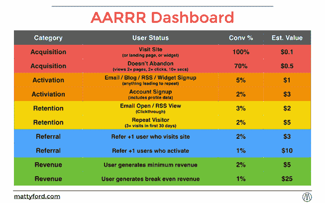
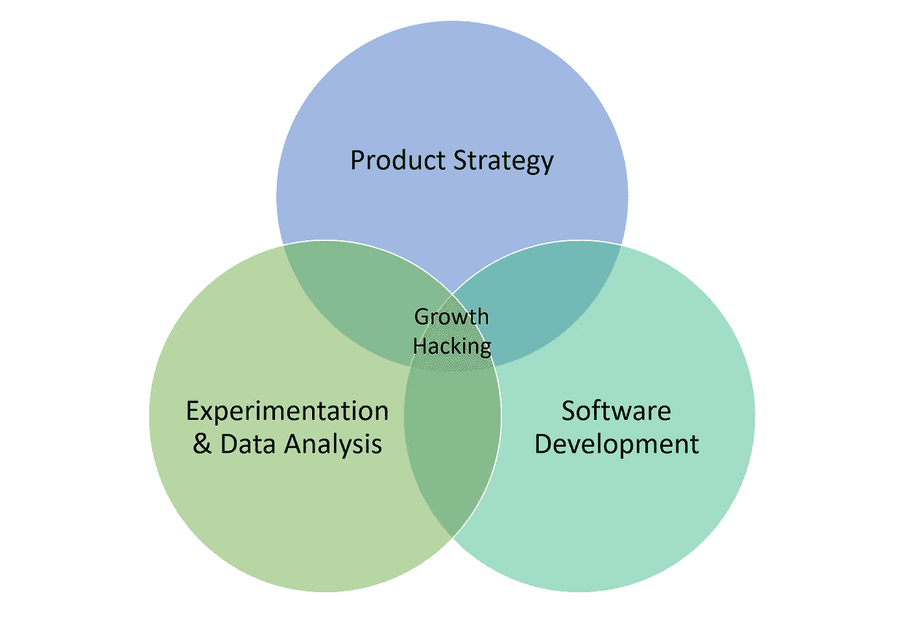

# 大回顾——将敏捷原则应用到您的产品路线图中

> 原文：<https://medium.com/hackernoon/the-grand-retrospective-applying-agile-principles-to-your-product-roadmap-ab0c41b5ce2a>

Scrum 宣言的核心原则是**反思和持续改进**，这也是它获得如此狂热追随者的原因。Scrum 的目的是缩短迭代周期，并在每个周期结束时进行回顾，在回顾中，您分析并调整流程以持续改进。这种紧密的反馈循环允许团队快速凝聚，建立有效的流程，消除浪费，并轻松适应优先级的变化。这就是敏捷开发如此伟大的原因。

这些原则可以应用于组织的许多不同层次。特别是，我们应该在我们的战略产品规划中应用这些原则。通过将实验、测量、思考和持续改进的过程应用到路线图计划周期中，我们可以在产品管理中获得与在软件开发中相同的好处。

# 创意捕捉

我们必须首先确保所有的产品创意被一致地捕捉和处理，不管它们来自哪里。这意味着首席执行官的想法与来自客户支持的反馈以同样的方式被处理。所有的想法都必须遵循相同的评估过程。产品经理的工作是从各种来源创建一个想法的漏斗，在路线图中捕捉它们，并独立于它们的来源对它们进行评估。

像[这样的工具啊哈！](https://www.aha.io/)或 [ProdPad](https://www.prodpad.com/) 可以在这个过程中提供帮助，但我只需要一个普通的旧电子表格就可以了。这里重要的不是文档本身，而是你回顾这些产品想法并以确定的方式评估它们对业务的影响的仪式。我建议每个季度至少召开一次深入的路线图计划会议，最好是一个月一次，在会议上你可以评估新的想法，并重新评估路线图上的现有想法。

# 盗版指标

我是戴夫·麦克卢尔评估产品创意的盗版指标框架的忠实粉丝。在这个框架中，所有的产品创意都根据一组对公司成功至关重要的通用业务驱动因素进行评估和评分。虽然驱动因素本身可能因行业而异，但您应该确定哪些驱动因素对您最重要。所有的产品创意都会根据这些标准进行评估，而不是根据哪个人的声音最大。它迫使你做出客观的决定，并对特性的预期结果进行结构化的讨论。

您首先要定义对您至关重要的关键业务驱动因素。对于互联网创业公司，这些驱动因素是:

> 获得物ˌ获得
> 
> 激活
> 
> 保留
> 
> 介绍
> 
> 收入

一旦定义了业务驱动因素，就定义了定义漏斗的关键事件。下面是一个漏斗示例:

Example Pirate Metrics Funnel — Credit Mattyford.com

这个过程类似于 Scrum 中的扑克规划。不同的人可能会争论某个特性在给定的驱动因素上是三分还是五分，但这迫使每个人都基于对业务真正重要的事情进行辩论。类似于 Scrum，需要练习，但最终你会找到节奏。

Example of a Product Roadmap

一旦根据关键业务驱动因素对所有功能进行评分，一个简单的加权公式将确定功能的相对优先级。至少每年一次，您应该根据业务需求为每个业务驱动因素设置相对权重。例如，如果你很擅长获取新用户，但很难转化他们，你应该给收入比获取更高的权重。每个变量的加权总和乘以它们各自的权重将得到一个总分数，可以对该分数进行排序以确定优先级。

只要每个人都致力于这个过程，没有人必须决定接下来应该开发哪些特性。模型会自己决定。这确保了您总是基于业务的 kpm 在正确的时间构建正确的特性。

# 增长破解您的路线图

风靡全球的“增长黑客”学科本质上是应用于产品开发的科学方法。流程如下:

> 发展一种假设
> 
> 开发一个实验来测试这个假设
> 
> 建立成功或失败的标准
> 
> 使用预先定义的群组和控制组进行实验
> 
> 隔离实验以控制假设
> 
> 衡量结果
> 
> 确认或否认假设。

确定路线图的优先级后，您应该为这些路线图项目开发一个假设、实验和成功度量。你的释放应该尽可能的小以隔离实验。您应该通过创建群组、控制组和许多 A/B 测试场景，将实验发展到您的发布中。在发布一个新的特性之后，你应该测量这个特性对你的业务驱动的影响。

例如，如果你有一个你认为会对转化率有很大影响的特性，你应该能够衡量这个特性在发布后对转化率的影响。几个星期或几个月之后，你应该能够分离出同时注册的人群，将他们分成不同的群组，并测量对转换的相对影响。然后，您应该在路线图文档本身上记录该实验的结果。

实现这一点的一个好方法是在用户创建函数中创建一个标记机制。当一个新用户被创建时，一个简单的标记被添加到他们的用户记录中。这被存储在数据库中，并且可以在以后被查询用于分析目的。在每一个版本中，你应该在你的用户创建功能中有一点逻辑，把用户放在一个特定的群组中。然后，应用程序应该基于用户群组分配为用户提供不同的体验。这本质上是基于用户标签打开或关闭特性的条件逻辑。一段时间后，您可以运行报告来比较群组之间的结果。

# 盛大的回顾展

在您的下一个路线图计划会议中，您应该从回顾自上次会议以来发布的结果开始。如果您遵循此流程，您应该能够轻松地比较对业务驱动因素的预期影响和实际影响。如果结果符合你的期望，你可以给自己一个鼓励。如果结果不是你所期望的，你应该利用这个机会反思你的决策过程。

如果你对你的产品创意的影响一直都是错误的，你要么在战略规划方面很糟糕，应该被解雇，或者更有可能的是，你根本没有在拥有完整信息的情况下做出决策。如果你过于重视高薪人士的意见，你没有进行基本的市场调查，或者你没有与你的客户密切接触，你很可能会做出糟糕的决定。

# 持续改进

这个过程凸显了你做出好的产品决策的能力。如果你的结果与你的期望不一致，你需要改变你做这些决定的方式。您应该分析这些没有按预期执行的特性，并尝试找到一些共同的模式。你应该花时间反思和分析是什么导致你做出错误的决定，并愿意改变你的过程。你可能过于强调内部想法，而没有从用户那里收集足够的反馈。这是我在[银弹](https://hackernoon.com/the-silver-bullet-how-a-user-centered-culture-can-solve-all-your-product-development-problems-ecd3e1e2cd7a)中深入阐述的主题。

回顾本身也应该是结构化的。您应该针对每个新特性提出一系列问题，以确定意外结果的根本原因。

> 这个想法是从哪里产生的？
> 
> 这是我们以前在其他产品中见过的功能吗？
> 
> 在开发并投入生产之前，我们是否与用户一起验证了这个概念？
> 
> 我们是否恰当地开发和执行了实验？
> 
> 我们是否充分控制了误差？
> 
> 我们的用户反馈解释了为什么这个特性会有这样的表现吗？

这些问题和其他问题将帮助你确定你的过程中需要改变的是什么。

# 结论

通过吸取 Scrum 的精华，并将其应用到战略规划过程中，我们能够做出更准确且始终正确的决策。通过致力于反思和持续改进的过程，我们确保我们第一次就构建了正确的产品。

这种方法围绕战略规划创建了一种结构，在这种结构中，您将情感和意见放在一边，完全基于对业务的客观影响来做出决策。如果做得好，您将能够高效和有效地评估和优先化特性，测量结果，并随着时间的推移不断改进您的过程。

我最近在 [0111 CTO 会议](https://www.111conf.com/)上做了一个关于开发和执行战略性产品路线图的演讲。如果你想更深入地了解这个话题，请欣赏这个视频:

# 刚推出！获取免费的产品开发工具包！

我已经整理了一个完整的包来帮助企业家、初创公司创始人和首席执行官学习如何建立技术产品和业务。我免费赠送的第一部分是一个可定制的产品开发工具包。它包括我和我的真实客户一起使用的所有模板，帮助他们从想法到执行。[拿过来！](http://www.buildtherightthings.com/toolkit)

# 如果你想阅读更多我写的关于产品开发、领导力和软件开发过程的文章，[在 Medium](/@mostlyemptyspace) 上关注我。你也可以在我的[媒体页面](https://www.voyagent.io/media/)上找到我的会议演讲和播客。