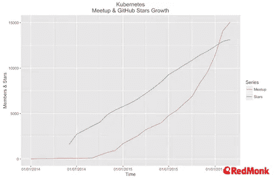
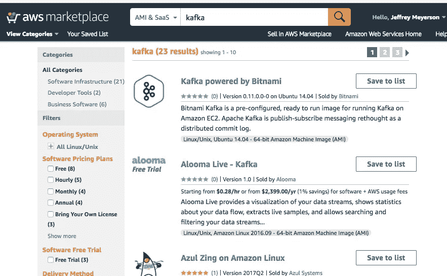

# 库伯内特斯的引力

> 原文：<https://medium.com/hackernoon/the-gravity-of-kubernetes-33126a96ee23>

## Kubernetes 已经成为部署新的分布式应用程序的标准方式。

[*要收听本集的播客版本，请每天在软件上查看。*](https://www.softwaredaily.com/#/post/5a5a2387f43c8d000457a110)

在可预见的未来，大多数新的互联网企业将会利用[的 Kubernetes](https://hackernoon.com/tagged/kubernetes) (无论他们是否意识到这一点)。许多旧的应用程序也在向 Kubernetes 迁移。

在 Kubernetes 之前，没有围绕特定分布式系统平台的标准化。就像 Linux 成为单个节点的标准服务器端操作系统一样，Kubernetes 已经成为编排应用程序中所有节点的标准方式。

有了 Kubernetes，分布式系统工具可以产生网络效应。每当有人为 Kubernetes 构建一个新工具时，它都会使所有其他工具变得更好。它进一步巩固了 Kubernetes 的标准。

谷歌、微软、亚马逊和 IBM 都有 Kubernetes 即服务产品，这使得在主要云提供商之间转移基础设施变得更加容易。我们可能会看到数字海洋、Heroku 和长尾云提供商最终提供托管的 Kubernetes。

在这篇社论中，我探讨了以下问题:

*   为什么会这样？
*   对开发者有什么启示？
*   云提供商受到了怎样的影响？
*   在 Kubernetes 标准化的世界里，有哪些新的商业模式是可能的？

# 软件标准

标准化的软件平台有好有坏。

标准允许开发者对他们的软件将如何运行有所期望。如果一个开发者为一个标准化的平台开发一些东西，他们可以对这个软件的潜在市场做出明智的估计。

如果你用 JavaScript 写一个程序，你知道它会在每个人的浏览器中运行。如果你为 iOS 开发了一个游戏，你知道每个有 iPhone 的人都可以下载它。如果您在。你知道有一个很大的有内存问题的 Windows 开发者社区可以购买你的软件。

标准化的*专有*平台可以为平台提供商带来巨大的利润回报。1995 年，Windows 是一个非常好的平台，微软可以以 100 美元的价格出售一张装在纸板箱中的 CD。2018 年，iPhone 太好了，苹果可以从其平台上的所有应用销售额中拿走 30%。

专有标准导致碎片化。

你的 iPhone 应用程序无法在我的 Kindle Fire 上运行。我不能在 Facebook Messenger 上使用你的 Snapchat 增强现实贴纸。我最喜欢的数字音频工作站只能在 Windows 上运行——所以我不得不随身携带一台 Windows 电脑来制作音乐。

当开发人员看到这种分裂时，他们会抱怨。他们想象贪婪的资本家，他们以牺牲软件质量为代价来赚钱。开发人员会想，“为什么我们不能好好相处呢？为什么我们不能拥有开放和自由的事物？”

开发者认为，“我们不需要专有标准。我们可以让*开放*标准。”

Apache 的增长，LAMP (Linux、Apache、MySQL、PHP)堆栈的一部分

Linux 就是这样。如今，新的服务器端应用程序大多是在 Linux 中。曾几何时，这是有争议的(见上图的最左边)。

最近，我们看到了 Docker 的一个更新的开放标准。Docker 为我们提供了一种开放、标准化的方式来打包、部署和分发单个节点。这非常有价值！但是对于 Docker 解决的所有大问题，它强调了一个新问题——我们应该如何将这些节点编排在一起？

毕竟，您的应用程序不仅仅是一个节点。您知道您想要部署一个 Docker 容器——但是您的容器是如何相互通信的呢？您如何扩展这些容器的实例？您如何在容器实例之间路由流量？

# 容器编排

在 Docker 流行起来之后，出现了一系列开源项目和专有平台来解决容器编排的问题。

Mesos、Docker Swarm 和 Kubernetes 都为管理容器提供了不同的抽象集。Amazon ECS 提供了一个专有的托管服务，负责为 AWS 用户安装和扩展 Docker 容器。

一些开发人员没有采用任何编排平台，而是使用 BASH、Puppet、Chef 和其他工具来编写部署脚本。

无论开发人员是通过使用编排平台还是脚本来部署他们的容器，Docker 都加速了开发，并使开发人员和操作人员之间更加和谐。

随着越来越多的开发人员使用 Docker 部署容器，编排平台的重要性变得越来越明显。[容器对于分布式系统就像对象对于面向对象的程序一样重要](https://youtu.be/gCQfFXSHSxw?t=611)。每个人都想使用容器平台，但这些平台之间存在竞争，很难看出哪一个会胜出——或者这将是一场长达几十年的斗争，就像 iOS 与 Android 的斗争一样。

不同容器编排平台之间的斗争导致了分裂——不是因为任何流行的编排框架都是专有的(Swarm、Kubernetes 和 Mesos 都是开源的),而是因为每个容器编排社区都在自己的系统上投入了大量资金。

因此，从 2013 年到 2016 年，Docker power 用户中存在一些焦虑。选择容器编排框架是一个巨大的赌注——如果你选择了错误的编排系统，这就像开了一家电影商店，选择了 HD DVD 而不是蓝光。

These pictures of container ships falling over never get old. Image: Huffington Post

容器编排者之间的战争感觉像是赢家通吃的事情。

就像在任何一场战争中一样，有一场迷雾很难看透。当我在报道容器编排大战时，我和容器编排专家一起录制了一个又一个[播客，在播客中我会问一些形式的问题，“那么，哪个容器编排系统会赢呢？”](https://softwareengineeringdaily.com/tag/containers/)

我一直这样做，直到[一个我尊敬的人](https://softwareengineeringdaily.com/2016/07/06/schedulers-with-adrian-cockcroft/)告诉我，询问谁将“赢得编排之战”并不是一个比评估编排者之间的技术权衡更有趣的问题。

回过头来看，我后悔相信了容器编制者之间的战争。

随着关于容器管弦乐队的辩论激烈进行，房间里最聪明的人大多在进行冷静的科学讨论——即使像我这样的记者变得激动，认为这是一个关于部落主义的故事。

容器编排者之间的冲突与部落主义无关——他们更多的是关于意见的分歧和开发人员的人机工程学。

好吧，也许容器编排之战不仅仅是关于观点的分歧。这一领域有大把的钱可以赚。我们正在讨论与价值数十亿美元的传统组织(银行、电信和保险公司)签订合同，这些组织正在向云发展。

如果你从事的是帮助电信公司走向成功平台的业务，那么生意会很好。如果你支持错误的平台，你最终会得到满满一仓库的 HD-DVD。

冲突最严重的时候是在 2016 年底，当时有[关于 Docker 潜在分叉的传言，以便 Docker 公司可以改变 Docker 标准，以更好地适应他们的容器编排系统 Docker Swarm](https://softwareengineeringdaily.com/2016/10/03/docker-fork-with-alex-williams-and-joab-jackson/)——但即使在那个时候，乐观主义者也有道理。

创造性破坏是痛苦的，但它是进步的标志——在争夺容器编排主导权的斗争中，有大量的创造性破坏。

当 2016 年底尘埃落定时，Kubernetes 显然是赢家。

如今，随着 Kubernetes 成为安全的选择，首席信息官们对在他们的企业中采用容器编排感到更加放心——这使得供应商们对投资 Kubernetes 特定的工具以销售给这些首席信息官们感到更加放心。

这就把我们带到了现在:

*   开源开发者正朝着同一个方向前进，对构建什么感到兴奋。
*   主要企业(新老企业)都在购买 Kubernetes。
*   主要的云提供商已经准备好了低成本的 Kubernetes 即服务。
*   监控、日志记录、安全和法规遵从性软件的众多供应商兴奋不已，因为他们必须集成的底层软件堆栈变得更加可预测。

# 走向多云

今天，最赚钱的专有后端开发基础设施提供商是 Amazon Web Services。开发人员不会怨恨 AWS，因为 AWS 是创新的、强大的、廉价的。如果你付给 AWS 很多钱，那可能意味着你的生意做得很好。

有了 AWS，开发人员就不会像 90 年代的主流专有平台那样受到限制。但是有一些局限。一旦你深深嵌入 AWS 生态系统，使用像 DynamoDB、亚马逊弹性容器服务或亚马逊 Kinesis 这样的服务，离开亚马逊就成了一项艰巨的任务。

随着 Kubernetes 为基础设施创建一个开放的公共层，理论上可以将您的 Kubernetes 集群从一个云提供商“提升并转移”到另一个云提供商。

如果你决定提升和转移你的应用程序，你将不得不重写你的应用程序的一部分，以停止使用亚马逊特定的服务(如亚马逊 S3)。例如，如果您想要一个可以在任何云上运行的 S3 替代程序，那么您可以使用 [Rook](https://rook.io/) 配置一个 Kubernetes 集群，并开始使用与您在 S3 上存储对象相同的 API 在 Rook 上存储对象。

这是一个很好的选择，但我还没有听说过任何人真的将他们的应用程序从云迁移到[，除了 Dropbox](https://softwareengineeringdaily.com/2016/05/17/dropboxs-magic-pocket-james-cowling/) ，他们的迁移是[如此壮观，花了两年半的时间](https://www.wired.com/2016/03/epic-story-dropboxs-exodus-amazon-cloud-empire/)。

当然，除了 Dropbox，还有人在亚马逊 S3 上花了这么多钱，以至于他们会考虑建立自己的对象商店，但这将是一个巨大的努力来完成这样的迁移。

Kubernetes can be used for lifting and shifting — but more likely will be used to have familiar operating layer in different clouds

Kubernetes 可能不会很快成为大范围提升和移动的工具。更有可能的情况是，Kubernetes 将成为一个无处不在的控制平面，企业将在多个云上使用。

NodeJS 是一个有用的类比。为什么人们喜欢在他们的服务器端应用程序中使用 NodeJS？不一定是因为 Node 是最快的 web 服务器。这是因为人们喜欢在客户端和服务器端使用相同的语言。就像 NodeJS 可以让你在客户机和服务器代码之间切换而不必切换语言一样，Kubernetes 可以让你在云之间切换而不必改变你对操作的看法。

在每个云上，您将有一些在 Kubernetes 上运行的定制应用程序代码，它们与该云提供的托管服务进行交互。

公司希望成为多云—部分是为了灾难恢复，但也因为在不同的云上访问托管服务有实际的好处。

一种新兴的模式是将用户流量的基础设施分为 AWS 和数据工程的 Google Cloud。使用这种模式的一家公司是[图钉](https://softwareengineeringdaily.com/2017/11/28/thumbtack-infrastructure-with-nate-kupp/):

*在图钉，AWS 上的生产基础设施服务于用户请求。发生的事务日志从 AWS 推送到 Google Cloud，在那里进行数据工程。在 Google Cloud 上，交易记录在 Cloud PubSub 中排队，这是一种消息排队服务。这些事务从队列中取出并存储在 BigQuery 中，big query 是一个用于存储和查询大量数据的系统。

BigQuery 被用作编排机器学习作业时从中提取的数据湖。这些机器学习作业运行在 Cloud Dataproc 中，这是一个运行 Apache Spark 的托管服务。在 Google Cloud 中训练一个模型后，该模型被部署在 AWS 端，在那里它为用户流量服务。在谷歌云方面，这些不同的托管服务的编排是由 Apache Airflow 完成的，这是一个开源工具，是 Thumbtack 在谷歌云上进行自我管理的少数基础设施之一。*

今天，Thumbtack 使用 AWS 来服务用户请求，使用 Google Cloud 在 PubSub 中进行数据工程和排队。Thumbtack 在谷歌中训练其机器学习模型，并将其部署到 AWS。

这就是今天的情况。Thumbtack 可能最终也会将谷歌云用于面向用户的服务。

A multi-cloud data engineering pipeline from a Japanese company

越来越多的公司将逐渐转向多个云——其中一些公司将在每个云上管理一个独特的 Kubernetes 集群。

您可能在 Google 上有一个 GKE Kubernetes 集群来协调 BigQuery、Cloud PubSub 和 Google Cloud ML 之间的工作负载，您可能有一个亚马逊 EKS 集群来协调 DynamoDB、亚马逊 Aurora 和您的生产 NodeJS 应用程序之间的工作负载。

云提供商不是可替代的商品。不同云提供的服务将变得越来越奇特和不同。企业将从访问不同云提供商的不同服务中受益。

# 分布式系统分布

像 Google BigQuery 和 AWS Redshift 这样的服务很受欢迎，因为它们通过一个简单的 API 为您提供了一个强大的、可伸缩的、多节点的工具。开发人员通常选择这些托管服务，因为它们非常易于使用。

你看不到这些类型的单节点付费工具。我不为 NodeJS、React 或 Ruby on Rails 付费。

用于单个节点的工具比用于分布式系统的工具更容易操作。跨服务器部署 Hadoop 比在我的笔记本电脑上运行 Ruby on Rails 应用程序更难。有了 Kubernetes，这种情况将会改变。

如果您正在使用 Kubernetes，您可以使用一个名为 Helm 的分布式系统包管理器。这就像 Kubernetes 应用程序的 npm。如果您正在使用 Kubernetes，您可以使用 Helm 轻松安装一个复杂的多节点应用程序，无论您在哪个云提供商上。

以下是对 Helm 的描述:

> Helm 帮助您管理 Kubernetes 应用程序——Helm Charts 帮助您定义、安装和升级最复杂的 Kubernetes 应用程序。图表易于创建、版本化、共享和发布——所以开始使用 Helm，停止复制粘贴的疯狂行为。

分布式系统的包管理器。太神奇了！来看看我能装什么吧。

Not pictured: WordPress, Jenkins, Kafka

分布式系统很难建立。问问那些建立了自己的 Kafka 集群的人。Helm 将使安装 Kafka 像在 MacBook 上安装新版 Photoshop 一样简单。你将能够在*的任何云*上做到这一点。

在 Helm 之前，最接近分布式系统包管理器的东西(据我所知)是你在 [AWS](https://aws.amazon.com/marketplace) 或 [Azure](https://azuremarketplace.microsoft.com/en-us/marketplace/) 或 [Google Cloud Launcher](https://cloud.google.com/launcher/) 上找到的市场。在这里，我们再次看到专有软件是如何导致分裂的。在 Helm 之前，没有标准的、与平台无关的一键安装 Kafka 的方式。

你可以想办法在 AWS，Google，或者 Azure 上一键安装 Kafka。但是这些安装中的每一个都必须为特定的云提供商独立编写。而要在数字海洋上安装 Kafka，需要遵循[一个 10 步教程](https://www.digitalocean.com/community/tutorials/how-to-install-apache-kafka-on-ubuntu-14-04)。

Helm 代表一个跨平台系统，用于在任何 Kubernetes 实例上分发多节点软件。您可以在任何云提供商或您自己的硬件上使用 Helm 安装的应用程序。你可以很容易地安装 Apache Spark 或 Cassandra——众所周知，这些系统很难安装和操作。

Helm 是 Kubernetes 的软件包经理——但它看起来也像是 Kubernetes 应用商店的开端。有了应用商店，你可以为 Kubernetes 出售软件。

你能卖什么样的软件？

你可以销售分布式系统平台的企业发行版，比如 Cloudera Hadoop、Databricks Spark 和 Confluent Kafka。像 Prometheus 这样的新型监控系统和 Cassandra 这样难以安装的多节点数据库。

也许你甚至可以像 Zendesk 一样销售更高级的消费级软件。

自托管 Zendesk 的想法听起来很疯狂，但有人*可以*构建它，并以专有二进制的形式出售，以固定费用而不是订阅的成本。如果我卖给你一个 99 美元的 Zendesk-for-Kubernetes，你可以很容易地在 AWS 上的 Kubernetes 集群上运行它，你最终会在支持票务软件上节省很多钱。

企业经常运行自己的 WordPress 来管理公司博客。Zendesk 的软件比 WordPress 复杂吗？我不这么认为——但是比起管理自己的博客软件，企业更害怕管理自己的帮助台软件。

我经营着一家相当小的企业，但我订阅了许多不同的软件即服务工具。昂贵的 WordPress 主机，昂贵的广告销售 CRM，时事通讯的 MailChimp。我为这些服务付费是因为它们超级可靠和安全，而且它们是复杂的多节点应用程序。我不想主持我自己的。我不想支持他们。当我的简讯发送失败时，我不想负责技术故障排除。[我想少跑软件](https://softwareengineeringdaily.com/2017/11/20/run-less-software-with-rich-archbold/)。

相比之下，我不怕我的单节点软件要坏了。

我从单个节点使用的软件往往要便宜得多，因为我不必将它作为“服务”来购买。我用来写音乐的软件有一倍的固定成本。Photoshop 有一次性固定成本。我支付运行电脑的电费，但除此之外，我没有运行 Photoshop 的持续资本支出。

当多节点应用程序与单节点应用程序一样可靠时，我们将看到定价模式的变化。

也许有一天我会买一个 Zendesk-for-Kubernetes。Zendesk-for-Kubernetes 将为我提供我从服务台获得的一切——它将启动一个电子邮件服务器，它将为我提供一个管理票证的网络前端。如果出现任何问题，我可以在需要时支付支持费用。

Zendesk is a fantastic service — but it would be cool if it had a fixed pricing model

# 元粒子

有了 Kubernetes，部署和管理分布式应用程序变得更加容易。有了 Helm，将这些应用程序分发给其他用户变得更加容易。但是开发分布式系统仍然非常困难。

这是 Brendan Burns 最近的 CloudNative Con/KubeCon 主题演讲的焦点，名为[“这项工作太难了:构建新的工具、模式和范例来实现分布式系统开发的民主化”](https://www.youtube.com/watch?v=gCQfFXSHSxw)。

在他的演讲中，Brendan 展示了一个叫做 Metaparticle 的项目。Metaparticle 是云原生开发的标准库，目标是使分布式系统民主化。在《T2》对超粒子的介绍中，布兰登写道:

> 云原生开发是定制的、复杂的，并且仅限于少数专业开发人员。Metaparticle 通过引入一组熟悉的编程语言实用程序来改变这种情况，这些实用程序满足了开发人员的需求，使他们能够开始使用熟悉的语言功能开发云原生系统。
> 
> Metaparticle 构建在 Kubernetes 原语之上，也使分布式同步变得更加容易。它为锁定和领导者选举提供了独立于语言的模块，作为熟悉的编程语言中易于使用的抽象。

经过几十年的分布式系统研究和应用，关于我们如何构建这些系统的模式已经出现。我们需要一种锁定变量的方法，这样两个节点就不能以不确定的方式写入该变量。我们需要一种方法来进行主节点选举，这样，如果主节点死亡，其他节点可以选择一个新的节点来编排系统。

今天，我们使用像 etcd 和 Zookeeper 这样的工具来帮助我们选择和锁定主人——而且这些工具需要成本。

Brendan 以 Zookeeper 为例说明了这一点，Hadoop 和 Kafka 都使用它来进行主选举。动物园管理员需要花费大量的时间和精力来学习如何操作。在 Hadoop 和 Kafka 的构建过程中，这些项目的创始工程师将他们的系统设计为与 Zookeeper 一起维护一个主节点。

如果我正在编写一个分布式 mapreduce 系统，我希望避免考虑节点故障和竞争条件。Brendan 的想法是将这些问题推进到一个标准库中——这样下一个对多节点应用程序有新想法的开发人员就更容易了。

重要的元点:元粒子是在假设你在 Kubernetes 上的情况下建立的。这是一个语言级的抽象，建立在对底层(分布式)操作系统的假设之上——这又一次将我们带回了标准。如果**每个人**都在同一个分布式操作系统上，我们可以对我们项目的下游用户做*大*假设。

这就是为什么我的头脑被 Kubernetes 吹乱了。它是跨异构系统世界的一层标准。

# 无服务器工作负载

功能即服务(通常称为“无服务器”功能)是一种强大、廉价的抽象，开发人员可以在 Kubernetes 之上与 Kubernetes 一起使用，在某些情况下可以完全代替 Kubernetes。

让我们快速回顾一下无服务器应用程序的现代景观，然后考虑无服务器和 Kubernetes 之间的关系。

[功能即服务快速回顾](https://www.softwaredaily.com/#/post/5a251d5f0cbcbe0004c932e1):

*功能即服务是无需可寻址服务器即可运行的可部署功能。*

*开发人员只需一次调用，即可部署、执行和扩展服务。在调用无服务器函数之前，您的函数不会在任何地方运行——因此，除了存储原始代码的数据库之外，您不会耗尽其他资源。当您调用一个函数作为服务时，您的集群将负责调度和运行该函数。*

*您不必担心启动一台新机器并对其进行监控，也不必担心在机器闲置时停止运转。你只要告诉集群你想运行一个函数，集群就执行它并返回结果。*

当您“部署”一个无服务器功能时，实际上并没有部署功能代码。您的代码以纯文本的形式存储在数据库中。当您调用该函数时，您的代码将从数据库条目中取出，加载到 Docker 容器中并执行。

Diagram from [How Serverless Platforms Work](/openwhisk/uncovering-the-magic-how-serverless-platforms-really-work-3cb127b05f71)

AWS Lambda 在 2014 年率先提出了“功能即服务”的理念。从那以后，开发人员一直在思考各种各样的用例。关于开发者如何使用无服务器的完整列表，有一个由 CNCF 无服务器工作组创建的[共享 Google 文档(在本文发表时有 34 页)](https://docs.google.com/document/d/1UjW8bt5O8QBgQRILJVKZJej_IuNnxl20AJu9wA8wcdI/edit#heading=h.yiaul8is1ki)。

从我每天在软件工程上的谈话来看，这些功能即服务至少展示了两个清晰的应用:

*   能够快速、廉价地扩展以应对突发工作负载的计算(例如，Yubl 的社交媒体可扩展性案例研究)
*   具有可变工作负载频率的事件驱动“粘合代码”(例如，具有各种数据库使用者的事件源模型)

为了创建一个 FaaS 平台，云提供商提供了一个称为调用者的 Docker 容器集群。这些调用者等待调度的代码块进入。当您发出执行程式码的要求时，有一段时间必须等待程式码载入至叫用程式并执行。这种花在等待上的时间就是“冷启动”问题。

如果您决定在 FaaS 上运行应用程序的一部分，冷启动问题就是您所做的权衡之一。不需要为不做任何工作的服务器的正常运行时间付费，但是当您想要调用函数时，您必须等待将代码调度到调用者上。

在 AWS 上，对于 AWS Lambda 的任何请求都有指定的调用程序。在 Microsoft Azure 上，有为 Azure 函数请求指定的调用程序。在 Google Cloud 上，有一些为 Google Cloud 函数保留的调用程序。

对于大多数开发人员来说，使用 AWS、微软、谷歌或 IBM 的“功能即服务”平台就可以了。成本低，并且对于大多数应用来说，冷起动问题不成问题。但一些开发者会希望得到更低的成本。或者，他们可能希望编写自己的调度程序，以定义如何将代码调度到调用者容器上。这些开发者可以推出自己的无服务器平台。

像 Kubernetes 这样的开源 FaaS 项目允许您在 Kubernetes 之上调配自己的无服务器集群。您可以定义自己的调用程序池。可以确定如何根据作业计划容器。您可以决定如何解决自己集群的冷启动问题。

Kubernetes 的开源 FaaS 只是一种类型的资源调度程序。它们只是我们将在 Kubernetes 之上看到的其他自定义计划程序的预览。开发人员总是构建新的调度程序，以便在这些调度程序的基础上构建更高效的服务。

那么，在 Kubernetes 的基础上还将构建哪些类型的调度程序呢？正如他们所说，未来已经到来，但它只能作为 AWS 托管服务提供。

AWS 推出了一项名为 Amazon Aurora 无服务器的新服务，这是一个自动上下扩展存储和计算的数据库。来自[杰夫·巴尔关于 AWS 无服务器 Aurora](https://aws.amazon.com/blogs/aws/in-the-works-amazon-aurora-serverless/) 的帖子:

*创建 Aurora 数据库实例时，您可以选择所需的实例大小，并选择使用读取副本来增加读取吞吐量。如果您的处理需求或查询率发生变化，您可以根据需要选择修改实例大小或改变读取副本的数量。这种模型在工作负载是可预测的、请求速率和处理要求有限制的环境中非常适用。*

*在某些情况下，工作负载可能是间歇性的和/或不可预测的，突发的请求可能每天或每周只持续几分钟或几小时。Flash 销售、不频繁或一次性的活动、在线游戏、报告工作负载(每小时或每天)、开发/测试和全新的应用程序都符合要求。安排合适的容量可能需要大量的工作；在稳定状态的基础上支付可能是不明智的。*

*因为存储和处理是分开的，所以您可以一直缩减到零，并且只需支付存储费用。我认为这真的很酷，我希望它能导致新类型的即时启动、瞬时应用程序的产生。扩展发生在几秒钟内，建立在一个“温暖的”资源池之上，这些资源迫不及待地想要满足您的请求。*

我们对 AWS 可以构建这样的东西并不感到惊讶，但很难想象它如何成为一个开源项目——直到 Kubernetes。这是一种随机开发人员可以在 Kubernetes 上构建的系统。

如果您想在 Kubernetes 上构建自己的无服务器数据库，您需要解决许多调度问题。网络、存储、日志、缓冲和缓存需要不同的资源层。对于这些不同的资源层中的每一层，您都需要定义如何调度资源以响应需求。

就像 Kubeless 为小部分功能代码提供了一个调度程序一样，我们可能会看到其他定制的调度程序，人们用它们作为更大应用程序的构建模块。

一旦你真正建立了你的无服务器数据库，也许你可以在 Helm app store 上以 99 美元的价格一次性购买。

# 结论

我希望你通过一些 Kubernetes 的历史和对未来的猜测享受这次旅行。

随着 2018 年的开始，以下是我们今年想要探索的一些领域:

*   **人们如何管理机器学习模型在 Kubernetes 上的部署？我们和马特·泽勒一起做了一个节目，他讨论了这个问题，听起来很复杂。**
*   Kubernetes 用于自动驾驶汽车吗？如果是，您是否部署一个集群来管理整个汽车？
*   Kubernetes 物联网部署看起来像什么？在一组网络连接时断时续的设备上运行 Kubernetes 有意义吗？
*   Kubernetes 将构建哪些新的基础设施产品和开发工具？有哪些新的商机？

Kubernetes 是构建现代应用程序后端的一个极好的工具——但它仍然只是一个工具。

如果 Kubernetes 完成了它的使命，它最终将淡出人们的视线。总有一天，我们会像谈论编译器或操作系统内核一样谈论 Kubernetes。Kubernetes 将是较低级的管道，不在一般应用程序开发人员的权限之内。

但在那之前，我们会继续报道。