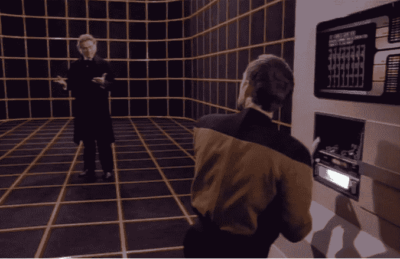
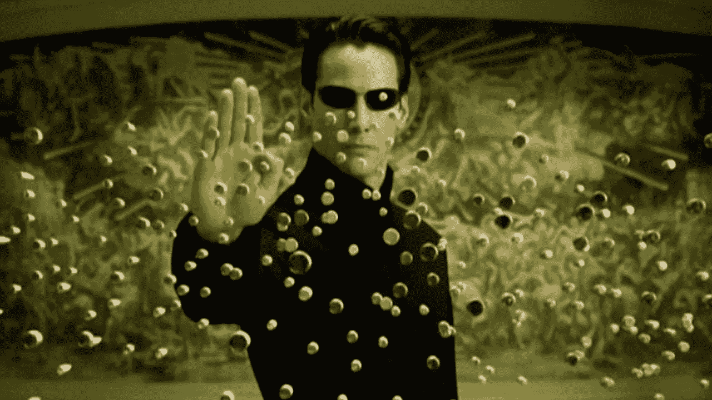
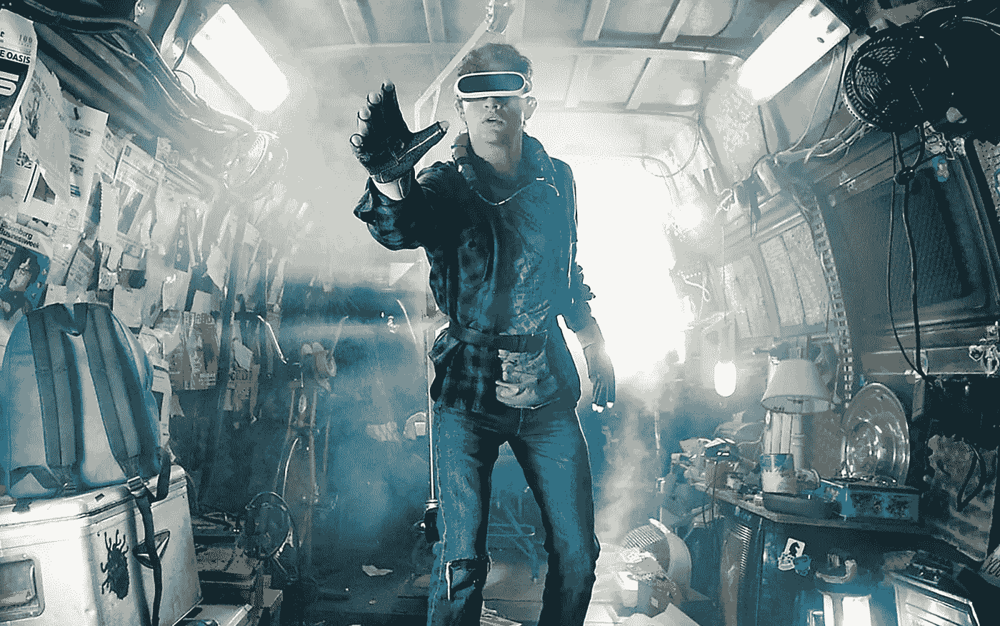
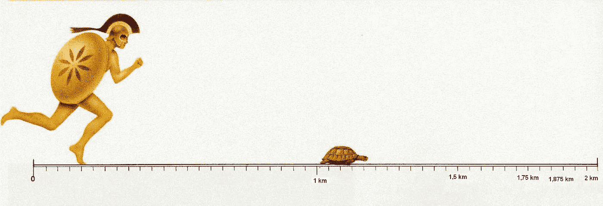
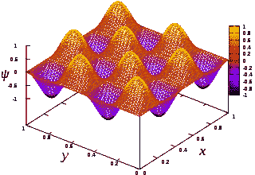
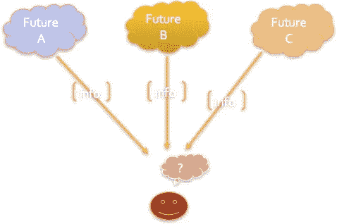
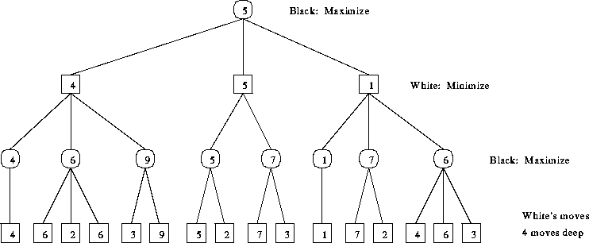
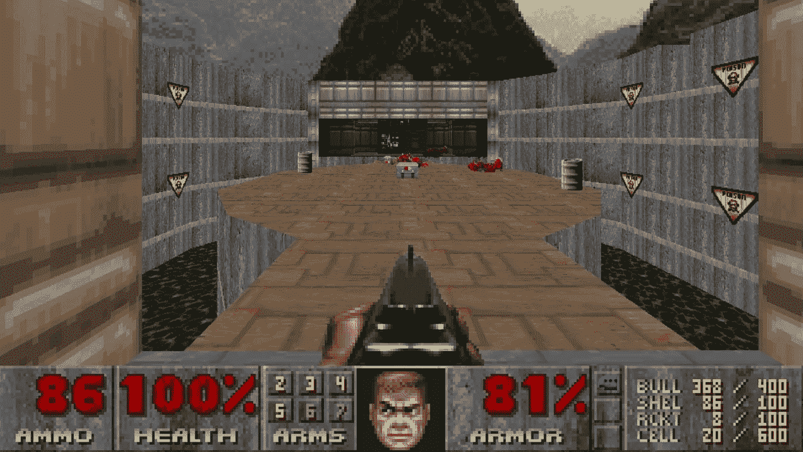
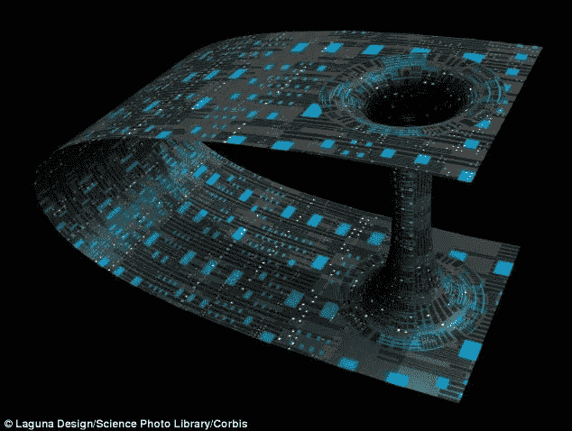

# 模拟假说——为什么量子物理学、人工智能和东方神秘主义者认为我们在一个电子游戏中

> 原文：<https://medium.com/hackernoon/the-great-simulation-why-quantum-physics-artificial-intelligence-and-eastern-mystics-all-agree-b6c185213a18>

> 一位麻省理工学院毕业的计算机科学家和硅谷视频游戏设计师给出了“模拟假说”的 10 个理由:我们的现实是一个模拟的、像素化的 3d 世界，在这个世界中，我们都有自己的经验值、关卡和任务，由一些巨大的人工智能运行

*注:如果你喜欢这篇文章，你可能想看看我的书，在*[*【Amazon.com】*](https://www.amazon.com/dp/B07M81F1KG)*或* [*巴恩斯&noble.com*](https://www.barnesandnoble.com/w/books/1130613031?ean=9780983056904)*或电子书*[*kobo*](https://www.kobo.com/us/en/ebook/the-simulation-hypothesis)*这里！或者在我的网站*[【www.zenentrepreneur.com ](http://www.zenentrepreneur.com)*报名！*

最近，我们可能生活在一个巨大的视频游戏中的想法，或者有时被称为*模拟假设*，已经引起了很多关注，因为像埃隆·马斯克这样的知名人士已经公开讨论了这个想法。随着虚拟现实技术变得越来越复杂，我们开始考虑虚拟世界，就像斯蒂芬·斯皮尔伯格执导的大片《玩家一号》中无处不在的绿洲一样。

有些人，比如科幻作家菲利普·K·蒂克，坚信我们生活在一种模拟环境中。其他人，如未来学家雷·库兹韦尔，已经普及了将我们的意识下载到硅基设备中的想法，这意味着我们毕竟只是数字信息。有些人，如牛津大学讲师尼克·博斯特罗姆，走得更远，认为我们实际上可能已经在这样的模拟中被人工模拟了意识！

## **科幻还是神秘主义？**

就像我第一次接触大多数伟大的想法一样，我通过看和读太多的科幻小说发现了模拟假说。

第一次是在*星际迷航:下一代*的一集中，一个全息甲板角色意识到他在一个模拟中，模拟中的一些人存在于“外面”(在这种情况下，外面的*是企业的其余部分)，他也想去那里！我想，我们有没有可能是在一个“全息甲板似的”空间里，而“外面”有另一个世界？*

A Star Trek character in the Holodeck realizes that he is in a simulation

虽然这在当时只是一个短暂的想法，但直到 1999 年电影《黑客帝国》上映，这个想法才在大众意识中成长起来。我当时想到，这种模拟可以存在，也可以不存在让这成为一个噩梦场景的霸主(在*《黑客帝国》*和埃隆马斯克的巨型视频游戏版本中，模拟背后都有超级智能的霸主，一个是进化的机器，另一个是外星人！).

The Matrix planted the idea in the popular consciousness that we are in a simulated reality

作为一名计算机科学家和视频游戏设计师，我不得不承认这个想法并没有那么疯狂。一个实现了像我们这样的高级模拟的文明可能比我们领先几千年(甚至几百万年*);不难想象这样一个文明会创造出比我们今天所能创造的更复杂的游戏。*

当我开始研究量子物理及其对“客观”与“主观”现实本质的惊人揭示时，我开始再次对大型多人视频游戏的想法产生怀疑。此外，随着我对东方传统，尤其是瑜伽和佛教哲学的深入研究，我发现他们关于世界本质的观点实际上与我们生活在模拟世界中的观点非常一致。

## **为什么这可能是一个视频游戏呢**

让我们来探究一下为什么我们可能生活在一个模拟世界中的主要原因:

***1。像素、分辨率、虚拟和增强现实***

马斯克提出的一个主要论点是，更先进的文明将拥有分辨率非常高的游戏——高到我们无法区分“真实”世界和“模拟”世界。

今天，我们已经看到虚拟现实使“完全沉浸”成为可能。任何玩过令人信服的 VR 游戏的人都会意识到，忘记现实世界并“相信”你所看到的世界是真实的是可能的。

举一个很好的例子，去年我正在玩一个乒乓球 VR 游戏的原型(由 Free Range Games 构建)，尽管它不是现实的分辨率，但我迷失了自己，以为我在真正地玩乒乓球。以至于我把球拍放在乒乓球“桌子”上，靠在桌子上。当然这是一个虚拟现实桌子，所以它并不真正存在——我最终把桨(实际上是 Vive 控制器)掉到了地板上。当我探身进入“桌子”时，我几乎摔倒，才意识到没有桌子。换句话说，*引用自母体，没有勺子。*

In Ready Player One, a realistic immersive virtual reality world, Oasis, becomes the ultimate escape

想象一下一百年后我们会有什么样的像素分辨率，更不用说一千年后了！这很有说服力。此外，随着 AR 技术发展到不需要外部眼镜就可以投影到视网膜上，我们可能会看到我们周围的东西，这些东西在分辨率上与物理世界没有什么区别。这引出了一个想法，即“外面”的世界可能真的只是我们头脑中的一个投影。

**2*。像素、量子和 Xeno 悖论*。**

我回想起在麻省理工学院读本科时的深夜，我和同学们就现实的本质进行哲学辩论。这是我第一次听说 Xeno 悖论。这个想法是，如果空间是连续的，就像数字一样(你总是可以在任何两个数字之间找到无穷多个数字)，怎么可能触摸到像墙壁这样的物体呢？你总是要走完一半的路程，而且永远也到不了那里。

Xeno(或者 Zeno，随便你喜欢哪个拼法！)用阿喀琉斯和一只乌龟的例子讲述了这个悖论。如果乌龟在阿喀琉斯的前面，如果他总是不得不弥补“一半的距离”，他怎么可能追上它呢？

当我第一次听到这个悖论时，我最初的反应是空间必须是量子化的——我们穿越的距离必须是最小的。后来，我发现有这种想法的不止我一个人；无论这个“最小”量是普朗克常数还是其他量，都不如我们所知的物理宇宙可能由像素组成的想法重要。就像电子游戏一样！真实世界有多少像素？用一个非科学的术语来说，一坨屎。

***3。一个开放的世界和无限可能的幻想。***

早期的视频游戏是非常线性的结构，如太空入侵者或吃豆人。有一组有限的“动作”是允许使用一些“输入”控制的，并且有特定的目标作为每个级别的一部分，并且你通过级别线性地前进。

随着视频游戏的发展和“世界”的 3d 模型变得普遍，视频游戏发生了进化上的飞跃。从玩家的角度来看，你可以四处走动，做任何事情。开放世界视频游戏的例子从 *GTA* (侠盗猎车手)和 *WOW* (魔兽世界)，或者*模拟人生*，这些游戏模拟了生活，最终像*第二人生*这样的虚拟世界。当然，世界是无限的，我们可以在这个世界里做“任何事情”的想法是一个精心制作的幻觉。

游戏设计师知道这不是真的。使用 3D 建模，我们可以生成一个看起来无限的世界，但实际上是一组地图和规则。在任何游戏中，无论它看起来有多“开放”，都有潜在的任务，或任务，或成就，这些都是由游戏设计者绘制出来的。有没有可能我们在生活中也有类似的“开放”的错觉？

Open World games like Second Life give the illusion of free choice

***4。概率波、未来自我和平行宇宙的崩溃***

在量子物理学中，最有趣的想法之一是概率矩阵，这是对亚原子粒子如何能够同时表现出*波*和固体粒子的属性的解释。在电子或光子的层次上，波动被解释为粒子在任何给定时间可能在哪里的一组概率。当我们观察到一个特定的可能性时，那么概率波就被称为“坍缩”，我们看到一个特定位置的单个粒子。

Probability wave of the location of a particle

一些解释者把这一点带到宏观层面，说我们在现在和未来都存在一系列可能性。

我们应该走哪条可能的路？没有一个好的解释；概率波如何坍缩是量子物理中最大的谜团之一。物理学家得出的最佳答案是*意识*在某种程度上决定了坍缩。

例如，物理学家弗雷德·艾伦·沃尔夫(Fred Alan Wolf)说，来自这些可能的未来的信息正在向我们走来，我们向未来发出一个“要约波”，它与来自未来的“要约波”相互作用。我们导航到哪个可能的未来取决于我们做出的选择，以及这两个波如何相互叠加(或相互抵消)。

这些是惊人的结果。未来可能的自我向现在发回信息，我们有意识地选择走哪条路。

Figure 1: Multiple Probable Futures Are Sending Us Back Information we use to make decisions.

听起来像科幻小说的量子物理学的另一个相关方面是平行宇宙理论，当我们做决定时，我们会分支到不同的“宇宙”。如果这是真的，那么就有一个多个宇宙的有向图，每次我们做决定时，这些宇宙都会分支，导致不同的时间线(事实上，平行宇宙理论是为了解决时间旅行的祖父悖论而提出的)。

这让我想起了我在麻省理工学院制作的第一个电子游戏。计算机选择下一步行动的方式是预测可能的未来，然后使用某种算法对这些未来进行“排序”，然后将这些值带回现在，然后人工智能会选择要遵循的路径。

我们在游戏中计算的可能的未来真的存在吗？或者它们只是概率？我意识到，这与量子水平上发生的事情没有太大的不同，只是在现有的游戏中，如国际象棋或跳棋，我们使用一个简单的函数(基于游戏规则)来决定哪条路径是最佳的。我们在游戏设计中使用了“极小极大”算法，试图在每次“未来之交”最大化我们的得分，最小化对手的得分。

The minimax algorithm: a simple AI for evaluating future outcomes and choosing hte best path

在伟大的生命模拟中，假设有另一种“功能”正在对这些可能的未来进行排序，我们在某种潜意识水平上正在选择那些可能的未来和分支，我们可能希望从现在开始，就像在电子游戏中一样！

***5。可观测量和条件渲染*** 。

当我们玩 3d 电子游戏时，我们用 3d 模型来描绘世界。在一些游戏中，我们允许用户生成的内容保留在游戏中，即使我们退出游戏，其他玩家也可以看到。

在电子游戏中，这个“世界”的“模型”存在于角色的感知之外。为了优化，我们没有在每个玩家的电脑上“渲染”整个世界。我们只渲染玩家所在的那部分世界，然后通常只针对某个时间的某个视点。渲染整个世界是不切实际的！

此外，在 3d 视频游戏中，存在基于玩家正在观看的内容来优化渲染的技术。这些技术最初出现在像 Doom 这样的第一人称射击游戏中，现在大量用于 VR 头戴设备中。

一个在量子物理学和电子游戏中都出现的哲学问题是，如果没有人在 3d 世界的特定部分——即没有人观察它，或者没有玩家在那里——特定的可能性存在吗？

就像薛定谔的神秘的猫，在有人观察之前，它是不死不活的，电子游戏的世界是依靠一个玩家登录来渲染世界的。如果没有人登录到特定的房间或特定的世界，它处于什么状态？例如，如果没有玩家登录像魔兽世界这样的 MMORPG 服务器会发生什么？服务器正在运行，但通常不会发生任何事情，除非玩家登录来观察正在发生的事情，这与量子物理学没有什么不同。

## **精神和神秘传统**

接下来的几个原因反映了一些精神和宗教传统之间有趣的相似之处，特别是东方传统和模拟假说。如果你不喜欢，跳到原因 9 和 10。

***6。这个世界是一个幻象。*** 在许多神秘的传统中，特别是在佛教和印度教中，我们被告知我们周围的世界实际上是一个幻觉。*玛雅*，梵语意为幻觉，用来描述我们看到的世界，而*梵天*，是真实的世界。

佛教的观点是，要“醒来”，你必须认识到我们周围的世界是一个幻象。事实上，“佛”这个词的字面意思是“醒着”。

用现代的术语来说，他们可能只是在描述一种我们都陷入其中的视频游戏，就像《星际迷航》中的全息甲板一样。我们被困在虚幻的世界里，而在那之外有一个真实的世界，除非我们“醒来”，否则我们无法正常感知。

其实佛教瑜伽有一个分支叫梦瑜伽，是用来帮助我们“觉醒”的。在梦瑜伽，一种清醒做梦的形式中，参与者被教导要意识到我们晚上做的梦是“模拟”的经历。通过学习认识到我们是在一个模拟中，我们可以“唤醒自己”。这个想法是，如果我们能在梦的“假”世界中做到这一点，那么我们也能在现实生活的“假”世界中做到这一点——这也是一个模拟的现实！

***7。多重生命、点数、关卡&体验。*** 根据许多东方传统，我们实际上正在经历多重生命，在每一次生命中获得经验，并上升到不同层次的“进化”。

在像《吃豆人》或《太空入侵者》这样的早期视频游戏中，每个玩家也有多条命——玩家积累点数直到角色被杀死。玩家可以从他们死去的地方“继续”,或者“重新开始”,直到可怕的“游戏结束”出现在屏幕上。

在 MMORPGs 中，玩家通常有一个在游戏过程中储存了一定经验的角色(角色的状态)。如果我们重新开始，玩家当然记得他们在前世获得的技能，但是这个角色在他们的状态中从零开始。

这类似于在一些佛教传统中，当我们出生时，即使我们保留了前生的倾向，当我们“重新开始”时，我们会跨过“遗忘之河”。在这些传统中，仍然有一个地方是我们储存所有经验和观点的地方。在哪里？虽然没有明确说明，但听起来肯定是上传到了某种“云服务器”上。

In some traditions, we go through multiple lives on the wheel of re-incarnation. Sure sounds like a Video Game to me!

让我们看看西方的宗教传统。我是在伊斯兰传统中长大的，有人告诉我，这辈子有一个为我们保留的“记分卡”——每一件好事都被记录(“拭子”)和每一件坏事都被记录(“哈拉姆”)，根据你生命结束时(审判日，Kyamath 日)的分数，你会去 Junnath(天堂)或 Jahanam(地狱)。在基督教传统中，也有每个肩膀上有两个天使的想法和去天堂或地狱的想法(额外还有炼狱)。同样，我们有同样的想法:玩家的游戏状态被上传到渲染世界之外的某个地方。

***8。任务、因果报应和神一样的 AI***

在东方传统中，我们的生活经历不是随机的；有一个系统在记录我们的想法和行为，然后在世界上创造一些情况来处理我们过去的行为，这就是因果报应。

现在，如果你要设计一个看似开放的游戏，一个可以跟踪数十亿玩家的模拟游戏，你需要记录每个人的任务和成就。

在今天的电子游戏中，每个玩家的任务/成就/挑战都是一样的。然而，想象一个更复杂的视频游戏并不困难，其中任务是根据玩家过去的经验选择的。就像在特定级别的视频游戏中，玩家可能会一次又一次地面临类似的挑战，直到他们能够通过挑战。

为了完成这种“个性化任务”，你需要在一个非常大的“玩家”和“NPC”或非玩家角色的基础上进行同步(在大模拟中有数十亿并发玩家)。你还需要弄清楚哪一组其他玩家可能会在此时此刻，在 3d 世界的某个特定区域，与玩家的任务兼容。游戏中每次互动的结果都可能产生持久的后果，导致未来更多的挑战。

一些智能将需要跟踪数十亿并发玩家(这是我们今天在任何视频游戏中都做不到的)。人工智能系统似乎是完成这类任务的理想选择。它甚至不需要那么智能，只要规则定义明确，并且可以无限扩展！

让我们从东方转向西方，转向更传统的宗教框架。在这些宗教中，每个人都向上帝祈祷。让我们暂时假设上帝是真实的。上帝是什么？什么样的智慧，如果存在的话，能够记录如此多，数十亿的个人祈祷和时间线？在审判日，有什么可以记录你是去了一个更深、更不愉快的游戏层次(“地狱”)，还是去了一个更高、更愉快的层次(“天堂”)。你猜对了——一个极其复杂的人工智能。

## ***最终原因***

离开精神传统，让我们回到科学的最后两个原因。

***9。玩家角色(PC)对非玩家角色(NPC)***

牛津大学的尼克·博斯特罗姆长期以来一直是模拟假说的支持者。他提出的论点是不同的——文明不太可能幸存，如果他们幸存，那么他们将拥有强大的计算机，可以进行“祖先”模拟。博斯特罗姆总结道，我们更有可能是模拟意识，而不是真实的生物。摘自他的著名论文:

> 后代可能会用他们超级强大的计算机做的一件事是对他们的祖先或像他们祖先一样的人进行详细的模拟。因为他们的计算机非常强大，他们可以运行大量这样的模拟。假设这些被模拟的人是有意识的(如果模拟足够精细，如果心理哲学中某个被广泛接受的观点是正确的，他们就会有意识)。那么有可能的情况是，绝大多数像我们一样的头脑不属于原始种族，而是属于原始种族的高级后代模拟的人。那么就有可能争论说，如果是这样的话，我们就有理由认为我们很可能是模拟的头脑，而不是原始的生物头脑

作为一名视频游戏设计师，这让我想起了我们创造真实的“NPC”或非玩家角色的尝试。随着游戏变得越来越复杂，这些人工智能角色也变得越来越复杂。我们可能会很快接近能够通过图灵测试的人工智能，这是一种与人类无法区分的人工智能(如果你与他们交谈的话)。

我记得早期的文字游戏，比如 Zork，玩家会和你说话，并试图让这些角色变得真实。人工智能的发展远远超过了这一点，但我们目前还没有能通过图灵测试的 NPC。一旦我们做到了(10 年后？100 年后？一千年后)，在模拟中与我们互动的人是 NPC 的可能性会大大增加。博斯特罗姆教授认为“我们”是模拟的意识。

**10 日*。光速，虫洞等。***

奇怪的是，在我们的宇宙中，就我们所知，我们从 A 点到 B 点最快的速度是光速。这也恰好是电气系统和电磁波的速度。在一个普通的视频游戏中，我们能够从一个玩家向另一个玩家发送信息的最快速度是通过电线。为什么我们穿越空间的最快速度会和电磁波的速度一样，除非我们对空间的概念是由某种形式的电磁波产生的？

在*第二人生*的虚拟世界中，如果你试图从 A 点到 B 点，你将被困在游戏的“空间”中，不得不缓慢移动——无论你是在走路还是在飞。另一方面，你可以立即传送到游戏的另一部分，在这一点上，3d 世界的不同部分将呈现在你周围。

现实生活中我们也有这种能力吗？一些物理学家提出了虫洞或爱因斯坦-罗森桥的理论，这将使我们能够撕裂时空结构，从而缩短时空结构。你可以把它看作一个后门——基本上是电子游戏术语中的传送。

Wormholes allow us to get outside the 3d world to go from one place to another

**结论**

这些只是我们可能生活在电子游戏中的一些原因，毕竟，伟大的模拟。我甚至还没有进入一些更深奥的或心理学的原因(这本身就需要一整本书)。

随着计算机科学和人工智能能力的快速发展，我们有可能创造出一个看起来和感觉上都和我们自己一样真实的模拟世界。视频游戏从简单的规则和简单的 2d 世界开始，已经迅速发展成为 MMORPG(大型多人在线角色扮演游戏)，数百万玩家在模拟世界中互动。随着计算机技术的进步，创造一个像我们这样的十亿玩家模拟世界的机会正在迅速接近。

此外，量子物理学给了我们一个 univere(或多个宇宙)的描述，从“客观现实”的角度来看这是没有意义的，但需要一些意识的观察。这些有时令人难以置信的发现违背了常识，除非我们生活在一个视频游戏中，而不是一个物理现实中，意识相当于我们“登录”了系统。

东方传统，尤其是佛教传统，长期以来认为我们生活在一个虚幻的世界中，我们经历了多重生命，试图找到我们的个人追求，所有这些都储存在“渲染世界”之外。有一个巨大的系统不仅储存了这些，还为我们创造了新的情境来获得我们的“成就”。对我来说听起来像是电子游戏。

所有这些领域，计算机科学/人工智能、量子物理学和东方精神传统都指向一个可能的场景:我们生活在一个非常复杂的视频游戏中，我称之为*大模拟。*

像所有模拟一样，我们的世界可能只有在“模拟”运行时才是真实的。

这让我想起了英国知识分子哈夫洛克·埃利斯关于梦想的一句话。他说:“梦在持续的时候是真实的。我们还能说更多的生活吗？”

我们真的可以吗？？

*注:如果你喜欢这篇文章，你可能想看看我的书，在*[*【Amazon.com】*](https://www.amazon.com/dp/B07M81F1KG)*或* [*巴恩斯&noble.com*](https://www.barnesandnoble.com/w/books/1130613031?ean=9780983056904)*或电子书*[*kobo*](https://www.kobo.com/us/en/ebook/the-simulation-hypothesis)*这里！或者在我的网站*[【www.zenentrepreneur.com ](http://www.zenentrepreneur.com)*报名！*