# 有史以来最伟大的交易书籍

> 原文：<https://medium.com/hackernoon/the-greatest-trading-books-ever-written-7302bcc3901e>

*{注意:如果你是我的热心读者，一定要看看我的新播客，* [***【每日邮报】***](http://dailyposthuman.com/) *因为每个人都需要一份定期的未来！}*

无论我走到哪里，人们都想知道传奇交易者的秘密智慧。

他们听说过私人图书馆的故事，它们深埋在地下，由隔空传送的忍者僧侣守卫，只有最优秀的交易者才敢涉足。无论是在[的某个](https://discord.gg/bhUUG2C)[论坛，还是在](https://discordapp.com/invite/qPDvcfM)的[推特](https://twitter.com/Dan_Jeffries1)上，或者就在我演讲之后，每个人都想知道如何接近这些神秘的知识和光明的巢穴。

多年来，我发誓保守秘密。交易僧侣小心翼翼地守护着这些书，冒着死亡的危险，只向那些经过几十年的流血、流汗和痛苦证明有价值的人展示它们。

但是今天，我决定冒一切风险，向你，我忠诚的读者，展示神圣的卷轴。

我不能再坐视不管，让这些大师级交易者独享时代的智慧。我可能无法活着出来，但如果我死了，我会知道古老的知识被永远释放了。

我已经在我的其他文章中给了你们一些这样的书，但是其中很多我直到现在才谈到。

但是在我们继续之前，有一句话要提醒你。请注意这些话，否则会有很大的危险。

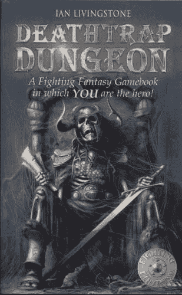

[**Choose your adventure wisely traveler!**](https://amzn.to/2FaSz1q)

许多战士已经走到了黑暗的尽头，因为他们没有注意到这些神圣智慧的话语:

没有哪本书会神奇地让你成为更好的交易者。

当然，我们喜欢相信隐藏着巨大的秘密，如果我们能得到它们，一切都会在瞬间改变！

这不是真的。

但是并没有失去一切！

书籍绝对能够并且确实有所帮助！

最好的书包含了多年经验的智慧结晶。即使你在阅读时不能理解你所读的一切，这些想法也会在你的潜意识中生根发芽，随着时间的推移它们会成长开花。

尽管如此，阅读只是开始。

书籍可以指明方向，但不能带你去那里。去某个地方的唯一方法就是去那里。

我们通过实践学得最好。

回想一下你小时候第一次学骑自行车的时候。也许你看了你的朋友或你的哥哥或姐姐一会儿？你试图理解模式。然后你进入了第二阶段。当你学习平衡时，你的妈妈或爸爸在你的自行车上放上辅助轮，和你一起跑。这有助于你在比赛中获得自信，但你不知道这是一种虚假的自信。

最终训练轮脱落了。

妈妈紧张地往后站，让你走。你只能靠自己了。

也许有一小会儿你设法保持直立，第一次独自向前，风吹动你的头发。

然后你最害怕的事情发生了。

你撞车了。

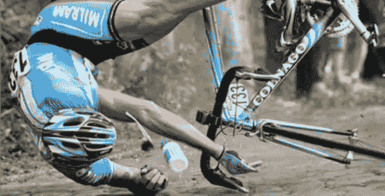

也许你像我一样擦伤了膝盖或者打碎了一颗牙齿？就在你发誓再也不骑自行车之后。

但你做到了。

那段记忆的痛苦伴随着你。它让你保持专注，因为你不想再感受那种痛苦。你的痛苦成了你的动力。

对那场车祸说声谢谢。这是发生在你身上最好的事情。没有什么比擦枪走火更能教会你骑自行车了。

**我们生活中的挫折是我们最好的老师。**

交易也是如此。直到你爬上竞技场，赢了钱又输了钱，一切才有意义。

第二个警告:这些书中有些是非传统的选择。并不是所有的都和交易直接相关。

**那是因为交易不仅仅是交易。**

交易就是思考。这是关于冒险。

但最重要的是，它让你比其他人更清楚地看到这个世界。

你必须看到事情的真相，才能做出正确的选择。

如果你认为苹果是香蕉，你就不会走得太远。

也许你肯定你能看到苹果中的苹果，但大多数人只在脑海中看到电影，而不是真实的现实。突破想象中的现实，到达另一边的真实世界，这是伟大的圣人和伟大的交易者的道路。

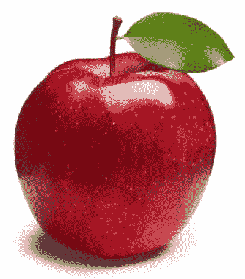

Not a banana no matter how many people tell you it is.

这听起来很容易，但事实并非如此，所以这份清单上的一些书在这里[教你更清晰地思考](https://hackernoon.com/five-steps-to-crystal-clear-thinking-6e94372789af)。

最后，我注意到我的很多学生问我要一本又一本的书。他们读完一本，还想再读十本。我理解这种渴望，但少即是多。

一旦你找到了一本真正引起共鸣的书，再次进入舞台，尝试你的新想法。

与它的智慧坐一会儿。用它工作。把它的智慧变成你自己的。

随着年龄的增长，我开始寻求信息的清晰性，而不是信息量。你可以读一千本关于交易的书，但是如果里面都是没有用的废话，你不会比刚开始的时候过得更好。

好了，这就是所有的免责声明，让我们开始吧。

# **书籍，排名不分先后**

## **1)**[**One Up On Wall Street:如何利用你已经知道的东西在市场上赚钱**](https://amzn.to/2J608ZK) **《彼得·林奇**

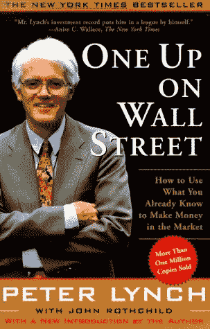

这本经典是我读过的第一本交易书籍。它在某些方面已经过时，但在其他方面仍然很出色。如果你是一个长期交易者，这本书会帮助你找出赢家，就像他们是 Tanqueray 一样。

大多数人认为最好的交易者是数学天才，但事实并非总是如此。

我注意到许多顶尖的市场杀手都有着不同的背景。他们数学很差，或者只在直觉层面上有粗略的了解。他们倾向于尝试很多事情，有曲折的早期职业生涯和广泛的学习。这使他们成为跨学科的思想家。他们看到了其他人忽略的东西，这是市场成功的关键。

在管理历史上最成功的基金之一之前，林奇是一名普通的文科学生。他擅长在别人之前发现高增长股票。

自从他交易以来，很多事情都变了。他承认自己是个技术恐惧症患者，讨厌电脑。今天没有人不用电脑交易。现在你在战场上的很多对手都是电脑。没有人需要申请。

市场上的专业人士比以往任何时候都多，这意味着我们面对的是更聪明的敌人。但是他带来的许多常识在今天和 80 年代初一样适用。

最重要的是，林奇专注于利用你所知道的来做决定。他培养了强烈的好奇心，密切关注周围的世界。如果他的妻子或孩子带着一个崭新的购物袋回家，他想知道一些事情。如果他发现在他的区域出现了许多商店，他就开始挖掘。

如今，信息流动的速度快得多，要找到一家投资者从未听说过的商店似乎是不可能的，但这并非不可能。很多人挣扎着看未来。除非某样东西已经很大很受欢迎，否则他们无法想象它会像火箭一样起飞。但如果你想找到高增长股票，你必须培养一种强烈的愿望，看看未来会发生什么，并在其他人之前找到它。

## 2)[**技术分析与股市利润**](https://amzn.to/2HdNzuU)**理查德·w·沙巴克著**

**这里我们有另一个经典，告诉你如何在图表上画漂亮的线条。它是唯一一本由专业交易者和彼得·布兰特老师推荐的 TA 书籍。**

**彼得有时与加密社区有争议的关系，因为一些忘恩负义和傲慢的年轻交易者开始称他为骗子，因为他称加密泡沫为流行。太荒谬了。他认为比特币在 800 美元时上涨，并一直持有，直到它跌至 18000 美元。他证明了经典图表的力量，那些让他出局的傻瓜现在破产了，退出了市场。**

**简单地说，你不能做 30 年的交易者，也不知道你在做什么。**

**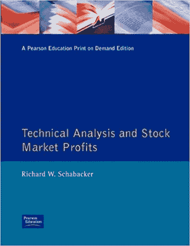**

**关于这本书有几件事需要注意。首先是没有电子书版本。这是不幸的，但尽管它的学术价格点，它仍然值得在你的交易工具箱中占有一席之地。如果你不能在一本书上花 50 美元，你就没有理由在市场上花几千美元。**

**你会注意到的第二件事是这本书很古老。它于 1932 年出版，第二版于 1937 年上市。**

**你可能已经在想八十年后它是否仍然成立？很难相信，在当今复杂的电脑主导的交易市场中，它仍然有意义。**

**但是事情越是变化，就越是一成不变。**

**即使在 19 世纪，最优秀的交易者也经常回去研究市场，因为市场定期展示出一次又一次的循环。**

**这本书与密码交易员特别相关。精明的读者会马上注意到出版日期。就在历史上最大的市场崩溃年之后，[黑色星期四，1929 年 10 月 24 日](https://www.thebalance.com/stock-market-crash-of-1929-causes-effects-and-facts-3305891)，为期四天的血腥屠杀开始了，市场损失了 300 亿美元，相当于今天的近 4000 亿美元，总额超过了一战的成本。**

**当人们说密码市场疯狂时，他们什么也没看到。**

**研究真正疯狂的崩盘时期和随后的大萧条时期的股票走势，是对真实波动性的研究，它看起来非常像今天秘密市场的疯狂高点和低点。**

## **3)[**内幕人士买入超级股票:我如何在 28 个月内将 4.6 万美元变成 680 万美元(14.972%)的超级定律**](http://amzn.to/2D6OKuP)**杰西·c·斯汀著****

****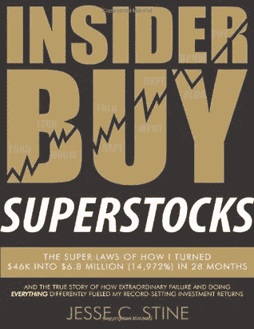****

****毫无疑问，我最喜欢的关于交易的书是 [**内幕人士买入超级股票**](http://amzn.to/2D6OKuP) 。作者在常规市场赚了数百万，这种回报在现代加密和外汇市场之外很少见。这是我现在的圣经，也是任何好的交易教育的基础。这对任何人来说都是绝对必须购买的。****

****这本书最重要的部分带你了解作者的心理和他早期的重大得失。它涵盖了一个交易者的完整旅程，从疯狂的高点到最低的低点，就像我在文章《传奇交易者的八重路径**中描述的那样。******

******在你进入单个图表之前，他通过交易者的心态讲述了如何应对在疯狂市场的混乱风暴中冒险投资带来的情绪波动。******

******但是不要担心，他确实在几个拥挤的章节里做了图表，这些章节比大多数关于技术分析的长篇大论要好。他融合了一些基本分析和助教来推测他的策略，这在每一个精心选择的例子中都有体现。******

******如果你能学会这几章，你可能永远不需要另外一本助教的书。******

********最后，他讲述了有史以来最重要的章节之一:********

********如何销售。********

******很少有书涉及销售。作者持有了 5 到 9 个月，因为一只股票从基础变成了超级新星，但他确实卖出了。******

******销售可能是交易中最被低估的技能。******

******人们天生就能挺过所有的逆境，因为在精神上我们仍处于狩猎采集的水平，拼命想找到下一餐。交易是反直觉的，它迫使我们违背自己的本性，骑在我们的赢家身上，而不是立即把它们储存起来，很久很久以后再出场。没有哪本书比超级库存更能说明什么时候卖得好。******

## ******4)[**金融市场的技术分析**](https://amzn.to/2EXMFRr)**作者约翰·J·墨菲********

********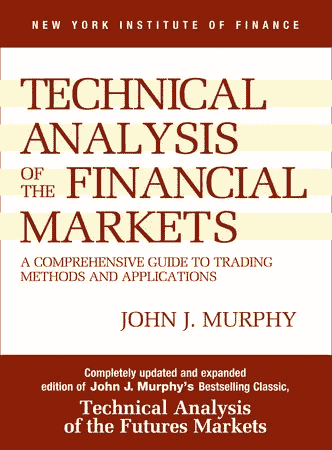********

********我不同意彼得·勃兰特的观点，你所需要的只是沙巴克关于 TA 的书。********

********虽然这是一本令人惊叹的书，值得在你的万神殿中占有一席之地，但它的缺点是它非常非常古老，而且背后没有数学。他们当时没有电脑，所以他们没有办法运行复杂的统计数据来查看他们的观察是否经得起审查。第二个大问题来自它的年龄。图片少了很多。当时在书中制作图片的成本很高，所以我们得到了大量的文本，而不是我们想要或需要的那么多图表。********

********这就是这本书登场的地方。这是有史以来最全面的一本关于 TA 的书。它充满了一个又一个模式和足够的统计数据，让你的眼睛流血。我建议每个人从头到尾读一遍。********

********然后很快就忘记了大部分。********

********为什么？********

********最令人吃惊的是，这些模式中有多少一次又一次地失败了，或者仅仅给你一个抛硬币的优势。这本书给你的是深度挖掘和深入研究自己喜欢的模式的能力。********

********它们站得住脚吗？********

********随着时间的推移，这真的会产生吗？********

********有没有其他更好更准确的模式？********

********我的建议是以开放的心态去经历这一切。读完之后，你会头晕目眩，不知所措，看到不存在的图案。********

********这时你会意识到是时候简化并专注于少数几种对你有效的模式了。********

********你不需要煮沸海洋。专注于支撑线、阻力线和趋势线，也许还有其他一些形成良好的模式，你就能在交易中获得更多利润。********

## ********5) **二对一:** [**海龟之道**](http://amzn.to/2CSuNeA) **和**[**完整的海龟操盘手**](http://amzn.to/2CEOFNR)********

********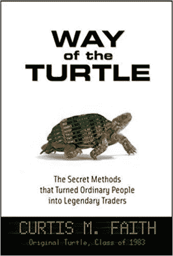********

********这里有两本书，我在不同的文章中推荐过几次。这两本书都值得一读，因为它们对同一个现实提供了不同的视角。********

********因为我已经多次谈到海龟，所以我不会在这里浪费更多的笔墨来重温它们不可思议的故事，但是我建议你自己去读一读。********

********第一本书是《海龟之道》,最初的海龟之一柯蒂斯·费思写的把普通人变成传奇交易者的秘密方法。是理解市场心理的杰作。仅仅攻克进场和出场的基本面是不够的。更重要的是控制你的情绪和你以极大的耐心展望未来的能力。********

********交易有一个铁一般的规则:********

********要掌握交易，你必须掌握自己。********

********还有那本书的配套书，《完整的海龟交易者》 ,作者迈克尔·w·科维尔广泛研究了海龟的故事。虽然《海龟之路》更多的是关于情感之旅，但 Covel 关注的是他们的机械交易系统，这是一套启发式规则，旨在消除交易中的情感，让统计数据对你有利。********

********在这本书里，科韦尔对柯蒂斯·费思持更怀疑的态度，所以它和《T4》中的海龟之路形成了鲜明的对比。他提出了一个很好的例子，费思是一个不守规则的外卡，他得到了特殊待遇，而其他交易者应该得到更多的信任。********

********很难说出真相到底在哪里，但很可能在两者之间，所以最好自己解决，因为没有正确或错误的答案。********

## ********6)“[**趋势跟随:如何在牛市、熊市、黑天鹅市场发财**](http://amzn.to/2m4VWj6)**”**迈克尔·科维尔著********

******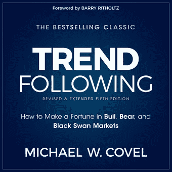******

******Covel 是这份名单上有两本书的两位作者之一。 [**趋势跟随:如何在牛、熊、黑天鹅市场发财**](http://amzn.to/2m4VWj6) 远远超越海龟，看看其他在市场上大赚了一笔的奇幻趋势跟随。******

******趋势跟踪是一种非常特殊的交易方式，它不试图预测市场的反转。它只是看起来确认它们并运行它们。让别人去搞清楚比特币是要去 11000 美元、8000 美元还是 4000 美元。趋势跟踪者只是在火箭掉头后跳回来，或者在下跌时做空。******

******这本书更多的是关于交易的心态和机制。你在这里找不到任何关于突破、趋势线或图表模式的细节。相反，你会发现是什么让最好的头脑在交易中运转。Covel 是一个伟大的作家，他用数据支持他的大量研究，你可以自己跟进。******

## ******7)[**市场奇才**](https://amzn.to/2qKhJPh)**[**新市场奇才**](https://amzn.to/2HPihvH)********

********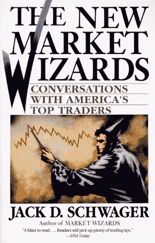********

********这里我们又有两本书，都是杰克·D·施瓦格写的。两篇文章都是对史上最传奇的交易者的采访，第一篇写于算法和计算机化交易兴起之前的 80 年代，第二篇写于 90 年代的一批新的数字交易者。********

********这两本书充满了智慧。********

********一些交易者对他们的系统很谨慎和封闭，但是大多数交易者对他们的成功和失败都很开放。你会学到各种各样的交易风格。在一次采访中，你会看到一个交易者称趋势跟踪为死亡，另一个交易者称它为山丘之王。********

********没有人知道所有的答案。********

********交易荣耀的道路不止一条。在这里，你会发现强迫症的风险经理，自由转动的弹弓，和狂热的数学定量分析师。********

********这两本书提供了很好的对比。在第一集里，你采访了理查德·丹尼斯，敢于冒险的海龟们的领袖；在另一集里，你采访了他冷静沉着的搭档，威廉·埃克哈特，他们系统背后的数学天才。至少可以说这是一对奇怪的组合，但很容易理解为什么这种鲜明的对比造就了一支摇滚明星球队。********

********这些书是各种交易者的必读书籍。无论你是交易外汇、密码、货币、商品、国债还是股票，这里都有一些东西可以帮助你理解可以带你到达山顶的心态。********

## ********8)[**卖出和卖空**](https://amzn.to/2vqdoXg)**作者亚历山大·艾尔德**********

********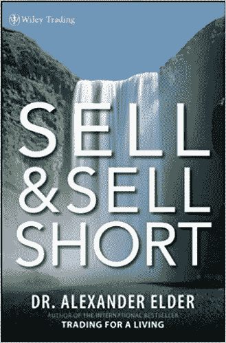********

********这个和罐头上写的一模一样。很多交易者问我关于保证金交易和卖空的机制。这本书涵盖了所有你需要了解的关于卖空的知识，以及你为什么要交易市场的涨跌。********

********这并不适合所有人，尤其是如果你只想买入并长期持有，但如果你想学习交易，你最好学会卖空。********

********如果不交易下跌趋势，当市场连续几个月完全进入熊市时，你别无选择，只能眼睁睁地看着你的利润蒸发或袖手旁观，正如我们在 2017 年 12 月至 2018 年 3 月的加密市场中看到的那样。********

********当其他人都在流血而死的时候，卖空帮助你获利，这是你学习如何快速杀人的地方。********

## ********9)[**批判性思维:行之有效的提高决策技巧、增加直觉和更聪明思考的策略！**](https://amzn.to/2qJsEJc)**西蒙·布拉德利和妮可·普莱斯著**********

********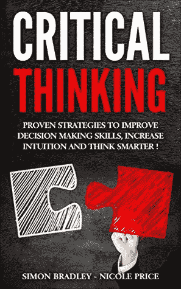********

********我以前说过，现在我要再说一遍，生活中最被低估和最基本的技能是批判性思维。********

********如果你只是把你学到的一切当作表面价值，你就没有机会成为成功的交易者。坦率地说，没有批判性思维，你不可能在任何事情上取得成功。********

**********什么是批判性思维？**********

**********很简单:质疑一切。**********

********仅仅因为我告诉了你一些事情，我看起来像一个聪明人，并不意味着你应该简单地接受我说的任何事情，而不亲自检查所有的证据。********

********用你自己的头脑。用你自己的眼睛看。自己看，自己做决定。********

********我们在生活中被灌输了很多废话，而大多数人把这些废话当成事实，甚至都懒得做一点后续工作。他们不为自己着想。他们让别人替他们思考。那是优秀交易者的死亡。********

********仅仅吸取 Twitter 上一群人的意见并就此收工是不够的。********

********你必须为自己想出办法，当你能做到这一点时，你就已经走在让自己成为一个强者的路上了。********

## ********10)****阿里·阿尔莫萨维著************

********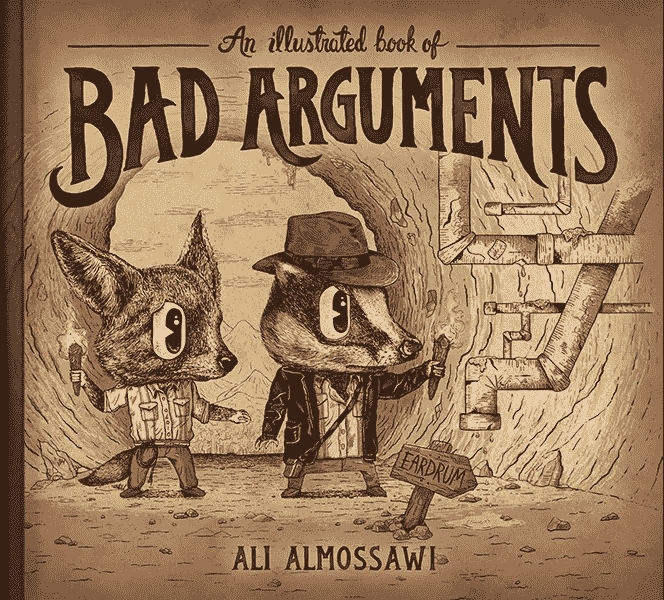********

********这本书是关于从你的思维中消除逻辑谬误的。********

********什么是逻辑谬误？********

********听任何一位政治家讲十分钟，你可能会在这么短的时间内听到 20 位。********

********谬误的思维大多数时候是糟糕的思维。用垃圾论点操纵意志薄弱的人很容易，但如果你想在市场中挑选赢家和输家，你需要学会透过操纵论点的面纱看到真相的曙光。********

********这说起来容易做起来难。********

********每个人都容易用歪理邪说来思考，我也是。从我们的金属湿件中消除这种想法几乎是不可能的，但我们可以最小化它的影响，并认识到我们何时陷入了懒惰和软弱的思维陷阱，这样我们就可以超越它，找到更强大的基础。********

## ********10)[**构建成功的算法交易系统:一个交易者从数据挖掘到蒙特卡洛模拟再到现场交易的旅程**](https://amzn.to/2JWxxHB)**作者凯文·戴维**********

********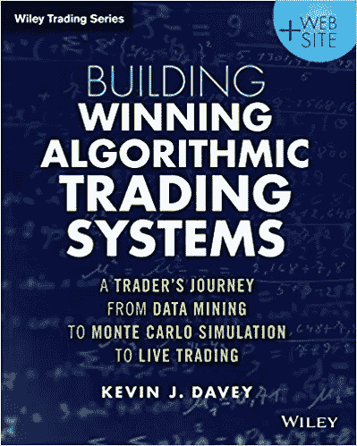********

********我目前正和一个团队一起构建一个自动交易平台，这本书帮助我们找到了测试任何系统的正确方法。********

********这是最先进的。********

********当我们试图创造一个交易策略时，我们经常测试它是完全错误的。几乎每个人都建立了一个系统，然后用[曲线来拟合过去的数据](/@mikeharrisNY/curve-fitting-and-optimization-in-trading-strategy-development-90fa4a8b3507)。这使得它变得脆弱，当它面临完全不同的交易环境时，它将无法生存。********

********这本书回顾了人们发现的所有正确测试系统的方法，从[向前走分析](http://systemtradersuccess.com/what-is-walk-forward-optimization/)到[蒙特卡洛模拟](http://www.futuresmag.com/2014/09/30/building-trading-strategy-after-testing-and-optimization)。这些方法中的每一种都是使您的系统灵活并为任何情况做好准备的基本方法。********

********没有一个系统可以在每种情况下都表现完美，但是对它进行适当的测试可以确保它能够在数百万种恶劣的环境中生存下来，就像一只[极端生物](https://www.care2.com/causes/5-creatures-that-can-survive-the-most-extreme-conditions.html) e 能够在炽热的熔岩中顺利游动。********

********如果你打算让电脑在没有你参与的情况下交易你的钱，那么在你把它放到数字交易大厅之前，你有责任让这个系统运转得尽善尽美。********

## ********11)“[**《概率救生员:你需要的所有工具了解机遇**](https://amzn.to/2qN65U6)**”**作者斯蒂芬·J·米勒********

******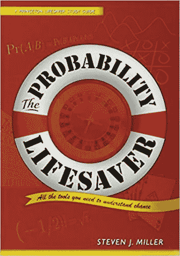******

******我们大多数人没有受过概率和统计的训练。如果你像我小时候一样在数学课上作弊，那么你就错过了交易难题的一个关键部分。******

******我讨厌数学，因为我的老师从来没有把它应用到现实世界中。但是随着年龄的增长和对人工智能的研究，我意识到那不是我，而是我被教导的方式。******

******你不需要知道所有关于那些有趣的数学曲线来理解交易，但是了解机会的本质和机会游戏如何工作的良好背景将帮助你超越大多数交易者的弱点，他们对数学如何在市场上对你有利或不利一无所知。******

******这本小书简单易懂，使用了大量的实际例子来说明。也许你永远也不会在华尔街找到一份量化分析师的工作，但你不会再犯和羊群一样的错误，这是通往交易大师之路的又一步。******

## ******12)[**前二十个小时，如何快速学习**](https://amzn.to/2JYerRs)**乔希·考夫曼著********

********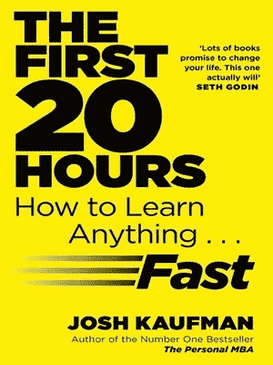********

********最后但同样重要的是，我们有一本关于如何学习的书。很多人问我如何学得更快更好。********

********我曾经认为这是一个疯狂的问题，但后来我意识到，大多数人没有被教会如何思考，只有思考什么。********

********差别很大。********

********我们如何去学习和尝试新事物会让世界变得不同。这就是这本书的内容。********

********忘掉两万小时规则吧。你一生只有时间掌握几样东西。********

********一天和一年只有这么多时间。你想更快地掌握其余的事情，这本小黄皮书将告诉你如何去做。********

********最重要的是，学习就是玩耍。********

********你想尝试，尝试很多事情，并且尝试得很快。********

********不要陷入困境，也不要放弃。快速失败，打破东西。弄脏你的手。********

********这是了解一个全新的想法、概念或技能的唯一方法。没有捷径可走，你必须用每一项新技能做到这一点，所以开始学习如何学习吧。********

# **********把一切带回家**********

******也许你已经读过这些书中的一些，错过了另外一些？******

******有些甚至会让你大吃一惊。没关系。******

************

******伟大交易者的标志是快速，灵活的思维。******

******你需要综合大量的信息，并做出决定，在残酷的零和游戏中智胜、持久并超越你的竞争对手，这种游戏不需要囚犯，也不在乎你是否会失去钱包中的每一只聪。******

******但是如果你努力学习，进入竞技场，开始战斗，边走边学，改变，适应，调整，那么你就有机会在生活和金钱的游戏中获胜。******

******这不容易，但可行。******

******成功的基础是好奇心。让自己成为终身学习者。一直读到眼睛流血。吸取过去的智慧，然后把它变成你自己的。******

******成功与否取决于你自己。没有人能替你做这件事。******

******但你并不孤单。时代的智慧就在那里，只等你去捡。没有秘密。就在你面前。******

******你要做的就是伸出手抓住它。******

******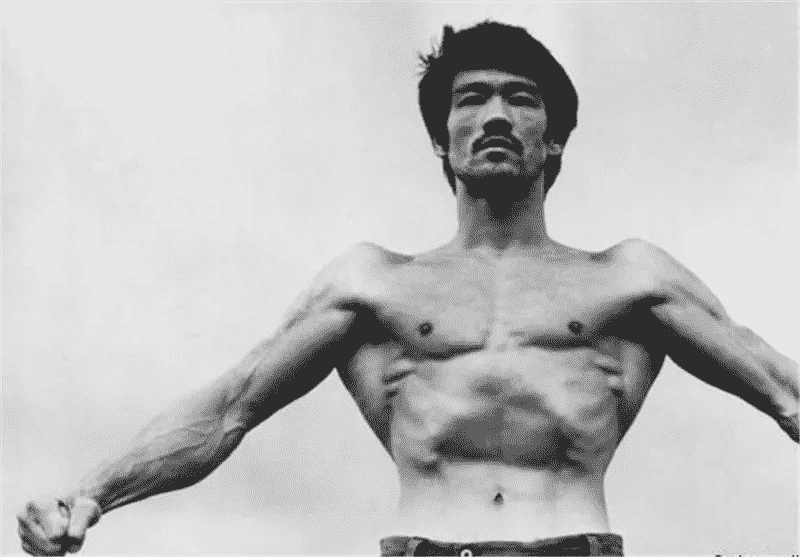******

******Be like water, my friend. You put water in the cup it become the cup.******

******###########################################******

## ******我有一个新的播客， [**每日邮报**](http://dailyposthuman.com/) **，涵盖了密码、人工智能、科技、未来、历史、社会等等**！查看我最著名的文章和观点的扩展报道。上 RSS 频道，不要错过任何一集，请在接下来的几个月里关注一些非常特别的嘉宾！******

************

******###########################################******

## ******如果你喜欢我的作品，请访问我的个人主页，因为这是我与所有粉丝分享特别见解的地方。顶级赞助人可以独家访问传奇的硬币表 Discord，在这里您可以找到:******

*   ********市场来电**来自我和其他专业技术分析大师。******
*   ******进入**投币人**专用**私聊**。******
*   ********幕后**看看我和其他专业人士是如何解读市场的。******
*   ********你还可以独家参加每月一次的虚拟聚会**，在那里我会分享我正在做的一切，让你看看我的幕后工作过程。******
*   ******我会跟踪每一次与**的谈话。问我任何问题，我都会回答。********

******###########################################******

## ******我将在迪拜的 [Futurama 会议](https://goo.gl/Mq2g3Z)上与 John McAfee、Brock Pierce 和其他密码界的杰出人士一起演讲。出来，看我谈论人工智能，加密和未来的金钱和社会，同时有一个令人难以置信的时间这样做。使用我的链接立即获得 20%的折扣，因为谁不喜欢折扣！******

************

******############################################******

******我也在一个全新的群中分享我的 TA，这个群拥有一些世界上最大最差的交易者: [**密码山**](https://discord.gg/X2nY7JJ) 。******

******来谈谈交易、研究、基本面，并与迷人的人建立联系。******

******############################################******

******你也可以在 [**DecStack 停下来，这是加密货币和分散式应用项目**](http://decstack.com/) 的虚拟合作点，在这里你可以接触多个项目。永远完全免费。只是进来和社交，一起工作，分享代码和想法。通过反馈让你的想法更好。寻找新朋友。见见你的新家人。******

******############################################******

************

******[Photo credit](https://extranewsfeed.com/the-winds-of-world-war-iii-8bc369584f67)******

******关于我:我是一名作家、工程师和连续创业者。在过去的二十年中，我涉及了从 Linux 到虚拟化和容器的广泛技术。******

*******你可以看看我的最新小说，* [***一部史诗般的中国科幻内战传奇***](http://amzn.to/2gAg249) *在这部小说中，中国挣脱了共产主义的枷锁，成为世界上第一个直接民主国家，运行着一个高度先进、人工智能的去中心化应用平台，没有领导人。*******

## ******当你加入我的读者群，你可以免费得到一本我的第一部小说《蝎子游戏》。读者称之为“神经癌的第一次严重竞争”和“黑色侦探会见约翰尼记忆术。”******

******############################################******

## ******最后，你可以[加入我的私人脸书小组，Nanopunk Posthuman 刺客](https://www.facebook.com/groups/1736763229929363/)，在这里我们讨论所有的科技、科幻、幻想等等。******

******############################################******