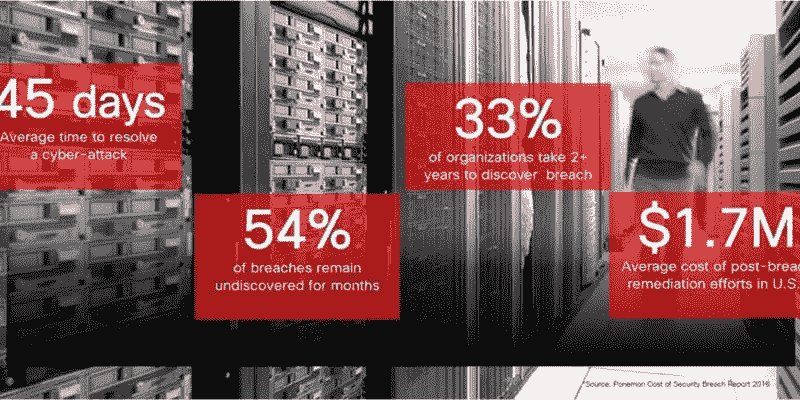
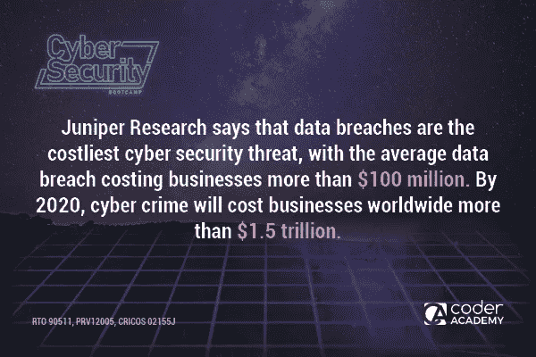
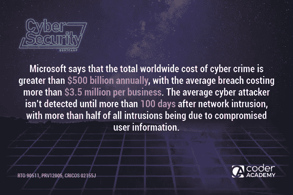
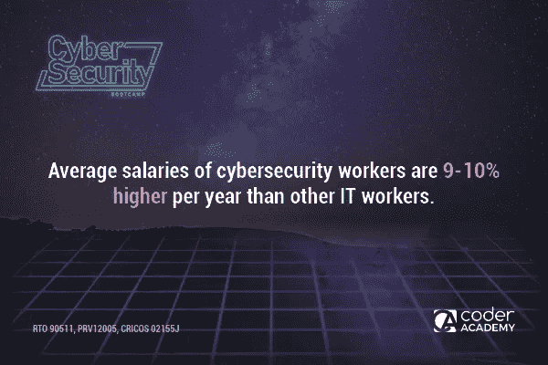

# 对网络安全人才日益增长的需求

> 原文：<https://medium.com/hackernoon/the-growing-demand-for-cyber-security-talent-c9f74897636>

尽管信息时代带来了许多好东西，但它也带来了我们每天都必须面对的网络安全挑战。

今天，即使在最偏远的地区，也有数百万人能够访问互联网。但这也带来了代价高昂的后果。

这个场景太熟悉了:你把你的个人数据上传到一个保证用户最大安全的网站，结果却被你生活中最大的震惊惊醒。某处有人匿名使用你的图像和个人信息欺骗公众，可悲的是，你对此无能为力。

此外，来自拥有私人数据的**黑客行动主义者的威胁以及银行因黑客而损失数百万的消息已经变得司空见惯。这些网络犯罪大多通过网站进行。它可以从一个简单的从网页下载文件的行为开始，在不知道你被攻击的情况下，你的手机电池开始过热，窗口开始闪烁，你发现自己处于完全失控的危险境地。**

**在本帖中，我们将与您分享网络安全专家需求飙升的主要原因。但首先，以下几点值得注意:**

# **关于网络威胁的普遍性，研究表明了什么？**

**不同研究小组的发现揭示了令人震惊的在线犯罪浪潮的细节，这种犯罪正在使世界不同地区的可用 IT 资源不堪重负。根据普华永道的【2017 年全球信息和安全状况(GSIS)调查，公司越来越多地投资于网络安全人才，希望他们能够一劳永逸地遏制威胁。这项研究的范围非常广泛，涉及 122 个不同国家 75 个行业的 95，000 名受访者。**

**Harvey/Nash KPMG 对首席信息官进行的一项调查对这个问题进行了更深入的研究，调查内容是公司为了加强其计算机安全系统而寻找的技能组合。他们的发现表明，最受欢迎的专家是数据分析师，他们的角色跨越一系列安全管理任务。结果是网络安全专家的高薪从 70，000 美元到 250，000 美元不等，这不仅是因为人才供应只有 25%，还因为这项任务的微妙性质。**

****

# **公司愿意支付更多**

**GSIS 的研究结果指出，虽然许多企业依赖内部网络安全专业人员，但他们仍然通过外包给 IT 公司来寻求同样的服务。网络犯罪分子试图破坏安全系统的速度也随着企业愿意为获得技术人才支付的额外津贴的增加而提高。这是网络安全需求持续增长的另一个指标。**

****

# **用户数据的保护**

**随着客户越来越担心他们的个人数据，GSIS 研究进一步考虑了世界各地首席执行官的意见，特别是他们对此正在做什么。**

**现在，我们生活在一个数据驱动的社会中，隐私泄露在全球范围内呈上升趋势，信任已成为首席执行官的一个重要考虑因素。人们意识到数据泄露有时是内部工作，涉及内部网络安全人员和数据挖掘公司，这一点也变得很明显(特别是在震惊脸书的剑桥分析公司丑闻之后)。这意味着，即使网络安全专业人员供不应求，公司也必须首先确保他们为网络安全职位聘用的人员的诚信。**

****

# **网络安全工作的类型**

**虽然在线安全问题属于大多数公司的 IT 部门，但并不是每个了解安全使用网络的人都适合处理像网络犯罪这样微妙的问题。网络安全工作要求包括但不限于，对 IT 领域的新问题有深刻的理解，在威胁检测方面接受过适当的培训，并了解网络边界和攻击媒介。**

**网络安全工作的例子包括:**

*   **数据和信息系统分析师。**
*   **安全经理，他们实施适当的策略和程序，并负责威胁管理策略。**
*   **开发运营工程师，他们的工作包括监控在线安全威胁。**

****

****网络安全不仅限于这三种类型的工作，这个领域对新的和有经验的人才来说充满了机会。如果你正在考虑从事网络安全方面的职业，请点击这里查看编码器学院的新** [**网络安全训练营**](https://coderacademy.edu.au/cyber-security-bootcamp) **。****

****关于作者:** Emily Watts 是全球著名的学术援助公司 [australia writings](https://australianwritings.com.au/essay-writing-service) 的自由博客作者和作家。在加入这家公司之前，Emily 曾为各种博客和网站撰写出版物。她的文章在读者中获得的成功激发了艾米丽创建自己的博客。**