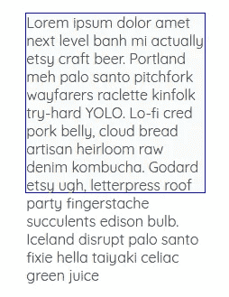
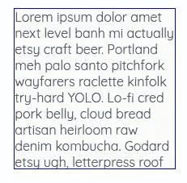
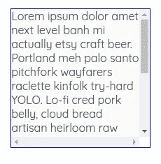
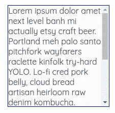

# CSS 溢出属性指南

> 原文：<https://medium.com/hackernoon/the-guide-to-css-overflow-property-5a3a91ae40f0>

**CSS 溢出**属性指定当内容**太大**而无法放入容器盒时该做什么。它指定了是否应该出现**滚动条**，或者内容是否被**剪切**。

overflow 属性是 overflow-x 和 overflow-y 的简写。overflow-x 属性指定处理水平方向的溢出，而 overflow-y 指定处理垂直方向的溢出。

了解这些的时候，多了解一点[定位](https://kolosek.com/css-position-relative-vs-position-absolute/)的知识是很有用的。

# 价值观念

溢出属性可以有不同的值:

*   **可见** —内容可以在框外呈现，
*   **隐藏** —内容被剪切，不显示滚动条，
*   **滚动** —内容被剪切，必要的滚动条被显示，
*   **自动** —浏览器决定如何处理内容，这可能因浏览器而异，但一般来说，滚动条会根据需要出现。

溢出属性仅适用于**块、内嵌块和表格元素**。

# 句法

以下语法用于定义溢出属性:

```
div { overflow: hidden; }
```

# 例子

现在，让我们用一些例子来支持这个理论。当处理文本时，它应该有一个合适的[格式](https://kolosek.com/css-relative-font-size/)。

超文本标记语言

```
<div>
  <p>Lorem ipsum dolor amet next level banh mi actually etsy craft beer. Portland meh palo santo pitchfork wayfarers raclette kinfolk try-hard YOLO. Lo-fi cred pork belly, cloud bread artisan heirloom raw denim kombucha. Godard etsy ugh, letterpress roof party fingerstache succulents edison bulb. Iceland disrupt palo santo fixie hella taiyaki celiac green juice.</p>
</div>
```

半铸钢ˌ钢性铸铁(Cast Semi-Steel)

```
div {
  height: 200px;
  width: 200px;
  border: solid thin blue;
  background-color: #fafafa;
  overflow: visible;
}
```



在上面的例子中，我已经将**溢出设置为可见**，内容**溢出**到容器盒外。

超文本标记语言

```
<div>
  <p>Lorem ipsum dolor amet next level banh mi actually etsy craft beer. Portland meh palo santo pitchfork wayfarers raclette kinfolk try-hard YOLO. Lo-fi cred pork belly, cloud bread artisan heirloom raw denim kombucha. Godard etsy ugh, letterpress roof party fingerstache succulents edison bulb. Iceland disrupt palo santo fixie hella taiyaki celiac green juice.</p>
</div>
```

半铸钢ˌ钢性铸铁(Cast Semi-Steel)

```
div {
  height: 200px;
  width: 200px;
  border: solid thin blue;
  background-color: #fafafa;
  overflow: hidden;
}
```



在第二个例子中，我将**溢出属性设置为隐藏的**。内容是**剪辑过的**和**没有滚动条**可见。

超文本标记语言

```
<div>
  <p>Lorem ipsum dolor amet next level banh mi actually etsy craft beer. Portland meh palo santo pitchfork wayfarers raclette kinfolk try-hard YOLO. Lo-fi cred pork belly, cloud bread artisan heirloom raw denim kombucha. Godard etsy ugh, letterpress roof party fingerstache succulents edison bulb. Iceland disrupt palo santo fixie hella taiyaki celiac green juice.</p>
</div>
```

半铸钢ˌ钢性铸铁(Cast Semi-Steel)

```
div {
  height: 200px;
  width: 200px;
  border: solid thin blue;
  background-color: #fafafa;
  overflow: scroll;
}
```



在第三个例子中，我已经将**溢出属性设置为滚动**。在这种情况下，内容物**溢出**到容器外，滚动条出现**。**

超文本标记语言

```
<div>
  <p>Lorem ipsum dolor amet next level banh mi actually etsy craft beer. Portland meh palo santo pitchfork wayfarers raclette kinfolk try-hard YOLO. Lo-fi cred pork belly, cloud bread artisan heirloom raw denim kombucha. Godard etsy ugh, letterpress roof party fingerstache succulents edison bulb. Iceland disrupt palo santo fixie hella taiyaki celiac green juice.</p>
</div>
```

半铸钢ˌ钢性铸铁(Cast Semi-Steel)

```
div {
  height: 200px;
  width: 200px;
  border: solid thin blue;
  background-color: #fafafa;
  overflow-y: scroll;
  overflow-x: hidden;
}
```



最后，您可以看到 **overflow-y** 属性的用法。你只看到**垂直滚动条可见**，而**水平滚动条被隐藏**。

在这篇简短的教程中，我解释了溢出属性。希望，当你开始下一个项目时，它会有所帮助。

感谢您的阅读！

*原载于 2018 年 5 月 7 日*[*kolosek.com*](https://kolosek.com/css-overflow/?utm_source=me)*。*