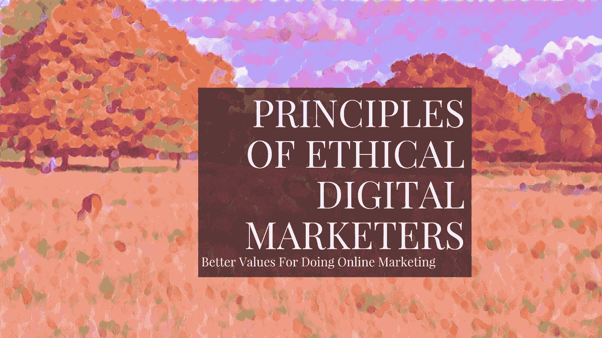
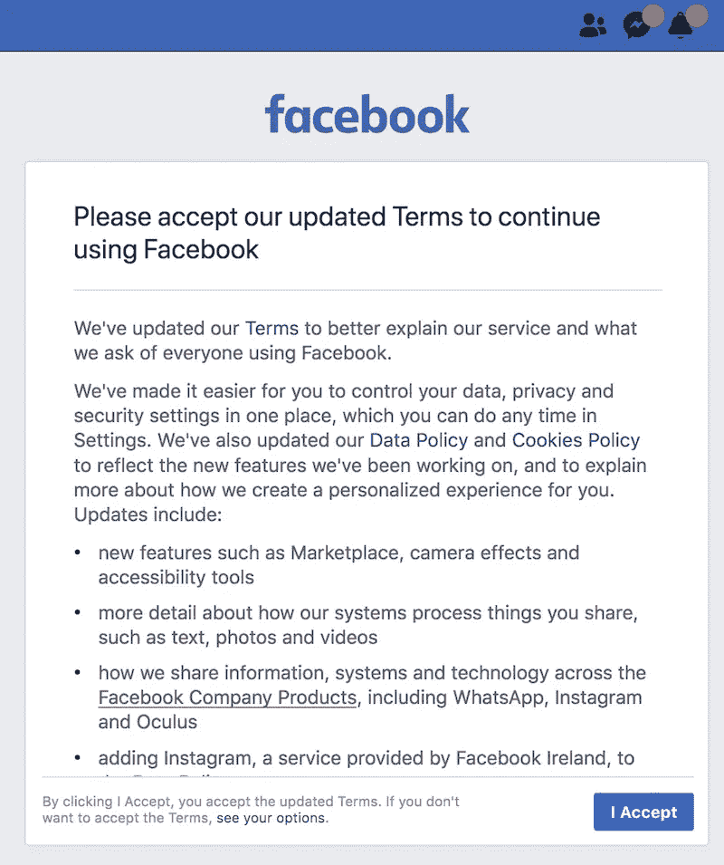

# 道德数字营销者的指导原则

> 原文：<https://medium.com/hackernoon/the-guiding-principles-of-an-ethical-digital-marketer-aeb953a56558>

## T 他的网上营销行业被打破了，它的名声不好，而且越来越差。

O 我们的行业充满了营销人员、企业家和开发者，他们的**风格、策略和道德受到数字**的驱动，依靠提取用户数据来推动他们不道德的[商业](https://hackernoon.com/tagged/business)模式。

*   增长黑客**以其他一切为代价**
*   建造的目的是转移注意力和**使用户对产品上瘾**
*   建造的目的是**收集数据，出售数据和出售广告**
*   以黑暗模式为特色的设计选择**操纵用户**采取有利于平台而不是他们自己的行动
*   数十个甚至数百个外部第三方脚本**跟踪每个动作**
*   设计中的有意**摩擦**使用户更难退出、取消、编辑设置
*   买卖和收集用户数据，如电子邮件地址，目的是**发送未经请求的大量销售邮件**

# 最著名的公司是最坏的罪犯

一些最著名的公司和在其中工作的人是最坏的罪犯。

谷歌已经背离了它的座右铭和哲学。

关于脸书如何滥用你的信任，你已经听到了你需要知道的一切。列表太长，无法在此列出。

从该公司前产品经理安东尼奥·加西亚·马丁内斯的《混沌猴子》一书中，你可以很好地了解到如今典型的营销人员是如何思考的:

> 在我在脸书的整个职业生涯中，我都卷入了与脸书隐私和法律团队的一场关于我们能做什么和不能做什么的激烈辩论中，消除他们的法律恐惧，并试图找到一些法律规则来原谅(或至少辩护性地原谅)我们下一次对用户数据的掠夺。

这是脸书在他们的设计中引入的一个黑暗图案的最新例子。

焦点在于顶部的假新通知和消息按钮，尽管实际上没有新消息。这个想法是让更多的人冲进去，毫不犹豫地接受他们的侵入性条款。

GDPR 只是他们成长团队的另一个障碍，可以被黑客攻击，以操纵更多用户同意他们可能不想要的东西。不管马克·扎克伯格想让你或参议员们相信什么。

联合利华是最大的网络广告商之一，这是他们的想法:

> *基思·威德(Keith Weed)穿着牛仔裤在他伦敦的办公室里走来走去，他是全球最大的广告客户之一联合利华(Unilever)的营销总监，他描述了手机是如何将数据提升为营销工具的。“现在有了好的老式手机，我有了关于人们的个性化数据。你不需要知道他们的名字。。。你知道他们的电话号码。你知道他们住在哪里，因为这和他们的电脑在同一个地方。”Weed 知道你通常在一天中的什么时间浏览、观看视频、回复电子邮件、去办公室——以及你走什么样的旅行路线。“从你的手机上，我知道你是住在四星级还是二星级酒店，是去火车站还是机场。我将这些见解与你在电脑上浏览的内容结合起来使用。我知道你是对马感兴趣还是对去加勒比海度假感兴趣。*

大多数大企业(以及那些试图变大的企业)所持有的核心价值观是财务增长和货币成功。

这种增长是最重要的，我们使用任何战术或战略来实现它。

这吸引了有经济动机的人。这些人很难牺牲短期增长或财务成功来换取用户隐私、尊重和强烈的道德观。

> ***要让一个人理解某件事是很难的，因为他的薪水取决于他对这件事的不理解***

**这就是我们工作的环境。纪律和耐心是不能容忍的。所有好的价值都有成本，被视为障碍，被视为竞争劣势，至少在短期内是如此。**

# **GDPR 让广告变得更加复杂**

**但是我们生活和工作的世界正在慢慢改变。自从通用数据保护条例(GDPR)生效以来，社交媒体和网站广告变得更加复杂。**

**您现在需要获得用户的许可才能收集和使用他们的个人数据。**

**不同网站上的所有 GDPR 公告让我们看到了有多少第三方追踪者在收集我们的数据。**

**比较一下[https://www.usatoday.com/](https://www.usatoday.com/)和[https://eu.usatoday.com/](https://eu.usatoday.com/)。第一个是你现在已经习惯的典型网站。**

**它包括横幅，侵入性广告，它加载缓慢，并使用了大量的数据。**

**在幕后，它加载了许多外部跟踪脚本，这些脚本监视你的一举一动(现场和场外)，了解更多关于你的信息，以便他们可以打断你，向你出售更多你不需要的东西。**

****总共装载了超过 5MB 的垃圾邮件。****

**第二个版本是符合 GDPR 法律的欧盟版本。**

**它赏心悦目，加载速度快，不会占用你太多的数据，不会推送你不想看到的侵扰性广告，也不会在后台加载任何跟踪脚本。**

**GDPR 友好版本的总大小为 500KB。**

**它的访问令人耳目一新，有很好的用户体验，在大的数字广告革命之前，几乎整个网络都是这样。**

**有了新的想法和更好的商业模式，我希望我们可以回到这种对用户和运营公司都有好处的道德网站。**

# **越来越多的诚信营销者和公司**

**幸运的是，越来越多的营销人员和公司(以及有更多法规支持用户的政治家)都希望让在线营销世界变得更好。**

****他们拥有令人钦佩的特质和品质，并对如何进行营销持有一种新鲜、不那么咄咄逼人的观点**。正直的人。更多的人和公司应该追求的东西。**

**[Doist](https://medium.com/u/788627f2f641?source=post_page-----aeb953a56558--------------------------------) 的 Amir Salihefendic 最近对此发表了自己的看法:**

**[Farnam Street 的 Shane Parrish](https://medium.com/u/4e1546c1a1a1?source=post_page-----aeb953a56558--------------------------------) 最近更新了他的道德和隐私政策，并删除了所有脸书跟踪像素:**

**[凯旺·李](https://medium.com/u/5187e5fad31d?source=post_page-----aeb953a56558--------------------------------)， [Buffer](https://medium.com/u/245d5483fb27?source=post_page-----aeb953a56558--------------------------------) ，[的营销总监也参与其中](http://www.kevanlee.com/my-marketing-philosophy/):**

> **好的营销需要同理心。要真诚。帮助别人。首先提供价值。不要劝。不要卖给别人他们不需要的东西。丰富人们的生活。当他们需要你的时候，做好准备。听着。沟通清楚。无偿给予。最低限度地做广告。寻求许可和庆祝意图。永远说真话。梦想远大。提供高质量。当有疑问时，做一块磁铁而不是一把锤子。**

**下面是 Moz 创始人 Rand Fishkin 的书 [Lost and Founder](https://sparktoro.com/book) 中的一个例子:**

> **“你认为我们应该让取消变得更难吗？”我回答道。“如果你把取消过程改为一个电话，”罗布解释道，“我敢打赌，仅仅摩擦就会提高你的月流失率。另外，你可以在人们取消约会时与他们交谈，更好地了解他们是谁以及他们为什么要离开。你或许也可以留住他们中的很多人，或者在将来把他们重新变成顾客。也许会让一些人转向更便宜的方案，或者说服他们购买与你不同的产品。”我看到了一些支持 Rob 猜测的数据，并告诉了他。“你说得对。使订阅只能通过电话取消可以对流失率产生真正的影响。但是我们都讨厌那些纯粹在线注册后需要打电话取消的服务。他们故意让事情变得困难。它没有同理心，这意味着它不是泰格费。”“很公平，”罗布回答道，“但是你在桌子上留下了很多钱。”“嗯，”我回答说，“我们总是说:如果你愿意牺牲它们来换取金钱，它们就不是核心价值观。”**
> 
> ***在 Moz，我们有六个核心价值观，首字母缩写为 TAGFEE——透明、真实、慷慨、有趣、同理心和例外。这些是我们优先于业务成功或增长的信念。TAGFEE 充当了一个试金石，测试我们是否应该采取行动，雇用或让某人离开团队，或者创建一个流程或政策。我们在日常讨论中使用它，讨论我们放在网站上的内容、我们参与社区的方式、我们开发的产品以及我们采取的内部行动。***

**兰德似乎也在他的新公司中采用了这种方法:**

# **增长黑客不如为人们创造真正的价值**

**这取决于我们创作者、开发者、营销者、设计师和企业家。我们可以把用户友好的网络带回来，我们可以**重新引入一些伟大的原则和价值观**。**

**所有的增长技巧都不如[为人们创造真正的价值](https://howtomakemyblog.com/write-blog-post/)。**

*   ****尊重你试图锁定的观众****
*   **对你正在做的事情坦诚相待**
*   **向你的目标人群提供真正的价值**
*   **给人们提供选项，并让他们明白这些选项**
*   ****征求有兴趣了解更多信息的人的许可****
*   **对不感兴趣的人不要求任何回报**
*   **不要用黑色图案设计欺骗人们接受他们不想接受的东西**
*   ****不要操纵**，劝人，骗人**
*   **不要爱出风头，不要卖人们不需要的东西**

**做出这些大的改变并不容易。你会犯错误，你会失望，你会遇到阻力。**

**从长远来看，你迈出的任何一小步都可能导致重要的变化。你也会更快乐，更有成就感。**

# **我在博客上采取的一些用户友好的步骤**

**我最近在博客上采取的一个步骤是**减少外部脚本的数量**。**

**一个快捷的方法是去掉默认的社交分享按钮，使用一个插件来显示它们，而不需要调用脸书等人的服务器。**

**除了当我嵌入来自其他网站的内容时，我最后剩下的外部脚本是 Google Analytics。我已经关闭了谷歌允许你使用的所有高级追踪选项。**

**我还通过添加[这个小技巧](https://www.jeffalytics.com/gdpr-ip-addresses-google-analytics/)(一段代码)，在谷歌分析中匿名化了我的访问者的 IP 地址:**

> **ga('set '，' anonymizeIp '，true)；**

**这样做只会损失城市数据的一些准确性。其他都没问题。**

**尽管如此，谷歌收集的数据比我需要的要多得多，但没有合适的替代方法。**

**丹尼·范·库腾和保罗·贾维斯正在研究一个更简单可靠的解决方案(Fathom ),当它准备好的时候，我渴望用[代替 GA。](https://usefathom.com/)**

**YouTube 也支持无 cookie 嵌入，所以我在嵌入视频时使用它。**

**另外，我对视频进行了延迟加载，这意味着它们不会加载任何东西(包括外部脚本)，除非你向下滚动到这些区域。这个[也让博客更快](https://howtomakemyblog.com/speed-up-wordpress/)。**

**在我的内容中，我完全专注于提供价值，没有任何空洞的承诺，没有侵入性的广告，没有咄咄逼人的，卑鄙的销售策略，让人们购买可以让他们一夜暴富的秘密。网络上充斥着这些。**

****我所有的内容都是完全免费的。也没有电子邮件捕获。**我不使用任何干扰性的弹出窗口，弹出框之类的东西(也看着你[中](https://medium.com/u/504c7870fdb6?source=post_page-----aeb953a56558--------------------------------))。**

**这些是我已经采取的一些小步骤，当我发现新的想法和替代默认方式时，我会进一步采取这些步骤。**

# **数据收集不应该以牺牲其他一切为代价来驱动你**

**所有这些并不意味着你没有野心。你的公司永远不会成长。你永远不会达到你想要达到的目标。**

**这并不意味着你必须完全忽略营销、战术和数据。数据是有用的，可以帮助你更好地了解你的受众，帮助你创造更好的产品。**

**这些东西可能是有用和有价值的，但它们不应该以牺牲其他一切为代价来驱动你和你的企业。**

**或者用德里克·西弗斯的话说:**

> ***真的，“营销”就是体贴的意思。营销意味着让人们容易注意到你，与你联系，记住你，并告诉他们的朋友关于你的事情。营销意味着倾听人们的需求，并为他们创造出人意料的定制产品。营销意味着了解人们，建立更深层次的联系，并保持联系。所有这些都只是体贴——站在对方的角度看问题，做对他们最有利的事情。***

***原载于 2018 年 5 月 31 日 howtomakemyblog.com***。****