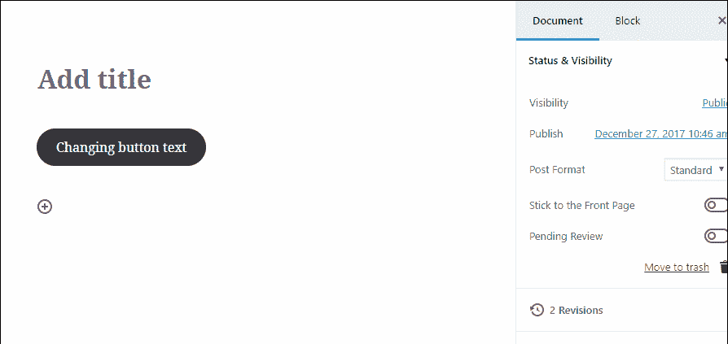
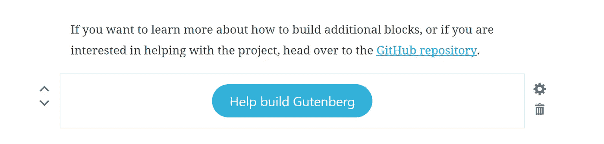

# Gutenberg WordPress 插件:你需要知道什么

> 原文：<https://medium.com/hackernoon/the-gutenberg-wordpress-plugin-what-do-you-need-to-know-8fc9fb040582>

WordPress 上编辑文章和页面的标准方式已经多年没有实质性的变化了。你必须了解 HTML，能够使用短代码，使用各种小工具来让你的 WordPress 帖子和页面看起来像你想要的样子。

与此同时，其他内容创建工具，如 [Medium](https://en.wikipedia.org/wiki/Medium_(website)) 和 Ghost，提供了非常直观和令人耳目一新的内容创建体验。许多人希望在 WordPress 上有一种类似的友好的、所见即所得的体验，这是有充分理由的。幸运的是，WordPress 社区的精英们联合起来共同努力创造了新一代的 WordPress 编辑器，叫做[古腾堡](https://wordpress.org/plugins/gutenberg/)。

在这篇文章中，我们将试图弄清楚 Gutenberg WordPress 插件现在给你带来了什么，以及这个雄心勃勃、影响深远的项目的未来是什么。你同意我们的观点吗？那么，我们开始吧！

# 目录

1.  古滕贝格常识
2.  与古腾堡合作
3.  其他有价值的古登堡特征
4.  兼容性问题
5.  古腾堡的利弊
6.  古腾堡和 WordPress 主题
7.  包扎

# 古滕贝格常识

关于古腾堡编辑器，你应该知道的最重要的事情是什么？我们已经把我们的头缠在这个编辑身上，带给你你应该知道的基本事实。请继续阅读，了解关于古腾堡的所有重要事情。

# 古腾堡是什么？

古腾堡是一个现代的编辑器，意在革新 WordPress 上的内容创建方式。这位编辑的名字让我们回到了 15 世纪，当时约翰内斯·古腾堡第一个用他开创性的印刷机将印刷术引入欧洲。Gutenberg WordPress 编辑器旨在像 Gutenberg 努力更好地改变世界历史一样强烈地影响 WordPress 的世界。

你可能想知道，为什么网上有这么多关于古腾堡的炒作。事实上，Gutenberg 旨在取代预定于 2018 年发布的 **WordPress 5.0** 中默认的 [Tiny MCE](https://codex.wordpress.org/TinyMCE) 内容编辑器。目前，Gutenberg 不是 WordPress 核心的一部分，它的使用是可选的。

处于测试阶段，Gutenberg 还没有准备好支持生产网站上的内容创建过程。尽管如此，该插件已经提供了令人惊叹的内容创建体验，这得益于其新一代的无干扰用户界面。

新旧版本编辑器之间的差异非常明显。对比一下他们的界面就知道了。微型 MCE 编辑器的界面:

古腾堡编辑器界面:

> [**古腾堡或者**](https://crocoblock.com/blog/gutenberg-vs-elementor/) **元素师选哪个？**

# 古腾堡背后是谁？

古腾堡倡议由 WordPress 的联合创始人之一 Matthew Mullenweg 领导。创始人希望在 Gutenberg 与 WordPress 核心合并之前，获得多达 10 万个活跃插件安装和大量反馈。与此同时，他被古腾堡集成到 WordPress 核心后可能带来的潜力所鼓舞。

在他的文章《我们称之为 Gutenberg 是有原因的》中，Mullenweg 称 Gutenberg editor 为**‘WordPress 的下一件大事’**，并预测这个编辑器将推动 WordPress 生态系统的每一部分向前发展。他设想多亏了古腾堡:

*   插件开发者将利用 Gutenberg 块作为他们的无故障入口点，开发更完整、无故障的插件集成。
*   WordPress 主题的创建者不需要开发自定义的所见即所得编辑器，也不需要为他们的主题配备一些高级插件。
*   代码开发人员将能够在现代环境中工作，不再担心长达几十年的向后兼容性。
*   用户将能够建立他们想象中看到的网站。而且，掌握了‘blocks’这个概念，用户会立刻掌握 90%+ WordPress 插件的精髓。

因此，在马特·莫楞威格看来，古腾堡编辑器将会让 WordPress 世界的所有人受益。这会让很多人更容易使用 WordPress 并为其开发。更重要的是，Gutenberg 背后的 [WordPress 团队有着深远的 Gutenberg 开发计划，集成到 WordPress 核心只是第一阶段。在本文的下一部分，让我们来看看 Gutenberg 编辑器发展的里程碑是什么。](https://github.com/WordPress/gutenberg/blob/master/CONTRIBUTORS.md)

# 古腾堡演化的三个阶段

要把古腾堡变成一个一站式的 WordPress 网站建设工具需要付出很多努力。古腾堡的实施可以大致分为以下 3 个主要阶段:

*   第一阶段旨在将古腾堡整合到 WordPress 5.0 中。在这成为可能之前，开发人员正在熟练地创造一种不兼容的后期编辑体验和“块”概念的完美实现。在 Gutenberg 成为核心的一部分之前，向后兼容性的所有主要问题都应该得到解决。
*   一旦古腾堡成为默认的 WordPress 编辑器，第二阶段就会开始。在这个阶段，团队将致力于进一步改进 Gutenberg 提供的帖子和页面编辑体验。此外，他们将结合页面模板的概念。
*   在**阶段 3** 期间，古腾堡有望转变成一种通用的解决方案。它将涵盖网站定制的所有方面，从最基本的到最复杂的。

如你所知， [Gutenberg WordPress 编辑器](https://www.templatemonster.com/blog/gutenberg-wordpress-editor/?aff=hackernoon)在第一阶段的中间。然而，古腾堡在 2017 年的发展速度确实令人鼓舞。插件从 0.1.0 版本升级到 2.2.0 版本只花了 6 个月的时间。此外，Gutenberg 的每个新版本都带来了 bug 修复和急需的编辑器功能的实现，如块嵌套和列块(v 2.2.0)。

# 什么时候？

由于 Gutenberg 打算成为默认的小型 MCE WordPress 编辑器的新一代替代品，所有的 WordPress 用户(根据 w3techs 统计，占所有网站所有者[的 29.9%)都是 Gutenberg 的未来用户。因此，古滕贝格何时被运送到更广泛的观众的问题是非常合乎逻辑的。事实上，马特·莫楞威格估计，大约要到 2018 年 4 月 8 日，古腾堡才准备好接受更广泛的全球观众。](https://w3techs.com/technologies/overview/content_management/all)

在接下来的几个月里，Gutenberg 应该会得到一些新的增强、错误修复和安全更新。此外，编辑器还需要一些好的官方文档，现在还没有。

如果你想了解更多关于古腾堡何时可以在制作网站上使用的信息，请查看 Mullenweg 的“单词状态”地址。

# 与古腾堡合作

# 古腾堡 101:街区

正如我们前面提到的，Gutenberg 插件在为你的网站内容结构提供动力时依赖于块。在 Tiny MCE 中，只有一个内容编辑字段。在 Gutenberg editor 中，该字段分为所需数量的内容块。

这些块可以包含任何类型的网站内容，并保存由兼容的第三方插件呈现的内容。有些人把这些通用块称为“古腾块”。反正这只是花里胡哨的名字。它暗示了在 Gutenberg 编辑器中创建的块在许多方面都是独一无二的。

那么，什么可以构成古腾堡区块呢？几乎任何内容都可以成为一个块。在 Gutenberg 中，您可以使用以下方法创建块:

*   文字。
*   图像。
*   桌子。
*   按钮(如“阅读更多”)。
*   嵌入式视频内容。
*   小部件。

更重要的是，许多第三方插件的开发者将有机会在 Gutenberg 中引入利用插件功能的定制块。

“古腾堡”概念的主要吸引力是什么？你可以忘记一些概念，比如短代码，小工具，和自定义的方式来添加内容到你的 WordPress 网站。一旦 Gutenberg 达到第一阶段的完成，它将提供统一的内容创建体验，其中所有类型的内容都将在块的帮助下进行添加和操作。

最终用户将如何从块结构中受益？这些积木很容易操作。Gutenberg 添加了两个箭头，让您只需点击一下就可以上下移动选定的块:

此外，右侧的控件为您提供了一键访问阻止设置和即时删除阻止的快捷方式:

网站访客会看到区块吗？作为编辑器中帖子/页面的控制构建块，页面/帖子浏览器输出中不存在块。类似地，块在内容的 HTML 版本中没有直接表示。只有古腾堡编辑器能够以适当的方式识别和操作这些块。

总而言之，古腾堡编辑器提供了一个全面的编辑体验，由于总体块结构。事实上，这种体验类似于 Medium platform 提供的体验。一旦用户习惯了，他们很可能会庆祝。

# 了解古腾堡界面

首先，让我们简要介绍一下古腾堡界面:

*   (A)代表“新区块”快捷方式；
*   (B)表示普遍存在的撤销/重做按钮；
*   (с)是“文档”选项卡。它反映了微小的 MCE 编辑器的当前右边栏。在这里，您可以管理内容状态、可见性、类别、标签、特色图片等。；
*   (D)打开所选块的“设置”面板；
*   (E)为您带来“文档”/“块”面板上方的文章预览链接和“发布/更新”按钮；
*   (F)是你要用方块填充的负空间。你可能会注意到，你得到的比微小的 MCE 更多。如此丰富的空白空间提供了现代的、改进的书写体验；

# 创建示例帖子

首先，让我们用 Gutenberg 创建一个简单的帖子。我们将有一个基本的文本帖子，用一张图片，一个引用和一个 YouTube 视频来增加它的活力。要以古腾堡的方式创建这样一个帖子，请执行以下操作:

1.  在编辑器中键入整个文本内容。或者，在任何文本编辑器中创建文本，并将其复制粘贴到 Gtenberg 的字段中。

接下来你要做的是将鼠标悬停在文本上，点击右边出现的三个垂直点。在显示的下拉菜单中点击**【转换为块】**项。

因此，您的文本内容被整齐地分成许多文本块，您可以根据需要进一步设置这些文本块。

2.现在，您必须为图像创建一个非文本块。按下图像所属的“加号”按钮，并在提供的块中选择“图像”。剩下要做的就是上传图片或者使用上传到媒体库的图片之一。你可以将图片拖放到你电脑上的文件夹中。批量上传也是允许的。

完成后，您将看到编辑器布局中显示的图像。

3.然后，轮到拉引了。您必须添加一个新块，并在“块”下找到“Pullquote”块。或者，在“搜索”字段中键入“pullquote ”,然后单击找到的块。

完成后，单击新的 pullquote 块并键入文本。

4.最后但同样重要的是，你必须嵌入一个 YouTube 视频。同样，从创建新块开始。这一次，导航到**‘嵌入’**选项卡。接下来，点击“YouTube”。因此，您将看到一个新的请求 YouTube URL 的块。输入网址，点击“嵌入”，你会看到古腾堡界面显示的视频预览。

5.一旦你按下右边的“发布”按钮，你的古腾堡帖子样本就可以在网站前端看到了。类似古腾堡帖子[见此处](http://moc.co/sandbox/example-post/)。

# 有哪些积木可以用？

让我们看看按下“+”快捷键后会发生什么神奇的事情。您可以在“新建块”窗口中添加各种块类型。

首先，您将看到四个选项卡，在这些选项卡下您可以找到所需的块类型:

**块**选项卡为您带来编辑器实例中可用的全部块集合。所有可用的块可以大致分为:

*   **普通块**:

段落、图像、图库、标题、引用、列表、封面图像、视频、音频。

*   **格式化块**:

引用，表格，预格式化，代码，自定义 HTML，经典文本，诗句。

*   **布局块**:

分隔符、更多、按钮、文本列。

*   **Widgets** :

最新帖子，类别，简称。

# 自定义 Gutenblocks

古腾堡有很多现成的积木。每个块都有其独特的设置，您可以根据需要调整块的内容和外观。然而，有一些巧妙实现的基本块设置值得一扫。

首先，您可以管理和更改实际编辑器主体中每个块的内容。

其次，对于基本的文字样式和对齐，请利用将光标悬停在块上时显示的设置栏。

如果您需要更高级的块定制，您可以点击右侧“块”选项卡下的可用设置。

例如，现在只需点击一下就可以为标题添加首字下沉或选择您喜欢的视觉样式。

更重要的是，对于某些块，您不必查看页面/post 的 HTML 代码来为对象添加您的自定义类。选择所需的块，并在右侧的“附加 CSS 类”字段中输入类。

# 其他有价值的古登堡特征

# 移动体验

那些喜欢在旅途中创建帖子或快速调整的人，可以庆祝一下了。Gutenberg 为您提供高质量的移动内容编辑体验，包括您可能需要在任何设备上与 Gutenberg 合作的所有元素。

# 列

在 WordPress 中创建响应性专栏一直是一种可怕的体验。古腾堡在这个问题上已经走了一半。使用它，您可以轻松创建 2、3 或 4 列的布局。这是可能的，由于响应文本列块。

# 桌子

使用 Tiny MCE，您必须使用 HTML 代码或附加扩展创建一个表。现在，您可以使用 Gutenberg 在 WYSIWYG 模式下创建一个 2 行 2 列的表格。不幸的是，创建定制表格并按照您需要的方式设计它们还不存在。尽管如此，我们希望在即将到来的编辑器更新中看到这个功能。

# HTML 块

如果你有一大块 HTML 代码想要添加到页面/文章中，你可以使用动态 HTML 块直接将它添加到可视模式的内容中。多亏了这个完善的特性，你不必不停地切换模式来正确地集成你的 HTML 代码片段。

# 使用斜杠创建块

Gutenberg 的另一个可用性增强让你避免了按“+”和选择新块类型的例行程序。或者，您可以输入“/”，并开始在编辑器的文本字段中键入块名。使用 autocomplete 特性在您眼前创建所需的块。请参见下面的工作原理:

# 锚

有了 Gutenberg，你还可以使用 WordPress 很久以前就没有的功能。您可以向标题和 Gutenblocks 添加锚点。可以在右侧的“块”设置中添加锚点。由于这一创新功能，您现在可以链接到您的页面/文章的某一部分，这对于为您的网站访客提供即时相关内容非常有用。

# 计数单词

了解你文章的字数是你写一篇完美文章的必经之路。有了古腾堡，你可以访问这类信息，如果你点击右上角的“I”图标。你马上就有机会看到你编辑的内容中有多少单词、区块和标题。

# 电源按钮

幸运的是，Gutenberg 也让你的按钮生活变得更简单。过去，您必须依赖短代码或第三方扩展来将急需的 CTA 按钮放在您需要的地方。

有了古腾堡，情况就不一样了。添加按钮就像添加任何其他非文本块一样简单。一旦有了它，重新着色和设计按钮只需要几秒钟，简直太棒了！

# 兼容性问题

WordPress 社区分享了一些兼容性问题。许多人担心一些用短代码、元框、自定义文章类型和第三方扩展实现的功能会丢失。

幸运的是，这似乎不是这样，因为 Gutenberg 背后的团队提供了将所有这些功能顺利纳入基于块的 Gutenberg。特别是:

*   您仍然可以使用**短码**。为此添加了一个“Shortcode”块。该团队目前正致力于在编辑器中的短代码的帮助下实现内容的预览。
*   一些**元框**仍然会出现在编辑器的用户界面中。DOM 元框应该更新为右显示。还有一些将在未来被改造成古腾堡街区。因此，在这方面也没有什么损失。
*   **自定义帖子类型**将在未来的版本中集成到 Gutenberg 中，并作为具有特定结构的块提供。

总而言之，古腾堡的创造者并不认为兼容性问题是理所当然的。他们热情地朝着完全向后兼容的方向前进，这很好。

一旦 Gutenberg 与 WordPress 核心合并，万一你找不到所需功能的支持，你可以随时退出。有官方的[经典编辑器](https://wordpress.org/plugins/classic-editor/) WordPress 插件，它禁用古腾堡并启用你习惯的小 MCE 界面。因此，如果您需要 Gutenberg 界面中不支持的特性，您可以简单地切换到经典编辑器。

# 古腾堡的利弊

# 欢迎古腾堡的主要原因

我们已经回顾了 WordPress 的新一代 Gutenberg 编辑器的主要功能。现在，是时候在下拉列表的帮助下列出这个编辑器的优点了:

*   首先，古腾堡让 WordPress 上的内容创作更加简单、直观、全面。它用大量的空白空间欢迎每一位作家，这是你努力的“白板”。此外，它还为您提供了视觉样式选项，让您以自己喜欢的方式处理内容。
*   其次，古腾堡在平板电脑和手机屏幕上提供了一种改进的、整洁的体验。因此，您不会错过在旅途中进行必要的更正或撰写新帖子。
*   第三，新的编辑器给你带来了 WordPress 几十年来一直缺少的功能(例如标题和块的锚点，单独的 CSS 类字段，响应列，按钮等)。)
*   下一步，古腾堡正在走向完全成熟的向后兼容。此外，开发人员可以向 Gutenberg 添加他们自己的定制块，以方便地获得他们需要的功能。
*   最后，古腾堡不是强加给你的。团队致力于此，并希望您在编辑器与核心融合之前全心全意地热爱它。即便如此，还是有办法让所有牢骚满腹的人退出，回到他们小小的舒适区。

# 嘘古腾堡的主要原因

虽然 Gutenberg 插件仍处于开发的早期阶段，但用户列举了许多理由来发现 Gutenberg 的体验令人失望。表达的关切如下:

*   尽管 Gutenberg 比 Tiny MCE 更容易掌握(加上它带来的所有增强)，我们仍然预测它的入门级用户有一个学习曲线。
*   其次，Gutenberg 在提供短代码和元盒兼容性方面仍处于半途。
*   第三，迎合视觉编辑体验首先，Gutenberg 可能会使在 HTML 模式下调整页面/帖子变得更加困难。
*   最后，有许多第三方插件，将不得不作出修改，以便他们与古腾堡集成。这可能需要一些时间。同时，插件的用户可能会错过他们需要的功能。

如您所见，Gutenberg editor 的主要缺点主要是由它的半成品状态造成的。希望编辑器背后的经验丰富的团队能够克服它们，直到编辑器成为 WordPress 核心的一部分。

如果你想了解更多关于使用古腾堡的利与弊，看看我的梦想或噩梦？【古腾堡 by WordPress】文章。

# 古腾堡和 WordPress 主题

到 Gutenberg 使它成为核心的时候，它将与你使用的大多数[最新](https://www.templatemonster.com/wordpress-themes.php?aff=hackernoon) [WordPress 主题](https://www.templatemonster.com/wordpress-themes.php?aff=hackernoon)兼容。编辑器会将主题内容分解成块，让你在新的、不受干扰的界面中使用这些块。

在 Gutenberg 集成的早期阶段，您仍然可能受益于主题提供商随模板一起提供的自定义 WYSIWYG 站点创建程序。然而，随着 Gutenberg 通过其实施的所有三个阶段，它将转变为一个成熟的网站定制解决方案。完全成熟的古腾堡网站建设经验将不会早于 2018 年底，所以目前没有大的变化等待着你。

如果你想了解更多关于古腾堡将如何影响 WordPress 模板的生产和网站建设工具的进一步发展，请查看[古腾堡编辑器的未来:这是 WordPress 建设者的死亡吗？](https://www.templatemonster.com/blog/gutenberg-editor-wordpress-builders-death/?aff=hackernoon)文章。

# 包扎

Gutenberg editor 是 WordPress 社区领导者的一项雄心勃勃的事业。虽然该编辑器仍处于测试版本，但它已经为用户带来了全面的块结构、不同内容类型的无障碍合并、大量急需功能的引入，以及最重要的是，新一代、不受干扰的内容创建体验。

目前，不要错过你的机会，以插件的形式预先体验最先进的 Gutenberg。但是，不要急着下判断。你的详细反馈比负面评价更有价值。说出你的担忧，你会看到它们在插件的下一次更新中得到解决。

你已经测试过古腾堡了吗？请在下面的评论区告诉我们您的体验！

敬请期待！