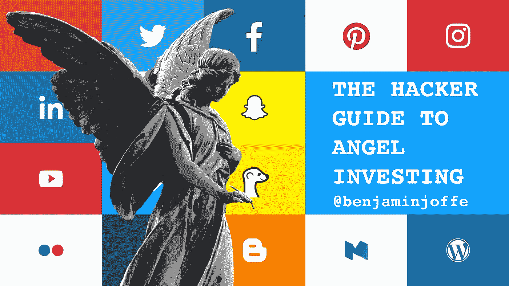
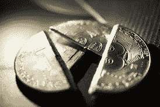
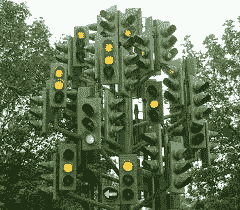
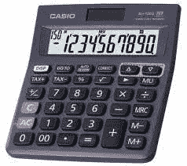
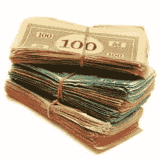
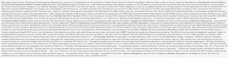
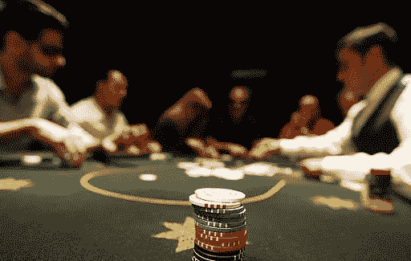
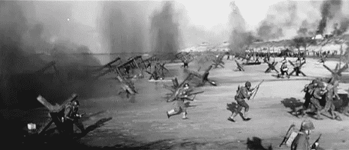

# 天使投资黑客指南

> 原文：<https://medium.com/hackernoon/the-hacker-guide-to-angel-investing-3a0ce661642a>

这篇文章是为有抱负的或刚开始的天使投资者准备的。

**‘我是天使投资人’**。它可以是一项严肃的努力，一条通往财富的道路，或者仅仅是一个昂贵的爱好(比如周末赛车)。是来之不易的紫心勋章，还是巧克力勋章？还有更好的成功方式吗？

No worries: it’s vegan.

你是哪种[类型的天使](http://trak.in/tags/business/2012/02/28/8-angel-investor-categories/)是你自己的选择。有些人投资是因为[他们喜欢](https://techcrunch.com/2012/09/30/why-angel-investors-dont-make-money-and-advice-for-people-who-are-going-to-become-angels-anyway/)，而有些人喜欢[塔克马克斯](http://observer.com/2015/08/why-i-stopped-angel-investing-and-you-should-never-start/)或[蒂姆菲利斯](http://fortune.com/video/2016/12/15/tim-ferris-startups/)停下来“更好地利用他们的时间”。

我在 10 年前做了我的第一笔天使投资——有点像“在它成为主流之前”——我基本上是“使命驱动的”:我只投资那些我很自豪地支持其使命和创始人的初创公司。

从那以后，我“只”投资了十几家公司，并且“在纸面上”获得了正的投资回报率(我只是选择不出售那些会让它变成正净值的股票)。没有人完全退出，但我以高达 75 倍的价格卖出了一些股票。到目前为止，1/3 的公司做得很好，1/3 的公司已经关闭，1/3 的公司处于不确定的未来之间。这在任何类型的投资中都不常见(作为一种资产类别，VC 被认为表现不佳)，对天使投资来说就更罕见了。

这篇文章的重点是帮助新天使们理解**社会副作用**和**市场动态**，这样他们就比我更清楚他们正在进入什么样的境地(尽管我已经足够幸运，不能抱怨)。

# 天使投资为什么有吸引力？

排名不分先后，以下是一些好处。

*   首先，*表明*你在美国有**可观的可支配收入** ，你通常需要成为一名“合格投资者”(资产= 100 万美元，或收入>20 万美元)。但是可能比你想象的要便宜！
*   第二，它让你处于一个**权力的位置** 人们向你要钱，或者要建议(聪明的创始人先征求建议，两者都有)。这是一个令人愉快的职位。

Great power can lead to abusive behavior

*   第三，因为它给你**地位** 和接触到的人和网络。
*   第四，**持续数年** 由于更多的创业公司在第一轮之后需要很多年才能成功(一般来说至少需要两年才能消亡)，你可以暂时兜售这个故事。

Precogs can’t wait 10 years to know if they’re right

*   第五，你将**了解创业公司的真实生活**

正如天使投资人兼企业家朋友 Itai Damti 提醒我的那样，你会学到很多东西，他把自己的金融科技公司发展到 100 名员工:

> 天使投资是企业家或高管了解另一面的无价之宝。在这个可以投资 5000 万到 10000 万的时代，大多数有钱的科技领袖应该至少投资一次。”-伊泰·达姆提

# 5k 天使

没错，单笔 5000 美元投资，你就可以称自己是天使投资人了！与其买一套[止赎房](https://www.cbsnews.com/media/10-homes-you-can-buy-for-5000/)或[孟加拉猫](http://ignitestudentlife.com/news/ignite/9-outrageous-things-you-can-buy-with-5000/)，不如给自己一份终极礼物！如果你想最大限度地利用“天使投资剧场”，你可以花 5 万美元投资 10 家公司的投资组合。哇哦。

Half a Bitcoin won’t give you as much class

**你是怎么做到的？**

Minimalist angel gear costs $1.89 on Taobao

有了 AngelList 辛迪加、股权众筹，以及现在的[整批加速器 ico](https://www.22xfund.com/)，一家公司甚至可以低至 1000 美元，或者 30 家公司高达 5000 美元！

所以，你可以去*El cheap o*…或者像 Fabrice Grinda 一样做点实事:在成为职业创业者之前，在你的创业创始人工作之余，向 100 多家创业公司投入更多资金。

**它能赚钱吗？**

请注意，如果你非常幸运(这发生在我身上)或者是一个认证的*预言师*，即使很小的投资也可以变成有意义的事情，如果:

*   很早就完成了(通常估值低于 500 万美元。100 万美元-$2M 最好)
*   …一家执行出色的初创公司
*   …并避免过度稀释(在种子 A+种子 b+ A 轮之后，天使股份已经被稀释到 50%是相当常见的)。

例如，要从 5，000 美元(200 倍)中获得 100 万美元，需要一家初创公司从(包括稀释在内)1，000 万美元的 2M 估值升至…**(2x 200 x2)。这在一个以单笔交易 10 倍回报著称的^^并不常见**

**事实是——你以前听说过——事实是:**

> **假设你会失去一切。“因为你可能会的”——伊泰·丹提**

# ****所有关于信号****

**天使们很少会给出投资组合回报的精确数字。都是为了“logo”！**

****

**Uh oh. You’re sending me mixed signals.**

****倍数伪装#1:** 你会听说过倍数，但只是“成功的”(尽管缺乏流动性)单笔交易。**

**这就像金融分析师没完没了地重复他们得到社会证明的*一个*预测，而不再提及他们错了的许多预测。**

****

**This would come in handy**

****倍数伪装#2:** 如果基于上一次估值而不是今天的公允价值，即使是倍数有时也毫无意义。**

**这家初创公司筹集了 1 亿美元的 C 轮融资？太好了！就要关门了？不太好。风投和有限合伙人报告公允价值。天使？往往比较自由式。**

****

**Millionnaire on paper**

**多重伪装#3: 小字可能会咬你一口。例如，我最近以上一次*估值(不是新*估值)的 1/3 的价格向新投资者出售了一家初创公司的部分股份。****

**为什么？因为我早期的股份比后来的股份特权少(因此价值更低)。但也因为大部分创业公司并没有真正的二级市场，所以买家指名其价格！**

**许多天使会说*“我以 X 估值投资，现在是 Y”*让你算错了，更不用说稀释，或者不良条款。光学法则！**

****

**Don’t worry!**

****多重伪装#4:** 一些天使投资人甚至可能像一些风险投资人一样，在 B/C/D/E 系列投资中晚些时候“购买商标”，但仍然自称为“天使”，因为他们投入了个人支票。**

**诀窍在于，这表明他们足够聪明/有影响力在早期进入(在后期进入可能仍然不重要，但这不是同一水平的英雄主义)，而事实上他们没有。**

****

**She has the logos but the car doors don’t open quite right yet**

**你真正想知道的是他们投资组合的现金对现金回报，或者一个合理的估价。社会规范和禁忌帮助人们混淆视听。**

# **你需要超过 10 项投资才能做好的真正原因(不是你想的那样)**

**这就是你经常听到的天使投资。**

**原因是*不是*一般的“分散风险”或“获得经验”。这些仅仅是与更重要的事情的关联:**改善你的交易流程**。**

## ****第一笔交易是获得更好交易的成本****

**变得“更聪明”的代价不是“更擅长挑选交易”。**

**同样，问题不在于你有多擅长大海捞针，而在于:**

*   **你在找正确的草堆吗**
*   **有多少根针**

## ****游戏到底是怎么玩的****

**由硅谷(和其他地方)的顶尖人物和连续创业者创办的新公司通常都充满了来自他们核心圈子的资金。**

**大多数天使不会看到那些交易。**

**所以作为一个天使**你会从其他人已经通过**的交易开始，或者从没有人脉的创始人那里开始。他们是最危险的。**

****

**Lots of needles = better results**

**事实上，认为自己擅长挑选可能是头号风险。**

**你的努力最好花在寻找更好的干草堆上，确保它们装满了针，并跟随有经验的找针者！**

****

**Sadly, you can’t seat at this table**

**然后，当你开始**广播你的天使投资者活动**时，也许你会建立一些交易流程和在某个领域或地域的一点专业知识，你会逐渐看到更好的交易。**

**这就是我的遭遇。**我在 source** 找到了我最划算的交易。在加速器中，或者通过我花了几年时间建立的高调网络，通过善意、信息交流，以及在我经营的市场中尽可能保持良好的声誉。**

# **黑客你的天使投资成功之路**

**如果我再做一次，我会建议年轻时的自己:**

*   **与有经验的投资者合作，他们的交易流程会帮助你，他们会整理所有的法律文件，协商价格等等。**

****

**They know what they’re doing**

*   **Itai Damti 有一个更聪明的想法(如果你能负担得起的话):既然你可以更像一个神，为什么要做一个普通的天使呢？成为一个 LP！**

> **尤其是在你相信的利基市场(例如，硬件和加密)。如果你非常了解某个人，你可能会以 5 万到 10 万美元的价格进入，这是你在 2 到 3 笔交易中的价格。他们会比你做得更好(虽然我并不是说他们会提供丰厚的回报……)——Itai Damti**

**还有，*‘我是 a16z 的 LP’*听起来比*‘我和 a16z 共同投资’*要球 1000 倍。**

**不管回报如何，你将获得数据室访问权、私人简讯，并将被邀请参加所有那些很酷的 LP 聚会，在那里他们做所有那些很酷的事情。光是信息和网络就可能是值得的——比你当地的乡村俱乐部或教会团体更值得！**

*   **保持你的支票在交易中平衡。我的有一些显著差异。矛盾的是，更小的支票产生了最好的回报(如果创业公司具有相同的风险水平，请记住，100 万美元的 1 万美元与 500 万美元的 5 万美元是相同的份额，但 100 万美元的 10 倍比 500 万美元的 10 倍容易得多)。我希望我在较大的交易上投资少一些，在较小的交易上投资多一些。对此，Itai 有一些进一步的想法:**

> ****第一次检查必须是小额的**。我花了 4 年时间将我的网络扩展到像 500 的 fintech partners 这样的人，他们可以获得我真正想要支持的交易(即使是小规模的)。我在去那里的路上花了太多的钱。**
> 
> **这些支票也很容易累积成一大笔钱。永远不要把超过你资产净值的 10%投入其中，不管这让你感觉有多好。如果你选择这样做，我建议**将它分散到 5 年内** : 1%，1%，2%，3%，3%。1 年内把 10%的身家投入创业公司是非常容易的。这是一个可怕的错误。-伊泰·达姆提**

*   ****每隔几轮就退出一部分，而不是一直冒险到底。** 这就是我今天的看法。许多创业公司可以通过种子和 A，但永远不会走到最后(看看统计数据)。作为天使投资人，你通常不能像风投那样(以 10 年为时间框架)跟进或双倍下注(这不是你的游戏)。你能做的就是有时候**在桌子消失之前把钱从桌子上拿走**。如果你以$2M 的价格向一家以 2000 万美元获得 A 的初创公司投资 2 万美元，出售你一半的股份将获得 10 万美元(根据稀释+条款折现到 50%)。而且你还有一半股份！不像风投，不需要独角兽就能获得回报，你的 carry 是 100%！**

****

**De-risk your deals by taking some early partial exits**

*   ****确保商业模式简单明了、可扩展，并且单位经济有效** 一些公司可以在整理之前处理大量的支点，但大多数公司都在努力尝试。**
*   ****勇气和足智多谋>品牌学位和经验**
    当心奢华的办公室和硅谷的成本。节俭还能提高艰难时期的生存几率。也许红杉的迈克·莫里茨说得有道理。**
*   **你最好的投资可能不需要你，那些需要你的人可能会让你奇怪，你怎么会付钱给他们，甚至…免费为他们工作！我只和我最初的投资有关(我用一点信誉和知识帮忙)，5 年后，他们已经大了 100 倍。**
*   ****“购买标识”早期** 我不喜欢这个，但它确实有效。其实很多风投(尤其是新进入者)也是这么做的。如果可以的话，投资一些小额资金到新潮的创业公司。不管他们的结果如何，你都可以利用他们的声誉在一段时间内获得更好的交易。如果他们后来失败了，你就已经赶上新的潮流了。**希望其中一个能成功，你只需要一个看起来像天才的人(就像 Skype、脸书、Twitter、小米等的早期投资者。).我拒绝了一些投资标志性公司的机会，这些公司我在早期或后期都不相信。他们最终做得不好，但如果我投资了，我的关系网就会扩大，我的知名度也会提高，让我有机会接触到更多的“圈内”交易。也许我拒绝了一些“标识”，错过了很好的交易流程。****
*   ****你只需要一个** 真正成功的投资能给你带来财富(虽然很难)。买一个著名的 logo 可以让你获得名声(不那么辛苦)。**

# ****光学是骗人的****

**从上面可以很清楚地看出，光学很重要，而且可能具有欺骗性。**

****

**Such big wings must fly for real!**

*   **一些看似成功的人可能从一笔交易中获得名声，从另一笔交易中获得财富。或者干脆没有财产。**
*   **我知道一些著名初创公司的天使投资人，他们以高估值姗姗来迟，在公司中没有任何角色，但却被邀请上电视，就好像他们有预测能力一样(他们可能仍然是聪明/有趣的人，但他们的成功并不源于人们认为他们拥有的品质，并询问他们这些品质)。**
*   **我还知道一些企业家，他们的“成功退出”给他们带来了 0 美元，而他们在其他地方进行的被动天使投资使他们成为了千万富翁——每个人都认为他们的财富来自他们自己的创业公司。但是，在某种程度上，他们花了数年时间建立自己的网络，让自己变得足够有价值，从而被邀请参加会议。有人可能会说，他们的创业努力是那张桌子上一个座位的价格。正如一些人所说，一半的工作正在显现。**
*   **也许你可以试着走杰森·卡拉卡尼斯的路，他写了一本关于天使投资的书。这条道路可能包括在网络热潮中以数百万美元的价格出售第一家公司，建立 20 年的网络，经营一个受欢迎的播客；)**

# **风投和天使**

**我有时会读到天使“与风投竞争”。**

**我的看法是“这很复杂”。**

**一方面，**普通天使投资者为初创公司混乱的超高风险早期阶段提供资金**这些初创公司没有网络从风投或更有经验的天使那里筹集资金。从数学上讲，这类交易的平均回报不可能很好(作为一个资产类别，即使是专业风投也有负回报)。**

****风投挑选存活下来的初创公司**，容忍/欢迎天使投资人，除非他们拥有太多股份(这是新兴市场经常出现的问题，早期投资人有时非常激进)。**

**因此，天使投资人大体上可以被视为投资的步兵，而风险投资人则拥有装甲车(或 T21 空袭)。**

****

**Angels take risks**

**与风投合作有风险更小的途径:**一些天使帮助风投寻找交易，或者组织辛迪加**。AngelList 甚至提出帮助创始人成为天使。**

**然而，天使投资人有时会与风险投资人竞争。例如，如果天使投资者向一家不成熟的初创公司投入数百万美元，它可能会对种子阶段的风投公司失去吸引力。然后，如果创业公司没有利用天使投资清除关键里程碑，它也可能阻碍后期阶段的风险投资。**过早投入过多的天使资金可能是危险的**，特别是如果这些天使不能为下一个里程碑提供支持，也不能在困难时期补足资金(当资金可能耗尽时，你的投资者是你的第一个电话)。**

# **喜欢就去做**

**瞧啊。我希望对天使投资的动态有更好的理解，你可能会比没有做得更好:)**

**A lovely angel-themed animation**