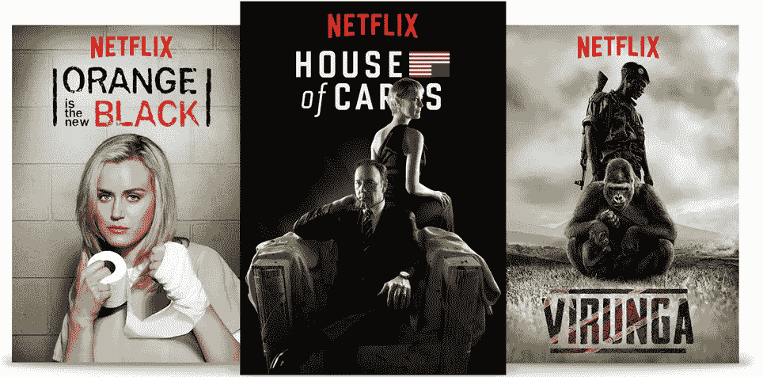
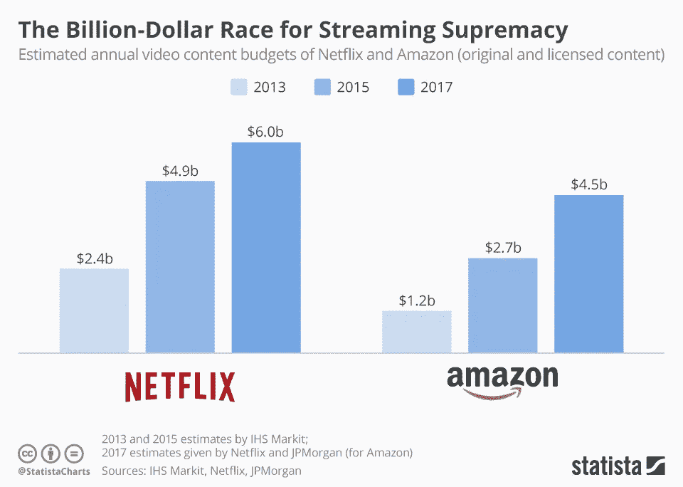
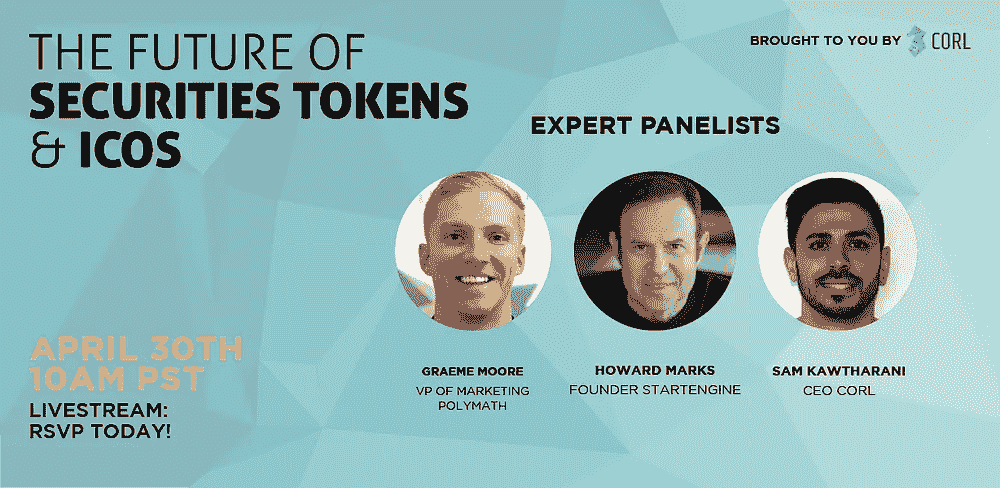
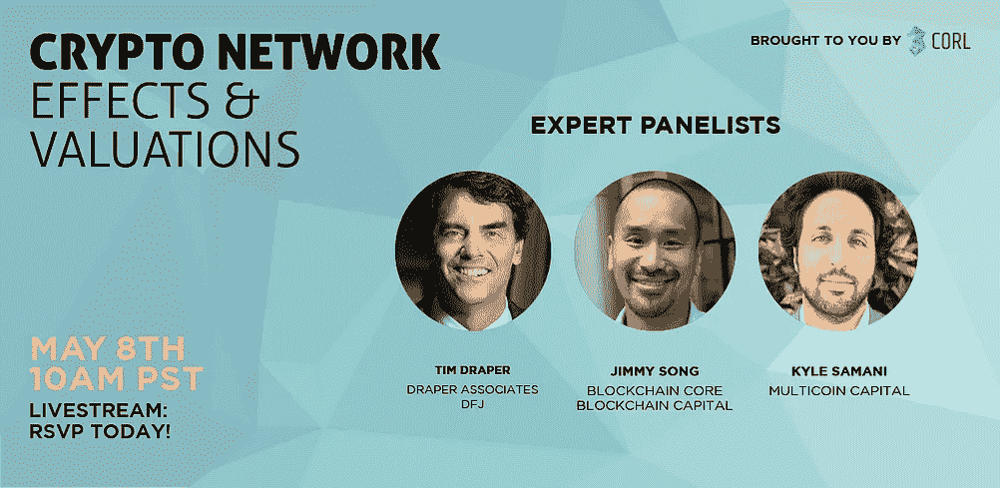

# 原创内容的硬道理

> 原文：<https://medium.com/hackernoon/the-hard-truth-about-original-content-a1200666ba71>

数量和质量很像供给和需求——对质量的要求与可获得的供给成正比。乞丐不能挑肥拣瘦，对吗？

但是，随着社会越来越多地进入一个丰富的世界，随着消费者的选择越来越多，企业(和个人)越来越难以区分。

不可避免地会出现聚合者——能够控制和匹配供求的垄断公司。这些成为摇钱树。

*   亚马逊商品化产品。
*   脸书把朋友商品化了。
*   谷歌商品化信息。

# 在一个丰富的世界里，你如何竞争？

问自己这个问题的公司不可避免地落入陷阱。他们通过提高速度、降低价格、增加参与度等手段来推翻现有的公司。他们已经有了衡量标准和方法。但是不管用。

颠覆现状的唯一方法就是打破规则，用不同的方式做事。要想引起轰动，需要大胆冒险的举动。即便如此，也没有什么是可以保证的。

理查德·布兰森开着坦克穿过纽约的街道，但维珍可乐还是失败了……如果连布兰森都失败了，我们这些凡人还有什么希望？

Source: Pressat.co.uk

但实际上理查德是一个很好的例子。虽然他取得了惊人的成功，但他至少经历了 15 次失败，这证明了他愿意冒险。

维珍可乐失败的原因很明显，它不是游戏规则的改变者。**更好的品牌几乎永远不足以让现任者下台。**当然，你可能会窃取市场份额，但祝你好运获得第一。

# 反思不同

胜利需要重写规则。创造颠覆性变革和获取真正价值的公司很少参与竞争——他们创造。

*   Airbnb 创造了短期旅游市场
*   优步创造了拼车市场
*   网飞创造了按需定制的狂欢

我们这个时代最有价值的公司都是科技公司。从脸书到苹果，从亚马逊到谷歌，以及介于两者之间的所有公司，今天最有价值的公司凭空创造了需求(从而创造了价值)。

这是彼得·泰尔的零到一框架。

但不是每个公司都能做到这一点。类别就这么多。虽然我们都相信富足，但并不是每个初创公司都注定(或能够)成为独角兽。

# 如何脱颖而出

让我们假设钱不是问题。在一个只有你自己可以日复一日做任何你想做的事情的世界里，你会做什么？你会怎样度过你的一天？

花点时间。想想吧。

我猜你会做一些超级有趣的事情。随着新鲜感的消退，你会追求其他不可思议的体验，如此等等。最终你可能会意识到生活不仅仅是纯粹的快乐，追求自我实现和做好事——但这需要时间。

你可以自由选择，你选择了最有娱乐性和原创性的选项。这一点永远不会改变。

> 我们是在匮乏时代进化而来的物种。当获得富足时，大多数人只是增加了他们对质量和原创性的期望——这就是网飞。

# 创造者

2017 年[网飞](https://hackernoon.com/tagged/netflix)制作了 1000 小时的原创节目，今年他们将在原创内容上花费 60-80 亿美元。他们在《网飞原创》上投入了大量资金(并将继续投入),随着《纸牌屋》、《黑镜》和《橙色是新的黑色》等剧集的播出，这显然很奏效。

他们赢得了各种奖项，拥有 1 . 17 亿付费用户，发现自己的价值高达 1420 亿美元(*来源:* [*扩展漫谈*](https://expandedramblings.com/index.php/netflix_statistics-facts/) )。

他们是怎么做到的？首先，他们专注于业务，通过邮寄 DVD 扰乱百视达的店内租赁市场。随着公司的发展，他们的抱负和对他人的依赖也在增长。

任何称职的首席执行官都意识到自给自足高于一切，因此网飞开始创作原创内容(在他们的流媒体视频创新之后很久)，以省去制作人/版税。尽管在短期内成本高得令人难以置信，但从长期来看，这一策略将(并将)带来巨大的回报。

记住我们的思维实验:娱乐性和原创性是关键。要建立一个足够大的常青内容库，让网飞用户永远不会看不完新内容，并不容易。但是他们正在做，就在我们眼前。只要公司的生产速度快于消费者的消费速度，他们的净消费就是正的(如果你看《纸牌屋》，当你看完这个系列的时候，X #的新系列/节目已经被录制和添加了——一个内容跑步机)。

不仅仅是网飞。亚马逊和苹果也在原创内容上下了大赌注。1B 今年的预算分别为 45 亿美元和 40 亿美元，显然，这两家科技巨头明白世界的走向:订阅和原创内容。

# 网飞对你

但你不是网飞——你没有他们的资源、专业知识或数据科学家。这是一件好事。

初创公司无法超越 Netflix 网飞(或谷歌、亚马逊等)。他们必须玩不同的游戏。虽然网飞在创造原创内容，但它并不都是原创的。当然，它令人难以置信地吸引人，许多节目(和电影)正在获奖，但它仍然只是电影/电视。他们的颠覆在于消费的便捷性、目录的大小以及基于你喜好的推荐。

如果你或我创作了下一部《权力的游戏》(请注意，预算很少)，我们不会看到如此成功的程度。“我也是”产品和“我也是”类别已经饱和。

# 内容为王？

为内容而内容是注定要失败的。试图与大公司竞争也是如此。

我的初创公司 [Corl](http://corl.io/?utm_source=matt%20medium) 正在为风险投资忽略的 99%的企业提供资金。我们正在以创新的技术方式解决一个不同的问题，因此有机会。但是为了增加这些可能性，我也在创造内容。

但是仅有内容是不够的。我们生活在一个每分钟有 400 小时的视频被上传到 Youtube 的世界里！播客也好不到哪里去，竞争很激烈。在数以千计的访谈节目、众多 NPR 级别的调查报告和许多其他个性驱动的播客中，脱颖而出几乎是不可能的。

这就是我组织加密圆桌会议的原因。我正在召集加密领域的顶尖人才召开电话会议，并向成千上万的[区块链](https://hackernoon.com/tagged/blockchain)爱好者直播小组讨论。通过让像蒂姆·德雷珀、罗杰·弗、吉米·宋这样的有影响力的人……在影响力方面远远超过我的男性和女性，我们正在创造一个真正原创的、难以置信的有价值的系列。

为了引起注意，你需要做不同的事情。时间会告诉我们密码社区对我们会议级质量的反应。我所知道的是，我尽了最大努力来确保科尔脱颖而出，并且直播上的可用座位很快就会被抢走。

今天就回复以确保你在直播中的位置( ***点击下面的图片链接*** )。

[带 Polymath、StartEngine 和 Corl 的安全令牌和 ico](https://getcorl.typeform.com/to/djSe17?utm_source=matt%20medium)—太平洋标准时间 4/30 上午 10 点

[Tim Draper、Jimmy Song 和 Kyle Samani 谈加密网络效应和估值](https://getcorl.typeform.com/to/ibpDTr?utm_source=matt%20medium) —太平洋标准时间 5 月 8 日上午 10 点

# 不确定

创新者在尝试之前从来不会真正知道某样东西是否可行。网飞有显示客户行为的数据，但每次尝试新事物时，你仍然会屏住呼吸。大多数激进的创新都失败了。无论是时机、需求还是交付出了问题，都有一百万个原因导致事情失败。

但是当一切顺利的时候会发生什么呢？好 10%还不够。失败的几率太大了，所以永远不要抱小梦想。

# 例子

这篇文章的大部分内容可能感觉是理论性的。在这最后一部分，我将尝试列出一些创新的例子。

请记住，虽然这些在今天看起来很平常，但在当时它们是变革性的。

1.  《美国生活》——第一个 NPR 级别的娱乐性日常新闻系列，包括一个播客(开启了播客时代和模仿浪潮)
2.  蜘蛛侠(2002)——第一部超级英雄电影，在这部电影中，英雄感觉自己是人/有弱点(点燃了现代超级英雄/漫威的全盛期)
3.  《白雪公主》(1937)——第一部动画长片——开启了迪士尼的帝国
4.  《西部世界》(1973)——在一部重要的娱乐故事片中首次使用 2D 电脑动画
5.  《花花公子》杂志(1955)——第一本色情/成人杂志，以玛丽莲·梦露为主角——我们知道结果如何

先驱者被赞美，被憎恨或者被忽视。落入前两个桶中的任何一个，你可能就有了一家公司。

大多数创新者都失败了。大多数原创内容表现平平。但在一个有无限上升空间的世界里，挑战极限、孤注一掷是值得的。

# 结束语

我们生活在注意力经济中。记住这一点的创作者更有机会脱颖而出。不要玩他们的游戏，发明你自己的和你的产品、服务、内容等等…至少有机会成功。

> 原创，复制品褪色太快

只有你能创作的内容是什么？祝你好运。

## 立即注册我们的免费直播:

1.  [安全令牌和 ico](https://getcorl.typeform.com/to/djSe17?utm_source=matt%20medium)
2.  [加密网络效应和估价](https://getcorl.typeform.com/to/ibpDTr?utm_source=matt%20medium)

对这次活动非常兴奋，希望能在那里见到你们。

想要更多精彩的圆桌会议和投资者访谈。立即订阅，永不错过任何事情！

## 学到了什么？单击👏说“谢谢！”并帮助他人找到这篇文章。

*如果你喜欢内容，请按住鼓掌按钮！它帮助我获得曝光率。*

***鼓掌 50 次在推特上关注我:***[***@ mattwardio***](https://twitter.com/mattwardio)

[*原发布于 mattward.io*](https://mattward.io/the-hard-truth-about-original-content/)