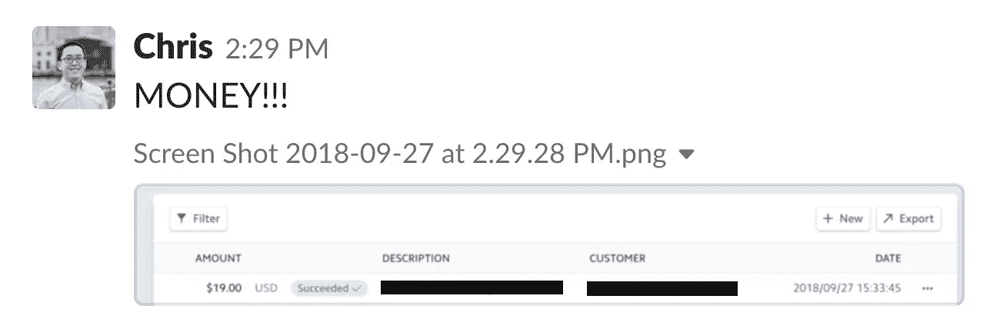
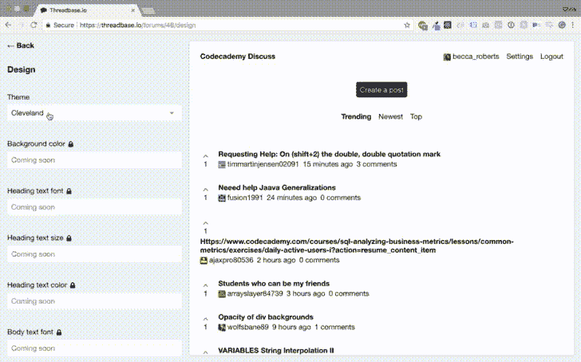

# 我为 19 美元工作过的最辛苦的工作(或者说，我们是如何得到第一个付费客户的)

> 原文：<https://medium.com/hackernoon/the-hardest-ive-ever-worked-for-19-or-how-we-got-our-first-paying-customer-7a7dd73db2a>

Sent this to my co-founder the moment the money showed up.

对于任何一家创业公司来说，你的第一个付费客户都是一个巨大的里程碑。

在 2018 年 9 月底，我很自豪地说，我们达到了这一里程碑，将我们在 [Threadbase.io](https://threadbase.io?utm_source=social&utm_medium=medium&tum_campaign=181101_19_dollars) 上的第一个免费社区所有者转化为 19 美元/月的等级。

我读过很多关于一些创业公司如何轻松达到这个里程碑的博客帖子。他们想出了一个“只需点击”的惊人主意，制作了一个 Instapage 登陆页面，并在短短一天内获得了第一个付费客户。或者，在投资了一家知名风投公司并获得资金后，他们如何能够在几天内获得数百名付费客户。

不幸的是，这不是我们的故事。

我们花了两个月的时间让我们的 alpha 版本出现在人们面前，让他们意识到我们有真正好的东西。

然后我们收到了来自三家不同的大型风投公司的三次拒绝，他们说我们的想法还没有在*实现*。

然后，又花了 2 个月的时间来推动拒绝，相信 Threadbase 的使命是让非技术人员能够轻松创建社区并从他们的社区中获得可扩展的收入，并与我们最早的支持人员合作，以达到我们的里程碑并获得我们的第一个付费客户。

今天，我想分享我们的故事，希望能激励其他人永远不要停止建设。

# 两个月的工作来发射我们的阿尔法。

A quick example of our theming engine!

卡姆和我创办了 [Threadbase](https://threadbase.io) ，因为我们相信在线社区对人们如何联系至关重要。作为狂热的 Redditors、Imgurians、产品猎人、独立黑客和黑客新闻人，Cam 和我看到了基于投票的社区如何让人们发现民主投票的内容，然后通过共同的兴趣与世界各地的其他人联系。即使这些观点并不完全是我们的观点，基于投票的社区也让我们得以一瞥其他人是如何思考的，以及对他们来说什么是重要的，从而开启我们可能没有通过朋友之友算法发现的新观点和想法。

但是，我们也知道其他人创建自己的投票社区有多难。基于投票的社区没有 Squarespace 或 Shopify，但人们迫切希望通过民主投票的内容建立联系，因此他们找到了替代方案。

这些人创造新的子主题，并把它们发展成数百万的追随者。这些人使用开源工具，如望远镜或话语。或者，如果你像我一样，你学习如何编程，这样你就可以为你热爱的事情建立一个基于投票的社区。

但是，Cam 和我觉得这种支离破碎的经历只允许某些人有特权去建立一个成功的在线社区。所以我们决定对此做点什么，于是创办了 Threadbase.io。

Threadbase 允许任何人在任何地方只需点击几下鼠标就可以建立自己的产品搜索、黑客新闻或 Reddit 风格的社区。您可以使用预先构建的主题定制您社区的外观和感觉，或者使用我们的付费层进行更强大的更改。此外，在我们的付费层，你甚至可以插入自己的 AdSense pixel，从你的社区中获得可持续、可扩展的收入。

[我们在 IndieHackers](https://www.indiehackers.com/forum/need-alpha-users-make-your-own-product-hunt-hacker-news-or-vote-based-community-no-coding-needed-4b780e8c60) 上分享了这个想法，一天之内，我们收到了大量的支持和 100 名有兴趣试用我们的 alpha 版的电子邮件订户。

在两个月的空闲时间编程之后，我们觉得我们正在做一些真正令人惊奇的事情。

不幸的是，有三个人正要告诉我们，我们错了。

# 三个风投的三次拒绝。

在 Threadbase 上工作时，我们可以感受到我们正在做的事情背后的动力。我们采访过的朋友和顾问都说这个想法很有趣，很有潜力。在独立黑客上分享它让我们知道其他黑客和创始人有兴趣用 Threadbase 建立他们自己的社区。

公平地说，由于所有的积极反馈和势头，我们自己的供应有点高，我们认为我们有如此伟大的东西，我们可以得到资助。

我们投了三家大型风投公司，正如你已经知道的，进展不如我们预期的那样顺利:

*“…不幸的是，我们确实觉得现在需要暂停投资…”*

*“不幸的是，Threadbase 不适合我们。”*

*“我认为这还不太适合我们的合作关系”*

相对而言，这些还不是最糟糕的拒绝信。事实上，他们说他们喜欢我们和这个想法，但尽管他们喜欢我们，他们都无法克服我们道路上的一个大障碍:

您还没有任何付费客户。

如果没有人为我们卖的东西买单，我们怎么可能认为我们有一个可行的 SaaS 创意呢？

当然，我们有很多免费的社区所有者，但在 2018 年，风投对“我们现在就获得免费用户，以后再将他们货币化”不感兴趣。

从某种意义上说，我们所有的风投都在告诉我们，除非你能证明人们——希望是很多人——愿意为你的产品付费，否则你还没有一个可行的想法。

# 经历拒绝。

虽然我们知道他们的反馈是有效的，但听到这么多的反对还是很难受。

所以我和小卡要做一个决定。我们是把 Threadbase 放在一边，尝试一些其他的想法，还是继续开发 Threadbase？

对我们来说，答案非常清楚，因为我们知道我们在建造什么，最重要的是，我们为什么要建造它:

我们生活中的很多事情都是在网上完成的。无论是约会、阅读新闻，还是寻找有趣的东西，你都必须通过一些在线社区来找到你想要的东西。而且，当这些内容被民主地投票通过时，你就能够发现丰富有趣的内容，如果这些内容是通过基于你以前的行为或你的朋友和朋友的朋友的算法推荐给你的，你可能不会发现这些内容。

我认为，如果不是我们的使命对我们两人来说都如此明确，我们可能会像我们有其他辅助项目一样放弃 Threadbase，但当你正在建立一个基于你的两位创始人都相信是正确的使命的想法时，再多的拒绝也不会阻止你前进。

# 挣 19 美元的感觉从来没有这么好。

这就把我们带到了今天。

经过近四个月的工作，拒绝，最重要的是，与我们早期的支持者合作，以建立一个他们喜欢的产品，这发生了:

看到钱出现在我们的 Stripe 账户上是一种疯狂的感觉，它验证了我们花在将生命注入一个想法上的所有时间。这并不容易。

我认为，从整个经历中最大的收获是，从零开始建立一个想法并获得你的第一个付费客户并不容易。

你将会有几个小时搞不清楚为什么组件没有渲染。你会花几天时间准备一个没有结果的推介会议。你会花几个月的时间给一个想法注入活力，而人们可能甚至不想为这个想法付钱。

但当 Stripe 告诉你有人以每月 19 美元的价格订阅了你的服务时，你会感受到我们的感受——这可能是我们为 19 美元所做的最艰难的工作，但这完全值得。

—

Chris 是 Threadbase 的联合创始人:一个平台，非开发者只需点击几下鼠标就可以建立自己的 Reddit 风格的社区。在 Threadbase 之前，Chris 在包括 Quidsi 和 ComiXology(均被亚马逊收购)和 Bonobos(被沃尔玛收购)在内的初创公司从事营销工作。