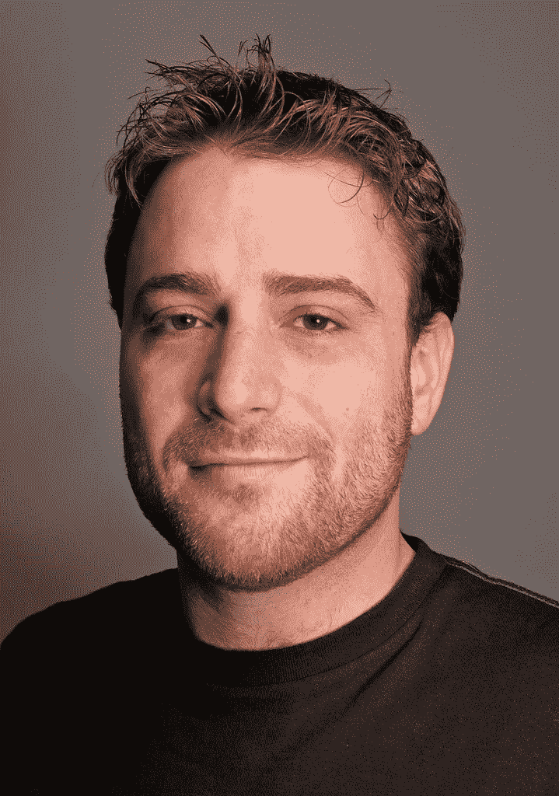
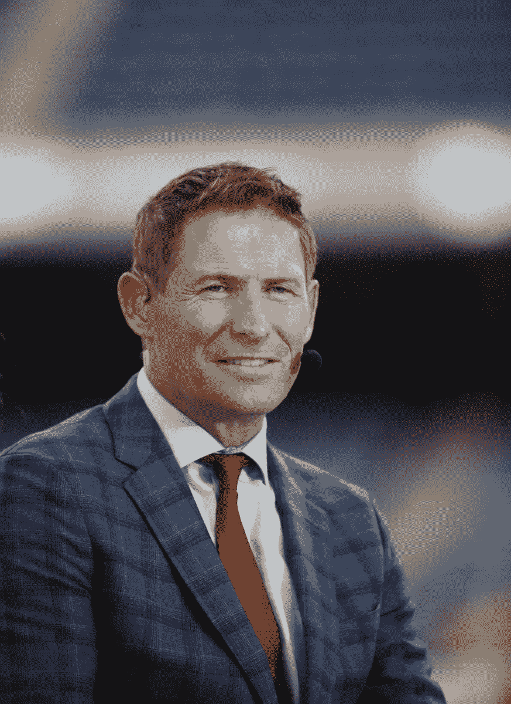
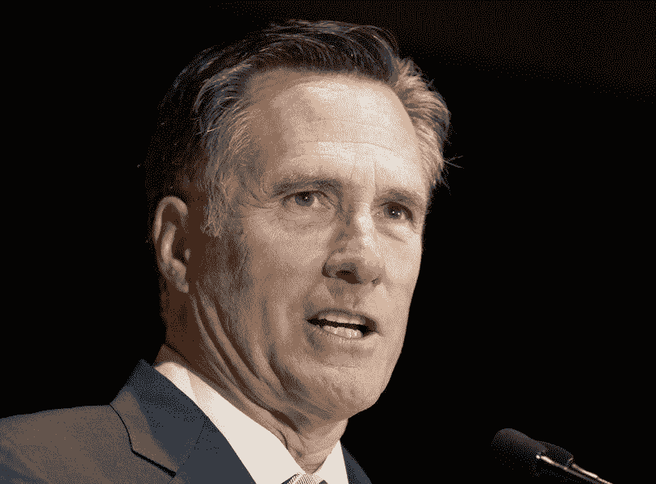

# 名人头条犹他科技峰会

> 原文：<https://medium.com/hackernoon/the-heavy-hitting-utah-tech-summit-1062dc3d8848>

你好，史蒂夫·杨

《阿凡达》“超人：钢铁之躯。”《复仇者联盟》

贾洛姆·西德维尔为这些大片和其他大片制作数字视觉效果。

但他远远不是在盐湖城举行的 2018 年硅坡峰会上发言的唯一大人物，“这是犹他州历史上最大的科技盛会，”SS 执行董事克林特·贝茨说。

其中，Qualtrics 的首席执行官 Ryan Smith 出席了峰会，他的客户(超过 8500 家)包括微软、Healthcare.gov、哥伦比亚广播公司和雅虎。，以及《华盛顿邮报》；Vivint 首席执行官托德·彼得森(Todd pede rsen)；奥马尔·约翰逊(Omar Johnson)，Beats by Dre 前首席营销官；戴夫·艾尔金顿，InsideSales.com 创始人；乔希·詹姆斯，Domo 首席执行官；Pluralsight 首席执行官 Aaron Skonnard 史密斯说，吉姆·斯沃茨(Jim Swartz)和大卫·菲阿尔科(David Fialkow)是纪录片的投资者，其中一部纪录片在会议上放映，成为圣丹斯电影节有史以来收视率最高的首映。

还有斯图尔特·巴特菲尔德、史蒂夫·杨和米特·罗姆尼。

## 布特菲尔德

Stewart Butterfield, Slack’s CEO, conducted a major advertising campaign in Utah. (Creative Commons)

史密斯在采访 Flickr 和 Slack 的联合创始人巴特菲尔德时说，巴特菲尔德“喜欢创办游戏公司，但他不太擅长”，然后变得更好。从巴特菲尔德买了 Flickr。

巴特菲尔德接着说，在大学里，“他的思想被互联网震撼了”，因为他喜欢与不同大学的朋友交流。然后，他将 Slack 描述为“人类互动，但这一次是在商业环境中”和“巨大的信息流”，并表示今天有“数千万”的人在使用 Slack。然而，他不认为电子邮件会消失，尽管他说 Slack 可以实现电子邮件的许多目标，但更有效。他还建议相关领域的企业主“寻找对用户体验感兴趣的工程师。”

“时间是有限的；资源是有限的，”他补充道。“约束和创造性的角色总是让我着迷……对于诗歌来说，整个事情都是约束……音乐有拍号、基调和调式。”

巴特菲尔德接着引用了“48 小时电影制作比赛”作为例子，说明时间限制如何提高生产率。

“无限可能性的想法实际上使创造性思维变得更加困难，”他补充道。

他还将电子游戏中“一次又一次”的死亡与工作中不断重复的失败进行了比较，这种失败可以导致产品相对于其本来可能达到的目标进行优化。

巴特菲尔德还谈到在犹他州做一个主要的广告活动，他说大部分的重点是在早上，因为他“不想干扰家庭晚会。”犹他州近三分之二的人是摩门教徒，他们在周一晚上举行一个名为家庭聚会的活动。

“哇，伙计，”史密斯在转身之前回答道，最后问巴特菲尔德要卖给雅虎什么。感觉就像。

“我不想再那样做了，”史密斯说。年纪轻的

## 年纪轻的

Steve Young said that his NFL coach in San Francisco, Bill Walsh, created a guide for conducting the West Coast offense when Walsh filmed his coaching it in practices. (AP Photo/Charles Rex Arbogast)

杨是 NFL 历史上排名最高的四分卫，他提醒人们，他是杨百翰大学的第八名四分卫——杨在他的职业生涯中一直穿着 8 号——在那里他应该代表对方球队的四分卫。

强调“代表”

“防守队员认为我实际上是(对方)四分卫，”杨说。

这伤害了杨，所以他打算退出球队。

“你可以退出，但你不能回家，”杨的父亲格里特说。

杨称格瑞特和他的母亲雪莉是“他生命中的 150 个天使”之一

在签署了一份 4000 万美元的合同(当时最赚钱的体育合同)后，杨在犹他州报纸 Deseret News 上看到一个标题后哭了，杨说读一读“史蒂夫·杨，体育怎么了？”

杨还说，杨在旧金山 49 人队担任四分卫时效力的比尔·沃尔什让杨成为乔·蒙塔纳的替补，以产生“创造性的紧张”

“我真的很感激我不得不经历那种紧张，”杨说，他作为首发球员，赢得了两次 MVP 奖和三次超级碗。

当被问及对那些认为自己应该有一份更好工作的人的建议时，杨说要避免“零和游戏思维”，并钦佩沃尔什将沃尔什关于西海岸进攻的指导制成视频，这是当时 NFL 的新发展。

“比尔·沃尔什是硅谷的第一任首席执行官，”杨说。“他正在整理一个工具箱……他拥有的一切，他获得的所有知识。”

杨说，沃尔什真的很有天赋，他的助手迈克·霍尔姆格伦和迈克·沙纳汉都获得了主教练的职位。

“他在(他们的)出路上说，‘我们在冠军赛上见’”，杨报道说。

两位教练，杨说他们是西海岸进攻的“第一代”的一部分，也赢得了超级碗。

随着传奇人物乔·蒙塔纳的发挥，杨被指责为 49 人队的缺点，以至于旧金山的头条新闻写道“海湾战争:是史蒂夫·杨的错。”

这是开玩笑的。但是杨说“我现在想起这件事就热泪盈眶。”

杨向他哥哥抱怨道。“我不会成功的，”杨告诉他。

但是这位兄弟回答说:“你在想什么？我有三个孩子，正在读医学院。”

杨还评论说，他对“我从华盛顿听到的所有故事”的回应是“神圣的废话”。

“那会留下什么遗产？”他说。“我们可能会赢……但是遗产是什么？…如果你知道我在说什么，那就不会发生。”

## 罗姆尼

Mitt Romney said “it’s thrilling to know you could be in the setting where you could fail or fall.” (AP Photo/Rick Bowmer)

罗姆尼被问及他是否“曾经真正害怕在通往他的“成就”的路上失败”

“你可能不知道，但我实际上竞选过美国总统，结果失败了，”他回答道。**我喜欢沃尔特·蒙代尔说的话。据报道，他说他想以最糟糕的方式竞选总统，这就是所发生的事情。”**

**在讲述了他的工作后，包括领导 2002 年冬季奥运会和担任马萨诸塞州州长，他说:“知道你可能会在一个可能失败或摔倒的环境中，这是令人兴奋的。”**

**他说，他首先从父亲乔治·罗姆奈那里学到的是不要“得过且过”。对自己想去的地方有一个愿景。”乔治·罗姆奈是美国汽车公司的主席和总裁，也是密执安州的州长。**

**当被问及他患有多发性硬化症的妻子安时，罗姆尼说“事实上你遇到的每个人都有一些…负担…我们享受的生活经历都有挑战。”**

**罗姆尼还谈到了作为一名共和党州长，立法机构中 87%是民主党人，他说他将在波士顿北端与民主党领导人共进晚餐，吃意大利面条和“其他意大利美食”。**

**“只是在社会基础上，”他说。**

**他说，他与领导罗姆尼白宫过渡团队的前犹他州州长迈克·莱维特进行了交谈。莱维特告诉他，“有一个反对党并不一定不利于完成任务。”**

**“我同意，”罗姆尼声称。**

**当被问及对犹他州、美国和世界的未来的“焦虑”时，罗姆尼说“我们可能会在某个时候经历一场衰退。”**

**“很难预测非理性行为，”罗姆尼接着说。**

**他后来说，“经济在不久的将来看起来很好。”**

**他还表示，日本经济状况好转“令人鼓舞”。**

**他在谈到俄罗斯时也带回了“地缘政治”这个词；罗姆尼在 2012 年表示，俄国是美国的“头号地缘政治敌人”**

**“在某些方面，他们正在努力显示他们是一个大玩家，一个超级大国，”罗姆尼说。"约翰·麦凯恩认为他们是一个加油站，而不是一个国家."**

**罗姆尼也不认为朝鲜独裁者金正恩不会发动核打击，因为“事情会失控”他还说，中国“非常重视 T2 在经济上主宰世界”，这就是他们在“非洲和巴基斯坦”建立关系的原因**

**“他们正在打持久战，以成为世界强大的经济引擎，”罗姆尼说。**

**“我很兴奋地看到……未来 50 年，我尽可能多地站在泥土的这一边，”他补充道。**

**罗姆尼还声称，“未来几十年，美国一半的工作岗位将会消失。”**

**“这是激动人心的时刻，我想看看这一切，”他说。**

**罗姆尼最后说“在创新驱动未来的地方，美国赢了，因为美国是世界的创新者”，说“美国……是这个星球上自由的关键。”。"**

**罗姆尼在采访开始时说，他没有宣布竞选犹他州的美国参议员，尽管他现在有。**