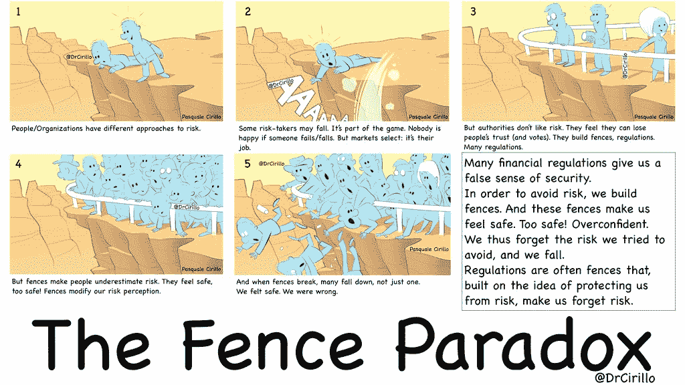

# 伦理监管的隐性风险

> 原文：<https://medium.com/hackernoon/the-hidden-risk-of-ethics-regulation-54649158394d>

## 监管科技行业不会解决其道德问题。这可能会让他们更糟。

在之前的一篇文章中，我认为有三种方法可以解决道德问题:

1.  建立和维护支持道德行为并发现和惩罚不道德行为的法律/法规基础设施。
2.  通过要求个体从业者证明游戏中的皮肤，获得道德可信度的公共评估。
3.  当人们说他们将遵守道德规范时，请相信他们的话。

选项 3 显然是有缺陷的，但尽管如此，它似乎是目前解决科技行业道德问题最流行的方式，通常以道德准则的形式表现出来。[我个人认为方案二是最现实有效的方式](https://towardsdatascience.com/an-ethical-code-cant-be-about-ethics-66acaea6f16f)。但是，尽管它很复杂，而且实现起来可能很昂贵，但选择 1 肯定是有道理的。我认为迈克·蒙泰罗(Mike Monteiro)为监管写了我所见过的最有说服力的论点。他专门写设计伦理，但他的观点同样适用于数据科学伦理，甚至是一般的技术伦理。

我将用这篇文章的大部分时间来解释我所认为的伦理监管方法的核心困难，所以我想首先尝试对支持它的论点进行公正的评价。我试图在这里总结蒙泰罗的立场——如果这个总结中有缺陷，它们很可能来自我，而不是他，所以我强烈建议阅读他的原始帖子。(我无论如何都推荐看他的帖子——真的很棒)。据我所知，蒙泰罗的主要前提如下:

1.  伦理原则只能由个人来维护:个人必须愿意并且能够站出来说“不，我不会那样做。”
2.  个人通常不愿意或不能坚持道德原则，因为告诉他们忽略这些原则的人是他们的经理、老板或其他有权力的人。这种权力不对称阻碍了个人做正确的事情。
3.  让个体愿意并能够做出合乎道德的行为的唯一方法是消除权力不对称，或者更好的是，让不对称向另一个方向倾斜，这样人们就会觉得不愿意或不能做出不道德的行为。

基于这些前提，蒙泰罗认为，许可和监管是前进的方向:通过建立一个监督机构来重新平衡权力，这个机构拥有可以减轻不道德意图的资源。要求从业者做出不道德的行为，雇主或顾客几乎不需要付出任何代价(除非如果当前的从业者不妥协，可能需要寻找新的从业者)。一个为个体从业者而战的专业组织、认证机构或联盟提高了成本，给了个体更多的自由来做出道德选择，从而减少了不道德的行为。

除了第一个前提，我不确定我是否同意蒙泰罗的任何一个前提，因为我认为大多数不道德的决定都是因为人们很难预见他们决定的后果。然而，即使我接受所有的前提为真，我也不相信结论是从前提中得出的。我认为监管将解决最近成为头条新闻的许多类型的道德风险，但我认为它会留下许多风险，同时引入新的风险——事实上是更具系统性的风险——从长远来看，这实际上会使公众和行业面临更多目前面临的潜在负面影响。

Pasquale Cirillo [对监管的风险进行了类比。他的工作重点是金融监管，但这一原则完全可以推广。他称之为栅栏悖论:](https://twitter.com/DrCirillo/status/977165189413031936)

将栅栏悖论视为任何法规的潜在属性可能比视为所有法规的确定属性更好。换句话说，监管可以很好地发挥作用，只要它们不产生人为的安全——并因此产生隐藏的系统性风险——就行。

认为道德问题的答案是监管是非常自然的。但正是这种监管让我们觉得我们有道德保护，而事实上我们没有。在目前的讨论中，大规模的监管需要规定什么是道德的，什么不是。这些规则必须比你在目前流传的任何道德准则中看到的规则更加具体:它们需要被分解成本质上是一个结构化的面试时间表，因此任何两名接受过使用该时间表培训的任意审计师都可以调查任意一家公司、团队或从业者，并以类似的方式回答问题。

如果我们不能在伦理规则的应用中达到近似的一致性，那么我们就没有监管的基础。然而，如果我们可以近似一致性，公司、团队和个体从业者完全有能力滥用系统，尽可能不道德地行为，同时仍然遵守规则的严格技术定义。这就是栅栏的风险:因为栅栏在那里，他们把所有的活动都堆在它旁边，推它，如果可能的话弯曲它。因为法规的设计目的只是在栅栏被破坏时提醒我们，这不会触发任何警报。当有人，不管是出于恶意还是出于无能，越过栅栏时，其结果对所有那些把栅栏当作挡土墙的人，以及所有其他依赖栅栏的人来说都是灾难性的。

那么，我们如何防止围栏倾向呢？一种方法是建造围栏，尽量少占地。《华盛顿邮报》最近刊登了一幅关于小栅栏的精彩插图，一位餐馆老板描述了她如何制定规则来管理工作场所的性骚扰。

> 我们决定采用颜色编码系统，将不同类型的客户行为分为黄色、橙色或红色。黄色指令人毛骨悚然的感觉或令人讨厌的样子。橙色意味着带有性暗示的评论，比如对某个员工外貌的赞美。红色表示公开的性评论或触摸，或者在被告知这些评论不受欢迎后重复发生橙色类别的事件。
> 
> 当一名员工遇到骚扰问题时，他们会报告颜色——“我在五号桌有一个橙子”——经理需要采取具体行动。如果报告为红色，顾客将被逐出餐厅。橙色表示经理接管桌子。对于黄色，如果员工选择，经理必须接管桌子。在任何情况下，经理的反应都是自动的，不会问任何问题。
> 
> 自实施以来，客户骚扰已不再是一个问题。红色几乎不存在，因为大多数粗略的客户似乎偏离了黄色或橙色。我们发现，大多数顾客在升级之前都会先试水，而且女性对不必要的关注有敏锐的第六感。当红色事件发生时，我们的员工有权采取果断行动。
> 
> 颜色系统是优雅的，因为它防止女性不得不重温破坏性的故事，并让经理们不必根据自己的经验对看起来没有威胁的情况做出艰难的判断。该系统承认男性和女性体验世界方式的差异，同时创造一个安全的工作场所。

这些规定不够明确，也不够标准化，无法在大量餐馆中得到一致执行。这就是重点:**本地**解决方案不需要我们标准化对与错的定义，因为它们不需要扩展。我们实际上可以根据人们的“感觉”来工作，因为修复也是局部的——它们不容易失控，如果失控，它们可以在一个小团体中进行协商。只要系统是本地化的，**我们使用什么**系统并不重要，更重要的是**我们首先有一个系统**。

很容易想象这种系统被用来管理技术团队的方式。任何团队成员都可以标记项目决策。黄色表示经理参与领导对决策的重新评估，并将员工转移到不同的项目(并且该项目在声望/薪酬/范围等方面不会明显恶化)。)应员工要求。橙色表示经理参与进来，员工开始着手新项目。红色表示该项目在进行全面重新评估时被搁置。在采取纠正措施之前，不要猜测员工的电话。这不是一个完美的系统，但它可以以一种不会产生栅栏风险的方式实施，并且它将承担道德风险的成本转移给了雇主，而不需要大规模的监管机构。

对这一论点的自然反驳是，期望大多数公司愿意在没有外部机构某种强制的情况下实施和袖手旁观这些政策是不现实的。这是一个公平的观点，但我认为如果管理得当和网络化，压力可以来自内部。想象一个帮助个体从业者跳槽的专业网络或服务:优先考虑道德实践的公司可以在求职者因为道德问题想要离开他或她的职位时得到警告，而因为道德问题失去员工的公司可以在员工获得新职位后得到警告。或许，给那些因为道德原因而失去员工的公司做广告是个好主意。有点像一个更好的商务局。

当然，细节需要更全面地制定，但我认为这些细节更值得制定，它们是大规模监管框架的细节。如果我们能够创建一个系统，通过让人才更容易离开来吸引不道德公司的人才，这些公司将有动力执行当地的道德法规。如果个体从业者离开不受监管环境的成本足够低，那么监管不需要为了有效而可伸缩。

大规模监管是危险的。这并不意味着我们不应该这样做——许多危险的事情非常值得去做。然而，如果我们着手进行监管，我们应该非常缓慢和谨慎地进行。尤其是当我们监管的目标是像科技行业这样复杂且不为人知的东西时。本地化监管有能力实现相同的目标，而不会招致相同的风险，它给了我们一个领域，许多不同的团队和组织可以修补规则，这增加了最终的变化，也许，创建一套大规模监管的规则，也不会带来系统性风险。