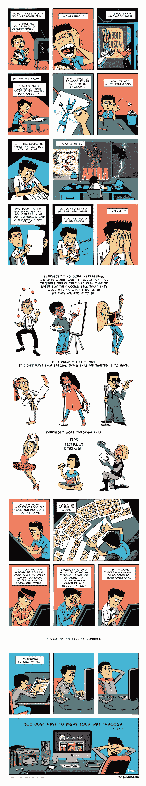

# 成功自学经历的隐藏秘密

> 原文：<https://medium.com/hackernoon/the-hidden-secrets-of-a-successful-self-taught-experience-d78469ddc597>

Photo by [iam Se7en](https://unsplash.com/@sevenshooter?utm_source=medium&utm_medium=referral) on [Unsplash](https://unsplash.com?utm_source=medium&utm_medium=referral)

> 在我们的文化中，我们倾向于将思考和智力与成功和成就等同起来。然而，从很多方面来说，是一种情感品质将那些精通某一领域的人与那些仅仅从事某项工作的人区分开来。我们的渴望、耐心、坚持和信心最终在成功中扮演了比纯粹的推理能力更重要的角色。感觉有动力和活力，我们可以克服几乎任何事情。感到无聊和不安，我们的思想关闭，我们变得越来越被动。—罗伯特·格林，精通

当我在地铁上听格林先生的有声读物时，他的话像火车残骸一样击中了我。

问题不在于我用了错误的提示或技巧来获取新知识。

并不是我没有足够的时间。

我必须向内看，而不是向外看。

# 先了解自己

在我的墙上，有一张便利贴，上面写着:“学习机[学习](https://hackernoon.com/tagged/learning)”

到现在已经快一年了。

我浏览了一些在线课程、教程，并涉猎了一些 Tensorflow 的例子。

我现在可以说我“懂”机器学习了吗？

不完全是。

但是我在尤克里里学的歌比我想象的多，为什么？

因为它很有趣，我可以放给我的女朋友听，这让我很开心。

在我不知情的情况下，它变成了一个积极的情绪反馈环。

相反，当我用机器学习库修改一些代码时，我没有人给我看。

有一次我向我的女朋友展示了[波森特](/tensorflow/real-time-human-pose-estimation-in-the-browser-with-tensorflow-js-7dd0bc881cd5)的能力，我得到了一生中最茫然的反应。

我们学东西都是从一个简单的目的开始的。最初的动机必须通过积极的情绪循环来加强。

确定学习的哪一部分给了你快乐的汁液，并用它来为动力之炉加油。

# 接受权威人物

> *“学习需要谦虚的态度。我们必须承认，有些人比我们更了解我们的领域。他们的优势不是天赋或特权的作用，而是时间和经验的作用罗伯特·格林，精通*

一旦你在某个领域取得成功，这就变得更加困难。我们的大脑欺骗我们，认为我们已经找到了成功的秘密公式。

如果我们做 X，我们得到 y，或者完美的算法。我们倾向于在任何地方应用它。那么我们就失去了发现其他选择的机会。

> 如果你只有一把锤子，那么所有的东西看起来都像钉子——亚伯拉罕·马斯洛

有时候权威人士看起来似乎遥不可及，但是如果你很谦虚，友好地提出要求，他们会非常渴望帮助你。

我非常幸运，当我对是否继续在媒体上写作有疑问时，我联系了安东尼·摩尔。

然后他寄给我这本漫画和一些振奋人心的话，

当我开始运用“我对 ____ 一无所知”的心态时，我的头脑开始与他的建议建立新的联系。一切又变得新鲜有趣了。

# 要耐心

> “河流知道这一点:没有匆忙。总有一天我们会到达那里。”米尔恩

就像上面的漫画。

我们心中有一个我们想去的理想地方。

一旦我们已经踏上了那段旅程，我们想在第二次尝试中走捷径。

如果我们第一次去外国旅游时迷路了，下次我们可能会做更好的调查，把从 A 点到 B 点的时间缩短一半。

当学习新的东西时，你可以重新应用过去对你有效的东西，节省一些时间。

但是没有任何提示或技巧可以取代你必须投入的时间，而且不知道要花多长时间。

# 当你学到一些东西时，总是要给予别人信任

“自学”这个词通常意味着这个人是靠自己的努力获得成功的。

事实是，没有人能完全靠自己学到东西。

即使你不主动接触导师，书和网上的资料都是别人写的。

我有几个伟大的老师，我从未见过他们本人，但我很感激他们在这个世界上的存在。

# 感谢阅读

如果你喜欢这样，鼓掌吧，这样其他人也能从中受益。

# 行动呼吁

终身学习者？我把学习日语和编码的经验收集到一个简明的列表里。获取[列表](https://pages.convertkit.com/7f1dc85d44/61f5f55e74)。