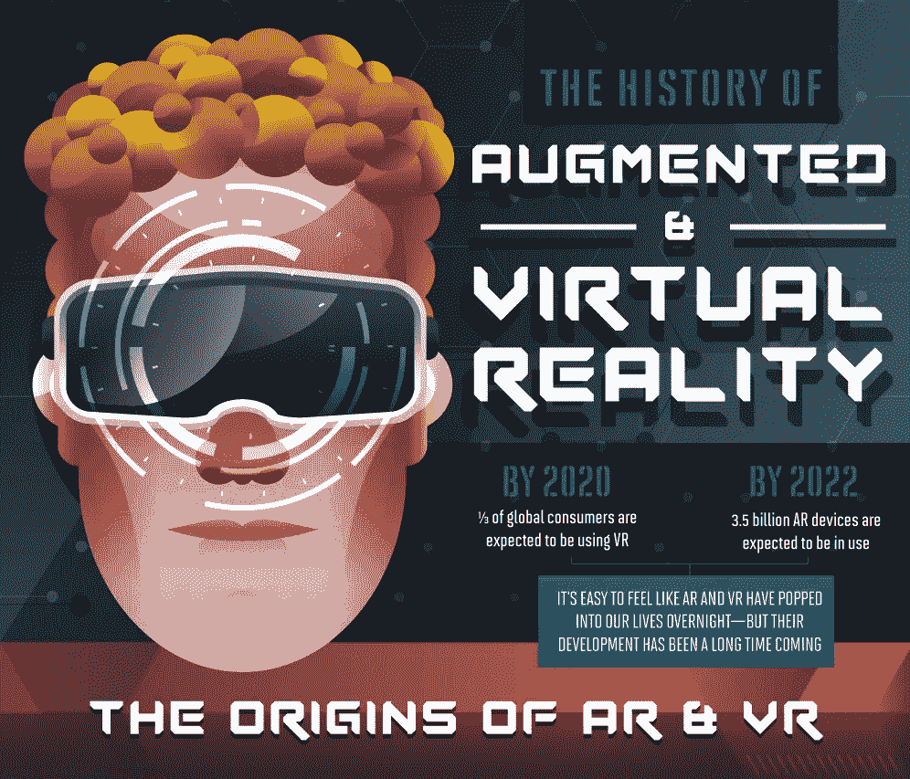
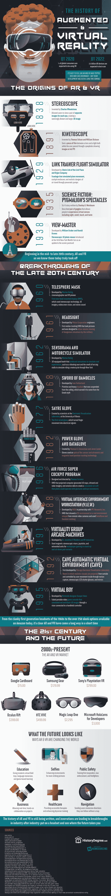

# 增强和虚拟现实的历史

> 原文：<https://medium.com/hackernoon/the-history-of-augmented-and-virtual-reality-f4826ddd8a2>

与所有现代创新一样，认识到技术的起源和发展是预测其未来走向的最佳方式。关于虚拟现实，这再正确不过了。虽然这种技术在过去十年中取得的突飞猛进的宣传是非常真实的，但发展中的进步已经存在多年了，有些甚至可以追溯到内战之前。

1839 年，英国科学家和发明家查尔斯·惠斯通介绍了一种奇怪的装置。他称之为立体镜，一种可以将观众带到完全不同的世界的装置。基于人眼的理解，并充分利用视错觉科学，立体镜允许用户查看一对单独的图像，每只眼睛一个，以创建一个遥远和更大的 3D 图像。150 多年后，20 世纪 90 年代的孩子们正在享受他们全新的任天堂虚拟男孩，挤满了现代技术，但保留了类似的标志性耳机设计，很像第一个立体镜。尽管被认为是一款平淡无奇的便携式游戏机，但虚拟男孩并没有在市场上持续很长时间，而是激发了新一代人在这款富有想象力的设备失败的地方取得了成功。今天，我们有 Oculus Rift 和 Vive 作为过去成功和失败实验的现代见证。

哪里有想象力，哪里就有创新。看看这张信息图，了解我们的 VR 耳机背后的[历史，它的起源，它对其他技术进步领域的意义，以及我们可以从它几十年的发展中学到什么。](https://historydegree.net/history-augmented-virtual-reality/)

