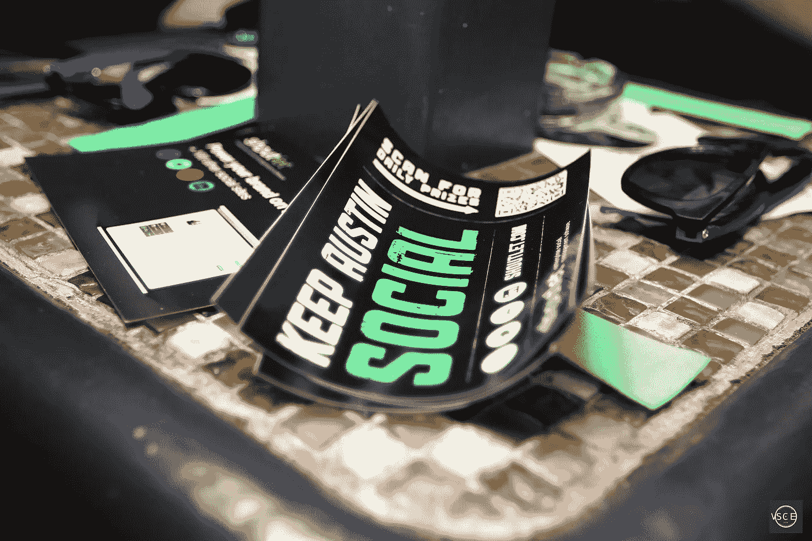

# SXSW 的历史:它是如何开始的

> 原文：<https://medium.com/hackernoon/the-history-of-sxsw-how-it-all-started-66b9aa379ee7>

*Austin 360 Bridge | Photo by Brian Dooley |* [*Flickr*](https://flic.kr/p/oP4cTN) *|* [*CC BY*](https://creativecommons.org/licenses/by-nd/2.0/)

SXSW 是每年春天在德克萨斯州奥斯汀举行的文化和技术节日。今天，这是一个全球现象，每年有数十万人参加这项活动，还有数百万人关注媒体报道。

> 即使你从未听说过它，你也肯定感受到了它对我们文化的影响。但并不总是这样。

# **反主流文化和企业家精神**

20 世纪 60 年代的奥斯丁人口只有现在的四分之一，是一个安静的大学城，拥有全国最好的[公立大学之一](https://www.utexas.edu/about/history-and-traditions)，也可以说是南方最自由的地方之一。随着 70 年代的到来，站在民权运动前线的嬉皮士们在奥斯汀市议会获得了一席之地。

可以肯定地说，在很多方面，奥斯汀是一个反文化的城市。小型地区性银行在金融放松管制中脱颖而出。旧势力无法与新玩家竞争，很快就离开了。

他们的位置被小企业和科技公司取代。IBM ，[德州仪器](https://www.kansascityfed.org/PUBLICAT/newgovernance04/Powers04.pdf)和 AMD 都在奥斯丁设立了工厂，争夺最聪明的 UTA 毕业生。这确实是一种独特的社会经济状况。

这座城市到处都是年轻、有才华、有抱负的人，他们渴望展示自己的能力。持进步价值观的反战示威者掌握着[实际权力](https://legacy.lib.utexas.edu/taro/aushc/00558/00558-P.html)。小企业正在蓬勃发展。然后，在 1973 年，德克萨斯州将饮酒年龄降低到 18 岁，这一切终于走到了一起。因为喝醉的年轻人最喜欢现场音乐。

# **奥斯汀城市界限和 70 年代音乐热潮**

奥斯汀的音乐界似乎在一夜之间爆发了。任何一个大到足以容纳乐队和扩音系统的地方都是如此。新的商店在城市各处开张了。他们中的一些人今天仍然在这里，那些被时间遗忘的人几乎被遗忘了。70 年代最有影响力的奥斯汀会场是[犰狳世界总部](http://awhq.com)。它体现了这座城市新的本土身份，一种独特的嬉皮士和乡巴佬文化的融合，被称为“红脖子摇滚”。

这个场地*就是*奥斯丁之声。

1976 年，一位年轻的电视制作人比尔·阿霍斯决定向全国广播这一声音。他的作品不是别人，正是美国电视上播放时间最长的音乐节目——奥斯汀城市极限。对于奥斯汀人来说，这不仅仅是一个电视节目。这是一个文化机构，旨在让这座城市独特的声音在未来几十年里一直被人们听到。

# **SXSW 不太可能的诞生**

然而，经济繁荣是短暂的。随着奥斯汀人口的持续增长，德克萨斯州陷入了全面的银行业危机。犰狳世界总部于 1980 年关闭。尽管《奥斯汀城市极限》很受欢迎，但它仍然是在预算有限的情况下拍摄的。

里根政府将饮酒年龄降低到 21 岁，理由是酒后驾车事故增加。失业是可怕的。必须采取措施拯救这座城市的音乐遗产，并赋予企业家权力。在这个十年即将结束之际，两个决定决定了这座城市的未来。

Silicon Prairie Party at SXSW *| Photo by* Silicon Prairie News *|* [*Flickr*](https://www.flickr.com/photos/siliconprairienews/5728280533/) *|* [*CC BY*](https://creativecommons.org/licenses/by/2.0/)

首先是奥斯汀科技孵化器的建立。另一个是由当地一家另类报纸的团队成立的 SXSW。

# **SXSW 音乐:奥斯汀的新声音**

第一届 SXSW 大获成功。700 人到场观看了 [177 位艺术家](https://www.sxsw.com/music/2016/six-surprising-things-you-probably-didnt-know-about-sxsw/)在超过 15 个场馆的演出，大大超出了[的预期出席人数](https://www.sxsw.com/about/history/)。不管他们卖什么，人们都想要。当地人很高兴他们的城市得到了关注。所以这个节日一直持续发展，直到它成为我们今天所知道的发现工厂。

约翰·梅耶价值数百万美元的职业生涯始于 SXSW。白线条乐团 [2001 年的亮相](https://www.youtube.com/playlist?list=PLOpiByN4Y6J0_vaa-4FT2ZEL_vgiZN93L)将他们推向主流。

2004 年，詹姆斯·布朗特在半空的房间里演奏时遇到了他最畅销首张专辑的制作人。在未能成为一名基督教签名创作人后，凯蒂·佩里广受好评的 2007 年 SXSW set 促成了一份唱片合同，使她成为现在的超级巨星。

如今，每年有来自世界各地的 5 万多人参加这个节日，同时有 2000 多个乐队表演，希望引起人们的注意。

# **SXSW 互动:早期**

SXSW 不仅仅是一个音乐节。首先，这是一个谈话的地方。它旨在将创作者聚集在一起，并点燃文化之火，这种火将在活动结束后持续很长时间。

第一届 SXSW 有一些行业会议的元素。有一个主题演讲，以及多个小组讨论和研讨会。以个人电脑的发展速度，数字媒体成为这个节日永久的一部分只是时间问题。

> 第一个 SXSW Interactive，或者当时叫做 SXSW Film & Multimedia，发生在 1994 年。那一年，下一件大事是… [光盘](https://www.philips.com/a-w/research/technologies/cd/cd-family.html)。

人们对能够将音乐和视频放在同一个光盘上感到很惊讶。发布会的媒体部分被认为是次要的，但它在第二年就超越了电影部分，成为了它自己的东西。

在会议的前四个阶段，最受欢迎的景点之一是万维网剧院，它只是一个有几台联网计算机的房间。人们排了几个小时的队来尝试自己上网。托德·德伦格伦在 1995 年预测在线媒体传播无处不在时，引起了一些人的不满。

回想起来，这一切听起来可能很滑稽，但当时人们并不十分了解这项新技术的全部潜力。

Silicon Prairie Party at SXSW *| Photo by* Ed Schipul *|* [*Flickr*](https://flic.kr/p/rnbHUd) *|* [*CC BY*](https://creativecommons.org/licenses/by/2.0/)

> 会议本身的潜力也被低估了。就像音乐节的音乐部分一样，随着时间的推移，它越来越大，巩固了它在世纪之交后在该国 it 界的地位。

# **白手起家:SXSW 加速器的故事**

SXSW 帮助普及的东西包括:视频流(1999 年)、在线博客(或 2000 年称为网络日志)、可穿戴技术(2001 年)和 Wi-Fi (2003 年)。很少甚至没有讨论资金和风险资本。如果你喜欢，你可以去旧金山或纽约参加活动。SXSW 把自己定位为理想主义者的 IT 大会。这被证明是其最大的资产*和*其最大的弱点。

很多人都喜欢这种新的、轻松的 IT 会议形式。也许，太多了。主旨发言人变得越来越花哨了。创业公司越来越大。博主。Friendster。推特。终于在 2007 年，SXSW Interactive 成为了它曾经鄙视的东西，推出了 SXSW 加速器。这个节日已经超越了它的独立根基。是时候主宰这个行业了。

确实如此。

# **走快点！**

SXSW Pitch 是一项面向全球创业公司的活动。在 11 年的时间里，它帮助新技术企业筹集了超过 50 亿美元的资金。虽然你可能没有听说过它，但你肯定至少使用过那里推介的一些产品。

2010 年 2 月，一群 24 名[前斯坦福研究所员工](https://www.huffingtonpost.com/2013/01/22/siri-do-engine-apple-iphone_n_2499165.html)发布了一款[免费的 iOS 应用](https://techcrunch.com/2010/02/04/siri-iphone-personal-assistant/)。他们用 2400 万美元的资金研究了两年。看起来不太理想。对于大多数 iPhone 机型来说，它太耗费处理器资源了。他们在 SXSW 进行了推介，仅仅一个月后，就被苹果收购了。当然，我说的是 Siri。

SXSW 的另一个成功故事是 kabb age——一个面向企业的在线贷款平台。它接着从日本科技巨头软银获得了 5000 万美元的资金，并且已经足够大，可以收购另一家金融科技初创公司。

> 每年都有数十家初创公司参加竞赛，希望他们的故事也能成功。

**关于作者:**

> *Dmitry 与品牌合作，创建内容并大规模推广企业文化。他是 Techstars Startup Digest 的元老之一。除此之外，他还担任 SXSW Pitch 活动和 SXSW Release IT 活动的顾问。*
> 
> *邮箱:Dmitry . kabanov[@]startupdigestmail.com*