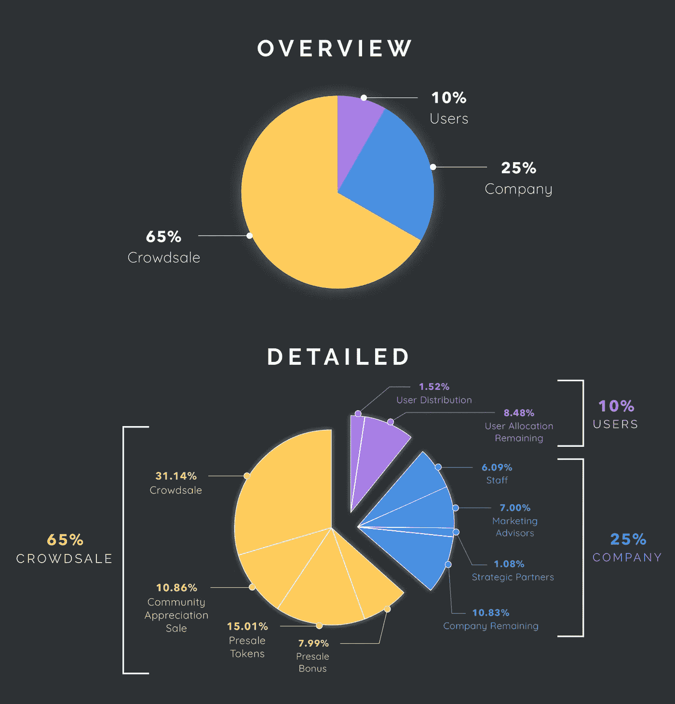

# 加密废话的搭便车指南:如何识别狗屎硬币？

> 原文：<https://medium.com/hackernoon/the-hitchhikers-guide-to-crypto-bullshit-how-to-spot-a-shitcoin-4ab9191d73b2>

想投资 ICO，或者得到一些已经交易的硬币？太棒了，欢迎加入！在你开始之前，让我给你一些线索，用实际项目中的例子来识别不可靠的项目。这些技巧来自我的经验(和失败)以及我与朋友和加密货币社区的讨论。

[*你会说法语？一路顺风。在 est bien。*](https://tokenbrice.xyz/fr/posts/2018/hitchhiker-crypto-guide/)

# 白皮书总是最具洞察力的资源

白皮书(本文其余部分为 WP)可能会让人害怕。虽然有些人设法让它保持简短(大约 10 页)，但其他人可以达到数百页，这是衡量项目严肃性的最佳地方。**一旦我认真考虑一枚硬币**，它仍然是我检查的第一件事。那么在 WP 中你应该密切关注什么呢？

## 英语

令人惊讶？如果你这么说就没那么多了:**如何信任一个无法用分散的加密货币项目推出完美 WP 的组织？这可能看起来很小，甚至很琐碎，但如果你在 WP 中发现低质量的英语或重复的错别字，你最好开始运行。**

## 技术模糊的大承诺

这可能是最常见的，因为大多数人不会阅读白皮书的技术部分。即使你不完全了解技术细节，一个试图掩盖谎言的 WP 和一个透明的 WP 之间的区别还是很明显的。 [SFIcoin 是这方面的完美例子——DONT 投资:骗局](http://www.sficoin.co/white-paper/white-paper.pdf)，完整配方在此:

*   **没有任何意义的大承诺**:“下一个全球支付系统”。
*   **无支持声明**:他们的 WP 详细描述了愿景、路线图、用例，但没有涉及任何技术。

> 最后但同样重要的是，SFICOIN 将成为第一种领先的点对点加密货币，用于管理高价值的即时支付。

*   **《我们会是第一个 X 的》**:海量红旗。加密货币没有确定性。
*   **营销人员为营销人员制作的 WP**大量的视觉效果，大量的设计工作，但总的来说，它缺乏真正的意义。

一个 WP 变得相当专业是可以的(这里是 Stellar 的——XLM ),但是用行话来掩盖缺乏技术解决方案是不行的。

## 白皮书达尔文奖

想看看一个糟糕的 WP 是什么样子吗？[查一下纳邦的](https://narbonne.io/Narbonne.pdf)，7 个月了，找不到更差的了。在这 22 页中，大约有 18 页是关于未来的模仿意大利面。这篇论文的大部分内容都很普通，里面的很多东西都很奇怪。我不得不选择一个，所以我们开始吧，在纳邦，以太 **i** um 和瓦 **w** es 之间的比较。是的，你没看错，他们连以太坊和波都拼不好。

这么多东西需要在这个表格里揭穿，其实是一个很好的练习。这里有几个你做剩下的:

*   “在[区块链](https://hackernoon.com/tagged/blockchain)记账”:我甚至不确定这是什么意思，但我认为像[REQ(REQ)](https://request.network/#/)这样的项目为以太坊涵盖了这一点。
*   《手机银行》:您好 [OmiseGo](https://omisego.network/) ！
*   “人工智能，聊天机器人，语音控制”:严格来说，这个项目(银行的基础设施)没有任何用处，但却是流行语，所以它们必须出现在这里！

## 一个合适的 WP 是什么样子的？

WP 是一份**技术文件**，通常至少包括:

1.  项目的远景/团队试图解决什么问题，
2.  针对问题提出的技术解决方案概述以及选择这些解决方案的原因。
3.  所选解决方案的技术实现细节，
4.  一个可靠的交付路线图，
5.  关于令牌的技术信息:令牌类型、总量、令牌机制…
6.  ICO 的规格，如果有的话。

要磨练自己的技能，没有比 OG 更好的了！我邀请你阅读由 Satoshi 撰写的[原创比特币白皮书](https://bitcoin.org/bitcoin.pdf)。您还可以检查:

*   [以太坊的 WP](https://github.com/ethereum/wiki/wiki/White-Paper) 提醒你**设计不必花里胡哨**(是 GitHub wiki)如果基本面健全。
*   卡尔达诺的 WPs:分为“[哲学 WP](https://www.cardano.org/en/philosophy/) 和[学术论文](https://www.cardano.org/en/academic-papers/)，我认为这个团队做了出色的工作，使他们的项目对那些感兴趣的人来说是易懂的。

Wanna get fancy? [Get yourself a BTC whitepaper poster.](https://btcposter.com/)

# 每秒交易量的神话

现在我们已经讨论了白皮书，让我来讨论今天文章的另一大块内容:每秒事务数(TPS)的神话。

## 每秒交易量:一个方便的谎言

**TPS 根本没有任何意义。**那么它为什么这么受欢迎呢？嗯，这有点像处理器的 GHz:它曾经是唯一宣传的东西。这在某种程度上是有意义的，**它给人的印象是**你有一个标准，允许你比较实际上不可比的不同处理器:越高越好，对吗？

不，你可以拥有一个 3.5 GHz 的 32 位 1 核处理器和一个 2 GHz 的 64 位 8 核处理器。猜猜哪个提供的计算能力最强？毫无疑问是第二个。

对于代币来说是完全一样的，除了在这里重要的不仅仅是能量。如果你错过了，让我从我以前的文章中快速提醒一下[:](/coinmonks/why-decentralization-matters-a-12-min-overview-for-the-layman-6ec572d35af6)

> 让系统更加分散的选择不是为了性能；这是为了分散化带来的好处。它允许创造新的服务，提供以前不可能的保证。

就算 TPS 毫无意义，现在也差不多在意料之中了。新来的投资者会非常信任这个非常误导人的指标，而且大多数项目都会宣传给定的 TPS。很好！这给了你一个他们有多诚实的好迹象:

## 使用 TPS 来减少废话

考虑硬币 A，广告 1M TPS，硬币 B 广告 10 TPS。它们支持的功能呢？去中心化呢？团队愿景呢？社区支持？只要看看数字，我现在就知道硬币 A 是垃圾，硬币 B 可能是好的。

当前的技术水平允许最大 10 000 TPS(已经很大了),而不会过度集中。任何承诺高于此值的硬币要么是:

*   **在分权上做出妥协。** [这是 EOS](/@CryptoPeterG/eos-centralization-problem-bd7a392eeed2) 的主要例子，它的 21 个区块生产商在网络上拥有巨大的权力。
*   **实验室场景**:你可以看到一些硬币宣传疯狂的 TPS，有些甚至会展示一个测试网络来支持他们的主张。要寻找的是测试网络的设置:通常，它只是几个节点。在三个节点的网络上很容易达到高 TPS，但是随着节点的增加，这变得越来越困难。
*   依靠新的和以前未测试过的技术解决方案。 [NANO](https://nano.org/en) 使用一种叫做 block-lattice 的新型分类器，在理想条件下支持高达 7 000 TPS。 [IOTA](https://www.iota.org/) 使用了另一个全新的解决方案(Tangle ),目前支持大约 800 TPS，但它将随着用户的采用而扩展。这两项是最激进的“账本创新”,也是最有前途的。它们是当前的艺术状态:对我来说，任何没有全新技术解决方案的 TPS 项目都是可疑的。
*   将**链外扩展**解决方案包含在他们的 TPS 计算中，这又回到了第一点:过度集中。
*   **在计算中加入新的机制，如分片**。以太坊可以说是最强大的开发社区之一，离真正实现分片还有 1 到 2 年的时间。一群新人怎么能在 6 个月内完成这个？
*   从他们的帽子里抽出这个号码。

*注意:一个加密货币开发项目通常开始时相当集中。重要的是团队有一个逐步开放网络的计划。例如，NEO 目前相当集中，但是现在基础设施已经健全* [*团队正在朝着更加分散*](https://neo.org/blog/details/4089) *的方向前进。*

在我们结束之前，让我们深入 ICOs 的疯狂世界，这是一个如此狂野的西部，它值得另一个单独的部分。

# 要寻找的 ICOs 危险信号

## 早起的鸟儿有大折扣

如果你看到一个 ICO 在销售的第一阶段提供巨大的折扣(> 30%)，这通常是一个灾难的处方。事实上，这意味着:

*   由于早起的鸟儿有如此大的折扣，一旦代币上市，他们有强烈的动机以 ICO 价格甚至略低于 ICO 价格抛售:如果他们卖得足够快，就保证免费。
*   为什么团队需要如此强烈的激励来推动销售？对于几乎没有效用的令牌，我经常看到这种模式。
*   即使上述两种情况不会发生，有一种情况是肯定的:巨大的折扣促使代币集中在少数人手里:它吸引了鲸鱼。大幅度的折扣是政治集权和治理问题的一剂良方。

## 没有产品，演示或代码

ico 的最大风险在于，你实际上是在投资一个承诺或愿景。然而，一些人一旦有了工作阿尔法就要钱，而另一些人一旦 WP 准备好就直接跑到 ICO。后者风险更大。如果有可用的 alpha 或演示版本，请务必查看！

即使你不是开发人员，检查项目的 GitHub 库总是很有见地的。 GitHub 让你不用看代码就能很容易地看到存储库有多活跃。这种方法远非完美，因为有办法让回购看起来很活跃，即使它并不活跃。

## 球队不匹配

如果你正在认真考虑投资一个 ICO，我建议你谷歌一下最杰出的团队成员。看看他们的 LinkedIn，他们的 Twitter，他们以前的公司等等。如果你发现不活跃的档案，这通常是一个非常不好的迹象。你也可能在最近的地方发现骷髅，比如一个团队成员参与了另一个被证明是失败或骗局的加密项目。

Screenshot for [Banano, a NANO fork](https://banano.co.in/) that doesn’t take itself too seriously

低质量或低频率的社交媒体也是一个亮橙色的信号。这些人必须推销他们的项目，获得用户和合作伙伴。如果他们不能推销自己，这已经是一个不稳定的开始。

**ICO 骗局广告一个有声望的顾问也很常见……这与项目**无关。仔细检查任何引人注目的人物，以确保他们确实参与了项目。如果你看到聪作为顾问，运行！

## 不适当的令牌分发

令牌分布图通常出现在每个 WP 中。如果不是，本质上就像“把你的钱给我们，我们不会告诉你我们会用它做什么”…快跑！

它通常看起来像一个饼状图。最透明的项目有两个:一个用于分发代币，另一个涵盖团队如何使用资金。

Storm token distribution is pretty good ([source](https://blog.stormtoken.com/token-structure-and-ceo-update-bd055860251e))

团队预留一部分令牌用于项目的开发是可以的，甚至是很好的。你必须注意分配给团队的份额:对于合理的项目，它可以从 10%到 30%不等。

在另一个极端，你有像 Ripple (XRP)这样的硬币，团队拥有总供应量的 60%。对于代币持有者来说，这是一个重大风险:首先，这是一个巨大的集中化载体。此外，这意味着**团队可以严重操纵其硬币**的价格。

*注意:几个月前，面对对这种非常集中的分发的强烈反对，该团队使用智能合同建立了一个托管系统。* [*55 个十亿代币现在被托管*](https://ripple.com/dev-blog/explanation-ripples-xrp-escrow/) *并以每月 10 亿的速度放出。它没有改变任何潜在的集中化问题，让我想知道哪种团队需要每月 5 亿美元(XRP 的当前价格约 0.5 美元)用于开发/合作/其他。此外，* ***由于这些代币现在已被锁定，因此不计入流通供应量(~39B)*** *)，这可能会让投资者放心，但纯粹是误导。实际供应量是 100 亿代币。个人观点:整个举动感觉像是营销噱头。*

# 结论

我写这篇文章是为了给你提供一些线索，帮助你发现不可靠的加密项目。总的来说，我希望你现在明白投资前阅读的越多，风险就越低。我劝你不要冲动投资。即使这是世界上最好的项目，你也可以睡一觉，多读一些书，几天后以全新的视角决定你是否想加入。

最后，让我给你更多我用来快速了解项目严重性的技巧:

*   Google search `site:reddit.com "token name (+scam/shitcoin/issues...)"`:这个方法允许您在 Reddit 上搜索特定的令牌。如果项目中有一个巨大的危险信号，通常会在 Reddit 的某个地方记录下来。补充说明:Reddit 现在变得越来越部落化了。在给定的令牌上找到可靠信息的最佳地方当然不是令牌子集合。如果你想对 XRP 有一个客观的看法，不要去/r/Ripple/网站。
*   **不要相信单一的消息来源，要经常与他们沟通！贪婪的人在互联网上推广不可靠的项目，永远不要盲目信任一个人，即使他看起来很诚实。**
*   有几种服务可以组织对 ico 的机构群体尽职调查。 [ICOCheck](https://icocheck.io/) 是一款相当可靠的软件，但你也要做好自己的尽职调查。

最后但同样重要的是:**我强烈建议你至少在投资 cryptos 的第一年不要投资 ico**。很多人都戏剧性地失败了。根据你愿意承担的风险，你最好把自己限制在前 25/100/200 个代币。即使在这些项目中，也有许多值得怀疑的项目:小心，投资愉快！

PS:你有什么招数能在这一块发现一个你没见过的不靠谱项目？下面随意分享。

如果你喜欢这篇文章，请告诉我，并查看我的维基以获得更多类似的内容。 **别忘了拍拍它** **帮它传播:**可以一直按👏高达 50 次鼓掌。

本文是一篇原文(法语) [EcoCrypto.fr](https://ecocrypto.fr) 故事的翻译。