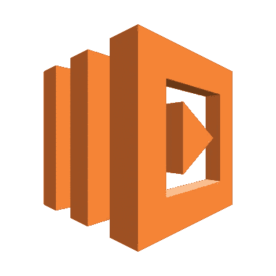
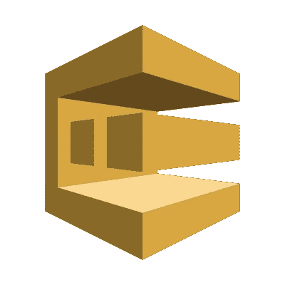
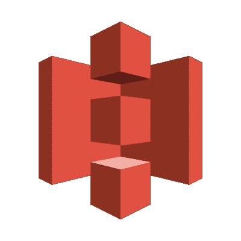

# 无服务器的搭便车指南

> 原文：<https://medium.com/hackernoon/the-hitchhikers-guide-to-serverless-ec5efb8075d6>

## 关于无服务器，宇宙和一切你应该知道的。

正如任何新的技术一样，T2 的无服务器生态系统正在迅速发展。云提供商每月都会发布新的功能和服务。作为一个新用户，这可能会令人不知所措。所以在这篇文章中，我将帮助你搞清楚[无服务器](https://hackernoon.com/tagged/serverless)动物园中的谁是谁——我将概述构建无服务器应用程序时你应该知道的服务，讨论你何时应该(或不应该)使用它们，并列出使用它们时的一些常见问题。

Serverless was the top mentioned technology during AWS re:Invent 2019.

我将把重点放在 AWS 无服务器服务上，因为 AWS 是我选择的云。然而，其他云提供商的产品与我们将在这里讨论的非常相似，所以你可以使用类似于 [AWS 到 GCP](https://cloud.google.com/free/docs/map-aws-google-cloud-platform) 或 [AWS 到 Azure](https://docs.microsoft.com/en-us/azure/architecture/aws-professional/services) 的列表，这些列表就像是云提供商的罗塞塔石碑，帮助你开始选择云供应商。

在我们开始之前，还有一件事:无服务器是有优势的，但是整个生态系统在开始时可能会很难接受。因此，我能给你的关于开始使用无服务器的最好建议，也是在银河系旅行的一个很好的建议，是**不要惊慌**。一开始似乎很难掌握所有的东西，但是学习曲线非常陡峭，结果是值得的。所以，废话少说，让我们开始我们的无服务器之旅。

DON’T PANIC. It’s easier then it looks.

# 无服务器的宇宙

## 希腊字母的第 11 个

对于开始我们的无服务器之旅来说，Lambda 是显而易见的选择。它是一种 Faas(功能即服务)产品，这是一种由云供应商提供的事件驱动的计算服务，允许您在不管理任何服务器的情况下执行代码。您压缩您的代码并将其发送给云提供商。然后配置代码应该执行的事件(比如 HTTP 请求、放入队列的消息等。)云提供商负责剩下的工作。

Lambda(和 Faas)是大多数无服务器系统不可或缺的一部分。它可以自动扩展，并且是按使用付费的(就像大多数无服务器服务一样)。我建议在大多数情况下选择 Lambda，尽管还有一些其他无服务器计算服务针对更具体的用例，我们将在后面介绍。

但是，在使用 Lambda 时，您应该注意一些新的问题:

1.  Lambda 有一个时间、内存和并发限制——确保你没有达到它，否则 AWS 将节流你的功能！同样，如果构建一个面向用户的 API，或者一个延迟很大的 API，你应该注意[冷启动](https://blog.octo.com/en/cold-start-warm-start-with-aws-lambda/)。
2.  避免独石——无服务器生态系统与[微服务架构](https://microservices.io/)完美契合。不要把一个完整的 web 应用打包到一个 Lambda 中。你的每一个函数都应该做一件事情。
3.  当使用 Lambda 时，确保你的函数**转换**数据，而不是**传输**数据。有更好的 AWS 服务可以使用。

Lambda 是大多数大型无服务器应用的基石，因此有更多的陷阱，并且需要时间来适应这种无服务器思维。但这应该能让你步入正轨。

## SQS

SQS(简单队列服务)是一个完全无服务器的队列服务。您可以通过点击一个按钮来创建一个队列，并开始通过它发送消息。队列是分布式系统中的常见组件。它们用于解耦我们系统的不同部分，因此每个部分都可以独立运行。SQS 提供了两种类型的队列:保证消息顺序的 FIFO 队列和不保证顺序的标准队列，但是队列的吞吐量几乎是无限的。

在无服务器系统中使用 SQS 队列作为组件时，有几点需要注意:

1.  一个 SQS 队列只能有一个客户端。这意味着，如果你想让信息到达多个目的地，你应该使用另一种服务(如 SNS 或 Kinesis)。从架构上讲，**拥有队列的微服务应该是接收端** —每个人都可以给队列发消息，但是只有一个服务会对消息做出反应。
2.  当使用 SQS 队列作为[λ](#24e9)函数的触发器时，只能使用标准(非 FIFO)队列。这是有意义的，因为您希望允许 Lambdas 为不同的队列消息并发执行。如果你确实需要按顺序处理，看看 Kinesis 吧。

## 社交网站（Social Network Site 的缩写）

[SNS](https://aws.amazon.com/sns/) (简单通知服务)是一种托管的发布/订阅服务。一个 SNS“实体”叫做话题。每个主题可以有几个订阅者(HTTP 端点、Lambda 函数或 SQS 队列)。

SNS 的一个典型用例是服务向系统的其余部分广播事件。假设我有几个微服务需要对一个新用户的注册做出反应。每当用户注册时，我可以让我的注册服务发布一条消息，并将所有其他组件作为该主题的订阅者(通过 Lambda 触发器、SQS 消息或 HTTP 挂钩)。经典酒吧/酒馆。

使用社交网络时，请记住以下几点:

1.  使用 SNS 有两种架构设置:一对多和多对多。要么**发送端拥有主题**，要么是自己的一个没有所有者的服务。如果你的 SNS 只有一个客户(并且一直会有，不仅仅是因为你还没有开发系统的那个部分)并且归他所有——也许 SNS 不是这个用例的正确选择。考虑使用 [SQS](#6d56) 队列/变身。
2.  [与其他消息服务相比，社交网络在规模上可能变得相当昂贵](https://hackernoon.com/applying-the-pub-sub-and-push-pull-messaging-patterns-with-aws-lambda-73d5ee346faa#bf71)。在某些情况下，可以考虑使用 [Kinesis](#37e3) 来代替。

## 由外界刺激引起的不随意运动

[Kinesis](https://aws.amazon.com/kinesis/) 是一个完全管理的流。它允许以非常高的规模有序地处理数据记录。为了支持并行数据处理，每个流都由几个“碎片”组成，并且只有碎片被按顺序处理。在将消息插入 Kinesis 时，您可以通过使用相同的标识符来保证同一个碎片将处理两个不同的消息。

Kinesis 是一个服务系列，包括标准的 Kinesis、 [Kinesis 视频流](https://aws.amazon.com/kinesis/video-streams/)和 [Kinesis Firehose](https://aws.amazon.com/kinesis/data-firehose/) ，后者是一个用于数据聚合的服务。

你可以使用 KCL (Kinesis 客户端库)从 Kinesis 读取数据，或者用它触发一个 Lambda。以下是一些关于将 Kinesis 集成到无服务器系统的注意事项:

1.  一个 Kinesis 流可以支持多个消费者，并将数据复制给他们所有人([互不影响](https://docs.aws.amazon.com/streams/latest/dev/introduction-to-enhanced-consumers.html))。有用！
2.  一个 Kinesis 流可以有许多不同的用例(从架构上来说)。因为它的目的是作为一个流，所以有时把它作为一个服务的输入，有时作为一个输出，有时作为一个完全独立的服务是有意义的。
3.  Kinesis 是为规模而生的，它的定价很好。不要害怕在系统最繁忙的部分使用它。
4.  Kinesis 还不支持自动缩放。这意味着您必须提前提供碎片数量。有一些解决这个问题的方法，但是在使用 kinesis 的时候需要考虑。

## 阶跃函数

由于 Lambda 函数是无状态的，管理状态有时会很困难。但是不要害怕，因为[步功能](https://aws.amazon.com/step-functions/)是来救援的！Step Functions 是一个 AWS 服务，它允许您以代码的形式管理状态。它是一种编排服务，允许您将工作流建模为状态机。你可以在这个由[崔琰](https://twitter.com/theburningmonk?lang=en)(我剽窃了他的名字)写的[精彩帖子](https://epsagon.com/blog/hitchhikers-guide-to-aws-step-functions/)中找到更多细节。

请注意 [AWS 在 re:Invent 2018](https://aws.amazon.com/about-aws/whats-new/2018/11/aws-step-functions-adds-eight-more-service-integrations/) 上宣布支持 Step 函数的更多服务集成，如与 DynamoDB、Fargate、SNS 和 SQS 的集成，所以你可以使用 Step 函数来编排很多东西，而不仅仅是 Lambda。这项服务有点昂贵，所以在一些用例中，它可能有点过头了，但对于大多数情况来说，它是一个非常棒的工具。

## S3

[S3](https://aws.amazon.com/s3/) (简单存储服务)可能是世界上最流行的对象存储服务。虽然它有许多可能的使用案例(例如备份、静态网站)，但无服务器系统显示了它的全部潜力。

构建无服务器微服务时，通常需要一些数据库。在某些情况下，S3 将是一个很好的选择——它易于使用，高度可用，耐用，而且非常便宜。它与 Lambda 集成在一起，您可以将它配置为它的一个事件源。此外，当与其他无服务器服务(如 Athena 或 Glue)结合使用时，尽管它很简单，但还是非常强大。

然而，当选择 S3 作为您的服务的数据库时，首先要确保它是一个合适的数据库:S3 是一个对象存储库。它没有像锁定机制和事务这样的数据库特性，这对于一些需要并行访问数据库的服务来说是一个问题(Lambda 的常见模式)，所以要确保情况不是这样(现在或在可预见的将来)。如果你没有并行写/它们不会中断你的服务，恭喜你，S3 可能是一个很好的选择。

## DynamoDB

[DynamoDB](https://aws.amazon.com/dynamodb/) 是一个无服务器的键值文档数据库。它是在 AWS 上构建无服务器应用程序的流行数据库。当我说 DynamoDB 是无服务器的时，它需要几个特性:

1.  开始时，您只需创建一个表，无需配置服务器。
2.  DynamoDB 的 API 在 HTTP 端点之上——使用它时不需要担心数据库连接，这在使用 Lambda 时非常好，因为它可以有数千个并行执行。
3.  自从 [AWS 最新公告](https://aws.amazon.com/about-aws/whats-new/2018/11/announcing-amazon-dynamodb-on-demand/)以来，你可以在按使用付费模式下使用 DynamoDB(你仍然可以使用保留容量，有时会便宜一点)

DynamoDB 是一个非常灵活的数据库，最适合单一用途的服务。如果你用 DynamoDB 构建一个整体，并把它作为一个通用的数据库，那你的日子就不好过了。

我这样说并不是因为这是不可能的，或者因为这将比其他数据库更难(可能会，但这不是重点)。这是因为当您尽可能保持数据简单时，DynamoDB 是最容易使用的。为许多不同的目的添加许多索引(对于每个目的，您可能需要一小部分数据)是一种反模式。附加索引在某些情况下是有效的，但是要明智地使用它们。

DynamoDB 最近宣布[事务支持](https://aws.amazon.com/blogs/aws/new-amazon-dynamodb-transactions/)，这是使其成为终极无服务器数据库所缺少的最后一块。然而，有些情况下 DynamoDB 并不是最合适的:当您必须对数据执行复杂的搜索时，或者当您持有原始分析或时间序列数据时，您可能会发现 DynamoDB 很难使用。对于这些情况，使用[其他无服务器数据库之一。](#d0d4)

## 其他无服务器数据库

AWS 最近宣布了除 DynamoDB 之外的几个无服务器数据库。有些仍处于预览阶段，但将于今年发布。我不会单独阐述它们中的每一个(因为 DynamoDB 非常适合大多数用例，至少是基本用例)，但这并不意味着你不应该使用它们。恰恰相反——您应该充分了解它们，并使用最适合您的用例的一个！永远要为正确的工作准备正确的工具。

Serverless databases on AWS. choose from key-value (DynamoDB), graph (Neptune), time-series (Timestream) or ledger (QLDB)

## API 网关

[API 网关](https://aws.amazon.com/api-gateway/)是应用程序的网关。它让你可以轻松地管理你的 API，并集成了许多计算服务来处理请求(Lambda 就是其中之一！).它是基于 REST 的(意味着您可以使用不同的 HTTP 动词)，并且有一些特性可以让您更好地控制 API，比如对 API 设置限制或对 API 使用不同的授权者，从而将身份验证逻辑与主要业务逻辑分离开来。

虽然这是一个方便的服务，但请注意，它给你的请求增加了一些延迟(例如，与通过 SDK 直接调用 Lambda 相比)，而且它不是很便宜(也不太贵，但在中间)。API Gateway 是 REST 面向用户的 API 的绝佳选择。对于内部 API 同步调用(微服务之间)，这取决于用例。在这种情况下，不要只是将 API Gateway 作为默认设置——比如，检查一下直接调用另一个服务 Lambda 有什么好处。有时候会有一些；有时候不会。

## AppSync

这一个令人兴奋。我们已经提到，你应该使用 Lambda 来转换，而不是传输。但是(假设您正在构建一个面向用户的应用程序)您应该如何向用户发送数据呢？这不正是 Lambda + API Gateway 所做的吗？简而言之就是可以，但是你可以做得更好。

[AppSync](https://aws.amazon.com/appsync/) 是一个面向移动/网络/任何 API 消费应用的无服务器后端。与 API Gateway 不同，它为您的服务使用一个 [GraphQL API](https://graphql.org/learn/) 。要使用 AppSync，您必须定义您的数据模式。然后，您必须设置您的数据源，AppSync 从该数据源读取数据。默认的数据源是 DynamoDB，但是还有许多其他选项(例如，您甚至可以在后台将它与 API Gateway 一起使用，用于遗留 API)。如果您需要在将数据发送给用户之前转换数据，您总是可以对请求使用 Lambda 解析器，并让它处理数据。然后让 AppSync 处理剩下的事情。

编写使用 API Gateway + Lambda 来服务用户请求的 API 可能是一项重要的工作，你可以把它花在其他地方。为此，我强烈推荐使用 AppSync。然而——它确实需要一些 GraphQL 的基础知识。如果您正处于无服务器过渡的开始阶段，有些人可能会希望一步一步来，而不是一次将所有这些新技术都引入到您的堆栈中。

## 雅典娜(&胶水)

爱情分析？这是给你的。Athena 是一个基于 T2 的无服务器工具，它可以让你使用标准的 SQL 查询快速而便宜地分析存储在 S3 的大量数据。数据可以以多种格式存储，包括 CSV、JSON 或 Parquet。另一个值得一提的是，Athena 集成了 [Glue](https://aws.amazon.com/glue/) ，这是一个无服务器的 ETL 服务，它本身就很酷。您可以对 Glue 数据目录中的数据源使用 Athena 查询。

使用 Athena 时要记住的一点是，您不仅要为 Athena 付费(根据读取的万亿字节来定价)，还要为 Athena 进行的 S3 调用付费。需要注意的一些事项包括:

1.  在你的 S3 数据湖上使用分区。当执行 Athena 查询时，可以在 SQL 语句的 WHERE 子句中指定要搜索的分区。这样，您将只扫描您需要的数据。
2.  请注意，在使用 Athena 时，您也要为 S3 API 调用付费。如果您的数据湖由许多小的 S3 文件组成，这可能会变得非常昂贵，并且还会影响性能。
3.  如果你需要一些比 SQL 查询更重的数据，你可以使用 [Glue 的定制脚本](https://docs.aws.amazon.com/glue/latest/dg/console-custom-created.html)来运行一个无服务器的 spark 作业！相当酷。

曼吉特·查耶尔和梅尔特·霍查宁提供了更多与雅典娜合作的技巧

# 好了，现在怎么办？

这只是冰山一角。在写这篇文章的时候，我不得不删掉很多东西，现在仍然很拥挤。像 AWS Batch、CloudFront、Route 53 这样的服务，以及不同的物联网和机器学习服务只是我遗漏的几个其他服务。每当您觉得需要在应用程序中实现某些东西时，您应该检查是否已经存在这样的服务。但是您至少熟悉在您的无服务器之旅中将使用的最基本和最常见的服务。

此外，这些只是基本的构建模块——现在该由您开始使用它们了。你应该注意的一点是，无服务器应用程序的[架构](https://hackernoon.com/tagged/architecture)是非常不同的，学会正确使用它需要一段时间。这里有一个[无服务器转换的例子](https://hackernoon.com/yubls-road-to-serverless-part-1-overview-ca348370acde)(还是崔琰写的)和一篇[关于无服务器设计模式的好文章](https://www.jeremydaly.com/serverless-microservice-patterns-for-aws/)(作者[杰瑞米·戴利](https://twitter.com/jeremy_daly?lang=en)让你对无服务器应用程序有个大概的了解。你也可以使用 AWS 新的[架构良好的工具](https://aws.amazon.com/well-architected-tool/)来帮助你。

像任何新技术一样，走向无服务器需要时间和精力。但好消息是你并不孤单！无服务器社区是一个不断增长的社区，并且真正具有包容性。加入 slack 上的[无服务器论坛](https://join.slack.com/t/serverless-forum/shared_invite/enQtMzc5NjI5MDY5NzE5LTM3MjY3YzljZDE0MDdiOGIyZjg0MDI2ZDM5NDYyODA0MWQ2Y2M0MWZkMjdjZDJhZWUwNjFkZmE4MGRlNjg0YzI)或访问[无服务器日](https://serverlessdays.io/)，你肯定会找到帮助你迈出第一步的人。

再见，感谢所有的功能！