# 电子邮件的圣杯:分析 1300 份 Axios 时事通讯教会了我们什么

> 原文：<https://medium.com/hackernoon/the-holy-grail-of-email-what-analyzing-1-300-axios-newsletters-taught-us-468c23617406>

*在*[*the edge . group*](http://www.theedge.group)*，我们帮助我们的客户创作令人难以置信的时事通讯。作为我们工作的一部分，我们有一个专门的收件箱，在那里我们可以订阅数以千计的时事通讯。这是一系列文章中的第一篇，在这些文章中，我们分析了我们的收件箱，并确定了造就一个伟大产品的因素。*

# **Axios 方式**

吉姆·范德黑(Jim VandeHei)和他的两次联合创始人迈克·艾伦(Mike Allen)用政治的剧本完善了创建易于理解、必读的日常电子邮件的艺术。他们正在建立他们的新成果，Axios，通过采用使 Playbook 成功的元素，并在整个公司灌输它们。

这些要素被总结为术语“[巧妙简洁](https://www.axios.com/the-axios-way-1513304777-96a62ccf-1019-43ea-9ed5-4283e078dc95.html)”，这意味着**没有浪费文字，也没有浪费空间**。为了找到是什么因素让 Smart bright“飞”起来，我们分析了来自十几个作者的 1300 多份 Axios 时事通讯。

我们使用了几个流行的数据科学工具，包括优秀的自然语言处理库 Spacy，来检查过去九个月中每封 Axios 电子邮件的 HTML 元素。我们的发现有助于支持我们对这些电子邮件的直觉，但直到现在我们还无法用大量的数据来证明这一点。(不像情怀，可以衡量时事通讯。)

以下是我们发现的最有趣的事情:

*   每份 Axios 简讯的平均字数约为 1500 字。是的，一些可读性最强、最简洁的时事通讯设法把三篇博客文章的内容塞进了它们的正文。
*   出现最多的粗体短语是 **“为什么重要”**，出现了 2150 次**。**
*   迈克·艾伦不睡觉，可能是一个简讯自动机——他在九个月的时间里发送了 474 条简讯。
*   在所有 1，300 封电子邮件中提到的前五个被点名的实体是:**【特朗普】****【美国】****【中国】****【纽约证券交易所】****系列(A、B 等)。)"**
*   山姆·贝克的邮件中出现次数最多的赞助商是 **PhRMA** 、**共 94 次**；最普遍的赞助商是 IBM——出现在四位作者的时事通讯中。

下面我们用从 Axios 时事通讯语料库中提取的数据来教我们**什么是一篇好的时事通讯**。

# 粗体短语:

粗体短语是 Axios 时事通讯的生命线。它们就像路标，给读者指明作者前进的方向。它们是形成智能简洁概念的关键要素之一。

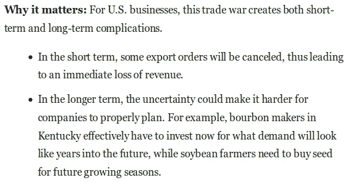

让我们来看看在我们的数据集中，最醒目的短语出现的频率…

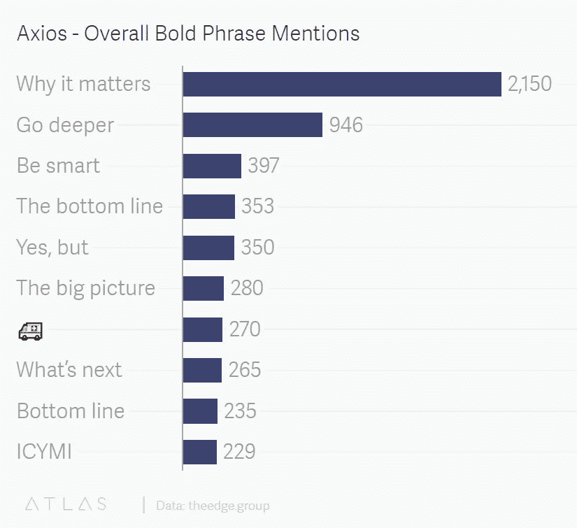

Bold phrases are vital to the Axios newsletter format. Here are the top phrases thoughout all their newsletters.

有粗体短语的段落中平均有多少单词…

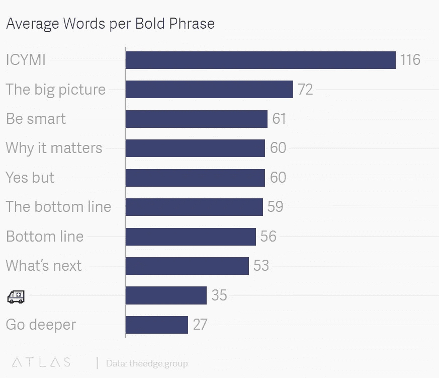

Each bold phrase is followed by a corresponding paragraph and/or list. These are the average word counts of that corresponding content.

五个*中出现频率最高的*短语中的四个有一些特别之处——“为什么重要”、“要聪明”、“底线”和“是的，但是”(“深入”是进一步探索某个主题的片段的指针)。他们相应的广告词都围绕着一个干脆的 **60 字**。

这意味着时事通讯中最常见的段落类型能够在**1-2 行**中传达一个想法。如果这涵盖了聪明简洁的后半部分，那么聪明的东西在哪里呢？为此，我们探究这四个短语的功能。

## **“为什么重要”**

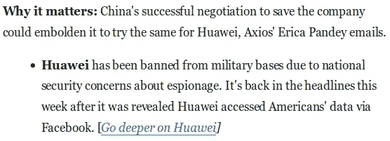

“为什么重要”是大多数 Axios 事件总结的症结所在。这个三个字的短语体现了该公司“帮助人们变得更聪明、更快”的目标。这意味着“抵制所有基于流量的诱惑，把事情变得简单”，简洁地向忙碌、聪明的观众传递严肃的新闻。

*“我们制作的每一个内容都将被分解并以真正的专业知识进行叙述，然后总结成一个可共享的元素。你可以决定是否深入。”*

## **“聪明点”**

运用专业知识的好处之一是能够在需要时坦率地提供不同的观点。

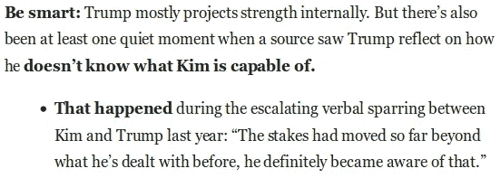

“做个聪明人”是指精通政治、科技、能源政策等的精明朋友。—看着你的眼睛，告诉你一个事件*实际上*把翻译成了什么。再次强调:“帮助人们变得更聪明、更快。”

## **《底线》**

“底线”是奇特的。它有时用作过渡，而不是衔接，用进一步的上下文充实主题:

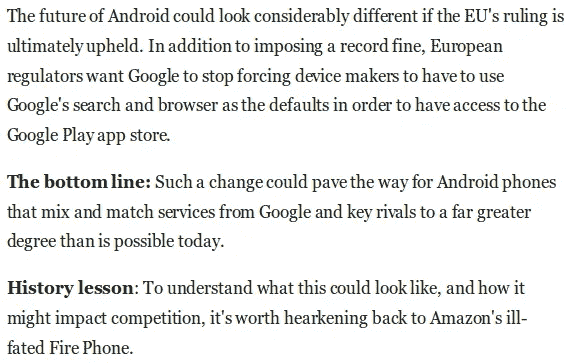

有时这真的是“底线”:

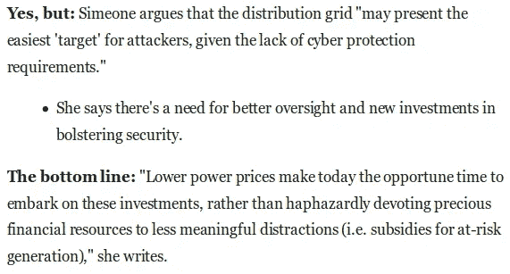

## “是的，但是”

对比传达事件中的细微差别，而细微差别有助于智能报道。“是的，但是”是这方面的一个范例。

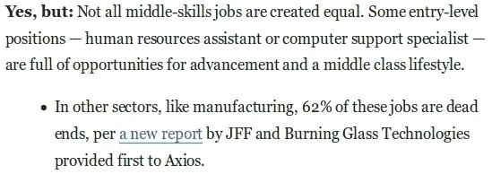

**时事通讯俳句**

粗体短语和相应的导语对简洁至关重要。他们设法给你指出正确的方向，而不使用不必要的词语。总结一下:

*   粗体短语的作用就像**路标**，提示读者作者的方向。例如，山姆·贝克不需要说明他要做一个对位法。“可以，但是*和*就足够了。
*   短语后的导语呈现了一个简单明了的想法。这在 1300 多份简讯和十几个作者中是一致的。
*   好吧，我们一直在谈论大胆短语和广告词的伟大之处，但是真正写它们的人是怎么回事呢？

# 作者列表:

这些备受崇敬半神是谁？他们写些什么？嗯，他们其实都是正常人(除了迈克·艾伦，他可能是电子邮件自动机)。以下是他们的简讯主题和总数:

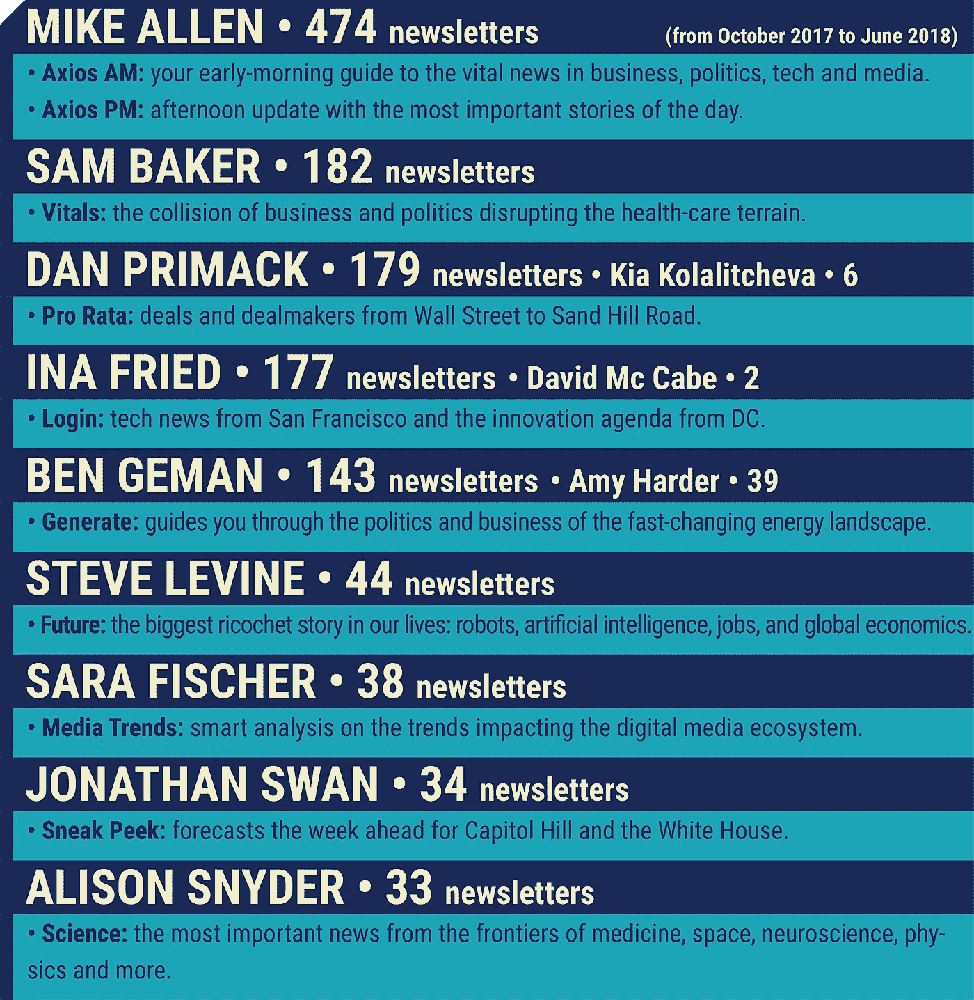

Each author's newsletter count from October 2017 to June 2018, as well the name and subject of their newsletter.

好的，这正式证实了其中一些人没有夜间活动。但是，对于每位作者巧妙简洁的运用，它告诉了我们什么呢？**两个字:物有所值。**

让我们走一步看一步吧。我们从老朋友开始，平均字数…

迈克·艾伦每天发两个帖子，大约 3000 字的政治和科技内容。乔纳森·斯旺尽管大约每周出版一次，但平均而言，在一份“为国会山和白宫预测未来一周”的时事通讯中，他发表的文章超过 2000 字。报道美国各地交易和交易撮合者的丹·普里马克(Dan Primack)能够在每个工作日发布超过 1800 字的关于初创公司、并购、风险投资和融资的新闻(他主要负责十大粗体短语排行榜中的救护车表情符号)。

所有作者**平均每份简讯 1500 字**。对于一封邮件来说，这是相当有内容的。首先，这体现了每位作者强烈的职业道德，其次也体现了他们严格的工作程序。始终如一的质量*和*数量，在你期望的时候交付，建立读者**信任**；读者认为 Axios 内容值得一读。这实际上是智能简洁目标的一部分，在概念的宣言部分有详细说明:

*“我们的目标是让(阅读)体验更充实、更有意义——因此也更有价值。当我们实现这一点时，它将解放人们，让他们在我们的平台或其他地方花时间做真正值得做的事情。”*

这是他们使命宣言的一部分:“【要】只提供值得**人的时间、注意力和**信任**的内容”。**

# 命名实体:

文本中经常出现的命名实体(地点、组织、人和基本上任何专有名词)可以作为一种晴雨表，表明作者是否抓住了主题。是的，我们知道每份简讯都已经有了预定的主题。但是证据就在布满弹孔的布丁里…

*(附注:一些命名实体充当总括术语——美国包括美国、美国等。这是为了在所有简讯中抓住概念，而不仅仅是文字。)*

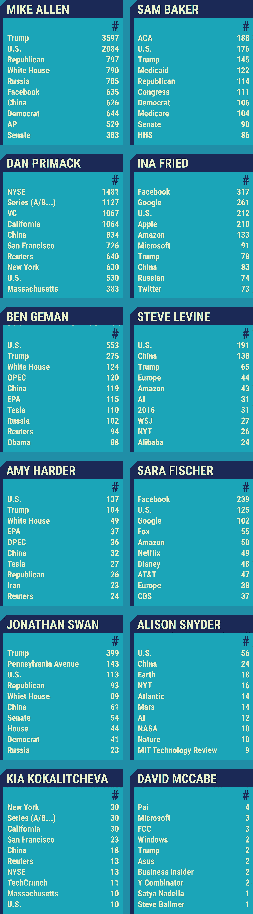

Named entities are specific people, places, organizations, and essentially any proper noun.

每个人都因为坚持要点而获得 A+，所以让我们进入课外活动，并仔细分析一下这些列表。

看到跨时事通讯话题区的佐证很有意思。排名靠前的实体包括“特朗普”、“美国”和“中国”。技术或纯粹的政治、能源或健康、工业都受到“中国”和“特朗普”(谁在“美国”)这样的人的影响。

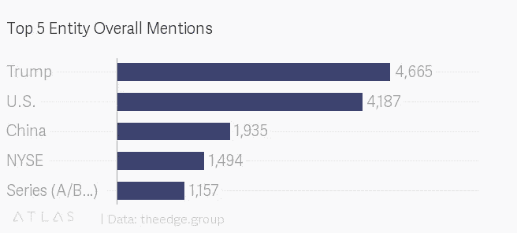

The top five named entities throughout all newsletters.

NYSE 和 Series (A、B 等)主要由 Dan Primack 使用，你可能记得他每个工作日都会发表大约 1800 字的关于美国交易和交易撮合者的内容。(旁注:迈克·艾伦(Mike Allen)仅凭他的报道，就把“特朗普”远远推过了“美国”，这是不可避免的。)

回主图。请注意在 Ina Fried 的命名实体中提到大型技术的频率:脸书>谷歌>苹果>亚马逊>微软作为顶级技术公司。她的登录简讯能代表整个新闻格局吗？谷歌趋势帮助回答:

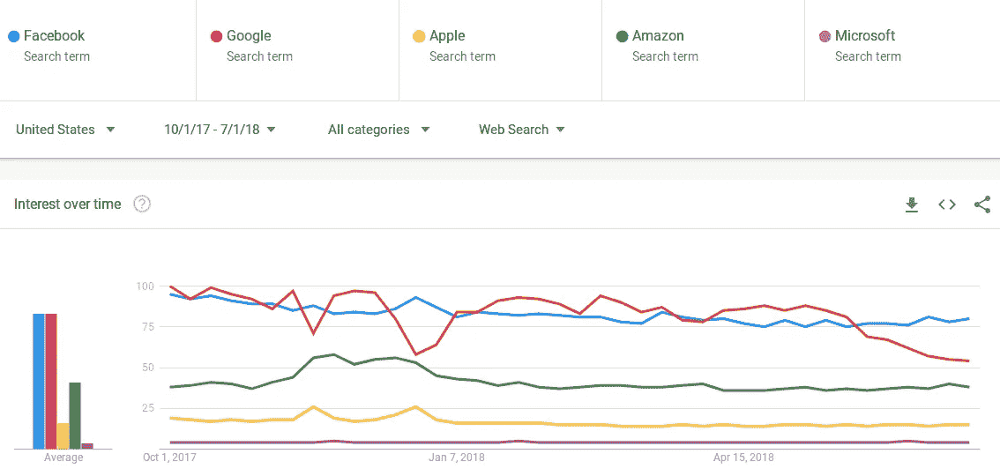

Comparing the order of frequency in Ina Fried's top tech company mentions to Google Trends data, we see a similar correlation.

除了苹果，提到的都挺有代表性的。

**其他几个观察:**

*   虽然迈克·艾伦钻研技术，但我们在他的顶级命名实体中没有看到这方面的证据，这些实体像过量的沙拉酱一样浸在政治中。
*   写能源的本·格曼(Ben Geman)提到了“奥巴马”88 次，其中许多提到都在讨论特朗普的白宫反对奥巴马时代的政策。
*   迈克·莱文把“2016”提到了 31 次。他是不是和本·格曼一样，指的是在某些政治问题上立场的逆转？其实也不尽然。许多关于 2016 年的提及是这样的:“2016 年，密歇根州弗林特 25 至 54 岁的男性中有 51%失业”，以及“2016 年美国便利店行业的销售额达到 5500 亿美元”。隐藏的偏好？

# **赞助商:**

广告——以及它们的展示——实际上是 Axios 宣言中相当不错的一部分。它们与公司的信念直接相关。让我们再来看看我们发布的第一条消息:

*“如果你想一想你不断发展的消费新闻和信息的习惯，你会发现你的时间更少了，注意力持续时间更短了。我们的内容、* ***我们的广告*** *和我们的平台是专门为适应这些新习惯和需求而设计的。”从该公司展示广告的方式中可以发现“Axios 方式”的两个要素:“永远不要为了点击量或广告费而做愚蠢的事情”，以及“笨拙的网站(或时事通讯)上的伟大内容……杂乱的设计是有害的”。

他们的广告呈现优雅、不张扬，让我们想起了碳广告([例](https://carbonads.net/founders_business.php))。看看这些:*

**丹·普里马克(交易和交易撮合者)**

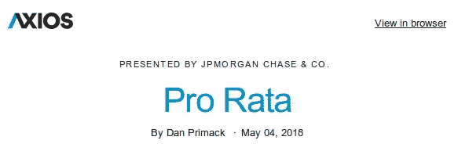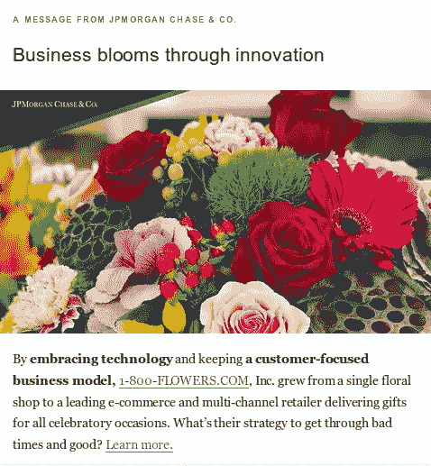

**史蒂夫·莱文(机器人、人工智能、工作和全球经济)**

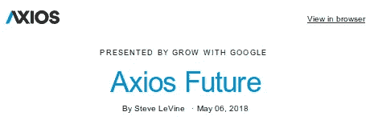

**艾莉森·斯奈德(医学、太空、神经科学、物理学)**

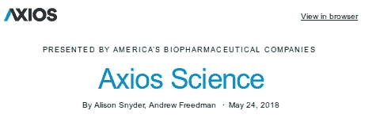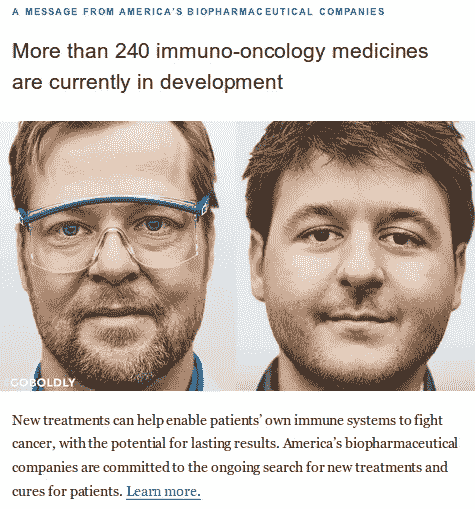

在阅读他们网站上的文章之前，人们不需要静音自动播放视频，取消全屏广告，拒绝发布者的电子邮件地址。同样的极简主义也应用在 Axios 的时事通讯中。由于优雅、相关的广告是聪明简洁咒语的一部分，我们调查了顶级赞助商，看看他们是否符合时事通讯的主题。

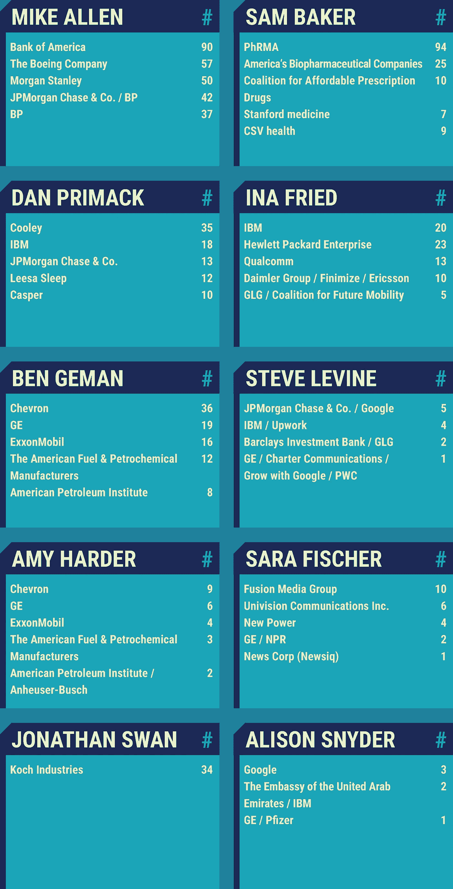

The top five newsletter sponsors per author.

除了迈克·艾伦和乔纳森·斯旺，这些公司可以与每位作者的时事通讯主题轻松交叉引用。至于电子邮件机器人自己，他似乎只是有一群真正的大玩家，他们想依偎在他多产的发帖率和受欢迎程度。斯旺先生的担保人科赫公司做很多事情(“石油、化工、能源、纤维的制造、提炼和分销……”)。也许他的时事通讯有很多强大的华盛顿超级粉丝，科赫公司正在确保它能在需要的地方被看到。

# 结论:

这篇文章的目的是在一个精细的分析层面上展示为什么 Axios 的 1500 字文章*能够发挥作用*。我们发现这是围绕着聪明简洁概念的一系列因素的组合。其中包括:

*   智能，**1-2 句导语**简洁地抓住新闻事件的关键，并以有用的上下文和出色的格式为后盾。
*   粗体短语为读者充当路标，帮助他们快速了解作者对摘要的理解。
*   一个**始终如一**并且有时**多产的输出**确保读者获得质量和数量。这建立了信任，并让读者认为 Axios 的内容值得他们关注(该公司名称在希腊语中的意思是“值得的”)。
*   每个作者都致力于他们的主题。虽然这似乎是一个平凡的事实，但它为高度特定的受众(以及高度特定的广告商)打开了大门。
*   该公司的广告哲学直接是“聪明简洁”口号的一部分。广告不浪费读者的时间。他们是微妙的，高度有针对性的，并提出了很好的。

重要提示:Axios 团队在这里所做的是遵循**良好的新闻实践**。这并不是什么新东西，它只是持续交付的可靠的、经过验证的实践。不过，他们做得如此之好，而且是以如此多产的速度，这是很了不起的。

*如果您想联系 Edge Group 团队，探索您自己的简讯数据和分析，请联系*[*info @ The Edge . Group*](mailto:info@theedge.group)*。*

1.  *注:我们在 2017 年 10 月左右，对去年批量订阅的作者进行了测量。因此，统计数据不包括乔·乌奇尔和安德鲁·弗里德曼更新的时事通讯。*
2.  ***使用的工具:*** *为了抓取我们专用的 Axios 电子邮件收件箱，我们使用了 Gmail 的 Python APIPandas Python 模块创建收件箱内容的数据框架；一些用于解析 html 数据的库；以及 Python 的自然语言处理模块 Spacy。*