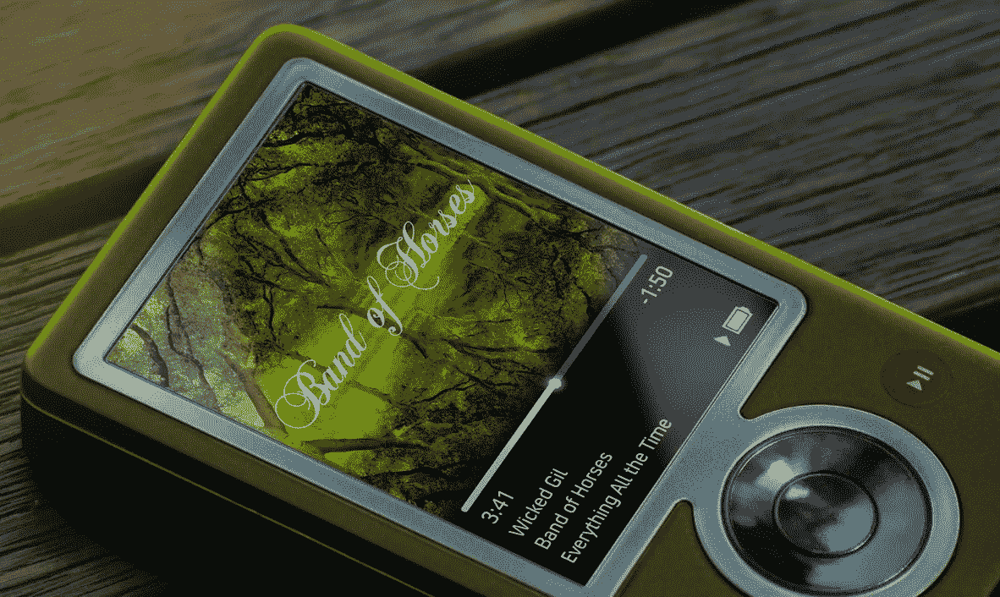
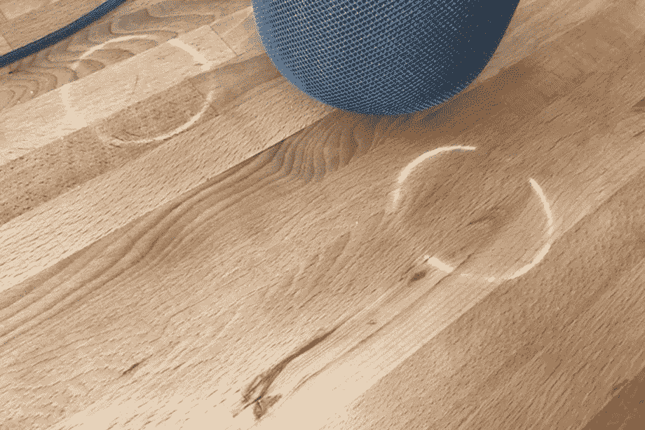

# HomePod 是新的 Zune

> 原文：<https://medium.com/hackernoon/the-homepod-is-the-new-zune-735d00c52655>

## 抱歉，苹果

你还记得微软的 Zune 吗？大概不会。Zune 是微软对苹果 iPod 的回应。你不记得的原因是因为产品太差了。微软高管知道这很糟糕。用户知道是吸。记者们知道这很糟糕。

> 看看这个婴儿。褐色的
> 
> ——史蒂夫·乔布斯谈 Zune

Zune 失败的原因有很多，但让我感兴趣的问题是:微软为什么要推出它？微软试图在产品质量、音乐质量、音乐目录、硬件/软件整合等方面赶上苹果。他们知道他们没有准备好竞争的东西。但他们还是努力了。我认为这背后的心理是:我们不想看起来像是被落下了。如果我们拿出一些东西，我们至少可以*假装*我们没有输掉这场战斗。

具有讽刺意味的是，这种思路与苹果当时的做法截然相反。苹果只会选择它能赢的战斗。史蒂夫·乔布斯一回来就杀了 OpenDoc，因为他知道他无法与微软 Office 竞争。那是 1997 年。4 年后，苹果发布了 iPod。

现在，快进到今天。苹果想与亚马逊的 Echo 和[谷歌](https://hackernoon.com/tagged/google) Home 竞争。它在技术上落后了——Siri 与 Alexa 或谷歌助手相比相去甚远。自 2007 年以来，它首次在应用和生态系统方面落后:Alexa 有 10.000 项技能，Siri 一项也没有。所以苹果[决定尝试发挥自己的优势](https://chatbotslife.com/homepod-is-probably-the-best-move-apple-could-make-3fec8af11055):音乐和设计。Homepod 将会是一款高质量的智能音响。现在终于出来了。这种情况发生了。

Yes, this is really happening

原来，Homepod 正在释放某种酸，燃烧木头，在你的家具上留下那些白色的圆圈。Homepod 只适用于 iTunes 和 Apple Music。Homepod 无法在 AppleTv 上显示内容。Homepod 推出时没有任何让它变得更智能的“技能”或应用程序。

(音乐在上面听起来很棒，我敢肯定)

那么，为什么苹果要挑起一场它不可能赢的战斗呢？见鬼，他们甚至不称之为“爱好”，就像他们过去对 AppleTv 说的那样。

他们为什么要发布 Zune？

也许苹果现在和 1997 年的微软处于同样的位置:完全否认统治世界。

> 别误会，我爱苹果和他们的产品。也许这就是我失望的原因，因为我在乎。你怎么想呢?