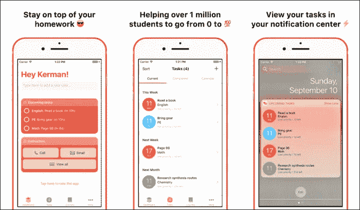
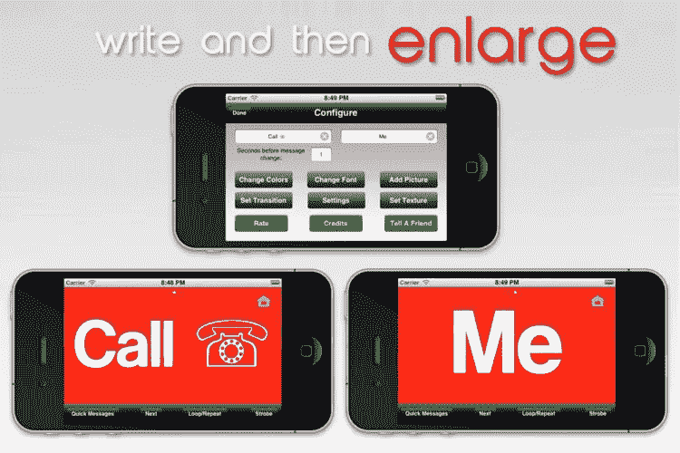
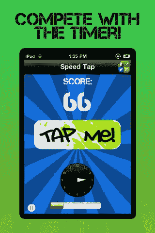
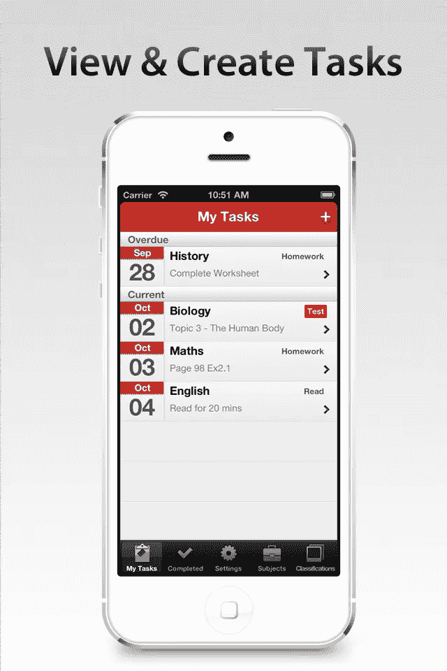
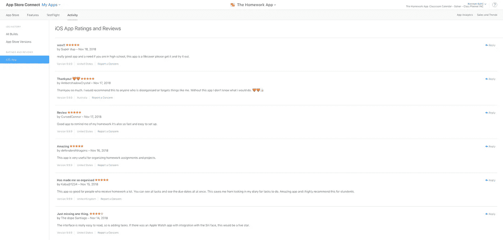
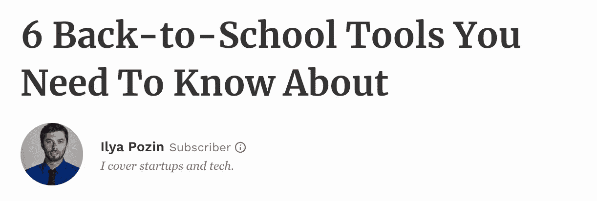
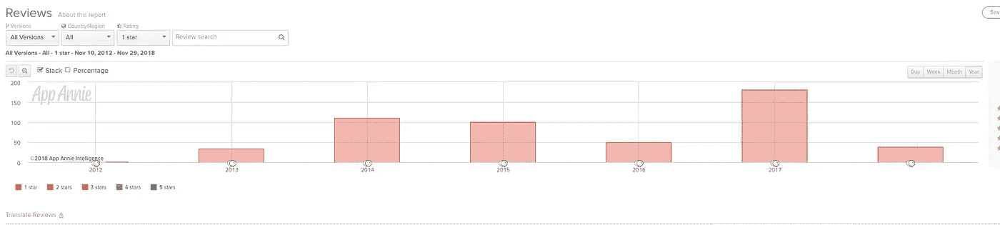
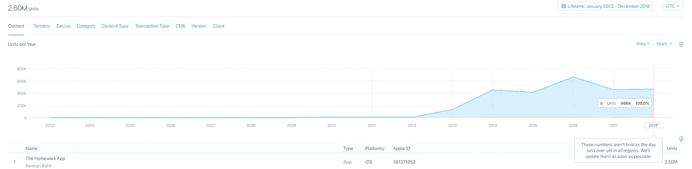

# 作业应用，8 年 iOS 旅程的终结。

> 原文：<https://medium.com/hackernoon/the-homework-app-the-end-of-a-8-year-ios-journey-4cc9f5c27c4f>

## 今年对我来说真是疯狂的一年。我从大学退学，辞去工作，全职研究 8x 协议。

今天我很兴奋地宣布，我已经卖掉了[作业应用](https://hackernoon.com/tagged/homework-app) (http://thehomeworkapp.com)。回想过去的 6 年，我已经能够展示这款应用的以下事实:

*   全球下载量超过 250 万次
*   每月有超过 90 多个国家的 100，000 名学生使用
*   出现在 App Store、福布斯、雅虎等网站的首页。
*   获得苹果 WWDC 奖学金+更多奖项

# 文本放大器

听起来可能有点俗气，但通往这一点的道路确实很特别。我在 12 岁的时候开始编程，因为这似乎是一件很有趣的事情。我的第一个应用程序是一个通过我的手机屏幕帮助我在机场和我爸爸告别的应用程序。制作它是一个巨大的挑战，我坚持不懈地复制 StackOverflow 片段，希望它们能起作用，并阅读 O'Reilly 关于 [iOS](https://hackernoon.com/tagged/ios) 开发的书籍。最困难的部分是试图弄清楚提出的编程概念并应用它们。

这是这款应用的最终效果:

我开始每次下载收费 1 美元。有人会购买我的应用程序的日子，我会从学校食堂买东西。

# 踢踏舞之家(又名热)

我非常喜欢 Runescape 和 MapleStory，所以我想尝试制作我的第一个游戏，尽管没有图形。因为我雇不起平面设计师，而且我自己也不擅长画画，所以我决定做一个游戏，看看谁能在各种游戏模式下点击一个按钮。

如你所见，我的设计技巧相当不成熟。虽然我仍然很满意我在按钮上创造的强光效果。当我完成 HOT 的时候，我不再盲目地看教程，并且在编写代码的时候能够更多地随机应变。我可能在这个项目上花了一年时间，另外还花了几年时间。HOT 获得了 10，000 次下载，但广告收入可能不到 100 美元。

# 作业应用程序

我想此时我已经是一个基本的 iOS 开发人员，但是创建一个 CRUD 应用程序仍然超出了我的能力范围。有一天，在忘记做作业后，我想我应该找个应用程序来帮我。尽管我没有最好的设计能力，但我有设计的眼光，知道有机会创造出比现有应用更好看的应用。这也是 CRUD 应用程序的完美应用，所以我不需要更多的说服就可以开始开发。我想我花了大约 6 个月的时间来构建、设计和测试这个应用程序，以推出这个家庭作业应用程序的第一个版本。我的用户测试团队基本上只有我的父母和姐姐，他们会给我反馈使用该应用程序的难易程度。迄今为止，他们仍然是最好的 UX 测试者。

Version One, the OG.

对我来说，就设计和工程而言，这比我以前的申请进步了一大步。幸运的是，努力工作得到了回报，我在应用程序发布的第一天就获得了 100 次下载——没有任何营销。这对我来说是一件大事。我的商业直觉告诉我，继续做这个可能是个好主意，而不是跳到下一个主意哈哈。

几天后，我收到了第一封来自用户的电子邮件，询问一个功能需求，这是我对产品开发和听取用户反馈的介绍。随着时间的推移，我不得不学会分清主次，学会听谁的，忽略谁的。所有的尝试和错误不幸哈哈。

在接下来的几年里，这个应用程序继续发展，它慢慢演变成了比我最初计划的还要大的东西。

# 好人

我认为让我震惊的是当我看到真实的人使用这个应用程序并分享它时，我甚至不知道他们的存在。

看到来自世界各地的学生的评论，感谢我创造了一些他们真正喜欢使用的东西，并对他们的生活产生了真正的影响。

我认为最疯狂的事情之一是一觉醒来，在谷歌上搜索我的应用程序，然后从《福布斯》上看到这个:

对于一个新西兰的青少年来说，看到这一幕是非常令人激动的。就像我甚至没有联系就上了福布斯？

# 课程

做产品真的真的很难。2016 年末，我觉得这款应用已经失去了设计优势，但还需要一些关键的更新，如云同步。虽然痛苦，但最好的方法是从头开始重新创建应用程序，并重新想象整个体验。我花了几个月的时间创建线框和高分辨率图像，然后又花了几个月的时间编码和测试新版本。

这次更新是为了引人注目:

*   云同步(多年来被高度要求的功能)
*   非常以 iOS 10 为中心的漂亮的新设计
*   很酷的新仪表板，有很酷的动画

此外，我还改变了收入模式，将它改为基于订阅，而不是一次性付费。这一切的最终结果是什么？

2017 年 175 个一星评论，大量愤怒的用户和大量损失的收入。

人们对新的更新感到愤怒、困惑和愤怒。这不符合他们的期望，他们的熟悉感已经完全破灭。尘埃落定需要大约 6 个月到一年的时间，但我从这次经历中学到了很多东西:

*   摇动小船，但不要摇动太多人们与你最初创造的东西没有任何联系的东西
*   收集大量观点和反馈。如果它不符合你的期望，那就更仔细地听——不要忽视它(我做的正好相反)。
*   你建造的东西越大，它就变得越脆弱。从收入来源到产品选择，确保你明白你在改变什么，以及它们可能产生的影响。你做好最坏的打算了吗？

# 关闭

I’m still inspired with the fact that I managed to reach millions of people, from my bedroom.

在过去的几年里，我非常喜欢开发 iOS 应用程序，但是现在是时候做更大的事情了。虽然听起来很老套，但加密可能是我未来十年致力于研究的一个领域。

> 让 crypto 激动人心的是政治、经济和技术的交集。

我仍然对社会如何运转、经济如何形成、战争如何开始以及金钱到底是什么一无所知。了解所有这些话题将会给我内心的好奇心提供它所渴望的那种渴望。在那之前，它将带着 8x 回到起点，开始全新的冒险。

和平！