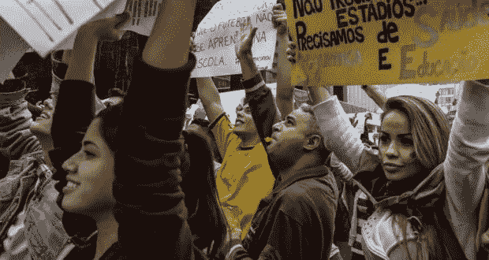

# 比特币的人道主义一面

> 原文：<https://medium.com/hackernoon/the-humanitarian-side-of-bitcoin-a0edd2dd0490>

## 加密货币如何通过市场集市促进企业家精神和社会正义(以及为什么它们的支持者和反对者都应该更多地关注它)

Image From [**The Economist/Eyevine**](https://www.economist.com/leaders/2017/07/29/how-to-deal-with-venezuela)

比特币和加密货币更普遍地是可以证明是令人惊讶的分裂话题。我说的“分裂”不是指关于加密货币合法性的辩论，而是指许多比特币和更广泛的加密货币领域的所谓“粉丝”的愚蠢、有时甚至是狂热的行为。上周的 [*和今晚的*关于加密货币及其潜力的](https://www.youtube.com/watch?v=g6iDZspbRMg)部分以“丹”的形式完美地展示了这种行为，他可能是虚构的，但也是非常真实的例子，你的办公室同事不停地咆哮比特币如何“是未来，伙计”,他如何迫不及待地在价格“月亮”之前“hodl”一些以太坊，他们成为了某种“比特币亿万富翁”。

尽管有这些令人讨厌的滑稽动作，人们不应该简单地忽视比特币、区块链和更普遍的加密货币现象。是的，这些粉丝是经济和金融领域的粉丝，相当于那些令人讨厌的顽固不化的*里克和莫蒂*粉丝，他们基本上破坏了我可以从节目中获得的任何乐趣，但对加密货币的折扣则是自担风险。正如许多人正确指出的那样，比特币和加密货币更普遍地代表了社会和个人如何看待和评估货币以及交易背后的哲学的转变，而支持它们的区块链技术有可能彻底改变贸易，并通过消除对银行形式的“中间人”的需求来创建一个真正的共同市场。事实上，在社交媒体上，你会发现许多人欢呼区块链和散落在互联网角落的各种加密货币的兴起，认为它们可能会从根本上分散银行业，并完全消除对银行机构的需求。

# 转变加密货币话语的需要

然而，这篇文章不会关注加密货币现象的金融方面。这已经并将继续在许多留言板和脸书评论区进行辩论。事实上，正是这些类型的东西——尤其是 Twitter 上所谓的“热门话题”——通常只会在比特币和其他加密货币刚开始真正流行时，让许多人(包括撰写本文的所谓“诺米”)疏远它们。

“mooning”和“hodl”的语言被认为是幼稚可笑的，而对比特币的任何批评——例如它可能代表另一种“郁金香狂热”现象的事实——都被不假思索地抨击和攻击；换句话说，整个加密货币行业似乎是一个巨大的邪教，而不是那些金融和经济领域的人认真对待的东西。

批评者和粉丝都忘记了加密货币和区块链的另一面:比特币的去中心化性质如何通过其破坏压迫性和官僚国家机器的能力，让人们在面对越来越多的繁文缛节时自由追求企业，或帮助他们的家人在面对暴力的中央集权主义入侵时生存下来。

# **打倒查韦斯，打倒马杜罗:委内瑞拉基于加密货币的集会活动**

委内瑞拉，一个看起来像这样的国家[自 2013 年](https://www.washingtonpost.com/world/the_americas/blackouts-hyperinflation-hunger-maduro-faces-reelection-as-venezuela-deteriorates/2018/05/16/2ec5bb60-56f5-11e8-9889-07bcc1327f4b_story.html?noredirect=on&utm_term=.a6b38ad601e2)以来一直处于永久的危机模式中，是这方面的完美例子。该国的通货膨胀率飙升至约 18，000%，面包和油等基本食品以及卫生用品和医疗用品都在减少，人们可以连续排队几个小时，但从国家官员那里得到的只是空洞的陈词滥调，他们承诺“革命”将在查韦斯指定的继任者尼古拉斯·马杜罗的伪装下继续。

尽管马杜罗和他的统计学家同事将委内瑞拉陷入的社会经济危机归咎于美国和定义模糊的“帝国主义”，但该国动荡的真正原因是缺乏某种形式的开放、自由市场经济；国家控制了委内瑞拉几乎所有的企业，并把私人控制企业视为“革命”的对立面和资本主义帝国主义的标志。不要误解我的意思，我和下一个明智的人一样反对帝国主义和美国对外国土地的无意义入侵，但委内瑞拉的经济崩溃可以说是美国在外国社会或经济秩序崩溃中几乎没有发挥作用的少数例子之一。

Image From [**Foreign Policy**](http://foreignpolicy.com/2017/05/02/the-maduro-regime-is-heading-for-a-soviet-style-collapse-venezuela/)

由于马杜罗的自私偏执，委内瑞拉人民毫不奇怪地采取了严厉措施。关于一群愤怒的暴民闯入动物园吃掉一匹马的报道在社交媒体上流传开来，而最近的[上周的*今晚的*第](https://www.youtube.com/watch?v=IYfgvS0FA7U)集披露，由于汽油短缺，抗议者已经诉诸于使用人类粪便来制造临时燃烧瓶——或者引用该节目主持人约翰·奥利弗的话，“噗噗”鸡尾酒。

比特币在这场混乱中扮演什么角色？其形式是破坏该国的货币控制。作为广场主义的一个鼓舞人心的例子，一些委内瑞拉人已经开始使用互联网，并开始挖掘比特币，以支付从国外进口的商品。国家的货币管制通过国家批准的所谓“官方”措施阻止个人这样做，但[比特币及其去中心化的性质允许个人通过用加密货币换取现实世界的玻利瓦尔](https://www.theatlantic.com/magazine/archive/2017/09/big-in-venezuela/534177/)来主动绕过这种管制，自由进口急需的食品和其他基本商品，其中许多商品主要来自迈阿密等佛罗里达州的美国港口城市。

这并没有阻止政府做它最擅长的事情:干预和压迫。自去年年底以来，马杜罗和国家警察打击了比特币采矿，以走私违禁品和破坏所谓的“革命”等捏造的罪名逮捕了矿工。事实上，在我看来，这是一种彻头彻尾的伪善行为，[委内瑞拉政府发行了自己的加密货币( *Petro* )](https://www.washingtonpost.com/news/worldviews/wp/2018/02/20/venezuela-launches-the-petro-its-cryptocurrency/?noredirect=on&utm_term=.5c98cb17f874) ，声称这将规避国际社会对该国的制裁。然而，所有人都清楚地看到，这不是某个受鼓舞的广场主义和反帝国主义行为。Petro 是作为一种政府批准、受监管的比特币形式推出的，其目的是削弱独立、去中心化的矿商、运营商和交易商，并进一步加强国家对人民的权力和控制。

然而，尽管存在这些入侵，加密货币开采及其给那些能够应对(主要由国家强制实施的)停电的人带来的现实世界人道主义好处仍在继续，让他们不仅摆脱了毫无意义的货币管制，还摆脱了自 2012 年左右以来一直试图侵犯他们公民和经济自由的压迫性国家。

# 打破官僚主义:加密货币&巴西企业的追求

Image From [**The Irish Times**](https://www.irishtimes.com/news/world/rousseff-in-emergency-talks-over-protests-1.1439024)

巴西是另一个经常被比特币粉丝和批评者忽视的例子。这个国家的政府不仅在拉丁美洲，而且在世界上都是最腐败、最专横、最控制经济的政府之一，在自由市场智库*传统基金会*的最新研究中，该国在经济自由度方面排名[第 153 位](https://www.heritage.org/index/country/brazil)，其前任和现任总统都面临[经济腐败和管理不善的指控](https://www.irishtimes.com/news/world/rousseff-in-emergency-talks-over-protests-1.1439024)。这可能会让你感到惊讶，因为在你上学的时候，巴西经常被经济和发展学者吹捧为“正在崛起的经济体”和“金砖四国”中的一员，这些国家将在未来十年左右的时间里实现经济爆炸！你可能会发现更令人惊讶的是，根据同一份 *Heritage* 研究，像乌克兰(目前正处于内战之中)、白俄罗斯(以欧洲最后一个独裁国家而闻名)和海地(你知道，这个国家遭受了毁灭性的地震和腐败)，这些国家的经济都比巴西自由。

看来巴西足球或萨尔萨舞自由流动的特性并没有转化为它的经济政策。进口关税可能高得离谱——根据产品的不同，高达 60%——从而损害了希望从国外进行贸易和购买的企业和消费者，而与大多数其他发达国家相比，建立一家企业并获得所有相关许可可能需要 83 天以上(例如，在美国， [*原因*注释](https://reason.com/blog/2016/11/30/rodrigo-souza-bitcoin-venezuela-brazil)最多只需要 8 天)。

加密货币和区块链在这方面的应用相当有趣。比特币等加密货币的去中心化性质破坏了巴西目前集中、专横的银行系统，而区块链则允许企业家和企业主[绕过国家机器和官僚机构的机关](https://bitcoinexchangeguide.com/originalmy/)，尤其是该国的公证服务，每当新的交易或交易将要提出时，所有企业都需要“联络”该服务。一家名为[*original my*](https://originalmy.com/)*的公司允许交易者、消费者和企业主上传重要文件的加密副本——在区块链架构中是安全的——这些副本很容易检索，并允许通过与在线存储的原始副本进行比较来验证文件的真实性。*

# ***总结思路***

*尽管上面有这些巧妙的例子，但哪里有企业和自由，哪里就不可避免地会有一个正在侵犯的国家试图对其进行管制。同样，不要误解我的意思，监管是必要的，如果执行得当，既可以保护消费者，也可以增强市场自由。问题出在像巴西和委内瑞拉这样的地方，[国家不仅仅希望监管](http://c4ss.org/content/25158)，它还希望[完全关闭加密货币市场](http://www.latinfinance.com/magazine/2018/march-april-2018/brazil-bears-down-on-cryptocurrencies)。*

*然而，正如本文和其他地方已经指出的那样，[国家在‘禁止比特币’](https://panampost.com/editor/2018/01/17/bitcoin-is-booming-in-brazil-and-politicians-cant-stop-it/)和更普遍的加密货币方面会有多成功完全是另一回事；正如委内瑞拉加密货币交易平台 SurBitcoin 的创始人罗德里戈·索萨在马杜罗政权开始打击比特币矿工时所说，“人们没有停止采矿，他们只是更深入地下了”。*

*比特币、区块链和所有其他加密货币及相关媒体都有可能不仅仅是他们的追随者不断宣扬的“下一个大事件”。它们实际上可以通过规避压迫性的国家官僚机构和结构，在基于加密货币的广场活动中帮助改善人们的生活。如果这些追随者，经济世界的超级粉丝 *Rick 和 Morty* 能够真正放下他们的手机，停止在推特上谈论什么将“登陆”或者人们应该“登陆”什么，并真正展示加密货币如何改善生活，那么也许更多像我一样的人——以前的怀疑者和批评者——能够真正开始更认真地对待比特币，并将其视为一种可行的经济变革工具，而不是被扔在父母地下室角落的白人男孩的玩具。*