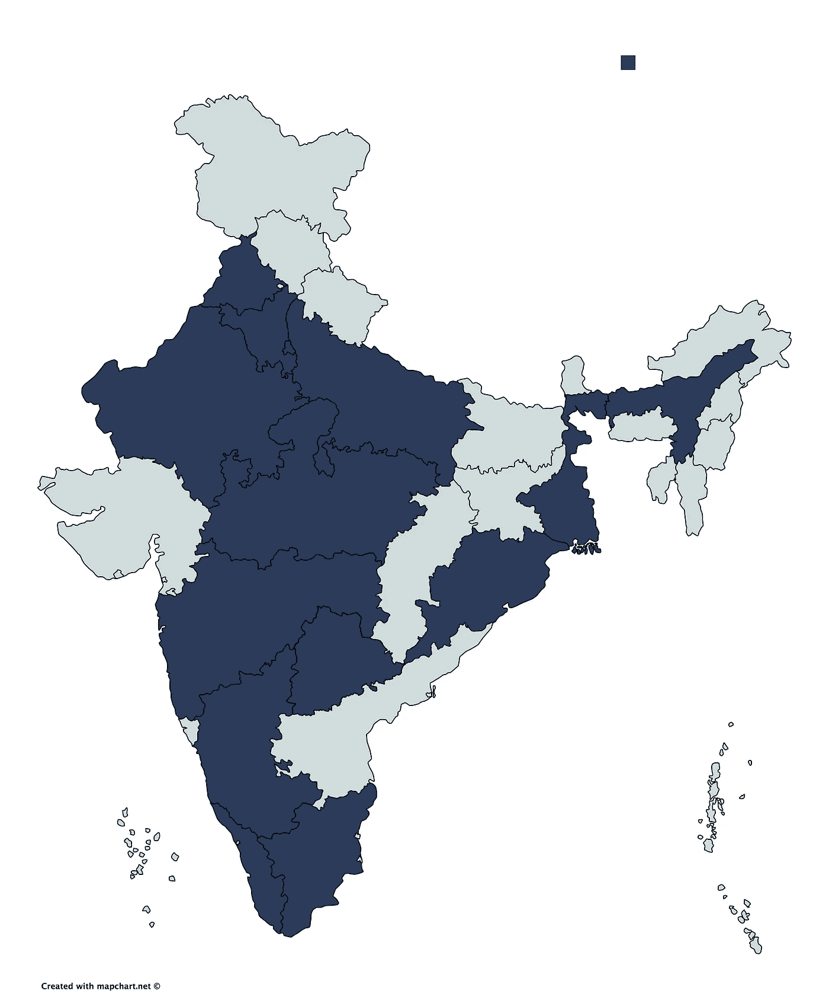

# 拥挤——领导运动

> 原文：<https://medium.com/hackernoon/the-hustle-to-lead-the-movement-fc1ac4ab642f>

> 你将成为什么样的人，你现在正在成为什么样的人

 [## 黑客协会|组织和参加黑客马拉松

### HackSociety 旨在促进开发文化，并激励学生通过实施技术来学习

黑客社会](https://hacksociety.tech) 

嘿，亲爱的读者

在这种情况下，你是那些年轻人中的一员，正准备踏上自我发现和全面个性发展的轨道，这可能正是你在投入下一项工作之前要经历的一段时间。也许你还在读高中，或者刚刚开始上大学，甚至可能马上就要毕业了，即将踏入这个充满不确定性和无尽机遇的世界。

作为一个最近经历过这一切的人，我们想借此机会提出一些事实。我们生活在一个高度竞争的世界里，仅仅擅长纸上谈兵是远远不够的。为了成为一名成功的专业人士，你不仅仅需要成为队伍中的第一名。看起来，你可能需要开始一个新的。仅仅是因为老一点的现在简直太乱站不住了。*那我们如何脱颖而出呢？*

> 创新——每个人都被期待在其中表现的可怕类别。

Photo by [Nikita Kachanovsky](https://unsplash.com/@nkachanovskyyy?utm_source=medium&utm_medium=referral) on [Unsplash](https://unsplash.com?utm_source=medium&utm_medium=referral)

还记得那些辩论比赛吗，你因为思维敏捷而受到赞赏？或者是那次黑客马拉松，你的导师给了你额外的分数，因为你构建了一些开箱即用的东西？那些能做出肯定回答的人值得称赞。他们已经领先于其他船员了。然而，船员们可以赶上，如果他们调整他们的游戏只是一点点。

> 今天比昨天更难开始，但今天比明天更容易开始。

这是一个简单的三步过程。首先，寻找你的兴趣，拥抱你的品质。第二，把这些品质打磨到最优。第三，不要羞于尝试新事物，也不要羞于在其他方面塑造自己。

对软件开发感兴趣但不知道从哪里开始？好，我们在这里与我们的 [**HackSociety 学生助理**](https://hacksociety.tech/hsa/) (HSA)项目，一个给你接触开发者世界的窗口的平台。我们的目标是将真实的世界带入学习空间，为崭露头角的人才创造机会，并帮助他们完成他们的旅程。

《HSA》是一部努力为你提供从新手到有经验专业人士的旅程所必需的推动力的作品，在一些技术领域的领导者的帮助下，让你为这个行业做好准备。我们打算通过建设来培养一种学习的环境。

# 俗话说，

> 生意场上的大事从来不是一个人做出来的。它们是由一群人完成的。

然而，对我们的学生伙伴来说，技术上的倾向并不是必须的，因为我们需要一个由顶尖的演说家、高效的组织者和技术爱好者组成的团队来取得成功。

我们还能提供什么？

*   ***影响力*** (在开发者中壮大你的人脉。)
*   ***摄取*** (通过技术专家的讲座增强您的技术相关知识)
*   ***闪耀*** (在你的学院里树立形象。)
*   *(把印度最好的科技创业公司加入你的网络。)*
*   ****综合*** (主持赛事，克服怯场。)*
*   ****好东西*** (而且显然获得了大量的赃物)*

**

*Applications so far…*

*到目前为止，我们已经收到了来自全国 13 个州的 51 所不同技术学院的申请。然而，我们打算在你们全心全意的支持下，把这件事做得更大。将这篇文章分享给你的朋友，并注册以确保你的席位。*

*申请该计划的最后一天是 2018 年 7 月 31 日，这给了你大约 24 个小时的时间来决定你是否愿意选择少走的路。*

*在这里找到所有相关的细节:-[https://hacksociety.tech/hsa](https://hacksociety.tech/hsa)*

*下次见！*

*老尼克，黑客协会*