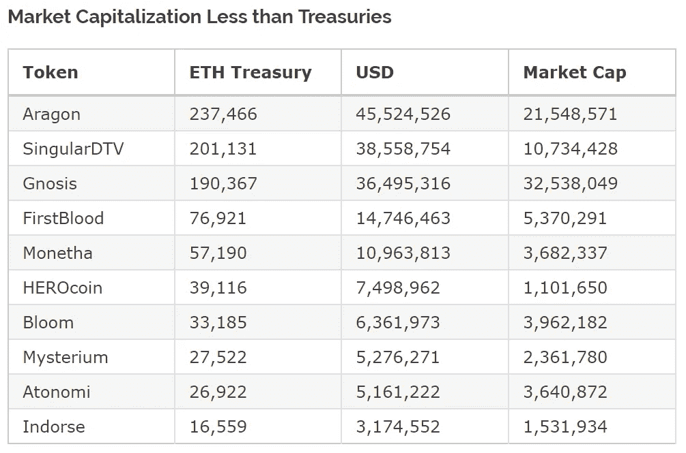
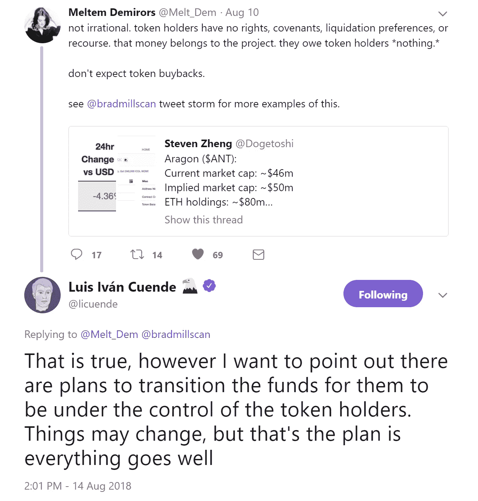

# ICO 热潮兜了一圈又回来了；现在的问题是如何将资金返还给投资者

> 原文：<https://medium.com/hackernoon/the-ico-craze-comes-full-circle-now-its-all-about-how-to-return-funds-to-investors-47b5ae87d700>

**你可以关注我**[**@ flattoutcrypto**](http://twitter.com/flatoutcrypto)**，在**[**【flatoutcrypto.com】**](http://flatoutcrypto.com)上找到我所有的作品

Cofound.it [今天](https://blog.cofound.it/closing-cofound-it-as-crowdfunding-market-disappears-and-presenting-good-practice-for-icos-796db5e001b8)宣布他们将关闭公司，并将资产返还给代币持有者。

这是一个重要的举措，显然对 Cofound 和整个行业都是如此:

1.  这标志着 ICO 热潮达到了一个象征性的顶点，随着项目从筹集巨额资金转向向投资者返还筹集的资金，这种热潮现在又回到了起点
2.  尽管 ICO 投资者可能有理由感到愤愤不平，但从表面上看，这似乎是一个良好做法和负责任举措的例子

这是一个基于帮助其他公司通过 ICOs 筹集资金的项目。这包括资金和信息服务等设施，以及帮助初创企业在 ICO 后成长。CFI 令牌允许持有人获得“优先通行证”，使他们能够投资于 Cofound 上的项目。

对于这样一个项目的必要性，你可能有自己的看法，但去年 6 月，当它筹集到当时创纪录的 1480 万美元时，很少有人会想到 ICO 市场会发生如此迅速的变化，导致对 Cofound 服务的需求减少。

ICOs 从理论上对所有人开放的众筹销售，变成了风险投资公司、人脉广泛的私人买家和资金池的专属领地。他们也从那些对使用项目感兴趣的人和有技术背景的人(尽管仍然有盈利动机)转变为纯粹的投机，在这种情况下，如果一个项目在启动的第一天没有达到巨大的倍数，它就被认为是失败的。

这并不完全归咎于外部环境，因为你可以说，即使在去年 6 月，Cofound 也永远不会成功。这并不是对该项目的一种轻视；您可以针对 99%以上的 ico 提出完全相同的案例。

# 逐渐减少

对我来说，更有趣的是放松的过程。

在我去年 11 月写的一篇文章中，我提到:

> 这里的主要问题来自于团队从 ICO 那里获得的大量资金——已经筹集了 2000-2500 万美元的公司将无法将这些资金全部用于员工成本(至少你希望如此)。在这种情况下，钱会发生什么变化？嗯，他们可以清算他们的持股，并按比例返还给代币持有者——但他们没有法律义务这么做。他们可以转向一个新的理念，给予代币持有者一定比例的新代币股份——但他们在法律上没有义务这么做。或者他们可以作为“僵尸”公司苟延残喘——无法实现他们最初的存在理由，但有太多的钱让他们倒闭，能够为他们知道他们无法交付的项目工作支付自己，但这将比从头开始更有利可图。

拥有 CFI 并不意味着拥有 Cofound 的任何基础资产。几乎所有的[加密](https://hackernoon.com/tagged/crypto)项目都是如此。你不是股东。你无权占有他们的资产。

然而，Cofound 已经决定将他们现有的资产归还给持有人。这相当于约 1440 万美元，而目前的市值为 800 万加元，交易现已冻结。假设所有资产都是流动的，并且负债符合目前 35 万美元的估计，那么现在的持有者应该会得到很好的补偿。可能已经卖出的 ICO 投资者(他们有足够的理由说明自去年 6 月以来 CFI 相对于 ETH 和 BTC 分别贬值了 70%和 90%)没有追索权。

尽管如此，从表面上看，这似乎是对各方来说最好的结果:

1.  它将一些价值(事实上几乎所有的美元价值)返还给持有者
2.  它防止僵尸公司在浪费资本的同时运营和占用资源
3.  它允许团队继续前进，声誉基本不受影响(许多创业公司失败了)，并能够从事新的项目

以这种方式结束的 ico 越多，它的污名就越少，也越容易被接受。失败并不意味着退出骗局和梦想破灭。通过保存一些价值，它实际上使投资 ico 成为一个更好的赌注。

此外，有数百家公司已经为永远不会实现的想法筹集了资金。他们最好遵循这种先发制人的清盘方式，而不是在没有成功机会的情况下耗尽投资者的资金。

# 市值=资产持有量？

如上所述，代币持有者对任何基础资产都没有权利。然而，*如果*(这仍然是一个很大的疑问)资产再分配变得司空见惯，那么我预计将会有资本过剩和表现不佳的项目纷纷效仿。这为投机性持有提供了可能性。

[Diar 最近的新闻简报](https://diar.co/volume-2-issue-36/)对这些持有大量资产的 ico 进行了分类:

在这种预期的交易中，最重要的方面是一个治理有方、道德健全的领导层。首先，阿拉贡是一个我相信符合这些标准的项目。

8 月 14 日，阿拉贡的联合创始人说了什么

**免责声明:本文中提到的代币我持有 BTC 和 ETH。我以前持有 ANT，但现在没有。**