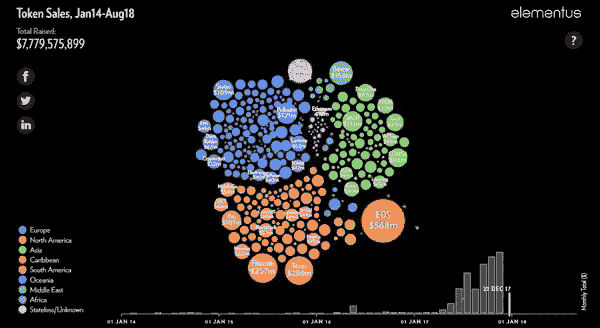

# ICO 市场并没有崩溃。它正在成熟。

> 原文：<https://medium.com/hackernoon/the-ico-market-is-not-collapsing-its-maturing-c11bfd4cdfe8>

[*互动版*](https://elementus.io/token-sales-history)/[/Youtube](https://www.youtube.com/watch?v=yQ7zRWujaYE)

*该可视化图显示了从 2014 年初到 2018 年 8 月底成功筹集至少 10 万美元的每一笔代币销售。图形底部的条形图显示了每月筹集的资金总额(详情如下)。*

# 代币销售:2018 年 8 月

**截至 2018 年 8 月 31 日的代币销售市场状况**

关键要点:

*   尽管有一系列相反的说法，但 ICO 市场仍然相当强劲，8 月份筹集了 14 亿美元，比前一个月增长了 44%
*   所有迹象都指向一个成熟的 ICO 市场:融资竞争越来越激烈，更多老牌公司涉足其中，证券代币显示出最初的生命迹象。
*   新加坡主办的 ico 首次超过美国。

## 到目前为止 ICOs 真正筹到了多少？

网上提供的大多数象征性销售统计数据严格依赖于第三方报告的金额，这些数据可能已经过时，而且在大多数情况下会排除不报告其筹款情况的项目。截至 2018 年 8 月，这些数字在 140 亿美元至 210 亿美元之间，因此他们之间没有达成共识。

矛盾的是，在世界上最开放、最透明的数据库中，关于筹款的准确信息仍然很难找到。

[A visual history of token sales](https://elementus.io/token-sales-history)

尽管区块链在技术上是透明的，但在功能上却是不透明的。Elementus 直接从区块链收集、组织和分析数据。我们的技术使我们能够像阅读一本打开的书一样阅读以太坊交易分类账。通过识别由 ICO 项目控制的各种钱包，我们可以计算它们的总筹款金额。

总的来说，我们估计截至 2018 年 8 月底，ico 已经筹集了总计**284 亿美元**。

## 8 月份的筹款额与去年 11 月持平

虽然投资者对代币的兴趣已从去年 2 月的峰值大幅下降，但前景远没有许多人报告的市场崩溃那么黯淡。

8 月份，ICOs 筹集了近 15 亿美元，与去年 11 月牛市期间筹集的金额持平。事实上，历史上大多数 ICO 融资都发生在当前的熊市。在迄今为止筹集的 280 亿美元中，159 亿美元发生在 2018 年 2 月至 2018 年 8 月之间。

此外，上图中显示的大幅涨跌趋势很大程度上可以归因于三家 ico——EOS(42 亿美元，6 月 17 日至 6 月 18 日)、Telegram(17 亿美元，18 年 2 月 18 日至 3 月 18 日)和 Tatatu(5.75 亿美元，6 月 18 日)。除去这些异常值，这幅图看起来相当稳定，特别是考虑到同期密码市场的剧烈波动。

下图显示了每月代币销售的数量。正如我们在之前[所讨论的，我们认为这一指标是对 ICO 市场活动更准确的衡量，因为它不太容易受到特殊波动的影响。](https://elementus.io/blog/token-sales-visualization/)

与上图一致，这一指标也指向一个更加稳定、健康的市场。

有人可能会说，在这次熊市中，投资者对 ico 的整体兴趣仍然很强。当然，一旦进入交易所，代币的价格仍然受交易者的支配。

## 代币销售市场正显示出成熟的迹象

在过去的 12 个月里，ico 的成功率(超过 10 万美元)从一半下降到了五分之一。似乎投资者，无论是散户还是专业人士，在向 ICO 团队提供资金时，都变得越来越挑剔。

市场成熟的另一个标志是，基于白皮书完成 1 亿美元以上 ICO 的前期产品创业公司越来越少了。最大的 ico 越来越多地由老牌公司进行。八月的例子包括[伦敦足球交易所](https://lfe.com/)、[策罗](https://www.tzero.com/)和 [Dfinity](https://dfinity.org/) 。

特别值得注意的是，tZero 的代币销售代表着首次筹集超过 1 亿美元的证券代币发行。安全代币长期以来被宣传为代币筹资的未来，但成功的例子很少。tZero 是一个重要的里程碑，表明安全令牌能够引起投资者的浓厚兴趣。

# 2018 年 8 月，新加坡举办的 ico 首次超过美国

就地点而言，[ico 仍然是一种全球现象](https://elementus.io/blog/token-sale-geography/)。

最近几个月最引人注目的地理趋势是远离美国，表面上是由于监管审查的加强，以及向新加坡的转移。8 月是新加坡主办的 ico 首次超过美国。

## [**点击此处查看互动泡泡图**](https://elementus.io/token-sales-history)

## 数据和方法

*以上数字来源于* [*Elementus 协议*](https://elementus.io/) *，这是一个直接从区块链提取和解释交易数据的专家系统。*

*筹款金额按照销售结束时通行的加密货币汇率兑换成美元。对 EOS ICO 的捐款自 2017 年 6 月以来一直在进行，每天按 ETH-USD 汇率进行转换。*

*通过代币可转换证券筹集的资金来自美国证券交易委员会的备案文件。项目所在地国家是自我报告的，主要根据社交媒体资料汇编。*

*最初发布于 2018 年 9 月 25 日*[*elementus . io*](https://elementus.io/blog/ico-market-august-2018/)*。*