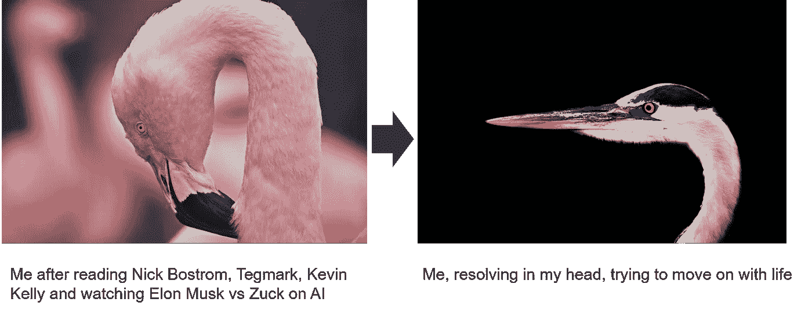
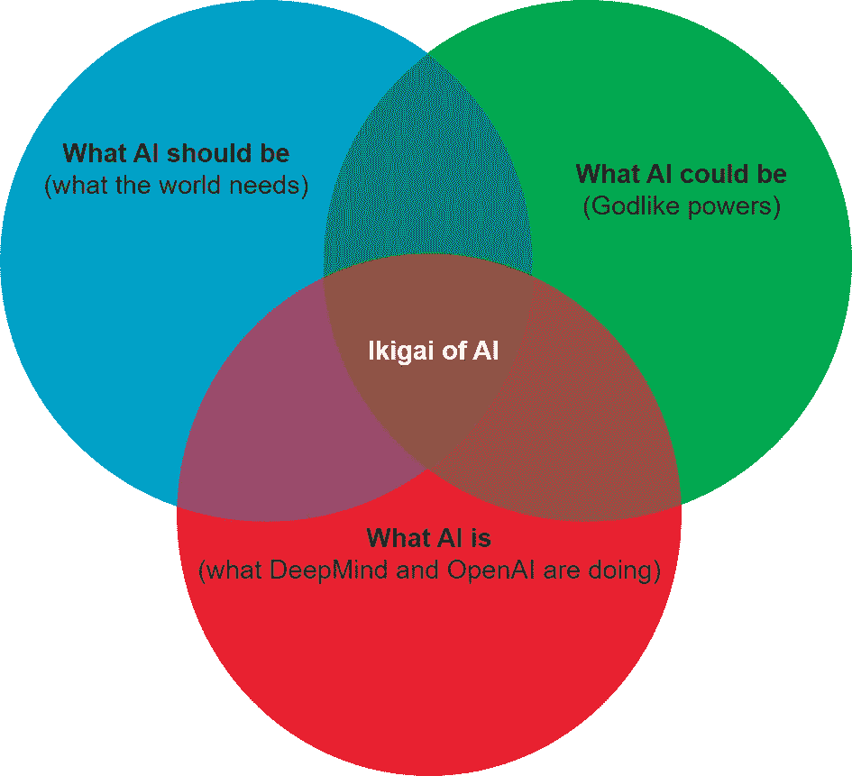

# ai 的 Ikigai

> 原文：<https://medium.com/hackernoon/the-ikigai-of-ai-920dbca2ff5>

## 理解围绕这一主题的两极分化思想，为今天提供见解。

对于任何怀疑为什么人工智能不应该“现在”主导我们的对话的人，考虑一下这个。

阿尔法围棋发生在 2016 年 3 月。这是谷歌训练一个机器人在中国围棋战略游戏中击败人类。现在，为什么这很重要并且不同于 1997 年 IBM 的深蓝在国际象棋上击败加里·卡斯帕罗夫是这样的:

> 围棋有 10 个⁷⁰可能的棋盘位置
> 
> 就背景而言，宇宙中只有 10⁸⁰atoms

作为这个有趣事实的证明，以及任何对机器如何学习感兴趣的人的精彩入门，我强烈推荐 ML 上[维沙尔·玛尼](https://medium.com/u/19a4c39d50a8?source=post_page-----920dbca2ff5--------------------------------)的[这篇精彩的文章](/machine-learning-for-humans/why-machine-learning-matters-6164faf1df12)。

在我们深入之前，任何不熟悉日本 Ikigai 概念的人可能都想了解一下托马斯·奥蓬的《T4》这部《T5》。虽然这对理解人工智能一点也不重要，但它可能有助于你理解生活。我只是用它作为一个心理模型来解决我头脑中的话题。正如我们的朋友埃隆·马斯克所说，心智模型是语义树。这是法南·斯特里特关于那篇文章的精彩报道。

我们跑题了。所以 Ikigai。

# Ikigai(或生活的唯一真正目的)

本质上被认为是四个元素的交集:

1.  你喜欢做什么
2.  世界需要什么
3.  你能比大多数人做得更好
4.  什么也能帮助你把食物放在桌子上(挣钱)

# 所以回到人工智能

现在，我不是这方面的专家，但我跟踪并广泛阅读了许多专家的文章。任何处于我这种情况的人都知道这有多混乱。所以我试图解开这个想法。以下是方法。

> 我在这里的尝试是说服任何关注这个话题的人去尝试获得一个健康均衡的“一天三个”的剂量。

因为，如果你单独大量服用其中任何一种，你就有遭受以下疾病的风险

a)活在艾冬天的幻觉里；

b)对神一样的人类存在的宏伟乐观(与希腊神统治地球的时代没有太大不同)；

或者 c)反乌托邦式的未来，人类是机器的宠物狗，也就是黑镜的黑色版本

所以推荐读物？

# **1。AI 应该是什么？**

在《纽约时报》的畅销书《不可避免》中，凯文·凯利(《连线》的联合创始人)提出了一个非凡的案例，说明人工智能可能会像电力一样在任何事物的背景下发挥作用。就像今天的云。我们正在变得不必要的愤世嫉俗，就像尼尔·德格拉斯·泰森开玩笑说的那样——阻止人工智能应该像拔掉电灯泡的插头一样容易。

另外，在这本书里，他还记录了我们今天所知的“互联网”是如何在他的眼前诞生，并成长为今天这样一个英俊的庞然大物的！(不是他的话 btw。)他列出了一份有趣的人工智能应用清单，涵盖了所有可能的领域，如果一切顺利的话。这是诗意的美丽。

# 2.**人工智能会是什么？**

[Max Tegmark 的 Life 3.0](https://www.amazon.co.uk/Life-3-0-Being-Artificial-Intelligence/dp/024123719X) ， [Nick Bostrom 的 Superintelligence](https://www.amazon.co.uk/Superintelligence-Dangers-Strategies-Nick-Bostrom/dp/0199678111) ，[Elon Musk 和已故的 Stephen Hawking 的著名公开信，](https://en.wikipedia.org/wiki/Open_Letter_on_Artificial_Intelligence)Musk 和 Zuck 之间的迷人对决(尽管我个人认为，一家拥有超过 20 亿用户的上市公司的所有者在公开承认任何由推动自己公司的技术带来的厄运之类的事情之前，会三思而后行)。我甚至不敢解释他们对谁玩铀的想法。不，但是说真的，如果你有机会听耶稣讲圣经，你为什么要去找牧师呢！(虽然我不怀疑耶稣所说的会与今天的圣经相似，但那是另一天的话题)

# 3.**AI 是什么？**

不需要天才就能明白世界在过去的 5 年里发生了怎样的变化。从语言翻译，语音技术，无人驾驶汽车，医疗诊断，没有一个领域是不被触及的，或者在未来 5 年内不会被触及。当你探索 DeepMind、OpenAI、百度和 Graphcore 正在做的事情时，你不会觉得未来已经到来，更不用说可爱的 GAFA(谷歌、苹果、脸书和亚马逊)、IBM 和微软了。

# 离别的思绪

挑战每一种群体思维是很重要的，包括你自己的。它有助于量子思维。

好的，谢谢你留在这里。我很想在下面的评论中听到你是否同意，如果不同意就更好了。

> “有些人担心人工智能会让我们感到自卑，但话说回来，任何一个头脑正常的人每次看到一朵花都会有一种自卑感。” —艾伦·凯