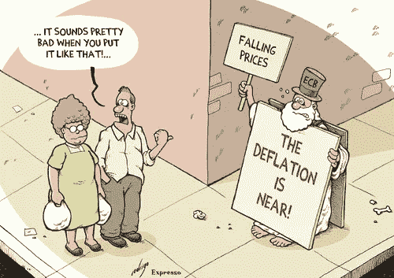
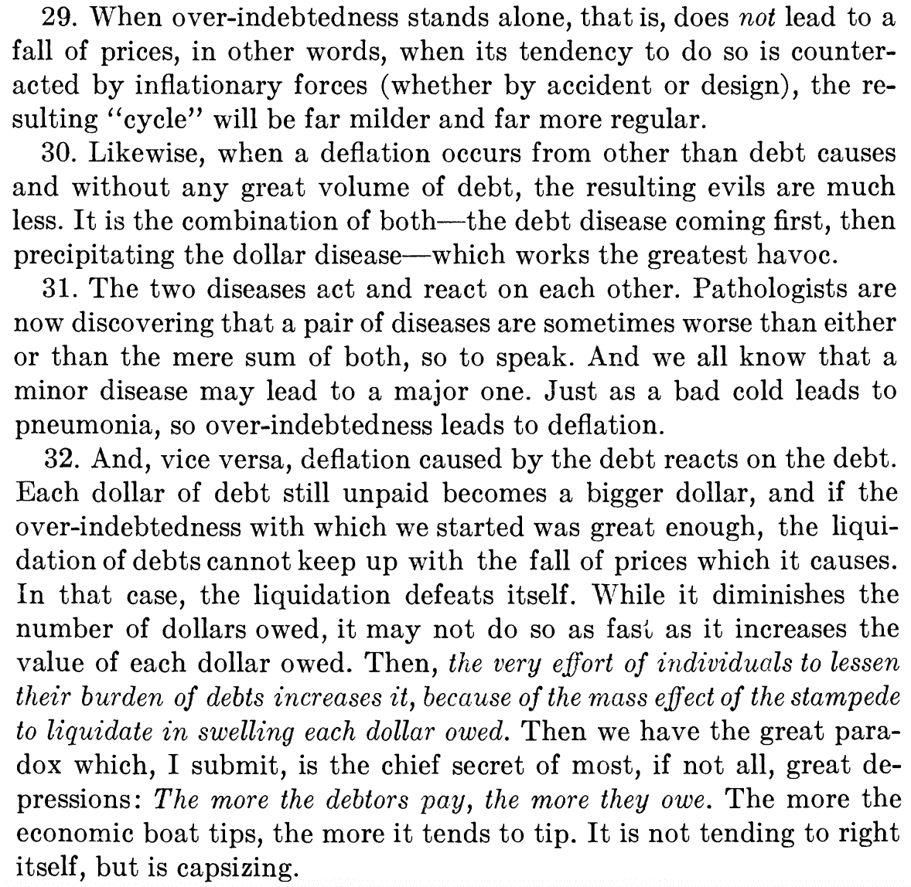

# 比特币的通缩代币经济学对其作为全球数字货币生存能力的影响

> 原文：<https://medium.com/hackernoon/the-impact-of-bitcoins-deflationary-token-economics-on-its-viability-as-a-global-digital-currency-878f3042fb08>

> **本帖主要由** [**维克多·布宁**](https://medium.com/u/1480904b921b?source=post_page-----878f3042fb08--------------------------------) **撰写。贡献者列表见文章末尾。**

比特币由中本聪创造，目的是成为一种点对点的电子现金系统，允许在线支付直接从一方发送到另一方，而无需通过金融机构。它出现在大萧条中期；随着个人失去他们的房子和储蓄，银行和企业正在破产，政府正在印刷钞票，通过多轮量化宽松来刺激经济。它旨在成为我们当前体系的一种替代方案，这种体系被认为是不负责任的政府和央行政策；一种重新想象金钱在我们社会中的角色的方法。

卓越的去中心化区块链设计和激励结构协调了矿工、用户和开发商的利益，以保持系统健康，并抑制任何团体积累过多的权力，因为攻击或不平衡会伤害所有人并降低网络的价值，进而降低他们的投资。尽管在规模、环境影响、价格波动等方面仍有许多挑战。比特币具有革命性，为 Satoshi 作为法定货币的真正替代品的愿景奠定了技术基础。

然而，我们目前暂时认为，比特币的通缩代币经济学将阻止其被采纳并用作全球数字货币。

通缩经济政策通常与奥地利学派和自由主义学派联系在一起，理论上听起来很棒，但当你解构它们时，很快就会土崩瓦解。对通货膨胀最大的抱怨是，我们的钱每年都会失去一点购买力，通货紧缩的经济政策初看起来会解决这个问题，让你辛辛苦苦挣来的钱升值，而无需你付出任何努力。这一部分是真的——钱的购买力会增加，所以随着时间的推移，你的储蓄会更“值钱”。然而，美国压倒性地放弃通缩政策并不是偶然的，它在 1933 年(大萧条期间)放弃了金本位制，并在 1971 年完全切断了美元与黄金的联系，世界其他国家在不同时期也纷纷效仿。这是因为这种政策为增长和投资提供了不正当的经济刺激，同时在经济衰退期间又是灾难性的。

接下来是一系列命题和论点，从经济、用户体验和激励角度审视比特币的通缩令牌经济学，以确定其作为全球数字货币的可行性。

# 假设:

1.  为了讨论的目的，让我们把事情简单化，把货币定义为一种计量单位，它允许我们根据我们对它们的估价来比较不同的商品和服务(例如，苹果和桔子)。举个例子，一个邻居可能会付给你 300 美元去粉刷他的篱笆，然后你去用它买了一双 300 美元的鞋子，这意味着你/社会把同样的价值和粉刷篱笆和那双鞋子联系在一起。
2.  我们将从货币单位，而不是一般经济学的角度来讨论通货膨胀和通货紧缩。例如，美国历史上有多个通货膨胀时期和通货紧缩时期(经济衰退)。
3.  在传统的菲亚特，通货紧缩直接导致消费减少，裁员等。虽然我们认为这在以 BTC 命名的经济体中也是如此，但我们不会进行这种论证，因为它已经被其他出版物多次提出，以支持其他非传统的推理
4.  我们不会将比特币作为价值储存手段、交易媒介和记账单位进行评论，因为已经有足够多的关于它的文章，虽然与本文相关，但需要一个没有显著附加值的长得多的部分

# 推理路线:

1.  通货膨胀(法定货币)和通货紧缩(黄金和 BTC)有不同的激励结构，因此导致不同的行为。他们的主要区别在于他们如何对待过去:通货膨胀侵蚀你创造的价值，而通货紧缩增加这个价值。
2.  因此，在通货膨胀的情况下，你必须将这些价值进行再投资，以创造更多、更大的价值(通过扩大经营，购买更好的设备来增加利润，扩展到其他迫切需要你的服务的社区，等等)。).如果你不这样做，你的钱可以维持一段时间，但随着时间的推移，购买力会下降。用简单的英语来说，通胀激励结构就是你必须增长，不能依赖过去的成功。
3.  另一方面，通货紧缩不断奖励你在过去创造的价值，而不管你现在在做什么。一旦你赚到了创造价值的钱，你继续为世界做贡献的动力就会大大减弱，因为通货紧缩通过赋予赚到的钱更大的购买力来永久地支持你。
4.  债务可以说是人类最伟大的发明之一，因为它允许储蓄的资本平稳过渡到另一个人用来创造价值。资本所有者获得一定的回报率，允许他们增加资本，借款人能够在她必须偿还的基础上保留她能够创造的任何回报。这不仅仅适用于复杂的金融工具。美国学生债务市场是一个完美的例子，个人同意使用他人的资本投资于自己，从而增加他们的价值创造/收入潜力，假设这种增加将大于他们借入资本的利率。BTC 计价(通货紧缩)债务的问题在于，随着时间的推移，这种债务的实际价值(购买力)会随着教派资产价值的增加而增加。这意味着你现在需要创造更大的价值，因为债务负担要高得多。这是一个大问题，因为这将给使用债务融资的个人和机构增加额外负担，而债务融资是创新和投资的主要驱动力。
5.  通缩型资产债券的另一个挑战是，它会导致实际利率上升。除了少数几个孤立的负利率政策(你实际上付钱给某人拿走你的钱)，通常的名义利率不会低于 0%，这在今天的通胀世界中意味着我们见过的最低实际无风险 T2 回报率(T3)低至-2%。通货紧缩的问题是，如果我们假设利率通常不会低于 0%，那么在 2%的通货紧缩下，实际无风险收益率为 2%。因为这一利率通常被用作基准，所以所有的实际利率都趋向于更高，即使它们的名义值可能更低。
6.  更高的实际利率是一个大问题，因为大多数提高生产率的创新投资都是微不足道的。他们不会一蹴而就地彻底改变地球……他们会逐步改进，随着时间的推移，会产生巨大的飞跃。例如，在比特币出现之前，加密货币已经被谈论和研究了 20 多年。更高的实际利率增加了投资的预期回报率，意味着低附加值或高风险项目不值得投资，导致创新率下降。
7.  因此，通缩货币通过刺激囤积和抑制投资来促进王朝财富。美国如此成功的原因之一是，该体系通过通货膨胀和遗产税抑制了家族财富。不管是好是坏，富人和穷人都在一台跑步机上，前提都是一样的:如果你想跟上时代，保持相关性，就要继续为社会做贡献。
8.  [名义刚性](https://en.wikipedia.org/wiki/Nominal_rigidity)描述的是任何事物的名义价格不变的情况。这一般分为两个部分:价格粘性和工资粘性。两者都很重要。
9.  大多数人都乐于看到咖啡的名义价格下降，因为他们认为咖啡现在变得更便宜了，但事实是，就像通货膨胀一样，实际价格基本保持不变。你不会突然觉得咖啡是你生活中更有价值的一部分，你愿意为此付出更大比例的薪水。如果咖啡的价格在过去 100 年上涨了 20 倍，那么由于效率和供应链的改善，年薪很可能上涨了 20 倍以上，所以咖啡对你来说可能比你的祖先更便宜！
10.  我们认为，从心理学而非经济学的角度来看，工资粘性是更重要的一点。一个常见的经济观点是，用通货紧缩的货币来命名工资将会推动失业，因为工资具有粘性(意味着工资上涨容易，但下跌非常困难)。该逻辑接着指出，在经济低迷时期尤其如此，因为货币往往升值，而工资下降，导致更大的解雇，因为使用通缩货币的影响更大。虽然我们同意这种推理，但我们希望特别关注工资的人性方面——如果人们经常将金钱与价值等同起来，那么我们的工资就是我们的贡献被社会重视程度的衡量标准。我们的自我价值和自我意识岌岌可危，尽管工资的实际价值可能在增加，但这种影响是看不见的，而名义上的工资下降却是显而易见的。
11.  最后，我们想强调一下经济衰退期间会发生什么。埃尔文·费雪在 1933 年写了一篇开创性的文章，名为《T2:大萧条的债务-通货紧缩理论》，他在文章中提出，过度投资本身不足以导致经济衰退，除非它与债务和通货紧缩结合起来。他的论文包含 49 篇文章，其中 29-32 篇(见下文)与我们的目的最相关，但都值得一读。

这在上一次通货紧缩、以黄金为基础的货币时期是灾难性的，如果得到 BTC 的支持，今天也会是灾难性的。

# 结论:

鉴于我们已经看到的证据，我们认为比特币的通缩代币经济学阻止了它作为全球数字货币的可行性。我们期待以下结果之一:

1.  比特币将保持通缩，并将稳固地成为价值储存手段，成为世界的“新黄金”，而另一种加密货币将作为现金和金融工具支持的实际货币
2.  比特币将很难变得通货膨胀，这将导致其价值的急剧下降，这是由于对协议的不可修改性缺乏信心(我们认为如果做得足够早，它将会存在)
3.  比特币将保持通缩，并与现有的菲亚特系统保持某种双轨能力，在维护国家经济主权的同时实现点对点跨境支付

至于奥地利学派和凯恩斯学派的辩论，我们最好的建议是折中。奥地利学派的经济理论作为我们社会的有效模型已经被彻底否定，但是凯恩斯主义的经济理论有其自身的缺陷。在经济衰退期间，美联储向我们的经济注入了 4 万亿美元，而美国前总统巴拉克·欧巴马在几个小时后就要印刷 1 万亿美元的硬币来支付我们的债务人并避免违约。这些不是凯恩斯经济学的缺陷，而是特征；那些最终会崩溃的。我们希望区块链将成为一个新的范例，它可以吸收两种模式的精华，为所有人创造一个更好的系统。

# 来源:

1.  【https://www.economist.com/blogs/freeexchange/2014/04/money 
2.  [https://www.wired.com/2013/11/bitcoin-and-deflation/amp](https://www.wired.com/2013/11/bitcoin-and-deflation/amp)
3.  [https://www . economics help . org/blog/978/economics/definition-of-deflation/](https://www.economicshelp.org/blog/978/economics/definition-of-deflation/)
4.  [http://www . macro trends . net/1329/us-dollar-index-historic-chart](http://www.macrotrends.net/1329/us-dollar-index-historical-chart)
5.  [https://campus . FSU . edu/bbcswebdav/users/jcalhoun/Courses/Growth _ of _ American _ Economy/Chapter _ Supplemental _ Readings/Chapter _ 23/Fisher-The _ Debt _ Deflation _ theory . pdf](https://campus.fsu.edu/bbcswebdav/users/jcalhoun/Courses/Growth_of_American_Economy/Chapter_Supplemental_Readings/Chapter_23/Fisher-The_Debt_Deflation_Theory.pdf)
6.  https://en.bitcoin.it/wiki/Deflationary_spiral
7.  [https://www . investinblockschain . com/bit coin-is-a-通缩-货币/](https://www.investinblockchain.com/bitcoin-is-a-deflationary-currency/)
8.  [https://www . economist . com/news/finance-and-economics/21599053-chronic-deflation-may-keep-bit coin-displacing-its-fiat-competitors-money](https://www.economist.com/news/finance-and-economics/21599053-chronic-deflation-may-keep-bitcoin-displacing-its-fiat-rivals-money)
9.  [https://ftalphaville . ft . com/2015/01/14/2088062/通货膨胀与投资之间的关系是什么/](https://ftalphaville.ft.com/2015/01/14/2088062/what-is-the-relationship-between-inflation-and-investment/)

# 信用

本·罗德里格斯:[本@帕雷亚. io](mailto:ben@parea.io)

Charles Hwang:[Charles @ lightning . capital](mailto:charles@lightning.capital)

尼哈·辛格:[Neha_singh1@outlook.com](mailto:Neha_singh1@outlook.com)

追逐科拉姆:[collumchase@gmail.com](mailto:collumchase@gmail.com)

# 正误表

我们只是人，我们会犯错误。我们将在每篇论文的结尾，在一个专门的部分中包括任何类型的修改或逻辑上的失误。此外，如果您对未来的论文有任何建议，如格式，或您希望看到讨论的主题，请给我们发电子邮件至 [hello@parea.io](mailto:hello@parea.io) 或留下评论。