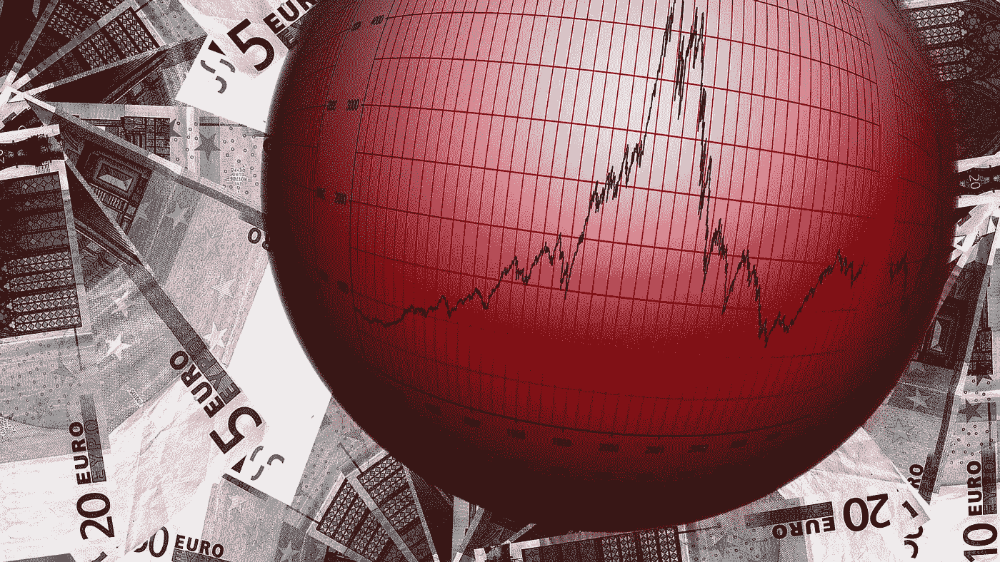
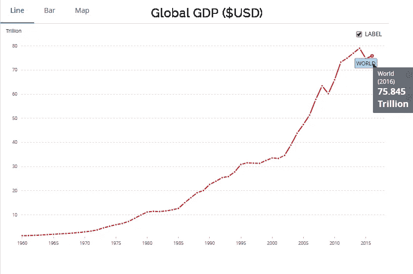
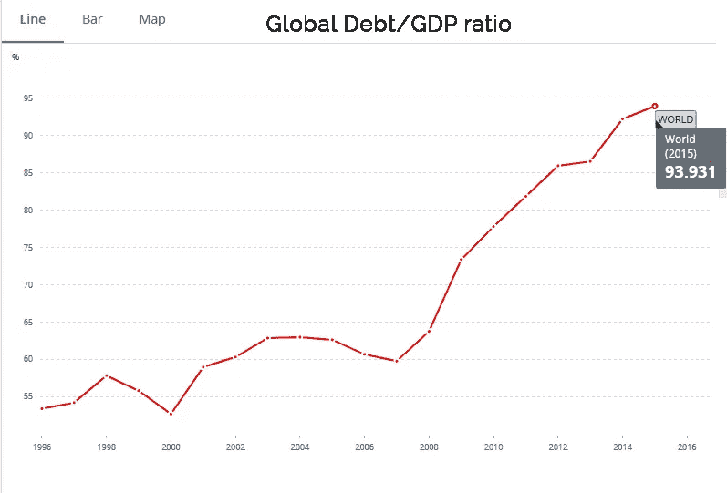

# 即将发生的车祸。

> 原文：<https://medium.com/hackernoon/the-impending-crash-906d3c34893c>

*作者:* [*吉亚德阿桑*](https://medium.com/u/8cbda52d2d8?source=post_page-----906d3c34893c--------------------------------) *编辑:* [*哈弗萨乌马尔*](https://medium.com/u/a6ad72b7a792?source=post_page-----906d3c34893c--------------------------------)

The world is in a credit bubble, the likes of which we have never seen before.

今年年初(2018 年)，在我的脸书和推特上，我表示美国股市将很快崩盘，这将是一个更大问题的征兆。随后的几天，我也澄清了自己这么说的理由。碰巧的是，最近美国股市因担心美国美联储可能加息而暴跌。它可能会暂时复苏，但从长远来看，崩盘是不可避免的。这种情况表明，大约 65 万亿美元的财富将很快从全球经济中消失。这里的问题是，我们正处于信贷泡沫之中，这很可能是历史上最糟糕的一次。这比我们在大萧条时期(1929 年)经历的还要糟糕。

**总结:**股市是用借来的钱支撑起来的，这使它们成为一种症状，而不是“问题”。我想到的问题是，泡沫现在是否正在破裂。要回答这个问题，我们需要把一切放在上下文中。如果我们考虑最新的市场状况，崩溃的逻辑流程将从美国股票市场的崩溃开始，接着是亚洲市场，然后是房地产和其他资产，短期内还有大宗商品市场，如黄金和其他贵金属。在这些发生之后，最后的症状将会表现为一系列银行破产，至少是较小的银行，可能还有一些中型银行，大萧条时期仅在美国就有 9000 家银行倒闭。如果我们将这种想法进行逻辑推理，不断恶化的局势将导致相当多的人失业，这可能也是前所未有的，因此我现在能做出的任何估计都将是毫无意义的。对于目前失业和正在找工作的人来说，这似乎也不是什么好消息。公司在未来几年肯定会失去很多业务，因此会损失很多钱，所以没有简单的说法:他们解雇的人会比招聘的人多。

这里要问的一个重要问题是，如果这是一个“信贷”泡沫，我们应该在“信贷”中看到一些证据，对吗？

正确，据彭博社报道，美国东部时间目前全球债务超过 233 万亿美元。270 万亿美元。

那*就是*很多债务，但是如果你赚的比你欠的多，债务应该不是问题吧？我们生产和赚取的是我们的 GDP，如果 GDP 超过了我们的债务，我们最终还是有能力偿还的，或者至少是可控的。那么，我们来看看世界银行表示的全球 GDP。

Global GDP in USD ([https://data.worldbank.org/indicator/NY.GDP.MKTP.CD](https://data.worldbank.org/indicator/NY.GDP.MKTP.CD))

目前，全球 GDP 约为 75 万亿美元。75 万亿美元的国内生产总值很清楚地表明，我们没有办法用每年生产的 75 万亿美元偿还 233 万亿美元，考虑到其中大部分，如果不是全部，都用于维持目前的生产水平。听起来不太妙，对吧？

Global Debt/GDP ratio [https://data.worldbank.org/indicator/GC.DOD.TOTL.GD.ZS](https://data.worldbank.org/indicator/GC.DOD.TOTL.GD.ZS?end=2016&start=1996)

我们调查得越多，情况就越糟。我们可能会认为，一个可能的解决办法是，政府可以买断债务，但他们不能；他们拥有[70 万亿美元的 it](https://www.nationaldebtclocks.org/) ！

此外，根据世界银行的数据，2015 年全球国家债务占 GDP 的比例为 94%。我们可能想把这个时间延长到 2018 年，以便有一个更现实的图景。这意味着大部分政府基本上资不抵债，而这一次，如果这个体系得以维持，一些政府可能也会破产。在[的美国债务时钟](http://www.usdebtclock.org/world-debt-clock.html)上，“外债占 GDP”的比率将告诉你一个国家欠了多少钱，它生产了多少东西，任何超过 100%的比率都告诉你这个国家欠的钱比它生产的钱多。

只有一种方法可以让这种不对称债务从系统中消失，那就是当债务人申请破产，因为债务人没有正常的方式还钱。在这种情况下，这是显而易见的，因为在过去的 20 年里，我们的债务比率只会上升，这意味着我们系统地无法产生足够的收入来偿还债务。这表明解决泡沫的唯一方法是破产链。最近的股市崩盘只是未来的先兆，借钱买股票的人将无力偿还银行。现在这些人可能还不够多，但最终，他们会越来越多。

另一个值得注意的有趣的事情是，股票市场因为对利率上升的恐惧而崩溃，这本身就很能说明问题——在利率最终上升使他们的债务达到不可收拾的水平之前，以较低利率借钱的人正在取出他们的钱。
同样，借钱做其他事情的人也会陷入困境。当这种情况发生时，银行最终将资不抵债，因为它们将不得不冲销比账面资产更多的债务，这当然是一个渐进的过程。然而，如果你仔细想想，这并不完全是渐进的。你所需要的只是一些备案的破产，或者一家倒闭的银行，让人们恐慌到足以进行几次银行挤兑。泡沫破灭了。

我不认为任何市场在短期内是安全的，因为将会出现流动性危机，甚至传统的避险资产也不会安全，因为衍生品市场已经摧毁了所有市场的基本价值，任何形式的资产的内在价值概念都过于模糊，不能被视为安全。